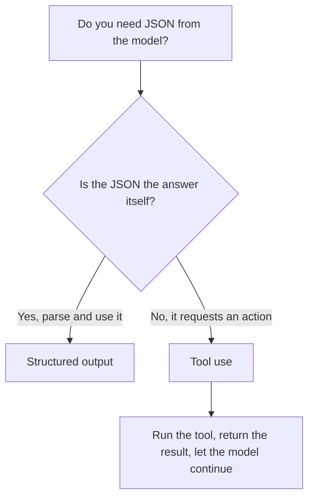

<LevelBadge level="intermediate" />

<VerifyNote lastVerified="2026-06-20" source="https://platform.claude.com/docs/en/docs/build-with-claude/structured-outputs">
Il meccanismo preciso per imporre uno schema evolve — verifica l'approccio attuale (configurazione dell'output / helper di parsing) nella documentazione ufficiale.
</VerifyNote>

<Callout type="objectives" items={["Spiegare perché l'output vincolato a uno schema batte il prompt che chiede JSON sperando nel meglio", "Fornire un JSON Schema e fare il parsing della risposta in un oggetto tipizzato (Pydantic / Zod)", "Distinguere l'output strutturato dall'uso degli strumenti per intento, non per meccanismo", "Applicare i quattro consigli per schemi rigorosi e affidabili", "Scegliere lo strumento giusto con una regola pratica basata su una sola domanda"]} />

Quando l'output di Claude alimenta altro software, ti serve una **struttura affidabile** — JSON valido che corrisponde a una forma nota, ogni volta. Non affidarti al "rispondi in JSON" sperando che vada bene; usa il supporto all'output strutturato della piattaforma.

Questa lezione ti accompagna da *perché il prompt-e-prega fallisce* a *come imporre uno schema e farne il parsing in un oggetto tipizzato* — e a come distinguere l'output strutturato dall'uso degli strumenti quando sembrano identici. Affrontala dall'inizio alla fine, poi mettiti alla prova con il quiz verso la fine.

## Il modo affidabile

Fornisci un **JSON Schema** per l'output e lascia che l'API/l'SDK lo imponga, poi effettua il parsing in un oggetto tipizzato (ad esempio Pydantic in Python, Zod in TypeScript). Gli helper di parsing dell'SDK ti consegnano un risultato tipizzato invece di una stringa che devi sottoporre a `JSON.parse` e validare da solo.

<Steps items={[
  {title: "Definisci la forma", body: "Modella l'output che ti serve come JSON Schema — in Python tramite un Pydantic BaseModel, in TypeScript tramite uno schema Zod."},
  {title: "Richiedi output conforme allo schema", body: "Chiedi al modello di restituire dati che rispettano quello schema, così l'API/l'SDK lo impone invece di lasciarlo al caso."},
  {title: "Fai il parsing in un oggetto tipizzato", body: "Usa gli helper di parsing dell'SDK per ottenere direttamente un risultato tipizzato — niente JSON.parse manuale più validazione fatta a mano."}
]} />

```python
# Conceptual shape — see the official docs for the current API surface.
from pydantic import BaseModel

class Ticket(BaseModel):
    title: str
    priority: str   # "low" | "medium" | "high"
    tags: list[str]

# Request the model to return data conforming to Ticket's JSON schema,
# then parse the response into a Ticket instance.
```

Vuoi una richiesta concreta da adattare? Ecco la forma di ciò che passi al modello — sostituisci il modello con il tuo schema.

<PromptCard title="Chiedi output conforme allo schema">{`Return the data conforming to this JSON Schema:

{
  "title": "string",
  "priority": "low | medium | high",
  "tags": ["string"]
}

Do not include any prose outside the JSON.`}</PromptCard>

## Perché non chiedere semplicemente il JSON nel prompt?

*Puoi* chiedere il JSON nel prompt, e per i casi semplici funziona — ma può deviare: prosa di troppo, una virgola finale, un campo mancante. L'output imposto da schema elimina quella classe di bug, il che conta nel momento in cui un sistema a valle ne dipende.

<Callout type="warning" items={["Il JSON chiesto via prompt funziona nelle demo e si rompe in produzione: il guasto compare solo quando un sistema a valle ne fa il parsing.", "Tre derive classiche da tenere d'occhio: prosa di troppo intorno al JSON, una virgola finale, un campo obbligatorio mancante."]} />

## Output strutturato vs. uso degli strumenti

Entrambe le funzionalità forniscono al modello uno **JSON Schema**, quindi si assomigliano — e si finisce per scegliere quella sbagliata. La differenza sta nell'*intento*, non nel meccanismo:

| | **Output strutturato** | **[Uso degli strumenti](/docs/api/tool-use)** |
|---|---|---|
| Cosa vuoi | La **risposta finale**, in una forma fissa | Che il modello **invochi una capacità** (chiami una funzione, recuperi dati, esegua un'azione) |
| Chi la consuma | Il tuo codice, direttamente | Il tuo codice esegue lo strumento, poi restituisce il risultato al modello |
| Forma del turno | Una risposta, finita | Un ciclo: il modello chiede, tu esegui, il modello continua |
| Uso tipico | Estrazione, classificazione, parsing | Agenti, ricerche in tempo reale, effetti collaterali |

Una rapida regola pratica:



Se il JSON *è* il prodotto finale, usa l'output strutturato. Se il JSON è il modello che chiede al tuo codice di *fare* qualcosa, allora è uso degli strumenti. Gli agenti spesso usano entrambi: gli strumenti per agire, l'output strutturato per restituire un risultato finale pulito.

## Suggerimenti

<Callout type="tip" items={["Mantieni gli schemi rigorosi — usa gli enum per le scelte fisse; marca i campi obbligatori.", "Descrivi i campi — le descrizioni dei campi guidano il modello come mini-prompt.", "Valida comunque al confine — un parsing difensivo è un'assicurazione economica.", "Per i task di estrazione, output strutturato + uno schema chiaro batte il formato libero ogni volta."]} />

<Callout type="takeaways" items={["Passa all'API/all'SDK un JSON Schema e fai il parsing in un oggetto tipizzato — non il prompt-e-prega.", "Chiedere il JSON nel prompt può deviare (prosa di troppo, virgola finale, campo mancante); l'imposizione dello schema elimina quella classe di bug.", "Output strutturato vs. uso degli strumenti differiscono per intento: il JSON È la risposta vs. il JSON richiede un'azione.", "Schemi rigorosi, campi descritti e validazione al confine rendono affidabili estrazione e classificazione."]} />

## Fissa i termini

<Flashcards cards={[
  {front: "Output strutturato", back: "Passi all'API/all'SDK un JSON Schema per la risposta finale e fai il parsing della risposta in un oggetto tipizzato (Pydantic / Zod). Il JSON È il prodotto finale."},
  {front: "Uso degli strumenti", back: "Passi al modello un JSON Schema così che possa invocare una capacità. Il tuo codice esegue lo strumento, poi restituisce il risultato — un ciclo, non una risposta in un colpo solo."},
  {front: "JSON Schema", back: "La forma su cui si basano entrambe le funzionalità. In Python la modelli con un Pydantic BaseModel; in TypeScript con uno schema Zod."},
  {front: "Helper di parsing", back: "Helper dell'SDK che restituiscono direttamente un risultato tipizzato, così salti il JSON.parse manuale più la validazione fatta a mano."},
  {front: "Regola pratica basata su una sola domanda", back: "Il JSON è la risposta stessa? Sì → output strutturato. No, richiede un'azione → uso degli strumenti."}
]} />

<Quiz title="Mettiti alla prova" questions={[
  {
    q: "Qual è il modo affidabile per ottenere JSON strutturato da Claude?",
    options: [
      "Chiedere 'rispondi in JSON' nel prompt e riprovare in caso di errori",
      "Fornire un JSON Schema, lasciare che l'API/l'SDK lo imponga, poi fare il parsing in un oggetto tipizzato",
      "Generare testo libero e scrivere una regex per estrarre i campi"
    ],
    answer: 1,
    explain: "Fornisci un JSON Schema e lascia che l'API/l'SDK lo imponga, poi fai il parsing in un oggetto tipizzato come Pydantic (Python) o Zod (TypeScript)."
  },
  {
    q: "Perché chiedere il JSON nel prompt è rischioso una volta che un sistema a valle ne dipende?",
    options: [
      "È più lento dell'imposizione dello schema",
      "Può deviare — prosa di troppo, una virgola finale o un campo mancante",
      "Costa più token dell'uso degli strumenti"
    ],
    answer: 1,
    explain: "Il JSON chiesto via prompt funziona per i casi semplici ma può deviare; l'output imposto da schema elimina quella classe di bug."
  },
  {
    q: "Cosa distingue davvero l'output strutturato dall'uso degli strumenti?",
    options: [
      "L'output strutturato usa JSON Schema; l'uso degli strumenti no",
      "L'intento: l'output strutturato è la risposta finale in una forma fissa, l'uso degli strumenti invoca una capacità",
      "L'uso degli strumenti è per Python e l'output strutturato è per TypeScript"
    ],
    answer: 1,
    explain: "Entrambi passano al modello un JSON Schema, quindi si assomigliano. La differenza è l'intento, non il meccanismo — la risposta finale vs. l'invocazione di una capacità."
  },
  {
    q: "Quale di questi è un consiglio valido per progettare gli schemi?",
    options: [
      "Lasciare i campi opzionali e saltare gli enum per flessibilità",
      "Usare gli enum per le scelte fisse, marcare i campi obbligatori e validare comunque al confine",
      "Fidarsi dello schema e non validare mai l'output dopo il parsing"
    ],
    answer: 1,
    explain: "Mantieni gli schemi rigorosi (enum, campi obbligatori), descrivi i campi come mini-prompt e valida comunque al confine come assicurazione economica."
  }
]} />

## Avanti

- [Uso degli strumenti / Function calling](/docs/api/tool-use) — anche gli strumenti usano gli schemi JSON
- [La tua prima chiamata API](/docs/api/first-call)
- [Template di prompt riutilizzabili](/docs/templates/prompts)
