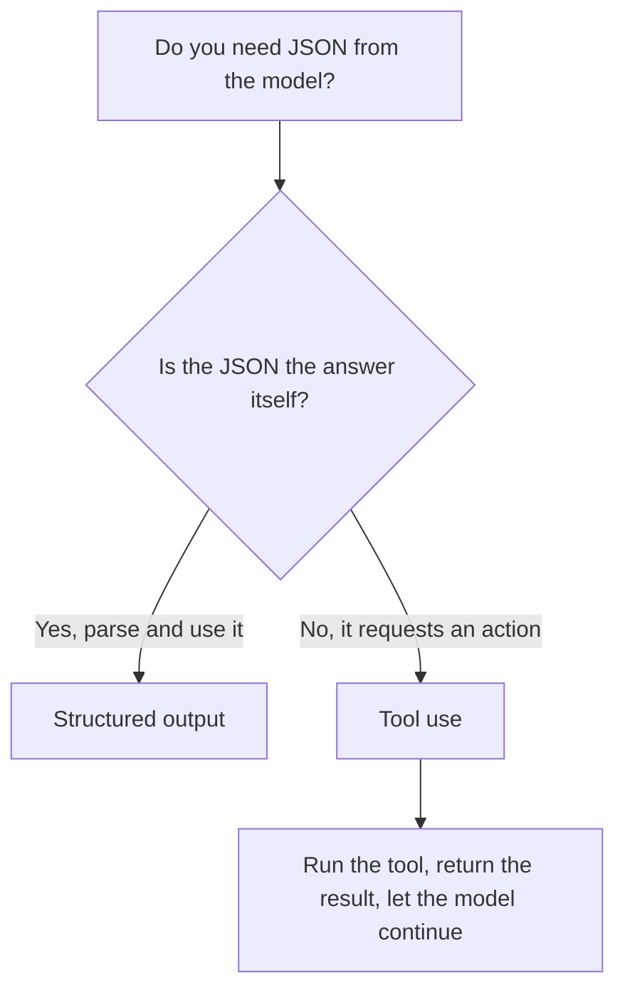

<LevelBadge level="intermediate" />

<VerifyNote lastVerified="2026-06-20" source="https://docs.anthropic.com/en/docs/build-with-claude/structured-outputs">
Il meccanismo esatto per imporre uno schema evolve — conferma l'approccio attuale (output config / helper di parsing) nella documentazione ufficiale.
</VerifyNote>

Quando l'output di Claude alimenta altro software, hai bisogno di una **struttura affidabile** — JSON valido che corrisponde a una forma nota, ogni volta. Non affidarti a "rispondi in JSON" sperando che vada bene; usa il supporto per l'output strutturato della piattaforma.

## Il modo affidabile

Fornisci uno **JSON Schema** per l'output e lascia che l'API/l'SDK lo imponga, poi effettua il parsing in un oggetto tipizzato (ad esempio Pydantic in Python, Zod in TypeScript). Gli helper di parsing dell'SDK ti consegnano un risultato tipizzato invece di una stringa che devi sottoporre a `JSON.parse` e validare da solo.

```python
# Conceptual shape — see the official docs for the current API surface.
from pydantic import BaseModel

class Ticket(BaseModel):
    title: str
    priority: str   # "low" | "medium" | "high"
    tags: list[str]

# Request the model to return data conforming to Ticket's JSON schema,
# then parse the response into a Ticket instance.
```

## Perché non chiedere semplicemente il JSON nel prompt?

*Puoi* chiedere il JSON nel prompt, e per i casi semplici funziona — ma può deviare: prosa di troppo, una virgola finale, un campo mancante. L'output imposto da schema elimina quella classe di bug, il che conta nel momento in cui un sistema a valle ne dipende.

## Output strutturato vs. uso degli strumenti

Entrambe le funzionalità forniscono al modello uno **JSON Schema**, quindi si assomigliano — e si finisce per scegliere quella sbagliata. La differenza sta nell'*intento*, non nel meccanismo:

| | **Output strutturato** | **[Uso degli strumenti](/docs/api/tool-use)** |
|---|---|---|
| Cosa vuoi | La **risposta finale**, in una forma fissa | Che il modello **invochi una capacità** (chiami una funzione, recuperi dati, esegua un'azione) |
| Chi la consuma | Il tuo codice, direttamente | Il tuo codice esegue lo strumento, poi restituisce il risultato al modello |
| Forma del turno | Una risposta, finita | Un ciclo: il modello chiede, tu esegui, il modello continua |
| Uso tipico | Estrazione, classificazione, parsing | Agenti, ricerche in tempo reale, effetti collaterali |

Una rapida regola pratica:



Se il JSON *è* il prodotto finale, usa l'output strutturato. Se il JSON è il modello che chiede al tuo codice di *fare* qualcosa, allora è uso degli strumenti. Gli agenti spesso usano entrambi: gli strumenti per agire, l'output strutturato per restituire un risultato finale pulito.

## Suggerimenti

- **Mantieni gli schemi rigorosi.** Usa gli enum per le scelte fisse; marca i campi obbligatori.
- **Descrivi i campi.** Le descrizioni dei campi guidano il modello come mini-prompt.
- **Valida comunque** al confine — un parsing difensivo è un'assicurazione economica.
- Per i task di **estrazione**, output strutturato + uno schema chiaro batte il formato libero ogni volta.

## Avanti

- [Uso degli strumenti / Function calling](/docs/api/tool-use) — anche gli strumenti usano gli schemi JSON
- [La tua prima chiamata API](/docs/api/first-call)
- [Template di prompt riutilizzabili](/docs/templates/prompts)
