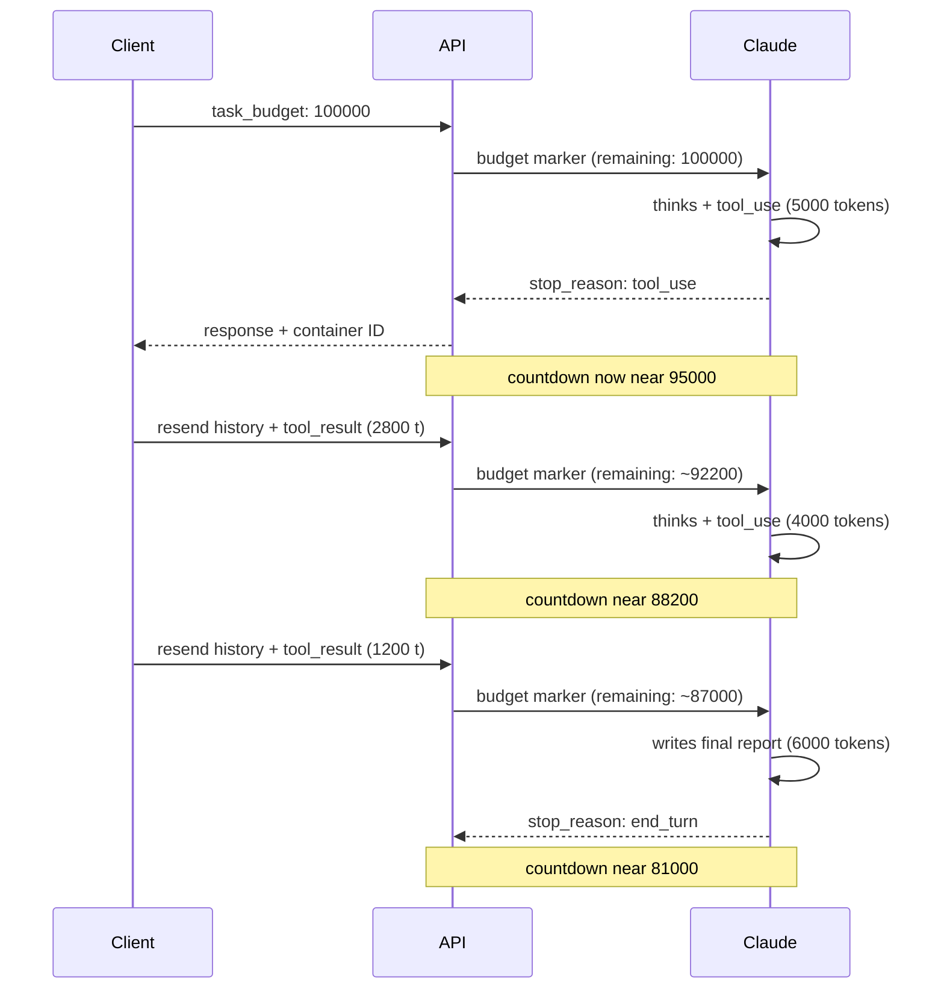

<LevelBadge level="advanced" />

<Callout type="objectives" items={[
  "Capire cos'è un task budget — un countdown di token consultivo, visibile al modello, attraverso un intero loop agentico",
  "Configurare task_budget correttamente — dentro output_config, con l'header beta task-budgets-2026-03-13, su un modello supportato",
  "Leggere cosa conta davvero contro il budget (token che Claude vede in questo turn) vs cosa no (payload ripetuto dalla history rispedita)",
  "Scegliere una dimensione di budget che aiuti invece di innescare comportamento refusal-like — misura prima, poi imposta generosamente",
  "Portare un budget attraverso la compaction con il campo remaining, ed evitare la trappola di invalidazione del prompt caching",
  "Distinguere task budget, session budget, effort e max_tokens — quattro leve, quattro lavori diversi"
]} />

<VerifyNote lastVerified="2026-08-25" source="https://platform.claude.com/docs/en/build-with-claude/task-budgets">
I task budget sono in **public beta** — l'header beta (`task-budgets-2026-03-13`), la lista di modelli supportati, il minimo di 20.000 token e i nomi esatti dei campi su `output_config.task_budget` sono citati dal riferimento ufficiale e possono cambiare mentre la feature è in beta. Ri-verifica prima di spedire.
</VerifyNote>

Gli agenti long-horizon bruciano token in modi difficili da predire dall'esterno. Una singola richiesta che si espande in una dozzina di round thinking-più-tool-call può silenziosamente costare 10× quello che il tuo turn tipico fa. **I task budget** sono la risposta di Anthropic: dai a Claude un tetto consultivo di token per l'intero loop agentico e lascia che il modello si *auto-regoli* — pace il proprio thinking, prioritizzi le azioni, e chiuda con un sommario mentre il budget si esaurisce, invece di essere tagliato a metà tool-call da `max_tokens`.

Due cose rendono i task budget diversi da ogni altra leva di costo che potresti già conoscere:

- **Il countdown è visibile al modello.** Claude vede un marker "tokens remaining" iniettato server-side e aggiusta il comportamento su di esso. Il tuo client non vede mai il marker in un campo usage.
- **È consultivo, non applicato.** I task budget sono un soft hint; il cap hard è ancora `max_tokens`. Questa è una feature — Claude occasionalmente può sforare il budget se interrompere un'azione in-flight sarebbe più disruptivo che finirla.

## Come funziona il countdown del budget

Il countdown riflette i token che **Claude ha processato in questo loop** — thinking, tool call, tool result e output — non la dimensione del payload di richiesta. Quando il tuo client rispedisce l'intera conversazione a ogni turn, il *payload* cresce monotonicamente ma il *budget* decrementa solo di quanto è nuovo per Claude in questo turn.

<Callout type="warning" items={[
  "Il countdown è visibile solo al modello. Le risposte API non includono un campo remaining-budget — nessuna entry task_budget in usage, nessun accessor SDK per esso. Per tracciare la spesa client-side, somma output_tokens attraverso le richieste nel tuo loop.",
  "Se il tuo client manda l'intera history a ogni follow-up E decrementa remaining mentre lo fa, il modello vede un budget sotto-riportato e chiude prima di quanto il budget effettivamente consenta. Imposta un budget generoso e lascia che il modello si auto-regoli contro il countdown server-side."
]} />

## Fai la tua prima richiesta budgetata

<Steps items={[
  {title: "Includi l'header beta", body: "Aggiungi anthropic-beta: task-budgets-2026-03-13 alla richiesta. Senza, output_config.task_budget è ignorato."},
  {title: "Scegli un modello supportato", body: "Attualmente: Claude Opus 5, Fable 5, Mythos 5, Opus 4.8, Opus 4.7. Sonnet 5, Sonnet 4.6, Haiku 4.5, e il vecchio Opus 4.6 NON sono supportati."},
  {title: "Imposta task_budget dentro output_config", body: "L'oggetto ha tre campi — type (sempre tokens), total (il tetto in token), e remaining (opzionale, per portare un budget attraverso la compaction). Il minimo total è 20.000 token; sotto ritorna un errore 400."},
  {title: "Tieni max_tokens generoso", body: "task_budget spazia l'intero loop agentico; max_tokens è il cap hard per-request. Ad effort high o xhigh, tieni max_tokens a 64k o più così che Claude abbia spazio per pensare e agire per richiesta."}
]} />

<PromptCard title="Richiesta minima — budgetare un agente codebase-review a 64k token">{`curl https://api.anthropic.com/v1/messages \\
  -H "x-api-key: $ANTHROPIC_API_KEY" \\
  -H "anthropic-version: 2023-06-01" \\
  -H "anthropic-beta: task-budgets-2026-03-13" \\
  -H "content-type: application/json" \\
  -d '{
    "model": "claude-opus-5",
    "max_tokens": 128000,
    "stream": true,
    "messages": [{
      "role": "user",
      "content": "Review the codebase and propose a refactor plan."
    }],
    "output_config": {
      "effort": "high",
      "task_budget": {"type": "tokens", "total": 64000}
    }
  }'`}</PromptCard>

## Quali modelli lo supportano davvero

| Modello           | Supporto                                                    |
| ----------------- | ---------------------------------------------------------- |
| Claude Opus 5     | Beta — imposta `task-budgets-2026-03-13`                   |
| Claude Fable 5    | Beta — imposta `task-budgets-2026-03-13`                   |
| Claude Mythos 5   | Beta — imposta `task-budgets-2026-03-13`                   |
| Claude Sonnet 5   | Non supportato                                              |
| Claude Opus 4.8   | Beta — imposta `task-budgets-2026-03-13`                   |
| Claude Opus 4.7   | Beta — imposta `task-budgets-2026-03-13`                   |
| Claude Opus 4.6   | Non supportato                                              |
| Claude Sonnet 4.6 | Non supportato                                              |
| Claude Haiku 4.5  | Non supportato                                              |

I task budget **non** sono supportati su [Claude Code](/docs/claude-code/what-is-claude-code) o superfici Cowork — usali direttamente attraverso la Messages API su uno dei modelli supportati. Se ti serve un cap hard-dollar su una sessione Managed Agents, quella è una feature separata: [Managed Agents Session Budgets](/docs/api/managed-agents-session-budgets).

## Scegli un budget — misura prima, non tirare a indovinare

Il budget giusto dipende da quanto lavoro fa attualmente il tuo loop. Raccomandazione di Anthropic stessa: **misura prima, poi sintonizza.**

<Steps items={[
  {title: "Esegui un campione rappresentativo SENZA task_budget", body: "Per ogni task nel campione, somma usage.output_tokens attraverso ogni richiesta nel loop, più la dimensione in token di qualsiasi tool result appeso tra le richieste. Quello è il totale che il modello ha visto."},
  {title: "Prendi il p99 della tua distribuzione per-task", body: "Parti da lì. L'obiettivo è dare a Claude abbastanza headroom che i run budgetati non sotto-performino improvvisamente il tuo baseline attuale."},
  {title: "Sintonizza in su o in giù dal p99", body: "Se Claude chiude routinemente troppo presto, alza il budget. Se i task consistentemente spendono ben sotto, capalo più basso per applicare disciplina. Non andare mai sotto il minimo di 20.000 token — l'API ritorna un errore 400."}
]} />

<Callout type="warning" items={[
  "Un budget troppo piccolo per il task può causare comportamento refusal-like. Quando Claude vede un budget chiaramente insufficiente per il lavoro (diciamo, 20.000 token per un task di coding agentico multi-ora), può declinare di tentare il task, ridurne lo scope aggressivamente, o fermarsi presto con un risultato parziale — piuttosto che iniziare lavoro che non può finire.",
  "Se osservi rifiuti inaspettati o stop prematuri dopo aver aggiunto un budget, alza il budget prima di debuggare altri parametri. Dimensiona contro la tua distribuzione effettiva della lunghezza dei task, non un default fisso."
]} />

## Portare un budget attraverso la compaction

Se il tuo loop compatta o riscrive il contesto tra richieste — per esempio, riassumendo turn precedenti per rimpicciolire il payload — il server **non ha memoria del budget speso prima della compaction**. Passa `remaining` sulla prossima richiesta così che il countdown continui da dove l'avevi lasciato:

<PromptCard title="Python — portare remaining attraverso la compaction">{`# Tokens spent before compaction, tracked client-side
tokens_spent_so_far = 45000

output_config = {
    "effort": "high",
    "task_budget": {
        "type": "tokens",
        "total": 128000,
        "remaining": 128000 - tokens_spent_so_far,
    },
}`}</PromptCard>

**Per loop che rispediscono l'intera history non-compattata a ogni turn, ometti `remaining`** e lascia che il server tracchi il countdown. Impostarlo manualmente quando non serve invita drift tra ciò che il tuo client pensa sia stato speso e ciò che Claude effettivamente ha visto.

## Interazioni con altri parametri

| Interagisce con      | Come interagisce                                                                                                                                                                                                                                                                                                              |
| -------------------- | ------------------------------------------------------------------------------------------------------------------------------------------------------------------------------------------------------------------------------------------------------------------------------------------------------------------------------ |
| `max_tokens`         | **Ortogonale.** `max_tokens` è un cap hard per-request; `task_budget` è un cap consultivo attraverso l'intero loop. Nessuno deve essere a o sotto l'altro. Combinali: `task_budget` dà a Claude un target su cui pace, `max_tokens` previene generazione runaway su qualsiasi singola richiesta.                            |
| [Effort](/docs/api/effort-tuning) | **Complementare.** Effort controlla quanto profondamente Claude ragiona per-step (breadth del thinking). I task budget controllano quanto lavoro totale il loop può fare (breadth dell'iterazione). Sintonizzali insieme.                                                                                                                             |
| [Adaptive thinking](https://platform.claude.com/docs/en/build-with-claude/thinking) | I task budget **includono** i token di thinking nel conteggio, quindi l'adaptive thinking naturalmente scala in giù mentre il budget si esaurisce.                                                                                                                                                                                                     |
| [Prompt caching](/docs/api/prompt-caching) | **Trappola di invalidazione cache.** Il marker del budget-countdown è iniettato per turn e non matcha attraverso le richieste. Se il tuo client decrementa `task_budget.remaining` su ogni follow-up, il valore cambiato invalida qualsiasi cache prefix che lo contiene. Imposta il budget una volta sulla richiesta iniziale e lascia che il modello si auto-regoli. |

## Task budget vs gli altri budget

Ailmanac copre già tre feature "budget"-shaped. Non sono intercambiabili.

| Feature                                                                          | Denominazione   | Scope                               | Enforcement                                | Header necessario                              |
| -------------------------------------------------------------------------------- | --------------- | ----------------------------------- | ------------------------------------------ | ---------------------------------------------- |
| **Task budget** (questa pagina)                                                  | Token           | Un loop agentico (possibilmente molte richieste) | **Consultivo** — soft hint al modello | `anthropic-beta: task-budgets-2026-03-13`      |
| **`max_tokens`**                                                                 | Token           | Una richiesta                       | **Hard** — tronca con `stop_reason: max_tokens` | Nessuno                                        |
| **`output_config.effort`**                                                       | Livello effort  | Profondità per step                 | Consultivo (model-controlled)              | Nessuno                                        |
| [**Managed Agents Session Budgets**](/docs/api/managed-agents-session-budgets)   | Centesimi US    | Un'intera sessione Managed Agents   | **Hard** — server mette in pausa a `budget_reached` | Header beta Managed Agents                     |

Pensala così: `max_tokens` è un fusibile (salta a un punto fisso), il task budget è un allenatore che sussurra il punteggio a Claude (aggiusta il gioco), effort è lo stile di gioco, e il session budget è il contabile che applica il cap del payroll. Usali tutti e quattro insieme quando ti servono agenti delimitati, auto-regolanti, capati a dollari.

## Verifica te stesso

<Quiz questions={[
  {
    q: "Imposti task_budget.total a 100000 su un agente codebase-audit. Durante il run, il payload cumulativo del tuo client cresce a 250000 token attraverso richieste perché rispedisci l'intera history ogni turn. Cosa sta facendo il countdown che Claude vede alla fine?",
    options: [
      "È andato a zero e il run è stato tagliato — hai superato il budget",
      "Decrementa solo di quanto Claude effettivamente processa in questo turn, non della dimensione del payload rispedito — l'intera history conta una volta",
      "Matcha la dimensione del tuo payload — 250000 supera 100000 quindi Claude ha rifiutato",
      "Decrementa solo su token di output, quindi si è mosso a malapena"
    ],
    answer: 1,
    explain: "Il task budget conta ciò che Claude vede ogni turn — thinking, tool call, tool result e text — non la dimensione del payload di richiesta. La history ripetuta sulle richieste di follow-up è contata una volta; contenuto nuovo (come tool result freschi) conta contro il budget mentre appare."
  },
  {
    q: "Compatti il contesto tra richieste. Per assicurarti che il countdown non si resetti, cosa fai?",
    options: [
      "Niente — il server tracca il budget automaticamente attraverso la compaction",
      "Aumenti max_tokens sulla richiesta di follow-up",
      "Passi task_budget.remaining sulla prossima richiesta, impostato a total meno quanto hai già tracciato client-side",
      "Imposti un nuovo task_budget.total uguale all'ammontare rimanente"
    ],
    answer: 2,
    explain: "Quando compatti o riscrivi il contesto, il server non ha memoria della spesa di budget pre-compaction. Passa il campo remaining sulla prossima richiesta impostato a (total - tokens_spent_so_far), tracciato client-side."
  },
  {
    q: "Imposti task_budget.total a 20000 per un task lungo di coding agentico, e Claude improvvisamente rifiuta o si ferma presto con un risultato parziale. Qual è il fix?",
    options: [
      "Aggiungere anthropic-beta: task-budgets-strict-2026-03-13 per forzare compliance",
      "Alzare il budget — 20k è il minimo accettato, e un budget chiaramente insufficiente per il task può causare comportamento refusal-like",
      "Abbassare max_tokens per matchare il budget",
      "Passare a Sonnet 5, che gestisce meglio i budget piccoli"
    ],
    answer: 1,
    explain: "Un budget troppo piccolo per il task innesca comportamento refusal-like — Claude può declinare di tentare lavoro che non può finire. Alza prima il budget; misura la tua effettiva distribuzione della lunghezza dei task e dimensiona contro p99 invece che un default fisso. (Inoltre: Sonnet 5 non supporta i task budget affatto.)"
  }
]} />

## Vocabolario

<Flashcards title="Glossario task-budget" cards={[
  {front: "task_budget", back: "Oggetto dentro output_config con i campi type ('tokens'), total (tetto) e opzionale remaining (per portare attraverso la compaction). Il minimo total è 20.000."},
  {front: "task-budgets-2026-03-13", back: "L'header anthropic-beta richiesto per opt-in. Senza, output_config.task_budget è ignorato."},
  {front: "Countdown marker", back: "Marker iniettato server-side che Claude vede ogni turn mostrando i token rimanenti nel loop agentico corrente. Mai emerso nell'oggetto usage della risposta."},
  {front: "Consultivo non applicato", back: "I task budget sono un soft hint — Claude può occasionalmente sforare per evitare di interrompere un'azione in-flight. Il cap hard è ancora max_tokens."},
  {front: "remaining", back: "Campo opzionale per portare un budget attraverso la compaction. Ometti su loop che rispediscono l'intera history non-compattata — lascia che il server tracci."},
  {front: "Comportamento refusal-like", back: "Quando Claude vede un budget chiaramente troppo piccolo per il task, può declinare, ridurre lo scope, o fermarsi presto. Fix alzando il budget prima di debuggare altri parametri."}
]} />

## Takeaway

<Callout type="takeaways" items={[
  "I task budget sono un countdown di token VISIBILE AL MODELLO, CONSULTIVO attraverso l'intero loop agentico — Claude si auto-regola contro di esso",
  "Opt-in con l'header beta task-budgets-2026-03-13 su un modello supportato — Opus 5, Fable 5, Mythos 5, Opus 4.8, o Opus 4.7. Sonnet, Haiku e Claude Code non lo supportano",
  "Il countdown conta i token che CLAUDE VEDE in questo turn — non la dimensione del payload rispedito — quindi la history ripetuta non fa doppio conto",
  "Misura prima (p99 della tua distribuzione di token per-task), poi imposta generosamente. Budget sotto-dimensionati causano comportamento refusal-like",
  "Usa remaining per portare il budget attraverso la compaction; omettilo quando rispedisci history non-compattata e lascia che il server tracci",
  "Accoppia con max_tokens per un fusibile hard e con effort per sintonizzare la profondità-per-step — quattro leve che fanno quattro lavori diversi"
]} />

## Prossimi passi

- [Effort tuning](/docs/api/effort-tuning) — i cinque livelli di effort e come interagiscono con i task budget
- [Managed Agents Session Budgets](/docs/api/managed-agents-session-budgets) — cap hard dollar su una sessione, applicati dalla piattaforma
- [Prompt caching](/docs/api/prompt-caching) — come la trappola di invalidazione cache si svolge con valori di budget muta­nti
- [Code execution tool](/docs/api/code-execution) — il runtime sandboxato su cui gli agenti long-running spesso si appoggiano
- [Building agents on Claude](/docs/api/building-agents) — l'intero ciclo di vita del loop agentico che questi budget modellano
