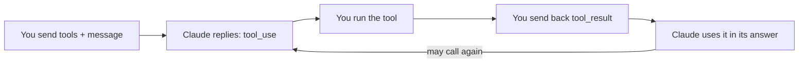

import Tabs from '@theme/Tabs';
import TabItem from '@theme/TabItem';

<LevelBadge level="intermediate" />

<VerifyNote lastVerified="2026-06-20" source="https://docs.anthropic.com/en/docs/build-with-claude/tool-use">
Le forme di richiesta/risposta dell'uso degli strumenti sono stabili ma evolvono — conferma i campi nella documentazione ufficiale sull'uso degli strumenti.
</VerifyNote>

L'**uso degli strumenti** consente a Claude di chiamare funzioni che *tu* definisci — una ricerca, una calcolatrice, il tuo database, qualsiasi API — e di usarne i risultati. È il fondamento di ogni [agent](/docs/api/building-agents).

## Il loop



1. Includi una lista di **definizioni di strumenti** (nome, descrizione, input in JSON Schema).
2. Se Claude decide di usarne uno, restituisce un blocco `tool_use` (con gli argomenti) e si ferma.
3. **Esegui tu** lo strumento e rinvii l'output come `tool_result`.
4. Claude continua, eventualmente chiamando altri strumenti, finché non risponde.

## Definire uno strumento (Python)

```python
tools = [{
    "name": "get_weather",
    "description": "Get current weather for a city.",
    "input_schema": {
        "type": "object",
        "properties": {"city": {"type": "string"}},
        "required": ["city"],
    },
}]

msg = client.messages.create(
    model="claude-sonnet-4-6", max_tokens=1024,
    tools=tools,
    messages=[{"role": "user", "content": "What's the weather in Rome?"}],
)
# If msg.stop_reason == "tool_use": run the tool, then send a tool_result back.
```

## Suggerimenti

- **Le descrizioni sono prompt.** Una `description` dello strumento chiara e la documentazione dei parametri migliorano enormemente quando/come Claude lo chiama.
- **Valida gli input** che ricevi prima di eseguirli — non fidarti mai ciecamente.
- **Restituisci gli errori come risultati.** Se uno strumento fallisce, invia un `tool_result` che descrive l'errore così Claude può recuperare.
- **Strumenti lato server.** Anthropic offre anche strumenti integrati (ad esempio ricerca web, esecuzione di codice, computer use) — consulta la documentazione per il menu attuale.

:::warning Strumenti = azioni = rischio
Uno strumento che compie azioni reali eredita un modello di sicurezza. Applica il privilegio minimo e mantieni un umano nel loop per le chiamate rischiose — vedi [Mettere in sicurezza agent e strumenti](/docs/security/securing-agents).
:::

## Avanti

- [Costruire agent sull'API](/docs/api/building-agents)
- [Output strutturato](/docs/api/structured-output)
- [MCP e collegamento agli strumenti](/docs/api/mcp)
