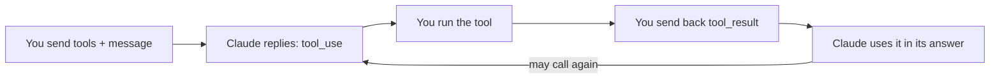

import Tabs from '@theme/Tabs';
import TabItem from '@theme/TabItem';

<LevelBadge level="intermediate" />

<VerifyNote lastVerified="2026-06-20" source="https://platform.claude.com/docs/en/docs/build-with-claude/tool-use">
Le forme di richiesta/risposta dell'uso degli strumenti sono stabili ma evolvono — conferma i campi nella documentazione ufficiale sull'uso degli strumenti.
</VerifyNote>

L'**uso degli strumenti** consente a Claude di chiamare funzioni che *tu* definisci — una ricerca, una calcolatrice, il tuo database, qualsiasi API — e di usarne i risultati. È il fondamento di ogni [agent](/docs/api/building-agents).

<Callout type="objectives" items={["Come funziona il loop agentico in quattro passi, dalle definizioni degli strumenti alla risposta finale","Come definire uno strumento in Python con nome, descrizione e input in JSON Schema","Perché le descrizioni degli strumenti agiscono come prompt che modellano quando e come Claude li chiama","Come validare gli input, restituire gli errori come risultati e usare in sicurezza gli strumenti lato server"]} />

## Il loop

L'uso degli strumenti è una conversazione, non una singola chiamata. Offri a Claude un menu di strumenti; Claude ne sceglie uno e si ferma; tu lo esegui e riferisci; Claude integra il risultato nella sua risposta — ripetendo il ciclo se necessario.

<Steps items={[{title: "Invia il menu", body: "Includi una lista di definizioni di strumenti — ciascuna con un nome, una descrizione e un input in JSON Schema."}, {title: "Claude sceglie uno strumento", body: "Se Claude decide di usarne uno, restituisce un blocco tool_use con gli argomenti e si ferma."}, {title: "Esegui tu", body: "Esegui tu stesso lo strumento e rinvii l'output come tool_result."}, {title: "Claude continua", body: "Claude continua, eventualmente chiamando altri strumenti, finché non risponde."}]} />

## Definire uno strumento (Python)

Una definizione di strumento è solo un nome, una descrizione in linguaggio naturale e un JSON Schema per l'input. Passala in `tools`, poi controlla `stop_reason` per sapere quando Claude vuole agire.

<PromptCard title="Strumento get_weather + prima chiamata">{`tools = [{
    "name": "get_weather",
    "description": "Get current weather for a city.",
    "input_schema": {
        "type": "object",
        "properties": {"city": {"type": "string"}},
        "required": ["city"],
    },
}]

msg = client.messages.create(
    model="claude-sonnet-4-6", max_tokens=1024,
    tools=tools,
    messages=[{"role": "user", "content": "What's the weather in Rome?"}],
)
# If msg.stop_reason == "tool_use": run the tool, then send a tool_result back.`}</PromptCard>

## Suggerimenti

Piccole scelte nel modo in cui definisci e gestisci gli strumenti fanno una grande differenza in termini di affidabilità.

- **Le descrizioni sono prompt.** Una `description` dello strumento chiara e la documentazione dei parametri migliorano enormemente quando/come Claude lo chiama.
- **Valida gli input** che ricevi prima di eseguirli — non fidarti mai ciecamente.
- **Restituisci gli errori come risultati.** Se uno strumento fallisce, invia un `tool_result` che descrive l'errore così Claude può recuperare.
- **Strumenti lato server.** Anthropic offre anche strumenti integrati (ad esempio ricerca web, esecuzione di codice, computer use) — consulta la documentazione per il menu attuale.

:::warning Strumenti = azioni = rischio
Uno strumento che compie azioni reali eredita un modello di sicurezza. Applica il privilegio minimo e mantieni un umano nel loop per le chiamate rischiose — vedi [Mettere in sicurezza agent e strumenti](/docs/security/securing-agents).
:::

<Flashcards title="Vocabolario dell'uso degli strumenti" cards={[{front: "Blocco tool_use", back: "Ciò che Claude restituisce quando decide di chiamare uno strumento — include gli argomenti — dopodiché si ferma e aspetta te."}, {front: "tool_result", back: "Il messaggio che rinvii contenente l'output dello strumento (o una descrizione dell'errore così Claude può recuperare)."}, {front: "input_schema", back: "Il JSON Schema che descrive gli input di uno strumento: tipi, proprietà e quali campi sono obbligatori."}, {front: "Strumenti lato server", back: "Strumenti integrati offerti da Anthropic, ad esempio ricerca web, esecuzione di codice, computer use — consulta la documentazione per il menu attuale."}]} />

<Quiz title="Mettiti alla prova" questions={[{q: "Dopo che Claude restituisce un blocco tool_use, chi esegue lo strumento?", options: ["Claude lo esegue automaticamente sui server di Anthropic", "Lo esegui tu e rinvii l'output come tool_result", "Lo esegue il JSON Schema"], answer: 1, explain: "Claude restituisce un blocco tool_use e si ferma; tu esegui lo strumento e rinvii il risultato come tool_result."}, {q: "Uno strumento che hai definito fallisce a runtime. Qual è la mossa consigliata?", options: ["Riprovare in silenzio finché non riesce", "Inviare un tool_result che descrive l'errore così Claude può recuperare", "Interrompere la conversazione"], answer: 1, explain: "Restituisci gli errori come risultati — un tool_result che descrive il fallimento permette a Claude di recuperare."}, {q: "Perché una descrizione chiara dello strumento è così importante?", options: ["Serve solo per documentazione e Claude la ignora", "Le descrizioni sono prompt — modellano quando e come Claude chiama lo strumento", "Cambia le regole di validazione del JSON Schema"], answer: 1, explain: "Le descrizioni sono prompt: una descrizione chiara e la documentazione dei parametri migliorano enormemente quando e come Claude chiama uno strumento."}]} />

<Callout type="takeaways" items={["L'uso degli strumenti è un loop: invii le definizioni degli strumenti, Claude restituisce un blocco tool_use e si ferma, tu esegui e restituisci un tool_result, Claude continua finché non risponde.","Una definizione di strumento è un nome, una descrizione e un input in JSON Schema — passala in tools e controlla stop_reason == tool_use.","Le descrizioni sono prompt; valida gli input prima di eseguirli; restituisci i fallimenti come errori in un tool_result così Claude può recuperare.","Anthropic offre anche strumenti lato server, e qualsiasi strumento che compie azioni reali necessita del privilegio minimo più un umano nel loop."]} />

## Avanti

- [Costruire agent sull'API](/docs/api/building-agents)
- [Output strutturato](/docs/api/structured-output)
- [MCP e collegamento agli strumenti](/docs/api/mcp)
