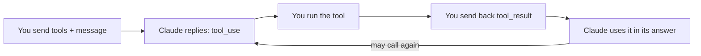

<LevelBadge level="intermediate" />

L'**uso degli strumenti** consente a Claude di chiamare funzioni che *tu* definisci — una ricerca, una calcolatrice, il tuo database, qualsiasi API — e di usarne i risultati. È il fondamento di ogni [agente](/docs/api/building-agents).

La maggior parte dei tutorial sull'uso degli strumenti si ferma dopo il loop in quattro passi. Il loop è la parte facile. Ciò che manda davvero in crisi le integrazioni in produzione è più specifico e meno discusso: le forme di messaggio che restituiscono `400`, il campo d'errore che permette a Claude di recuperare invece di scusarsi, e il fatto che **forzare una chiamata a uno strumento non funziona più sui modelli Claude più recenti**. Questa pagina copre tutto questo.

<Callout type="objectives" items={["Come funziona il loop agentico in quattro passi, dalle definizioni degli strumenti alla risposta finale","Come scrivere una definizione di strumento — e descrizioni che indirizzano davvero quando Claude lo chiama","Le tre regole sulla forma dei messaggi che restituiscono un 400, e il testo d'errore che ti dice quale hai violato","Perché tool_choice \"any\" e \"tool\" ora falliscono sui modelli più recenti, e i due sostituti","Come garantire input degli strumenti conformi allo schema con strict: true","Perché i risultati degli strumenti sono il punto in assoluto più probabile in cui una prompt injection raggiunge il tuo agente"]} />

<VerifyNote lastVerified="2026-09-29" source="https://platform.claude.com/docs/en/agents-and-tools/tool-use/define-tools">
I campi di una definizione di strumento, la matrice di supporto di `tool_choice`, le regole di formattazione
di `tool_result`, il comportamento di `is_error` e la semantica di `strict: true` sono stati verificati il
29 settembre 2026 sulle pagine "Define tools", "Handle tool calls" e "Strict tool use" di Anthropic. Il
supporto dei modelli all'uso forzato degli strumenti cambia a ogni release — ricontrolla la matrice di
supporto sulla pagina Define tools prima di farci affidamento, e consulta
[Modelli e prezzi attuali](/docs/whats-new/models-and-pricing) per la lineup corrente.
</VerifyNote>

## Il loop

L'uso degli strumenti è una conversazione, non una singola chiamata. Offri a Claude un menu di strumenti; Claude ne sceglie uno e si ferma; tu lo esegui e riferisci; Claude integra il risultato nella sua risposta — ripetendo il ciclo se necessario.


```mermaid
flowchart LR
  A[You send tools + message] --> B[Claude replies: tool_use]
  B --> C[You run the tool]
  C --> D[You send back tool_result]
  D --> E[Claude uses it in its answer]
  E -->|may call again| B
```

<Steps items={[{title: "Invia il menu", body: "Includi una lista di definizioni di strumenti — ciascuna con un nome, una descrizione e un input in JSON Schema."}, {title: "Claude sceglie uno strumento", body: "Se Claude decide di usarne uno, la risposta torna con stop_reason \"tool_use\" e uno o più blocchi tool_use, ciascuno con un id, un name e un oggetto input."}, {title: "Esegui tu", body: "Esegui tu stesso lo strumento e rinvii l'output come tool_result che fa riferimento all'id del tool_use."}, {title: "Claude continua", body: "Claude continua, eventualmente chiamando altri strumenti, finché non risponde con uno stop_reason normale."}]} />

Nota il plurale al passo 2: Claude può restituire **più blocchi `tool_use` in una singola risposta**. Smista in base al campo `type` di ciascun blocco invece di dare per scontato `content[0]` — una risposta di solito apre con un blocco `text`, e sui modelli più recenti può aprire invece con blocchi `thinking`.

## Definire uno strumento

Una definizione di strumento è un nome, una descrizione in linguaggio naturale e un JSON Schema per l'input.

| Campo | Obbligatorio | Note |
| --- | --- | --- |
| `name` | sì | Deve corrispondere alla regex `^[a-zA-Z0-9_-]{1,128}$` |
| `description` | sì | Cosa fa, quando usarlo, quando *non* usarlo. Punta ad almeno 3–4 frasi |
| `input_schema` | sì | Un oggetto JSON Schema che descrive i parametri |
| `input_examples` | no | Un array di oggetti input di esempio, ciascuno valido rispetto allo schema |
| `strict` | no | Imposta `true` per forzare input conformi allo schema — vedi sotto |
| `cache_control` | no | Mette in cache la definizione tra i turni (vedi [Prompt Caching](/docs/api/prompt-caching)) |

<PromptCard title="Strumento get_weather + prima chiamata (Python)">{`tools = [{
    "name": "get_weather",
    "description": (
        "Get the current weather for a city. Use this when the user asks about "
        "present conditions or temperature in a named place. Returns temperature "
        "in the requested unit plus a one-word sky condition. It does NOT return "
        "forecasts — use get_forecast for anything in the future."
    ),
    "input_schema": {
        "type": "object",
        "properties": {
            "city": {"type": "string", "description": "City and region, e.g. 'Rome, IT'"},
            "unit": {"type": "string", "enum": ["celsius", "fahrenheit"]},
        },
        "required": ["city"],
        "additionalProperties": False,
    },
}]

msg = client.messages.create(
    model="claude-opus-5-5", max_tokens=1024,
    tools=tools,
    messages=[{"role": "user", "content": "What's the weather in Rome?"}],
)

if msg.stop_reason == "tool_use":
    for block in msg.content:            # iterate — never index content[0]
        if block.type == "tool_use":
            result = run_tool(block.name, block.input)
            # send back a tool_result carrying block.id`}</PromptCard>

### Le descrizioni sono prompt

Il campo `description` è di gran lunga la leva più potente sulla qualità dell'uso degli strumenti — lo legge il modello, non i tuoi colleghi. Le indicazioni di Anthropic sono inequivocabili su cosa distingue una buona descrizione:

- **Dì quando *non* usarlo.** La maggior parte delle selezioni sbagliate è uno strumento chiamato per un compito che appartiene a uno strumento adiacente.
- **Consolida invece di moltiplicare.** Invece di `create_pr`, `review_pr`, `merge_pr`, spedisci un solo strumento con un parametro `action`. Strumenti meno numerosi e più ampi riducono l'ambiguità nella selezione.
- **Usa un namespace per servizio.** `github_list_prs` e `slack_send_message` battono `list_prs` e `send_message` quando la tua superficie di strumenti cresce.
- **Restituisci risultati ad alto segnale.** Identificatori stabili e semantici (slug, UUID) e solo i campi che servono a Claude per scegliere il passo successivo. Un output di strumento gonfio brucia contesto e seppellisce il segnale.
- **Per input delicati, aggiungi `input_examples`.** Gli esempi validati rispetto allo schema costano circa 20–50 token ciascuno per oggetti semplici e 100–200 per quelli complessi e annidati, e un esempio non valido restituisce un 400.

## Gestire la risposta: le tre regole che restituiscono 400

È qui che il codice funzionante di solito si rompe. Un `tool_result` è un normale messaggio `user`, ma l'API impone tre regole di posizionamento.

<Steps items={[{title: "I risultati devono seguire immediatamente il loro tool_use", body: "Nessun messaggio può stare tra il messaggio tool_use dell'assistant e il tuo messaggio tool_result. Se violi questa regola, l'API segnala: tool_use ids were found without tool_result blocks immediately after."}, {title: "I blocchi tool_result vengono PRIMA nell'array content", body: "Qualsiasi testo che aggiungi deve venire DOPO tutti i tool_result. Un blocco text prima di un tool_result è un 400."}, {title: "Se una chiamata a uno strumento lato server è ancora irrisolta, invia SOLO blocchi tool_result", body: "Quando lo stesso turno dell'assistant ha chiamato anche uno strumento lato server che non ha ancora un risultato, aggiungere del testo in coda chiude il turno in anticipo e la richiesta fallisce con un 400 che nomina lo strumento lato server irrisolto."}]} />

```json
// ❌ 400 — text before tool_result
{"role": "user", "content": [
  {"type": "text", "text": "Here are the results:"},
  {"type": "tool_result", "tool_use_id": "toolu_01", "content": "15 degrees"}
]}

// ✅ correct — results first, text after (client tools only)
{"role": "user", "content": [
  {"type": "tool_result", "tool_use_id": "toolu_01", "content": "15 degrees"},
  {"type": "text", "text": "What should I do next?"}
]}
```

Il `content` di un `tool_result` può essere una stringa semplice, oppure una lista di blocchi `text`, `image`, `document` o `search_result`. Può anche essere omesso del tutto per uno strumento che non restituisce nulla.

### Restituisci i fallimenti come risultati, non come eccezioni

Quando uno strumento solleva un'eccezione, non interrompere il loop — restituisci il fallimento con `is_error`:

```json
{"role": "user", "content": [{
  "type": "tool_result",
  "tool_use_id": "toolu_01A09q90qw90lq917835lq9",
  "content": "Rate limit exceeded. Retry after 60 seconds.",
  "is_error": true
}]}
```

Scrivi il messaggio per un lettore che deve decidere cosa fare dopo. `"failed"` non dice niente a Claude; `"Rate limit exceeded. Retry after 60 seconds."` gli dice di aspettare invece di riprovare subito. Quando una chiamata a uno strumento non è valida o manca un parametro, Claude di norma riprova due o tre volte con delle correzioni prima di arrendersi e scusarsi con l'utente — quindi un errore istruttivo è spesso la differenza tra il recupero e un vicolo cieco.

## Garantire input conformi allo schema: `strict: true`

Impostare `strict: true` su una definizione di strumento vincola il sampling dei token del modello a un output conforme allo schema (grammar-constrained sampling). L'`input` di ogni blocco `tool_use` corrisponde allora in modo dimostrabile al tuo `input_schema`, e il `name` è sempre uno strumento reale — nessun `"2"` dove ti serviva `2`, nessun campo obbligatorio mancante, nessuno strato di validazione-e-riprova.

<PromptCard title="Definizione di strumento strict">{`{
  "name": "search_flights",
  "description": "Search bookable flights for a route and date.",
  "strict": true,
  "input_schema": {
    "type": "object",
    "properties": {
      "destination": {"type": "string"},
      "departure_date": {"type": "string", "format": "date"},
      "passengers": {"type": "integer", "enum": [1, 2, 3, 4, 5, 6]}
    },
    "required": ["destination", "departure_date"],
    "additionalProperties": false
  }
}`}</PromptCard>

Tre avvertenze che vale la pena conoscere prima di attivarlo ovunque:

- Lo schema deve restare all'interno del sottoinsieme di JSON Schema supportato — lo stesso che usa l'[Output strutturato](/docs/api/structured-output).
- Le voci **toolset** di computer use e browser use rifiutano `strict: true`; una richiesta che lo imposta su una delle due viene rifiutata.
- Gli schemi compilati vengono messi in cache separatamente dal contenuto dei messaggi per un massimo di 24 ore. Le indicazioni di Anthropic sono esplicite: **non inserire informazioni sanitarie protette negli schemi** — né nei nomi delle proprietà, né nei valori `enum`, né nei valori `const`, né nelle regex `pattern`. I PHI vanno nel contenuto dei messaggi, che gode delle tutele HIPAA che gli schemi in cache non hanno.

## `tool_choice` — e perché forzare uno strumento ora fallisce

`tool_choice` controlla se Claude *può*, *deve* o *non può* chiamare uno strumento. Accetta quattro valori:

| Valore | Significato |
| --- | --- |
| `auto` | Claude decide. Il default ogni volta che `tools` è presente |
| `any` | Claude deve chiamare uno dei tuoi strumenti, ma sceglie quale |
| `tool` | Claude deve chiamare lo strumento indicato |
| `none` | Claude non può chiamare nessuno strumento. Il default quando non è presente alcun `tools` |

Ecco la parte che a ogni altra guida sull'uso degli strumenti attualmente manca. **`any` e `tool` non sono supportati universalmente, e sui modelli più recenti restituiscono un 400.**

| Modello o impostazione | Limitazione | Usa invece |
| --- | --- | --- |
| Extended thinking manuale (`thinking` di tipo `enabled`) | `any` e `tool` danno errore | `auto` o `none`. Il thinking adattivo da solo *non* blocca l'uso forzato degli strumenti |
| Claude Opus 5.5, Sonnet 5.5, Fable 5.1, Mythos 5.1 | `any` e `tool` restituiscono un 400, indipendentemente dalle impostazioni di thinking | `auto` più `strict: true`, oppure [Output strutturato](/docs/api/structured-output). `none` funziona ancora |

L'errore è esplicito:

```text
tool_choice: type "tool" and "any" are not supported for this model.
```

La stessa validazione si applica all'endpoint di conteggio dei token, quindi una richiesta che passa il conteggio dei token non ti riserverà sorprese più tardi.

### Cosa fare invece

Separare le due motivazioni rende la migrazione ovvia, perché l'uso forzato degli strumenti svolgeva due compiti distinti:

- **«Mi serve JSON conforme allo schema.»** Non è mai stato davvero un problema di forzare una chiamata. Tieni `tool_choice` su `auto` e imposta `strict: true`, oppure sposta lo schema sull'[Output strutturato](/docs/api/structured-output) se vuoi una risposta invece di una chiamata.
- **«Mi serve che chiami lo strumento, non che mi parli addosso.»** Dillo nel prompt. Dichiarare quando lo strumento si applica — «Usa `get_weather` per qualsiasi domanda sulle condizioni attuali» — indirizza ancora quale strumento sceglie `auto`.

Rinunciare all'uso forzato degli strumenti ha un bonus: `any` e `tool` funzionavano precompilando il messaggio dell'assistant, cosa che sopprimeva qualsiasi preambolo in linguaggio naturale prima dei blocchi `tool_use`. Con `auto`, Claude può spiegare cosa sta per fare — che di solito è ciò che vuoi in un agente rivolto all'utente.

:::tip Trappola della cache
Cambiare `tool_choice` a metà conversazione **invalida i blocchi di messaggio in cache**. Le definizioni degli strumenti e i system prompt restano in cache, ma il contenuto dei messaggi deve essere rielaborato. Se stavi commutando `tool_choice` a ogni turno, ti stava costando silenziosamente — vedi [Prompt Caching](/docs/api/prompt-caching).
:::

## Strumenti lato client vs. strumenti lato server

Non tutti gli strumenti hanno bisogno di un handler nel tuo codice.

- **Strumenti lato client** — i tuoi. Definisci lo schema, esegui, restituisci un `tool_result`. Il loop visto sopra.
- **Strumenti lato client con schema Anthropic** — bash, text editor, memory. Lo schema è predefinito, ma a eseguirli è comunque la *tua* app.
- **Strumenti lato server** — web search, web fetch, code execution, tool search. Girano sull'infrastruttura di Anthropic senza codice di handler da parte tua, e gli errori sono gestiti in modo trasparente: per uno strumento lato server non restituisci mai `is_error`.
- **Toolset lato client** — computer use e browser use sono una singola voce senza `name` che dichiara un insieme fisso di strumenti membri. I loro blocchi `tool_use` portano un campo aggiuntivo `toolset_name` (`"computer"` o `"browser"`), e il `name` è il membro che viene chiamato, come `screenshot` o `navigate`. **Smista in base a entrambi i campi**, e rimanda indietro `toolset_name` nel risultato — il risultato di un membro che lo omette viene rifiutato.

## Errori comuni

- **Indicizzare `content[0]`** invece di iterare e smistare in base a `type`. Le risposte spesso iniziano con un blocco `text`, e sui modelli più recenti con blocchi `thinking`.
- **Gestire un solo `tool_use` per risposta.** Claude può chiamare più strumenti in un turno; un loop che risponde al primo e scarta gli altri lascia degli id `tool_use` senza risultati, che è un 400 alla richiesta successiva.
- **Mettere i tuoi commenti prima dei risultati.** I blocchi `tool_result` vengono per primi, sempre.
- **Inghiottire le eccezioni degli strumenti.** Un'eccezione nel tuo handler chiude il loop; un risultato con `is_error` permette a Claude di adattarsi.
- **Ricorrere a `tool_choice: "any"` per abitudine.** Sui modelli flagship attuali è un 400 — e comunque `strict: true` era già la risposta migliore.
- **Trattare l'output degli strumenti come affidabile.** Vedi sotto.

:::warning I risultati degli strumenti sono la più grande superficie di injection del tuo agente
I risultati degli strumenti portano abitualmente contenuti che non controlli: pagine web, email in arrivo, upload degli utenti, API di terze parti. Un attaccante che può influenzarne una parte qualsiasi può inserire istruzioni dirette al tuo modello — prompt injection indiretta. Mantieni i contenuti non affidabili **dentro i blocchi `tool_result`**, mai innestati nel prompt `system` o in un semplice blocco `text` dell'utente, e leggi [Prompt Injection](/docs/security/prompt-injection) e [Mettere in sicurezza agenti e strumenti](/docs/security/securing-agents). Uno strumento che compie azioni reali eredita anche un modello di sicurezza: privilegio minimo, e un umano nel loop per tutto ciò che è irreversibile.
:::

<Flashcards title="Vocabolario dell'uso degli strumenti" cards={[{front: "Blocco tool_use", back: "Ciò che Claude restituisce quando decide di chiamare uno strumento — porta id, name e input — dopodiché si ferma e aspetta te. Una risposta può contenerne diversi."}, {front: "tool_result", back: "Un blocco di messaggio user che porta l'output di uno strumento, agganciato all'id del tool_use. Deve venire per primo nell'array content, immediatamente dopo il messaggio tool_use dell'assistant."}, {front: "is_error", back: "Booleano opzionale su un tool_result che marca la chiamata come fallita. Claude legge il messaggio e si adatta — di solito riprovando due o tre volte prima di scusarsi."}, {front: "strict: true", back: "Grammar-constrained sampling su una definizione di strumento: l'input dello strumento corrisponde in modo dimostrabile al tuo input_schema. Richiede additionalProperties false; rifiutato sulle voci toolset computer/browser; tieni i PHI fuori dallo schema."}, {front: "tool_choice", back: "auto | any | tool | none. auto è il default quando tools è presente; none quando non lo è. any e tool restituiscono un 400 su Opus 5.5, Sonnet 5.5, Fable 5.1 e Mythos 5.1."}, {front: "toolset_name", back: "Campo aggiuntivo sui blocchi membro di computer use e browser use (\"computer\" o \"browser\"). Smista in base a esso oltre che a name, e rimandalo indietro nel risultato, altrimenti il risultato viene rifiutato."}]} />

<Quiz title="Mettiti alla prova" questions={[{q: "Imposti tool_choice su {\"type\": \"tool\", \"name\": \"get_weather\"} con claude-opus-5-5. Cosa succede?", options: ["Claude è costretto a chiamare get_weather", "La richiesta restituisce un 400 — l'uso forzato degli strumenti non è supportato su quel modello", "Claude ignora tool_choice e risponde in testo"], answer: 1, explain: "Su Opus 5.5, Sonnet 5.5, Fable 5.1 e Mythos 5.1 i tipi \"any\" e \"tool\" di tool_choice restituiscono un 400 indipendentemente dalle impostazioni di thinking. Usa auto con strict: true, oppure l'output strutturato."}, {q: "Il tuo messaggio user contiene un blocco text che spiega i risultati, seguito da due blocchi tool_result. Cosa fa l'API?", options: ["Lo accetta — l'ordine non conta", "Restituisce un 400: i blocchi tool_result devono venire per primi, il testo dopo", "Scarta silenziosamente il blocco text"], answer: 1, explain: "I blocchi tool_result devono venire PER PRIMI nell'array content; qualsiasi testo deve venire dopo tutti loro."}, {q: "Uno strumento che hai definito solleva un errore di connessione a runtime. Qual è la mossa consigliata?", options: ["Propagare l'eccezione e terminare la conversazione", "Riprovare in silenzio finché non riesce", "Inviare un tool_result con is_error true e un messaggio istruttivo come 'Rate limit exceeded. Retry after 60 seconds.'"], answer: 2, explain: "Restituisci il fallimento come tool_result con is_error true. Un messaggio istruttivo dice a Claude cosa fare dopo; un generico 'failed' non gli dice niente."}, {q: "Perché i contenuti web non affidabili dovrebbero restare dentro un blocco tool_result invece di essere incollati nel system prompt?", options: ["I blocchi tool_result costano meno in token", "Limita la prompt injection indiretta — il contenuto in un tool_result è inquadrato come dato, non come istruzione", "Il system prompt ha un limite di lunghezza"], answer: 1, explain: "I risultati degli strumenti portano contenuti che non controlli. Tenerli nei blocchi tool_result invece che nel system prompt o in un semplice testo dell'utente è il contenimento raccomandato da Anthropic per la prompt injection indiretta."}]} />

<Callout type="takeaways" items={["L'uso degli strumenti è un loop: invii le definizioni degli strumenti, Claude restituisce uno o più blocchi tool_use e si ferma, tu esegui e restituisci dei tool_result, Claude continua. Itera sui blocchi di content in base al type — non indicizzare mai content[0].","Tre regole di posizionamento causano la maggior parte dei 400: i risultati devono seguire immediatamente il loro tool_use, i blocchi tool_result vengono per primi nell'array content, e una chiamata a uno strumento lato server irrisolta impone soli risultati.","L'uso forzato degli strumenti è scomparso sui modelli più recenti: tool_choice \"any\" e \"tool\" restituiscono un 400 su Opus 5.5, Sonnet 5.5, Fable 5.1 e Mythos 5.1. Usa auto con strict: true, oppure l'output strutturato, e indirizza la selezione degli strumenti dal prompt.","strict: true garantisce input conformi allo schema tramite grammar-constrained sampling — ma tieni i PHI fuori dagli schemi e non impostarlo sulle voci toolset computer/browser.","Restituisci i fallimenti come tool_result con is_error e un messaggio istruttivo, così Claude può adattarsi invece di scusarsi.","I risultati degli strumenti sono la via più probabile perché una prompt injection indiretta raggiunga il tuo agente — tienici dentro i contenuti non affidabili, applica il privilegio minimo e subordina le azioni irreversibili a un umano."]} />

## Avanti

- [Programmatic Tool Calling](/docs/api/programmatic-tool-calling) — lascia che Claude chiami questi stessi strumenti da Python dentro una sandbox, riducendo i round-trip e tenendo i risultati intermedi fuori dal contesto
- [Output strutturato](/docs/api/structured-output) — l'altra metà del sostituto dell'uso forzato degli strumenti, quando vuoi una risposta JSON invece di una chiamata
- [Costruire agenti sull'API](/docs/api/building-agents) — avvolgi il loop in un agente reale
- [Claude Opus 5.5: la guida sul campo](/docs/models/opus-5-5-field-guide) — la storia completa della migrazione dietro la rimozione dell'uso forzato degli strumenti
- [MCP e collegamento agli strumenti](/docs/api/mcp) — ottieni gli strumenti da un server invece di definirli tu stesso
