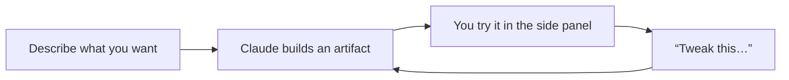

<LevelBadge level="beginner" />

<VerifyNote lastVerified="2026-06-20" source="https://www.anthropic.com">
Le capacità degli artifact (interattività, persistenza, ciò che possono richiamare) evolvono rapidamente — verifica il comportamento attuale nell'app/centro assistenza.
</VerifyNote>

Gli **artifact** sono output che Claude visualizza in un **pannello laterale** accanto alla chat — un documento, un grafico, un'app funzionante, un diagramma — che puoi vedere, usare e affinare, separatamente dal testo della conversazione.

## Cosa puoi creare

- **Mini app e strumenti web** — un calcolatore, un quiz, un modulo, una piccola demo interattiva.
- **Documenti** — testi strutturati che puoi rifinire ed esportare.
- **Elementi visivi** — grafici, diagrammi e semplici dashboard di dati.
- **Codice** che puoi leggere ed eseguire.

## Perché è potente per chi non programma

Puoi costruire qualcosa di *utilizzabile* — "creami un calcolatore della mancia per una cena di gruppo", "una dashboard da questo CSV" — descrivendolo, e poi affinarlo conversando ("aggiungi un campo per il coperto", "ingrandisci i pulsanti"). È l'esempio più chiaro di **costruire con l'AI senza scrivere tu stesso codice**.

## Come lavorare con gli artifact

1. **Chiedi la cosa**, con dettagli (scopo, input, aspetto).
2. **Affina in linguaggio naturale** — Claude aggiorna lo stesso artifact.
3. **Usalo** nel pannello; **esporta/condividi** dove supportato.

## Suggerimenti

- **Sii concreto** su input/output e pubblico — esattamente come in un buon [prompting](/docs/prompting/basics).
- **Affina poco alla volta.** Una modifica per volta è più facile da azzeccare.
- **Verifica qualsiasi logica/numero** che un artifact calcola per usi importanti ([Allucinazioni](/docs/foundations/hallucinations)).

## Avanti

- [Generare file reali (docx/pptx/xlsx/pdf)](/docs/claude-app/generating-files)
- [Iniziare con Claude.ai](/docs/claude-app/getting-started)
- [Playbook di analisi dati](/docs/playbooks/data-analysis)
