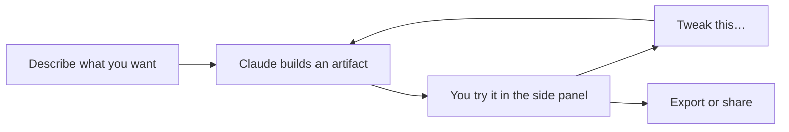

<LevelBadge level="beginner" />

<VerifyNote lastVerified="2026-09-25" source="https://support.claude.com/en/articles/17153992-what-are-artifacts-and-how-do-i-use-them">
Gli Artifacts sono disponibili su **Free, Pro, Max, Team ed Enterprise**. I tre *template* — **Claude Docs**, **Claude Slides** e **Claude Design** — sono **in beta solo sui piani a pagamento**: attivi di default su Pro, Max e Team, disattivati su Enterprise finché un owner non li abilita uno per uno. Qui le funzionalità cambiano in fretta — conferma il comportamento attuale nel Centro assistenza.
</VerifyNote>

Gli **Artifacts** sono output che Claude visualizza in un **pannello laterale** accanto alla chat — un documento, una presentazione, un grafico, un'app funzionante — che puoi vedere, usare e affinare, separatamente dal testo della conversazione.

Dalla [fusione di settembre 2026](/docs/claude-app/one-claude-docs-and-slides), il pannello è anche il posto dove vivono i tre **template**. Questo rende "artifact" il contenitore e "template" la forma di partenza.

<Callout type="objectives" items={[
  "Sapere cosa può produrre il pannello degli artifact, e quali output sono artifact semplici e quali template in beta",
  "Scegliere tra un Doc, una presentazione, un design, un'app eseguibile e un file scaricabile — senza andare per tentativi",
  "Affinare un artifact in linguaggio naturale invece di ripartire da zero",
  "Sapere quali artifact puoi esportare, in quali formati e su quali piani"
]} />

## Cosa puoi creare

| Output | Di cosa si tratta | Piano |
| --- | --- | --- |
| **Mini app e strumenti web** | Un calcolatore, un quiz, un modulo, una piccola demo interattiva | Tutti i piani |
| **Grafici e diagrammi** | Elementi visivi e semplici dashboard di dati | Tutti i piani |
| **Codice** | Qualcosa che puoi leggere ed eseguire | Tutti i piani |
| **Claude Docs** | Un documento vivo, multi-tab, che co-editi con Claude e il tuo team | A pagamento, beta |
| **Claude Slides** | Una presentazione costruita dai tuoi appunti o dalla conversazione, presentabile sul posto | A pagamento, beta |
| **Claude Design** | Elementi visivi, mockup, prototipi e landing page allineati al tuo design system | A pagamento, beta |

Le esportazioni cambiano in base al tipo: i Docs escono in **Word, PDF, Markdown e Google Docs**; le Slides in **PowerPoint e PDF**; i Design come **.zip, PDF, PowerPoint o HTML standalone**.

## Perché è potente per chi non programma

Puoi costruire qualcosa di *utilizzabile* — "creami un calcolatore della mancia per una cena di gruppo", "una dashboard da questo CSV" — semplicemente descrivendolo, e poi affinarlo conversando ("aggiungi un campo per il coperto", "ingrandisci i pulsanti"). È l'esempio più chiaro di **costruire con l'AI senza scrivere tu stesso codice**.

## Come lavorare con gli artifact

<Steps items={[
  {title: "Chiedi la cosa, con dettagli", body: "Dichiara lo scopo, gli input, il pubblico e l'aspetto. La vaghezza è il motivo principale per cui il primo artifact manca il bersaglio — vale la stessa regola del prompting ordinario."},
  {title: "Oppure scegli tu la forma", body: "Seleziona Output nella casella del messaggio e scegli un template, o avviane uno dal tab Artifacts. Fallo quando Claude continua a produrre una forma diversa da quella che avevi in mente."},
  {title: "Affina in linguaggio naturale", body: "Claude aggiorna lo stesso artifact invece di crearne uno nuovo. Una modifica per volta è molto più facile da azzeccare di una lista di cinque."},
  {title: "Usalo, poi esporta o condividi", body: "Provalo nel pannello. Docs, Slides e Design hanno ciascuno i propri formati di esportazione; le regole di condivisione dipendono dal tuo piano."}
]} />

```mermaid
flowchart LR
  A[Describe what you want] --> B[Claude builds an artifact]
  B --> C[You try it in the side panel]
  C --> D["Tweak this…"] --> B
  C --> E[Export or share]
```

<PromptCard title="Un brief specifico batte sempre uno vago">{`Build me an interactive artifact: a tip calculator for a group dinner.

Inputs: bill total, number of people, tip percentage (slider, 0-30%,
default 18), and a toggle for "service charge already included".
Output: tip amount, total, and per-person share, updating live.

Audience: my friends on their phones — big tap targets, works at
375px wide, no explanation text.`}</PromptCard>

## Suggerimenti

- **Sii concreto** su input/output e pubblico — esattamente come in un buon [prompting](/docs/prompting/basics).
- **Affina poco alla volta.** Una modifica per volta è più facile da azzeccare.
- **Verifica qualsiasi logica o numero** che un artifact calcola, se l'uso è importante ([Allucinazioni](/docs/foundations/hallucinations)).
- **I grafici dentro un Doc non si aggiornano da soli.** Cambi i dati e il grafico continua a mostrare i valori vecchi finché non chiedi a Claude di ricostruirlo.

## Quiz

<Quiz questions={[
  {q: "Sei sul piano Free e chiedi a Claude di trasformare una conversazione in un documento multi-tab condivisibile. Cosa ottieni?", options: ["Un Claude Doc — gli artifact ci sono su ogni piano", "Un Claude Doc, ma in sola lettura", "Non un Claude Doc — i template sono in beta solo sui piani a pagamento; puoi comunque ottenere un artifact semplice o un file scaricabile", "Niente, gli artifact richiedono un piano a pagamento"], answer: 2, explain: "Gli artifact in sé sono disponibili su Free, Pro, Max, Team ed Enterprise. I tre template — Docs, Slides e Design — sono in beta solo sui piani a pagamento. Su Free puoi comunque ottenere artifact semplici e file generati."},
  {q: "Claude ha costruito un artifact quasi giusto, ma i pulsanti sono troppo piccoli. Qual è la mossa efficiente?", options: ["Aprire una nuova conversazione con una specifica più completa", "Chiedere la modifica in linguaggio naturale — Claude aggiorna lo stesso artifact", "Esportarlo e modificarlo a mano", "Chiedere cinque correzioni in una volta per risparmiare turni"], answer: 1, explain: "Affinare conversando aggiorna lo stesso artifact, che è tutto il senso del pannello. E una modifica per volta va a segno più affidabilmente di un blocco di cinque."}
]} />

<Callout type="takeaways" items={[
  "Artifact = il contenitore nel pannello laterale; template = la forma di partenza (Docs, Slides, Design).",
  "Gli artifact semplici funzionano su ogni piano; i tre template sono in beta sui piani a pagamento, e disattivati di default su Enterprise.",
  "Affina in linguaggio naturale sullo stesso artifact — non ricominciare la conversazione.",
  "Verifica sempre i numeri calcolati, e ricostruisci i grafici dopo ogni cambio dei dati."
]} />

## Avanti

- [One Claude: la fusione, Claude Docs e Claude Slides](/docs/claude-app/one-claude-docs-and-slides) — i template in profondità, e i loro limiti
- [Generare file reali (docx/pptx/xlsx/pdf)](/docs/claude-app/generating-files) — quando vuoi un download al posto di un artifact
- [Playbook di analisi dati](/docs/playbooks/data-analysis)
