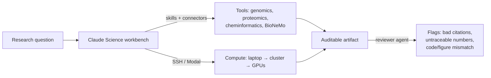

<LevelBadge level="advanced" />

<VerifyNote lastVerified="2026-07-13" source="https://www.anthropic.com/news/claude-science-ai-workbench">
Claude Science è in beta. Skill integrate, modelli connessi, opzioni di calcolo e disponibilità dei piani cambiano rapidamente — verifica i dettagli attuali nell'app e nell'annuncio ufficiale prima di farci affidamento.
</VerifyNote>

<Callout type="objectives" items={["Capire cos'è Claude Science — e lo specifico problema che risolve e che una finestra di chat non può risolvere", "Conoscere i suoi tre pilastri: strumenti integrati, artefatti verificabili e calcolo gestito", "Vedere come l'agente revisore individua automaticamente numeri non tracciabili e figure incoerenti", "Sapere quando ricorrere a Claude Science rispetto a Claude semplice o a Claude Code", "Collocarlo nel più ampio panorama dell'AI per la scienza senza sopravvalutare ciò che un modello può verificare"]} />

Gran parte del lavoro scientifico con un chatbot generico si rompe sempre nello stesso punto: il modello ragiona bene, ma gli *strumenti, i dati e il calcolo* vivono altrove — un cluster, un notebook, un browser genomico, un modello di folding. Copi i risultati avanti e indietro a mano, e nessuno può poi ricostruire esattamente come è stata prodotta una figura. **Claude Science** (beta, lanciato il **30 giugno 2026**) è il tentativo di Anthropic di chiudere questa cucitura: un *banco di lavoro* AI dove il ragionamento, gli strumenti, il calcolo e la provenienza vivono tutti nello stesso posto.

È un'app distinta — non un prompt che incolli in chat. Pensala come [Claude Code](/docs/claude-code/what-is-claude-code) puntato su flussi di lavoro di biologia da laboratorio e computazionale invece che su repository software.

## Il problema che affronta

Un ricercatore che esegue, ad esempio, una pipeline di RNA a singola cellula deve gestire: una fonte di dati, uno strumento di QC, una libreria di plotting, un modello di folding su una GPU e un gestore di citazioni — più il carico mentale di ricordare quale versione di quale script ha prodotto quale figura tre settimane fa. Gli assistenti generici aiutano con *un* passaggio e perdono il filo su tutti gli altri.

<Callout type="tip">
L'unità di valore nella scienza non è una buona risposta — è una risposta **riproducibile**. Claude Science è costruito attorno a questo: i suoi output sono progettati in modo che un revisore (umano o agente) possa risalire da ogni numero al codice e all'ambiente che lo ha prodotto.
</Callout>

## I tre pilastri

### 1. Strumenti integrati — l'ambiente arriva già cablato

Claude Science include **oltre 60 skill e connettori curati** preconfigurati per genomica, singola cellula, proteomica, biologia strutturale e chemioinformatica. Fondamentale: si connette nativamente ai modelli **NVIDIA BioNeMo** — inclusi **Evo 2** (modello fondativo genomico), **Boltz-2** (predizione di struttura/affinità) e **OpenFold3** (folding proteico) — così la predizione di folding o affinità è un passaggio del tuo flusso di lavoro, non un portale separato.

Questa è la stessa macchina di [skill e connettori](/docs/claude-code/skills) che forse conosci da Claude Code, curata per uno stack scientifico invece che per uno software.

### 2. Artefatti verificabili — la provenienza è l'impostazione predefinita, non un ripensamento

Ogni output porta con sé la sua intera storia:

- il **codice e l'ambiente esatti** che l'hanno prodotto,
- una **descrizione in linguaggio naturale** di come è stato creato, e
- l'**intera cronologia dei messaggi** che c'è dietro.

In più, un **agente revisore** segnala automaticamente **citazioni errate, numeri non tracciabili e figure che non corrispondono al codice sottostante**. Quest'ultimo è il presidio meno ovvio: un grafico dall'aspetto plausibile i cui dati non provengono realmente dal codice nell'artefatto viene individuato.

<Callout type="warning">
L'agente revisore riduce una classe di errori — non rende gli output *corretti*. Segnala citazioni che non può verificare e numeri che non può tracciare; non può garantire il disegno sperimentale, la validità biologica o se è stata posta la domanda giusta. Provenienza ≠ verità. La scienza resta tua responsabilità.
</Callout>

### 3. Calcolo gestito — dal tuo laptop a centinaia di GPU

Claude Science **gestisce il calcolo sul tuo laptop, sul tuo cluster o su GPU on demand**, scalando **da una singola GPU a centinaia secondo necessità**. Funziona con l'infrastruttura esistente — cluster HPC via **SSH**, o account **Modal** — così i job pesanti girano dove i tuoi dati e le tue allocazioni già sono, senza che tu debba scrivere a mano l'orchestrazione.

## Visualizzazione scientifica nativa

I risultati vengono renderizzati **nell'interfaccia**, non come file da scaricare e aprire altrove: **strutture proteiche 3D, tracce del browser genomico e strutture chimiche** vengono mostrate nativamente. Ispezioni un fold o un locus dove hai ragionato su di esso — l'idea di [artefatto](/docs/claude-app/artifacts), estesa agli oggetti scientifici.

## Un flusso di lavoro tipico

<Steps items={[{title: "Inquadra la domanda", body: "Enuncia la domanda biologica e punta Claude Science alla tua fonte di dati tramite un connettore."}, {title: "Lascia che assembli la pipeline", body: "Seleziona le skill (QC, allineamento, folding) e propone i passaggi — rivedili prima di far girare calcolo pesante."}, {title: "Esegui dove vivono i dati", body: "Sposta il passaggio costoso sul tuo cluster HPC via SSH o su GPU on demand; i passaggi leggeri restano locali."}, {title: "Ispeziona nativamente", body: "Visualizza la struttura 3D, la traccia genomica o la struttura chimica in linea invece di esportare prima."}, {title: "Consegna un artefatto verificabile", body: "L'output raccoglie codice, ambiente, metodo in linguaggio naturale e cronologia dei messaggi — e l'agente revisore segnala qualsiasi cosa non tracciabile."}]} />

<PromptCard title="Una prima richiesta concreta dentro Claude Science">{`Load the connected single-cell dataset, run standard QC (filter low-count cells and high-mito), and show a UMAP colored by cluster. Keep every step in an auditable artifact I can hand to a reviewer.`}</PromptCard>

<PromptCard title="Sposta il passaggio pesante su calcolo reale">{`Predict the structure of this sequence with the connected folding model, run it on my HPC cluster over SSH, and render the 3D structure inline when it finishes.`}</PromptCard>

## Quando usarlo (e quando no)

| Usa Claude Science quando… | Ricorri ad altro quando… |
|---|---|
| Ti servono output scientifici riproducibili e revisionabili | Vuoi una risposta veloce e una tantum → [Claude](/docs/claude-app/getting-started) semplice |
| Il tuo lavoro spazia tra strumenti di genomica / proteomica / chemioinformatica | Stai costruendo software → [Claude Code](/docs/claude-code/what-is-claude-code) |
| Il calcolo pesante deve girare sul tuo cluster o su GPU on demand | Non hai connettori dati o calcolo da cablare |
| La provenienza (codice + ambiente + cronologia) conta davvero per la revisione | Sei su Free, o su Windows (vedi disponibilità) |

## Disponibilità e limiti

- **Piani:** Beta per gli utenti **Claude Pro, Max, Team ed Enterprise**. (Nessun livello Free.)
- **Piattaforme:** **macOS e Linux** — nota che al lancio non c'è un client Windows.
- **Stato:** Beta — aspettati che l'elenco delle skill integrate, i modelli connessi e le opzioni di calcolo cambino.

<Callout type="tip">
Claude Science è specifico di Claude, ma lo *schema* è diffuso in tutto il settore: gli assistenti stanno acquisendo livelli di integrazione degli strumenti, provenienza e calcolo per poter fare lavoro reale, non solo descriverlo. Aspettati mosse "banco di lavoro" equivalenti da altri laboratori di AI — l'asticella di riproducibilità che Claude Science fissa è un buon metro per giudicarli.
</Callout>

<Flashcards title="Vocabolario di Claude Science" cards={[{front: "Claude Science", back: "Il banco di lavoro AI in beta di Anthropic per gli scienziati: strumenti di ricerca integrati, artefatti verificabili, visualizzazione nativa e calcolo gestito in un'unica app."}, {front: "Artefatto verificabile", back: "Un output raccolto insieme al codice esatto, al suo ambiente, a un metodo in linguaggio naturale e all'intera cronologia dei messaggi — così ogni risultato può essere ricondotto a come è stato prodotto."}, {front: "Agente revisore", back: "Un controllo automatico che segnala citazioni errate, numeri non tracciabili e figure che non corrispondono al codice sottostante. Riduce l'errore; non garantisce la correttezza."}, {front: "BioNeMo", back: "La collezione di modelli fondativi per la biologia di NVIDIA. Claude Science si connette nativamente a Evo 2, Boltz-2 e OpenFold3."}, {front: "Calcolo gestito", back: "Claude Science esegue i job sul tuo laptop, sul cluster HPC (via SSH) o su GPU on demand (es. Modal), scalando da una GPU a centinaia."}, {front: "Chemioinformatica", back: "Analisi computazionale di strutture e proprietà chimiche — uno dei domini per cui Claude Science precabla skill, insieme a genomica, singola cellula, proteomica e biologia strutturale."}]} />

<Quiz title="Verifica te stesso" questions={[{q: "Qual è l'obiettivo di progettazione più distintivo di Claude Science rispetto a un chatbot generico?", options: ["Risposte più veloci", "Riproducibilità — ogni risultato risale al codice e all'ambiente che lo hanno prodotto", "Una finestra di contesto più ampia"], answer: 1, explain: "I suoi output sono artefatti verificabili (codice + ambiente + metodo in linguaggio naturale + cronologia dei messaggi), costruiti in modo che un revisore possa tracciare ogni numero. Quel design orientato alla provenienza è il differenziatore centrale."}, {q: "L'agente revisore segnala una figura i cui numeri non corrispondono al codice nell'artefatto. Cosa ha dimostrato?", options: ["Che la scienza è sbagliata", "Che il risultato è corretto", "Che la figura non è tracciabile — un problema di provenienza, non un verdetto sulla biologia"], answer: 2, explain: "Il revisore individua numeri non tracciabili, citazioni errate e incoerenze codice/figura. Riduce una classe di errori ma non può confermare che la scienza sottostante sia valida — la provenienza non è verità."}, {q: "Devi fare il folding di una proteina sull'allocazione HPC del tuo laboratorio dall'interno del banco di lavoro. Claude Science può…", options: ["Girare solo sul cloud di Anthropic", "Eseguire il job sul tuo cluster via SSH (o su GPU on demand), scalando secondo necessità", "Non fare affatto calcolo"], answer: 1, explain: "Claude Science gestisce il calcolo sul tuo laptop, sul cluster (via SSH) o su GPU on demand (es. Modal), da una singola GPU a centinaia."}, {q: "Quale utente non può usare Claude Science al lancio?", options: ["Un utente Max su macOS", "Un utente Enterprise su Linux", "Un utente del piano Free su Windows"], answer: 2, explain: "È in beta per Pro, Max, Team ed Enterprise (nessun livello Free) e viene rilasciato solo su macOS e Linux — quindi un utente Free/Windows è escluso su entrambi i fronti."}]} />

<Callout type="takeaways" items={["Claude Science è un'app beta distinta — un banco di lavoro AI per scienziati, non un prompt da incollare in chat.", "I suoi tre pilastri: strumenti precablati (60+ skill, BioNeMo nativo — Evo 2, Boltz-2, OpenFold3), artefatti verificabili e calcolo gestito.", "Gli artefatti verificabili raccolgono codice + ambiente + metodo + cronologia dei messaggi; un agente revisore segnala numeri non tracciabili, citazioni errate e incoerenze codice/figura.", "Il calcolo gira dove vivono i dati: laptop, HPC via SSH o GPU on demand, scalando da una a centinaia.", "Beta per Pro/Max/Team/Enterprise solo su macOS e Linux; la provenienza riduce l'errore ma non certifica mai che la scienza sia corretta."]} />

## Fonti e approfondimenti

- [Claude Science, an AI workbench for scientists — Anthropic](https://www.anthropic.com/news/claude-science-ai-workbench) — l'annuncio di lancio (30 giugno 2026); fonte per le 60+ skill, le connessioni BioNeMo, la struttura degli artefatti verificabili, l'agente revisore, le opzioni di calcolo e la disponibilità.
- [NVIDIA BioNeMo](https://www.nvidia.com/en-us/clara/bionemo/) — la piattaforma di modelli fondativi per la biologia dietro Evo 2, Boltz-2 e OpenFold3.
- [Modal](https://modal.com/) — uno dei backend di calcolo on demand che Claude Science può usare.
- Correlati su AILmanac: [Claude Code](/docs/claude-code/what-is-claude-code), [Skills](/docs/claude-code/skills), [Artifacts](/docs/claude-app/artifacts) e [Managed Agents](/docs/api/managed-agents).
