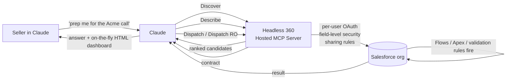

<LevelBadge level="intermediate" />

<VerifyNote lastVerified="2026-09-01" source="https://www.salesforce.com/news/press-releases/2026/08/26/salesforce-and-anthropic-announce-claudeforce/">
Claudeforce è stato annunciato il **26 agosto 2026**; **Salesforce in Claude** è oggi in **pilot selezionato** con **open beta prevista per settembre 2026**. La superficie MCP a 4 tool di Headless 360 è un'API pubblicata da Salesforce (Beta, luglio 2026). Numero di skill, prezzi e perimetro esatto delle linee Slack/Agentforce cambiano ogni settimana: verifica sulla documentazione Salesforce Developers collegata prima di impegnare un'org.
</VerifyNote>

Il **26 agosto 2026** Salesforce e Anthropic hanno annunciato insieme **Claudeforce**, una partnership a quattro linee. Il primo pezzo in consegna è **Salesforce in Claude**: un plugin che permette a una conversazione Claude di ragionare su dati CRM live e agire in modo governato, con **37 skill di vendita precostruite** (solo ~8 nominate pubblicamente al lancio), un'open beta prevista per settembre 2026 e, la parte che la stampa salta, una **superficie MCP sorprendentemente piccola** sotto il cofano.

La maggior parte degli articoli sono comunicati stampa ritagliati. Questa pagina è la guida pratica sul campo: l'architettura che rende possibili 37 skill da soli **4 tool MCP**, i **due modelli di autenticazione molto diversi** con cui il plugin viene distribuito e le **trappole di governance** che colpiranno RevOps se lo tratti come un'ennesima estensione Chrome.

<Callout type="objectives" items={[
  "Capire cosa arriva davvero nell'open beta di settembre 2026: le quattro linee di Claudeforce, e quale di queste è 'Salesforce in Claude'",
  "Vedere perché al plugin bastano 4 tool MCP (Discover / Describe / Dispatch / Dispatch Read-Only) per esporre l'intera superficie API di Salesforce",
  "Distinguere le due vie di autenticazione, OAuth per utente (Claude) vs integration user con client credentials (Slack), e scegliere correttamente per la tua org",
  "Classificare le 37 skill per livello di autorità (sola lettura / raccomandazione / scrittura) prima di attivarne una qualsiasi",
  "Evitare le quattro trappole: profili sovra-provisionati, effetti collaterali delle automazioni dimenticati, la collisione con l'upgrade Winter '27 e i server MCP in shadow IT"
]} />

## Cos'è davvero Claudeforce (e cosa non è)

Claudeforce è una partnership a quattro linee, non un prodotto. Solo una linea, **Salesforce in Claude**, apre a settembre 2026. Confondere le linee è il modo in cui i team RevOps finiscono per dimensionare il pilot sbagliato.

<Steps items={[
  {title: "Linea 1 — Salesforce in Claude (open beta settembre 2026)", body: "Un plugin Salesforce che gira DENTRO l'app Claude. I venditori restano in Claude; Claude raggiunge la loro org tramite l'Hosted MCP di Salesforce. È la linea di cui parla questa pagina."},
  {title: "Linea 2 — Claude dentro i prodotti Salesforce", body: "La direzione opposta: i modelli Anthropic disponibili come cittadini di prima classe in Agentforce (Atlas Reasoning Engine, Agentforce Vibes, Agentforce Coworker, Agent Builder). UX diversa, superficie admin diversa, calendario di rollout diverso."},
  {title: "Linea 3 — Claude come modello di default in Slack", body: "Le funzioni Slack AI (riassunti degli huddle, recap dei canali, bozze di messaggi) iniziano a usare Claude come modello di default. Governata in modo diverso: vedi la via di autenticazione Slack più sotto."},
  {title: "Linea 4 — Adozione commerciale incrociata", body: "Salesforce diventa un grande cliente Anthropic; Anthropic diventa un grande cliente Salesforce. Interessante per il procurement, irrilevante per il setup tecnico."}
]} />

Il resto della pagina riguarda la linea 1: **Salesforce in Claude**.

## L'architettura a 4 tool che scala a 37 skill

L'unica cosa non ovvia di Claudeforce è che il plugin **non** registra un tool per capacità. L'**[Headless 360 Hosted MCP Server](https://developer.salesforce.com/docs/platform/hosted-mcp-servers/guide/headless-360-mcp.html)** di Salesforce (Beta, luglio 2026) espone esattamente **quattro tool MCP**, e Claude raggiunge ogni skill componendoli.

<Steps items={[
  {title: "Discover", body: "Ricerca semantica su un indice vettoriale di ogni API e skill nell'org connessa. Claude passa la sua interpretazione della tua richiesta; Discover restituisce una lista ordinata di operazioni candidate. È il motivo per cui 'trovami la cosa sulla salute del deal per questo account' non richiede 200 tool pre-registrati che ingombrano il contesto."},
  {title: "Describe", body: "Per un candidato scelto, Describe restituisce il contratto tecnico: parametri, dipendenze, passi ordinati, effetti collaterali. Claude lo usa per verificare che Discover abbia fatto emergere la cosa giusta prima di impegnarsi a eseguire qualcosa."},
  {title: "Dispatch", body: "Esegue l'operazione scelta. Instrada verso l'endpoint corretto. Applica i guard di accesso utente prima che la chiamata raggiunga Salesforce. È il percorso di scrittura: validation rule, Flow, trigger Apex e governor limit CPU scattano tutti normalmente a valle di Dispatch."},
  {title: "Dispatch Read-Only", body: "Variante solo GET. Stesso flusso di discovery, stessi controlli di accesso, ma il tool fisicamente non può mutare nulla. È il default sicuro per il pilot e il tool a cui si legano le skill di sola lettura."}
]} />

Due implicazioni che la maggior parte dei post di lancio si perde:

- **La superficie dei tool resta piccola e stabile**, ma il **catalogo delle skill cresce in modo indipendente** lato Salesforce: Claude non ha bisogno di una nuova registrazione di tool per raggiungere una nuova skill.
- **Field-level security, permessi sugli oggetti e sharing rule si applicano a ogni chiamata di tool**: l'enforcement avviene nell'org, non in Claude. Se un utente non può vedere un campo nella UI Salesforce, Discover non lo farà emergere e Dispatch lo negherebbe comunque.

## Le due vie di autenticazione, e perché la differenza conta

Claudeforce arriva con **due modelli OAuth** attaccati a un plugin dall'aspetto identico, e hanno posture di sicurezza molto diverse. Sbagliare qui è il modo in cui dai per errore a ogni rep dell'org i permessi effettivi di un singolo integration user.

<Steps items={[
  {title: "Via A — Salesforce in Claude (OAuth per utente)", body: "Usa le Salesforce External Client App con lo scope mcp_api. Un singolo admin fa la connessione una tantum a livello di org; poi ogni venditore si autorizza come sé stesso. Ogni chiamata di tool da Claude gira come l'individuo richiedente, con IL SUO profilo, permission set, sharing rule e field-level security. È la postura corretta per qualsiasi cosa visibile all'utente."},
  {title: "Via B — Claude in Slack (client credentials)", body: "Usa il flusso OAuth 2.0 client credentials con un integration user dedicato. Gli access bundle condividono UNA credenziale agente tra gli utenti. Ogni richiesta gira come lo stesso integration user: i permessi di quell'utente diventano il tetto effettivo per chiunque lo tocchi. Comodo, ma la forma sbagliata per qualsiasi cosa con requisiti di isolamento dati per utente."}
]} />

<Callout type="warning" items={[
  "Se provisioni l'integration user di Slack con un profilo sales-ops ampio perché 'così funziona', ogni utente Slack instradato attraverso di esso eredita quell'accesso effettivo. Restringi il profilo dell'integration user al perimetro minimo di cui Slack ha davvero bisogno, poi aggiungi capacità con i permission set: stesso principio di qualsiasi service account condiviso."
]} />

## Le 37 skill, classificate per livello di autorità

Salesforce ha nominato solo una manciata di skill al lancio; altre arriveranno fino a fine 2026. Quello su cui puoi pianificare fin da ora è che ogni skill ricade in uno di **tre livelli di autorità**, e l'interfaccia le fa sembrare identiche. Classificarle tocca a te.

| Skill nominata (ago 2026) | Livello di autorità | Via Dispatch approssimativa |
| --- | --- | --- |
| Daily briefing | Sola lettura | Dispatch RO |
| Pipeline review | Sola lettura | Dispatch RO |
| Forecast narrative | Sola lettura | Dispatch RO |
| Meeting preparation | Sola lettura | Dispatch RO |
| Deal-health review | Sola lettura | Dispatch RO |
| Win/loss analysis | Sola lettura | Dispatch RO |
| Salesforce hygiene | Raccomandazione | Dispatch RO → bozze |
| Activity logging | Scrittura | Dispatch (POST/PATCH) |

Le restanti ~29 skill non sono pubblicate al lancio; man mano che arrivano si applica lo stesso triage:

<Steps items={[
  {title: "Sola lettura (solo Dispatch RO)", body: "Analizza, riassume, recupera. Non può mutare. Abilita liberamente per la coorte pilot. La modalità di fallimento è 'risposta sbagliata', non 'scrittura sbagliata'."},
  {title: "Raccomandazione (Dispatch RO + bozze)", body: "Analizza E propone modifiche, ma lascia la mutazione effettiva come bozza per un umano. Abilita dopo che il livello di sola lettura si comporta bene. La modalità di fallimento è una bozza sbagliata che un venditore potrebbe approvare senza leggere: misura il tasso di correzione, non solo la velocità."},
  {title: "Scrittura (Dispatch POST/PATCH/DELETE)", body: "Muta direttamente i dati CRM. Ogni scrittura passa per validation rule, Flow, trigger Apex e governor limit CPU dell'org, ESATTAMENTE come se un umano avesse cliccato Salva. Abilita per ultimo, skill per skill, con scoping del profilo per utente, e solo dopo aver misurato l'accuratezza del livello raccomandazione per almeno 4 settimane."}
]} />

## Impostare un pilot: la checklist RevOps

<Steps items={[
  {title: "1. Audita i profili che stai per esporre", body: "Qualsiasi profilo sovra-provisionato che era innocuo dietro una UI lenta diventa davvero rischioso dietro un agente veloce. Prima del pilot, esegui un audit dei permessi sugli utenti che inviterai: quali oggetti, quali campi, quale sharing per record type. Il plugin applicherà fedelmente ciò che dicono quei profili, incluso qualsiasi sovra-provisioning storico che nessuno aveva notato."},
  {title: "2. Lega gli utenti pilot a un permission set blindato", body: "Crea un permission set Claudeforce Pilot: oggetti specifici, campi specifici, sola lettura all'inizio. Assegnalo in aggiunta al loro profilo normale, così a fine pilot lo rimuovi in modo pulito senza toccare l'accesso di base."},
  {title: "3. Parti con Dispatch Read-Only ovunque", body: "Abilita solo skill di sola lettura per i primi due sprint. Ti permette di misurare l'accuratezza senza una superficie di rollback. Cerca nomi di campo allucinati o lookup di record sbagliati: sono le modalità di fallimento che sopravvivono nel livello di scrittura."},
  {title: "4. Scegli TRE workflow sui tre livelli di autorità per il pilot del livello di scrittura", body: "Uno di sola lettura, uno di raccomandazione, uno di scrittura. Profili di rischio diversi fanno emergere lacune di governance diverse, e un pilot per livello costa meno di un pilot per skill."},
  {title: "5. Versiona la tua baseline API", body: "Salesforce in Claude richiede API v67.0+; Winter '27 introduce la v68.0. Se la tua org si aggiorna automaticamente a Winter '27 durante la finestra beta (set–ott 2026), blocca esplicitamente la versione API del plugin così un upgrade di piattaforma non ti sposta la semantica a metà pilot."},
  {title: "6. Vieta le connessioni MCP gestite dai team durante la beta", body: "Se i singoli team tirano su i propri Hosted MCP Server per 'andare più veloci', hai reinventato lo shadow IT con un packaging più pulito. Centralizza la governance MCP sotto gli stessi admin che possiedono connected app e profili."}
]} />

<PromptCard title="Template di prompt per venditori: briefing pipeline del lunedì in sicurezza (livello sola lettura)">{`You are preparing my Monday pipeline briefing from Salesforce.

Every Monday at 07:00 local:

1. Use the "Pipeline review" skill on my named accounts (owner = me,
   stage != Closed Lost, close date in current quarter).
2. Use the "Deal-health review" skill on the top 10 by amount.
3. Use the "Meeting preparation" skill for accounts I have a meeting
   with in the next 5 business days.

Constraints (do NOT violate):
- Read-only pass only. If any skill proposes a write (update stage,
  log activity, change amount) STOP and surface it as a draft in
  the output — do NOT dispatch it.
- Do not log activities on my behalf. Do not update fields.
- If a skill returns a field you cannot see under my profile, do
  not guess the value — flag it as "hidden by permissions".

Produce a single briefing:
- 3-bullet TL;DR
- "Pipeline movement since last Monday" (opportunity-level, cite
  the Salesforce record IDs)
- "Deals I should touch this week" (with why, from deal-health)
- "Meetings this week" (with prep pack from meeting-preparation)
- "Proposed writes (NOT DISPATCHED)" — every draft change the agent
  wanted to make, so I can review in one place.`}</PromptCard>

Due cose che questo prompt fa e che la maggior parte dei post 'copia questo template' non fa:

- **Inchioda il pilot alla sola lettura** con un invariante esplicito "se la skill propone una scrittura, FERMATI". In una sessione Claude schedulata o di lunga durata non puoi rispondere a un 'sei sicuro?' successivo: gli invarianti devono vivere nel prompt.
- Chiede al modello di **far emergere in un unico posto ogni scrittura che avrebbe voluto fare**, così puoi misurare l'accuratezza a livello raccomandazione di una skill prima di promuoverla al livello di scrittura. È il modo più economico per guadagnarsi la promozione.

## Le quattro trappole che ti colpiranno

<Steps items={[
  {title: "1. I profili sovra-provisionati diventano blast radius live", body: "Lo stesso permission set che andava più o meno bene dietro una UI è davvero pericoloso dietro un agente che può fare Dispatch di 30 scritture al minuto. Rimedio: audit dei profili PRIMA del pilot, non dopo."},
  {title: "2. Gli effetti collaterali delle automazioni scattano a ogni scrittura Dispatch", body: "Dispatch PATCH è una normale scrittura Salesforce. Ogni validation rule, Flow, Process Builder, trigger Apex e governor limit di CPU scatta esattamente come un clic umano. Una skill ben intenzionata che gira in loop può far scattare i limiti CPU o propagare email indesiderate guidate da Flow. Rimedio: strumenta le tue automazioni sull'org pilot prima di attivare skill di scrittura."},
  {title: "3. Winter '27 arriva durante l'open beta", body: "Gli upgrade di produzione Winter '27 (set–ott 2026) collidono con l'open beta di Claudeforce. Se una skill si rompe a metà finestra, farai debug di DUE cambi di piattaforma simultanei. Rimedio: blocca la versione API sul plugin e, se puoi, programma l'upgrade Winter '27 della coorte pilot FUORI dalla finestra beta."},
  {title: "4. Via Slack ≠ via Claude", body: "Poiché Slack usa client credentials con un integration user, dare 'accesso Slack a Claudeforce' non è la stessa forma di governance del dare ai singoli utenti il plugin in Claude. Trattali come due rollout separati con due audit trail separati."}
]} />

## Dove si colloca Claudeforce rispetto ad Agentforce

Salesforce distribuisce **Agentforce** dal 2024 e Claude è UNO dei suoi foundation model da fine 2025. Claudeforce non sostituisce Agentforce: aggiunge una **nuova superficie** (l'app Claude) e **formalizza** Claude su quattro livelli di Agentforce (Atlas Reasoning Engine, Agentforce Vibes, Agentforce Coworker, Agent Builder). L'opzionalità del modello resta: Agent Builder offre ancora Amazon Nova accanto a Claude.

Tabella decisionale approssimativa per i team che guardano entrambi:

| Vuoi... | Scegli |
| --- | --- |
| Dare ai venditori un'interfaccia chat che ragiona sul CRM live | Salesforce in Claude (il plugin) |
| Incorporare funzioni AI DENTRO la tua UI Salesforce (record, list view, pulsanti) | Agentforce |
| Costruire un agente custom con tool, memoria, policy di escalation | Agent Builder (dentro Salesforce) |
| Automatizzare end-to-end lavoro CRM di back-office ripetibile | Agentforce Coworker |
| Usare Claude per scrivere codice Salesforce (Apex, LWC) | Agentforce Vibes |

Se si applica più di una riga, la scelta sbagliata è prenderne una e forzarla: Claudeforce è progettato perché plugin, Agentforce e Agent Builder siano complementari, e gli utenti possano muoversi tra loro nella stessa org.

## Quando NON usare Salesforce in Claude

- **Ti serve un'integrazione machine-to-machine.** Il plugin è una superficie chat human-in-the-loop. Per scritture CRM non presidiate su larga scala, collega direttamente l'[Headless 360 MCP Server](https://developer.salesforce.com/docs/platform/hosted-mcp-servers/guide/headless-360-mcp.html) ai [Managed Agents](/docs/api/managed-agents), senza l'app Claude in mezzo.
- **Distribuisci già un'esperienza Agentforce che i tuoi venditori conoscono.** Aggiungere una seconda superficie frammenta la formazione e raddoppia il lavoro di governance. Scegli quella in cui vive il tuo team.
- **Non hai admin Salesforce per governare tutto questo.** Il plugin rende l'org più potente e più raggiungibile: una pessima combinazione senza qualcuno che possiede profili, permission set e connessioni MCP.
- **La tua postura di compliance vieta l'inferenza su dati dei clienti.** Anche se il plugin instrada l'inferenza attraverso Amazon Bedrock dentro il Salesforce Trust Boundary, il contenuto dei prompt e i dati restituiti lasciano comunque il layer di storage. Leggi il tuo DPA prima del pilot.

## Quiz

<Quiz questions={[
  {q: "Quanti tool MCP espone a Claude il server Headless 360, indipendentemente da quante 'skill' ci sono nel catalogo?", options: ["37 — una per skill precostruita", "Centinaia — una per operazione API Salesforce", "4 — Discover, Describe, Dispatch, Dispatch Read-Only", "1 — un tool generico 'salesforce'"], answer: 2, explain: "Salesforce mantiene deliberatamente la superficie MCP minuscola e stabile a quattro tool (Discover / Describe / Dispatch / Dispatch RO). Le nuove skill arrivano nel catalogo dietro quei quattro tool; il modello non ha bisogno di una nuova registrazione di tool per ciascuna. È ciò che permette allo stesso plugin di scalare da 37 skill al lancio a centinaia in seguito senza inquinare la finestra di contesto di Claude."},
  {q: "Dai a un venditore un permission set con accesso in modifica su Opportunity.Amount e abiliti una skill di livello scrittura. Il venditore chiede a Claude di alzare tre opportunità del 10%. Cosa scatta lato org?", options: ["Solo l'UPDATE grezzo — Claude bypassa le automazioni dell'org per velocità", "L'UPDATE più ogni validation rule, Flow e trigger Apex su Opportunity, esattamente come un clic nella UI", "Niente — le scritture vengono accodate e applicate in un batch notturno", "Le automazioni sono disabilitate di default quando il chiamante è un agente"], answer: 1, explain: "Dispatch PATCH è una normale scrittura Salesforce. Validation rule, Flow, Process Builder, trigger Apex e governor limit CPU scattano tutti. Per questo 'audita le automazioni' è nella checklist pre-pilot: un agente che fa 30 scritture al minuto può silenziosamente far scattare un governor limit o propagare un'email guidata da Flow che non ti aspettavi."},
  {q: "Il tuo CFO chiede 'l'integrazione Claude in Slack è governata allo stesso modo di Salesforce in Claude?'. Qual è la risposta corretta?", options: ["Sì — stesso OAuth, stesso enforcement per utente", "No — Slack usa client credentials con un integration user, quindi ogni richiesta gira come quell'unico utente, non per venditore", "Sì — entrambe passano per il Salesforce Trust Boundary quindi non importa", "No — Slack non ha autenticazione, è di sola lettura"], answer: 1, explain: "Salesforce in Claude usa OAuth per utente tramite External Client App (scope mcp_api): ogni chiamata gira come l'individuo richiedente. La via Slack usa OAuth 2.0 client credentials con un integration user dedicato, quindi ogni richiesta tramite Slack gira come quell'integration user. È una forma di governance diversa e richiede un rollout e un audit trail separati."},
  {q: "Stai pianificando il pilot Claudeforce per inizio ottobre 2026. Qual è il rischio specifico di timing della piattaforma da cui guardarsi?", options: ["Una scadenza rigida entro cui il pilot deve finire", "Gli upgrade di produzione Winter '27 arrivano tra set e ott 2026 e potrebbero spostare la semantica API a metà pilot", "Anthropic che dismette Claude Opus 4.8", "Un cambio di prezzo su Sonnet 5 in vigore dal 1° settembre"], answer: 1, explain: "Gli upgrade Winter '27 (set–ott 2026) collidono con la finestra dell'open beta. Blocca esplicitamente la versione API del plugin e, se puoi, programma l'upgrade Winter '27 della coorte pilot fuori dalla finestra beta: altrimenti una skill rotta avrà due possibili cause radice da distinguere. (Il cambio di prezzo di Sonnet 5 del 1° settembre è stato ANNULLATO; $2/$10 è ora permanente.)"}
]} />

## Fonti e approfondimenti

- Salesforce — [Salesforce and Anthropic Announce Claudeforce](https://www.salesforce.com/news/press-releases/2026/08/26/salesforce-and-anthropic-announce-claudeforce/) (comunicato stampa di lancio, 26 ago 2026)
- Salesforce Developers — [Headless 360 (Beta) — riferimento Hosted MCP Servers](https://developer.salesforce.com/docs/platform/hosted-mcp-servers/guide/headless-360-mcp.html) (architettura canonica a 4 tool)
- Salesforce Developers — [Riferimento Standard Servers](https://developer.salesforce.com/docs/platform/hosted-mcp-servers/guide/servers-reference.html) (auth per utente, enforcement della field-level security)
- Salesforce Developers Blog — [Announcing the Headless 360 MCP Server Beta](https://developer.salesforce.com/blogs/2026/07/announcing-the-headless-360-mcp-server-beta) (lancio dell'architettura, luglio 2026)
- Anthropic — [Prezzo permanente di Claude Sonnet 5](https://www.anthropic.com/news/claude-sonnet-5) (10 ago 2026, $2/$10 confermato permanente: l'aumento del 1° settembre è stato annullato)
- Correlati su AILmanac: [Connettori (MCP) nelle app](/docs/claude-app/connectors) · [Task schedulati in Cowork](/docs/claude-app/cowork-scheduled-tasks) · [Lo standard aperto Skill.md](/docs/models/skill-md-open-standard) · [Managed Agents](/docs/api/managed-agents) · [Restrizioni di dominio dei Managed Agents](/docs/api/managed-agents-domain-restrictions) · [Mettere in sicurezza i server MCP](/docs/security/securing-mcp-servers) · [Tool poisoning e rug pull in MCP](/docs/security/mcp-tool-poisoning-and-rug-pulls)

## Prossimi passi

- [Connettori (MCP) nelle app](/docs/claude-app/connectors) — il concetto generale che questo plugin specializza
- [Mettere in sicurezza i server MCP](/docs/security/securing-mcp-servers) — i pattern di sicurezza da applicare prima di aprire il pilot
- [Managed Agents](/docs/api/managed-agents) — l'alternativa lato API quando ti serve tutto questo senza l'app Claude nel loop
