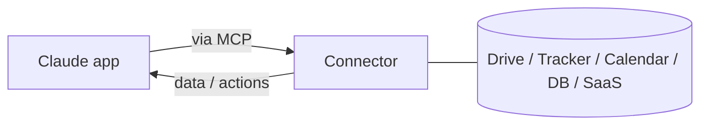

<LevelBadge level="intermediate" />

<VerifyNote lastVerified="2026-06-20" source="https://platform.claude.com/docs">
Quali connettori esistono, e la loro disponibilità per piano, cambiano frequentemente — verifica le opzioni attuali nell'app/centro assistenza.
</VerifyNote>

I **connettori** permettono alle app Claude di raggiungere **al di fuori della chat** — fin dentro i tuoi strumenti e dati (drive, sistemi di ticketing, calendari, database e altro) — così Claude può rispondere attingendo a sistemi reali e agire su di essi. Sotto il cofano sono alimentati dall'aperto **[Model Context Protocol (MCP)](/docs/claude-code/mcp)**.

## Cosa fanno

Senza connettori, Claude conosce solo ciò che è nella conversazione. Con un connettore può (con il tuo permesso) recuperare informazioni rilevanti da un servizio collegato — ad esempio trovare un documento, leggere i ticket recenti, controllare un calendario — e usarle nella sua risposta.

## Stesso standard, ovunque

I connettori sono la forma **rivolta alle app** di MCP. Lo stessissimo protocollo alimenta [MCP in Claude Code](/docs/claude-code/mcp) e [sull'API](/docs/api/mcp). Impara il concetto una volta; vale su tutte le superfici.

## Configurazione e uso

1. **Connetti** il servizio (autorizza tramite OAuth, dove supportato).
2. **Concedi il privilegio minimo** — solo l'accesso necessario al compito.
3. **Chiedi in modo naturale** — "trova il mio documento di pianificazione del Q3 e riassumi i rischi".

## Sicurezza

:::warning Un connettore è accesso + (a volte) azioni
- Autorizza solo servizi e ambiti (scope) di cui ti fidi.
- I contenuti recuperati da fonti esterne possono veicolare [prompt injection](/docs/security/prompt-injection) — sii prudente quando un connettore legge materiale non attendibile.
- Verifica cosa può fare un connettore di terze parti prima di abilitarlo ([Revisione di codice di terze parti](/docs/security/reviewing-third-party-code)).
:::

## Avanti

- [Server MCP in Claude Code](/docs/claude-code/mcp)
- [MCP e connessione agli strumenti (API)](/docs/api/mcp)
- [L'AI nei tuoi strumenti esistenti](/docs/claude-app/ai-in-your-tools)
