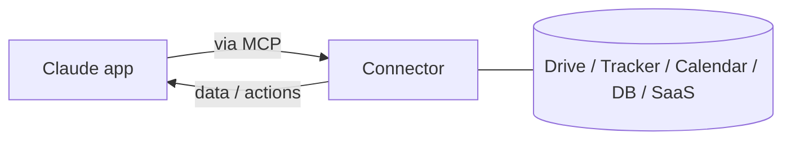

<LevelBadge level="intermediate" />

<Callout type="objectives" items={[
  "Capire cosa aggiunge un connettore che la sola chat non può fare",
  "Vedere perché connettori, server MCP di Claude Code e MCP sull'API sono lo stesso standard con tre volti diversi",
  "Configurarne uno con privilegio minimo, in tre passi",
  "Conoscere i due rischi che stai accettando: l'accesso, e i contenuti non attendibili che arrivano attraverso di esso"
]} />

<VerifyNote lastVerified="2026-08-02" source="https://platform.claude.com/docs">
Quali connettori esistono, e la loro disponibilità per piano, cambiano frequentemente — verifica le opzioni attuali nell'app/centro assistenza.
</VerifyNote>

I **connettori** permettono alle app Claude di raggiungere **al di fuori della chat** — fin dentro i tuoi strumenti e dati (drive, sistemi di ticketing, calendari, database e altro) — così Claude può rispondere attingendo a sistemi reali e agire su di essi. Sotto il cofano sono alimentati dall'aperto **[Model Context Protocol (MCP)](/docs/claude-code/mcp)**.

## Cosa fanno

Senza connettori, Claude conosce solo ciò che è nella conversazione. Con un connettore può (con il tuo permesso) recuperare informazioni rilevanti da un servizio collegato — ad esempio trovare un documento, leggere i ticket recenti, controllare un calendario — e usarle nella sua risposta.

```mermaid
flowchart LR
  C[Claude app] -->|via MCP| K[Connector]
  K --- S[(Drive / Tracker / Calendar / DB / SaaS)]
  K -->|data / actions| C
```

## Stesso standard, ovunque

I connettori sono la forma **rivolta alle app** di MCP. Lo stessissimo protocollo alimenta [MCP in Claude Code](/docs/claude-code/mcp) e [sull'API](/docs/api/mcp). Impara il concetto una volta; vale su tutte le superfici.

## Configurazione e uso

<Steps items={[
  {
    title: "Connetti il servizio",
    body: "Autorizza tramite OAuth, dove supportato. È il passo che crea la relazione di fiducia — tutto ciò che viene dopo erediterà qualunque cosa tu conceda qui."
  },
  {
    title: "Concedi il privilegio minimo",
    body: "Solo l'accesso necessario al compito. Un connettore che deve soltanto trovare documenti non ha bisogno di ambiti di scrittura, e una concessione in sola lettura è il controllo di sicurezza più economico che hai a disposizione."
  },
  {
    title: "Chiedi in modo naturale",
    body: "Non sei tu a invocare il connettore: descrivi l'obiettivo. \"Trova il mio documento di pianificazione del Q3 e riassumi i rischi\" — è Claude a decidere quale strumento usare."
  }
]} />

<PromptCard title="Interroga un servizio collegato">
{`Find my Q3 planning doc and summarize the risks.`}
</PromptCard>

## Sicurezza

:::warning Un connettore è accesso + (a volte) azioni
- Autorizza solo servizi e ambiti (scope) di cui ti fidi.
- I contenuti recuperati da fonti esterne possono veicolare [prompt injection](/docs/security/prompt-injection) — sii prudente quando un connettore legge materiale non attendibile.
- Verifica cosa può fare un connettore di terze parti prima di abilitarlo ([Revisione di codice di terze parti](/docs/security/reviewing-third-party-code)).
:::

<Quiz questions={[
  {
    q: "Un connettore recupera un documento condiviso scritto da qualcuno esterno al tuo team. Qual è il rischio specifico che questo crea?",
    options: [
      "Il documento viene conteggiato nel limite di spazio del tuo piano",
      "Prompt injection — contenuti non attendibili che arrivano attraverso il connettore possono veicolare istruzioni",
      "Il connettore otterrà automaticamente accesso in scrittura al documento",
      "Claude non può leggere documenti che non ha creato lui"
    ],
    answer: 1,
    explain: "I contenuti recuperati da fonti esterne possono veicolare prompt injection. Il connettore è il canale di consegna di materiale che non hai scritto tu, ed è esattamente per questo che la nota di sicurezza avverte sul materiale non attendibile."
  },
  {
    q: "Ti serve solo che Claude trovi e legga documenti. Quale ambito dovresti concedere?",
    options: [
      "Accesso completo, così non devi mai riautorizzare",
      "Solo l'accesso necessario al compito — privilegio minimo",
      "Qualunque cosa il connettore richieda per impostazione predefinita",
      "Nessun ambito: i connettori funzionano senza autorizzazione"
    ],
    answer: 1,
    explain: "Privilegio minimo. Un connettore che deve soltanto trovare documenti non ha bisogno di ambiti di scrittura, e la concessione che fai in fase di configurazione viene ereditata da tutto ciò che il connettore farà in seguito."
  },
  {
    q: "Qual è la relazione tra i connettori delle app, i server MCP in Claude Code e MCP sull'API?",
    options: [
      "Tre sistemi di integrazione senza alcuna relazione, che per caso condividono un nome",
      "Tre superfici dello stesso protocollo aperto — impara il concetto una volta sola",
      "I connettori sono un formato legacy che MCP ha sostituito",
      "Solo la versione API è vero MCP; le altre sono semplificate"
    ],
    answer: 1,
    explain: "I connettori sono la forma di MCP rivolta alle app. Lo stesso protocollo alimenta i server MCP di Claude Code e MCP sull'API, quindi il concetto si trasferisce su tutte e tre le superfici."
  }
]} />

<Callout type="takeaways" items={[
  "Senza un connettore Claude conosce solo ciò che è nella conversazione; con un connettore può leggere da sistemi reali e agire su di essi, con il tuo permesso.",
  "I connettori sono MCP con il suo volto rivolto alle app — lo stesso protocollo dei server MCP di Claude Code e di MCP sull'API.",
  "La configurazione sta in tre passi: connetti, concedi il privilegio minimo, poi descrivi semplicemente l'obiettivo.",
  "Stai accettando due rischi: l'accesso che hai concesso, e i contenuti non attendibili che arrivano attraverso di esso. Restringi gli ambiti e tratta il materiale esterno come non attendibile."
]} />

## Avanti

- [Server MCP in Claude Code](/docs/claude-code/mcp)
- [MCP e connessione agli strumenti (API)](/docs/api/mcp)
- [L'AI nei tuoi strumenti esistenti](/docs/claude-app/ai-in-your-tools)
- [Claudeforce: Salesforce in Claude](/docs/claude-app/claudeforce-salesforce-in-claude) — un plugin reale che trasforma il pattern MCP a 4 strumenti in 37 skill per le vendite
