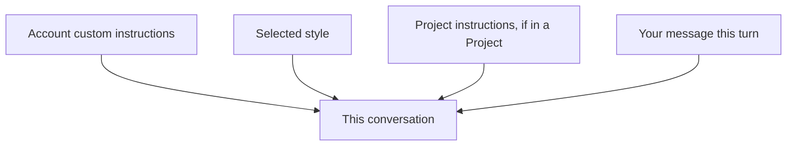

<LevelBadge level="beginner" />

<VerifyNote lastVerified="2026-06-20" source="https://www.anthropic.com">
I nomi e le posizioni esatti delle istruzioni personalizzate e degli stili nelle app Claude cambiano — verifica nell'app/centro assistenza.
</VerifyNote>

Stanco di ripetere "sii conciso" o "sono un'infermiera, spiega di conseguenza" a ogni chat? Le **istruzioni personalizzate** e gli **stili** ti permettono di impostare i tuoi valori predefiniti una volta sola e farli valere ovunque.

## Istruzioni personalizzate = il tuo system prompt personale

Imposta fatti e preferenze stabili — chi sei, cosa fai, come ti piacciono le risposte — e Claude li applica a tutte le conversazioni. È la versione per app consumer di un [system prompt](/docs/foundations/roles) (e il cugino di [CLAUDE.md](/docs/claude-code/claude-md) per chi sviluppa).

Cose buone da includere:
- **Contesto su di te** ("gestisco una piccola panetteria"; "programmo in Python").
- **Preferenze di output** ("rispondi sempre con brevi elenchi puntati"; "mostra sempre il tuo ragionamento").
- **Regole ferree** ("non usare mai emoji"; "unità metriche").

## Stili = preset di presentazione

Gli **stili** cambiano tono/formato (conciso, formale, esplicativo, ecc.) e possono essere cambiati per ogni conversazione. Usa uno stile quando vuoi una *voce diversa per questa chat* senza riscrivere le tue istruzioni stabili.

## Come si combinano

Il contesto più specifico/più recente tende a prevalere in caso di conflitto — quindi le istruzioni di un [Progetto](/docs/claude-app/projects) o una richiesta esplicita nel tuo messaggio possono sovrascrivere i tuoi valori predefiniti globali. Mantienili coerenti per evitare sorprese.

## Suggerimenti

- **Mantieni le istruzioni brevi e veritiere** — come per CLAUDE.md, l'eccesso e le regole obsolete fanno male.
- **Non inserire segreti** nelle istruzioni personalizzate.
- **Rivedile** ogni tanto, man mano che le tue esigenze cambiano.

## Avanti

- [Ruoli System, User e Assistant](/docs/foundations/roles)
- [Progetti: spazi di lavoro persistenti](/docs/claude-app/projects)
- [CLAUDE.md e file di memoria](/docs/claude-code/claude-md)
