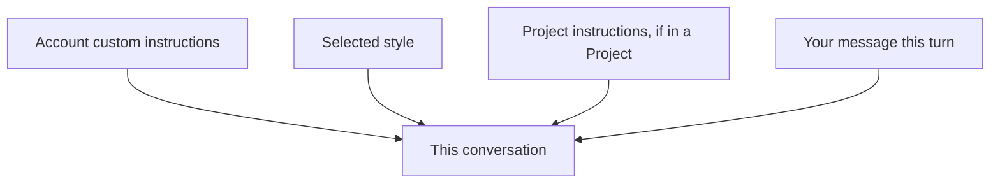

<LevelBadge level="beginner" />

<Callout type="objectives" items={[
  "Distinguere le istruzioni personalizzate dagli stili — e sapere quale usare",
  "Scrivere un primo set di istruzioni stabili in tre righe che valga la pena conservare",
  "Capire l'ordine di combinazione quando quattro livelli di istruzioni sono in conflitto",
  "Evitare i due errori che rendono le istruzioni stabili peggiori del non averle",
]} />

<VerifyNote lastVerified="2026-08-02" source="https://www.anthropic.com">
I nomi e le posizioni esatti delle istruzioni personalizzate e degli stili nelle app Claude cambiano — verifica nell'app/centro assistenza.
</VerifyNote>

Stanco di ripetere "sii conciso" o "sono un'infermiera, spiega di conseguenza" a ogni chat? Le **istruzioni personalizzate** e gli **stili** ti permettono di impostare i tuoi valori predefiniti una volta sola e farli valere ovunque.

## Istruzioni personalizzate = il tuo system prompt personale

Imposta fatti e preferenze stabili — chi sei, cosa fai, come ti piacciono le risposte — e Claude li applica a tutte le conversazioni. È la versione per app consumer di un [system prompt](/docs/foundations/roles) (e il cugino di [CLAUDE.md](/docs/claude-code/claude-md) per chi sviluppa).

Cose buone da includere:
- **Contesto su di te** ("gestisco una piccola panetteria"; "programmo in Python").
- **Preferenze di output** ("rispondi sempre con brevi elenchi puntati"; "mostra sempre il tuo ragionamento").
- **Regole ferree** ("non usare mai emoji"; "unità metriche").

<Steps items={[
  {title: "Scrivi l'unica frase su di te che continui a riscrivere", body: "Ruolo, ambito e tutto ciò che cambia la risposta giusta — \"sono un'infermiera di distretto nel Regno Unito\" o \"scrivo servizi in Python 3.12\"."},
  {title: "Aggiungi la forma di output che vuoi per default", body: "Una riga: elenchi brevi, nessun preambolo, unità metriche. È la parte che rende a ogni singolo turno."},
  {title: "Aggiungi al massimo due regole ferree", body: "Regole che applicheresti ogni volta, tipo \"non usare mai emoji\". Un regolamento lungo è più difficile da rispettare per Claude di uno corto."},
  {title: "Fermati qui e usalo per una settimana", body: "Aggiungi una regola solo quando ti accorgi di scrivere la stessa correzione due volte. Istruzioni che non ricordi sono istruzioni che non puoi diagnosticare."},
]} />

<PromptCard title="Un set iniziale di istruzioni personalizzate">{`I'm a district nurse in the UK. I read fast and act on summaries.

Default to short bullet answers with no preamble. Metric units. Flag anything
that is clinical guidance I should confirm against current NHS sources.

Never use emoji.`}</PromptCard>

## Stili = preset di presentazione

Gli **stili** cambiano tono/formato (conciso, formale, esplicativo, ecc.) e possono essere cambiati per ogni conversazione. Usa uno stile quando vuoi una *voce diversa per questa chat* senza riscrivere le tue istruzioni stabili.

## Come si combinano

```mermaid
flowchart TD
  A[Account custom instructions] --> C[This conversation]
  B[Selected style] --> C
  D[Project instructions, if in a Project] --> C
  E[Your message this turn] --> C
```

Il contesto più specifico/più recente tende a prevalere in caso di conflitto — quindi le istruzioni di un [Progetto](/docs/claude-app/projects) o una richiesta esplicita nel tuo messaggio possono sovrascrivere i tuoi valori predefiniti globali. Mantienili coerenti per evitare sorprese.

## Suggerimenti

- **Mantieni le istruzioni brevi e veritiere** — come per CLAUDE.md, l'eccesso e le regole obsolete fanno male.
- **Non inserire segreti** nelle istruzioni personalizzate.
- **Rivedile** ogni tanto, man mano che le tue esigenze cambiano.

<Flashcards title="Quattro livelli, quattro compiti" cards={[
  {front: "Istruzioni personalizzate", back: "Fatti e preferenze stabili a livello di account. Valgono per ogni conversazione. L'equivalente di un system prompt nelle app consumer."},
  {front: "Stili", back: "Preset di presentazione — tono e formato — commutabili per singola conversazione. Usane uno quando vuoi una voce diversa solo per questa chat."},
  {front: "Istruzioni di Progetto", back: "Istruzioni limitate a un singolo spazio di lavoro Progetto, accanto ai suoi file. Più specifiche dei valori predefiniti dell'account, quindi tendono a prevalere."},
  {front: "CLAUDE.md", back: "Il cugino per chi sviluppa: un file di istruzioni stabili di progetto che Claude Code legge. Stessa disciplina — breve, veritiero, mantenuto."},
  {front: "La regola di combinazione", back: "Il contesto più specifico o più recente tende a vincere un conflitto. Mantieni i livelli coerenti così non devi mai indovinare quale si è applicato."},
]} />

<Quiz title="Verifica te stesso" questions={[
  {q: "Vuoi un tono formale per una sola conversazione, senza toccare i tuoi valori predefiniti. Cosa usi?", options: ["Istruzioni personalizzate", "Uno stile", "Istruzioni di Progetto", "CLAUDE.md"], answer: 1, explain: "Gli stili cambiano tono e formato e si possono cambiare per ogni conversazione — esattamente il caso di una voce diversa in una sola chat."},
  {q: "Le istruzioni del tuo account dicono \"usa sempre elenchi puntati\" ma le istruzioni di un Progetto chiedono prosa. Cosa tende a succedere in quel Progetto?", options: ["Vincono le istruzioni dell'account perché sono globali", "Tendono a vincere le istruzioni del Progetto perché sono più specifiche", "Claude si rifiuta e ti chiede di scegliere", "Vengono ignorate entrambe"], answer: 1, explain: "Il contesto più specifico o più recente tende a vincere, quindi le istruzioni di un Progetto possono sovrascrivere i tuoi valori predefiniti globali — ecco perché mantenere i livelli coerenti conta."},
  {q: "Quale di questi NON va nelle istruzioni personalizzate?", options: ["Il tuo ruolo e il tuo ambito", "La forma di output che vuoi per default", "Una chiave API che riusi spesso", "Una regola ferrea tipo \"unità metriche\""], answer: 2, explain: "Non inserire segreti nelle istruzioni personalizzate — viaggiano con ogni conversazione."},
]} />

<Callout type="takeaways" items={[
  "Le istruzioni personalizzate sono valori predefiniti stabili; gli stili sono una voce per singola chat. Usa quello più circoscritto.",
  "Tre righe — chi sei, la tua forma di output predefinita, una o due regole ferree — battono un regolamento lungo.",
  "Quattro livelli alimentano ogni conversazione: istruzioni dell'account, stile, istruzioni di Progetto, il messaggio di questo turno.",
  "Il contesto più specifico o più recente tende a vincere un conflitto, quindi mantieni i livelli coerenti.",
  "Non mettere mai segreti nelle istruzioni stabili, e pota le regole obsolete man mano che le tue esigenze cambiano.",
]} />

## Avanti

- [Ruoli System, User e Assistant](/docs/foundations/roles)
- [Progetti: spazi di lavoro persistenti](/docs/claude-app/projects)
- [CLAUDE.md e file di memoria](/docs/claude-code/claude-md)
