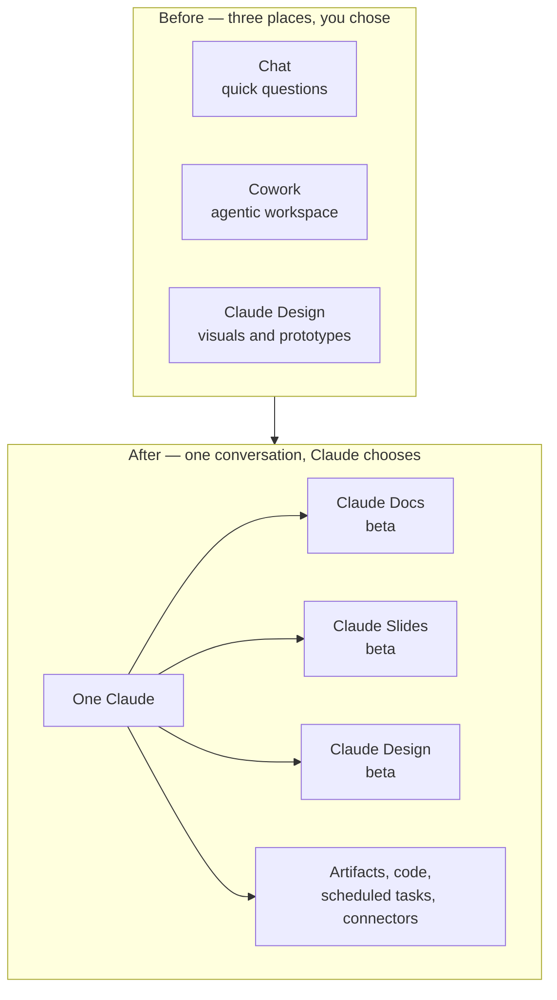

<LevelBadge level="beginner" />

<VerifyNote lastVerified="2026-09-25" source="https://claude.com/blog/cowork-is-now-claude">
Annunciato il **16 settembre 2026**. L'esperienza unificata arriva **gradualmente, a partire da Pro e Max** su web, desktop e mobile, poi Team e Free; le organizzazioni Enterprise ricevono **almeno 30 giorni di preavviso**. Claude Docs, Claude Slides e Claude Design sono **in beta sui piani a pagamento**. Dato che il rollout è scaglionato, due account sullo stesso piano possono vedere cose diverse nello stesso giorno — controlla l'[articolo del Centro assistenza](https://support.claude.com/en/articles/16761823-claude-cowork-and-chat-are-one-claude) per lo stato attuale prima di fare affidamento su qualsiasi cosa qui.
</VerifyNote>

Il **16 settembre 2026** Anthropic ha compresso tre prodotti in uno. Chat, **Cowork** (il workspace agentico) e **Claude Design** hanno smesso di essere posti separati tra cui dover scegliere. Ora c'è una sola casella di conversazione, ed è Claude a decidere cosa serve al task.

L'inquadramento ufficiale è breve: *"Ask Claude for what you need, and it can decide which tool to use."* La conseguenza pratica è più lunga, ed è l'argomento di questa pagina — perché una fusione del genere sposta impostazioni, manda in pensione abitudini e introduce due nuovi strumenti documentali i cui limiti non sono ovvi finché non ci sbatti contro.

<Callout type="objectives" items={[
  "Capire cosa si è fuso davvero il 16 settembre 2026 — e perché 'nessuna modalità da scegliere' cambia il modo in cui apri un task",
  "Trovare tutte le impostazioni che si sono spostate: istruzioni globali, ricerca web, research e archiviazione dei file",
  "Scegliere correttamente tra Claude Docs, Claude Slides, Claude Design, un artifact semplice e un .docx/.pptx scaricato",
  "Usare Claude Docs come è progettato: tab, commenti inline, modifiche via @Claude e co-authoring in tempo reale",
  "Conoscere gli otto limiti che ti daranno fastidio — niente cronologia versioni, nessun ruolo solo-commento, grafici che non si aggiornano, e le configurazioni di compliance dove Docs semplicemente non è disponibile",
  "Prevedere il costo in usage limit del lavoro agentico, ora che tutto gira in un'unica conversazione"
]} />

## Cosa si è fuso, in un'immagine

Niente di ciò che avevi viene buttato via. Secondo Anthropic: *"Existing Cowork tasks, projects, connectors, skills, artifacts, and files carry over, and those Cowork tasks open as they did before, so you can continue them."*

Quello che cambia è il **punto di ingresso**. Prima decidevi la forma del lavoro prima ancora di descriverlo — chat per una domanda, Cowork per un progetto. Ora descrivi il lavoro e Claude sceglie la macchina, con lo stesso contesto, le stesse skill e gli stessi connettori disponibili da qualsiasi conversazione.

## Dove è finita ogni cosa

È la parte che genera più confusione da "dov'è finito il mio pulsante", ed è la parte che nessun articolo di terze parti copre. Quattro cose si sono spostate:

| Cosa usavi | Dov'è adesso |
| --- | --- |
| Istruzioni globali | **Settings → General** |
| Toggle della ricerca web | **Sparito — è automatica.** È Claude a decidere quando cercare |
| Research | Scrivi **`/deep-research`**, oppure usa il pulsante **`+`** |
| I tuoi file | **Settings → Storage folder** |

<Callout type="warning" items={[
  "Il toggle della ricerca web non è nascosto, è stato rimosso. Se il tuo flusso di lavoro dipendeva dal forzare la ricerca a off per un task privato o di ragionamento offline, quella leva non esiste più nella UI — dillo nel prompt ('answer from the conversation only; do not search the web')."
]} />

## I tre template: quale vuoi davvero?

La fusione ha introdotto **Claude Docs** e **Claude Slides** come nuovi strumenti, e ha spostato **Claude Design** dentro le conversazioni. Tutti e tre sono *template* — una forma di partenza per un artifact, non un'app separata.

<Steps items={[
  {title: "Claude Docs — documenti vivi", body: "Documenti rich-text salvati nel tuo account Claude, con titoli, tabelle e altra formattazione, e più di un tab (come le sezioni di un quaderno). Tu, Claude e i tuoi colleghi scrivete tutti nello stesso documento, nello stesso momento. Esporta in Word (.docx), PDF, Markdown (.md) e Google Docs. Usalo quando il documento stesso è il deliverable e continuerà a cambiare."},
  {title: "Claude Slides — presentazioni", body: "Presentazioni costruite dai tuoi appunti, da un report o dal lavoro già presente nella conversazione. Puoi modificare qualsiasi slide direttamente, presentare senza uscire da Claude, ed esportare in PowerPoint e PDF. Usalo quando ti serve una presentazione a partire da materiale che hai già prodotto."},
  {title: "Claude Design — elementi visivi e prototipi", body: "Elementi visivi, mockup, prototipi, one-pager e landing page, costruiti sul tuo design system. Esporta come .zip, PDF, PowerPoint o HTML standalone. Usalo quando l'output è visivo o deve rispettare un brand."},
  {title: "Un artifact semplice — codice, app, grafici", body: "C'è ancora, invariato, su ogni piano incluso Free. Una mini-app eseguibile, un grafico, un diagramma, uno script. Usalo quando la cosa deve girare più che essere letta. Vedi Artifacts."},
  {title: "Un file generato — .docx / .pptx / .xlsx / .pdf", body: "Un file one-shot che Claude costruisce e tu scarichi. Nessuna superficie di editing live, nessuna condivisione, nessun commento. Usalo quando ti serve un file da consegnare e non toccare mai più dentro Claude. Vedi Generare file reali."}
]} />

La distinzione che conta di più è quella tra gli ultimi due: **un Claude Doc è un documento vivo con un URL, collaboratori e commenti; un `.docx` generato è un download.** Se prima della fusione chiedevi "un documento Word" e ottenevi un file, chiedendo allo stesso modo oggi potresti ottenere un Doc da esportare poi — che di solito è quello che volevi, ma è un oggetto diverso con regole di condivisione diverse.

### Tre modi per crearne uno

<Steps items={[
  {title: "Chiedilo in qualsiasi conversazione", body: "Il linguaggio naturale basta — 'trasforma il piano che abbiamo appena messo a punto in una product spec che posso condividere col team'. Claude fa qualche domanda prima di iniziare, poi redige il documento a schermo."},
  {title: "Scegli un template esplicitamente", body: "Seleziona Output nella casella del messaggio e scegli un template. Usalo quando Claude continua a scegliere una forma diversa da quella che vuoi."},
  {title: "Parti dal tab Artifacts", body: "Scegli un template dalla galleria, poi fai il brief a Claude. Utile quando il documento, non la conversazione, è la cosa per cui sei lì."}
]} />

<PromptCard title="Fai il brief di un Claude Doc così la prima bozza è già vicina">{`Create a Claude Doc: a one-page product spec for the export feature
we just designed.

Structure it in four tabs:
  1. Summary — problem, proposed solution, who it's for
  2. Requirements — numbered, testable, each with a rationale
  3. Open questions — things I still need to decide, with your
     recommendation and the tradeoff for each
  4. Rejected alternatives — what we considered and why not

Rules:
- Pull the decisions from this conversation. Do not invent
  requirements I did not state.
- Where I was vague, leave a comment asking me the question
  instead of guessing.
- Add a table comparing the three export formats we discussed.

Ask me anything you need before you start drafting.`}</PromptCard>

## Claude Docs in profondità

### Editing, commenti e @Claude

Coesistono tre percorsi di editing, ed è proprio il senso dello strumento:

- **Scrivi tu.** Clicchi nel documento e scrivi. Le modifiche si salvano automaticamente.
- **Chiedi tu.** Richiedi una modifica conversando; Claude edita e spiega cosa ha fatto e perché.
- **Commenti tu.** Selezioni del testo e lasci un commento per i tuoi collaboratori — e **menzioni `@Claude` in un commento per fargli fare quella modifica sul posto.** Claude risponde nel thread, applica il cambiamento e lo spiega.

Claude inoltre **lascia commenti propri mentre redige**, per spiegare una scelta o farti una domanda. È il comportamento attorno a cui vale la pena progettare il prompt: dire a Claude di *chiedere in un commento invece di tirare a indovinare* (come nella prompt card qui sopra) converte un rischio silenzioso di allucinazione in una domanda visibile a cui puoi rispondere.

Puoi anche chiedere a Claude di **aggiungere un grafico, un diagramma o una timeline** a un documento.

### Collaborazione e condivisione

Chi ha accesso in modifica lavora sullo stesso documento nello stesso momento in cui lo fate tu e Claude, e le modifiche di tutti compaiono in tempo reale.

| | Viewer | Editor |
| --- | --- | --- |
| Lettura | ✅ | ✅ |
| Modifica | ❌ | ✅ |
| Commento | ❌ | ✅ |
| Esportazione | ❌ | ✅ |

Le regole di condivisione cambiano nettamente in base al piano:

- **Pro / Max** — condividi con chiunque abbia il link.
- **Team / Enterprise** — invita persone specifiche o un gruppo, oppure condividi con tutta la tua organizzazione. **I Docs non possono essere condivisi fuori dalla tua organizzazione**, né per link né per invito via email.
- **In entrambi i casi** — aprire un documento condiviso richiede un account Claude, e **solo l'owner può rinominare o eliminare un documento.**

### Dove puoi usarlo

I Docs funzionano su **web, desktop, Claude Code e mobile** — ma le **app iOS e Android sono in sola lettura**: niente editing e niente selezione dei template dal telefono. Tienine conto se il tuo ciclo di revisione è mobile.

## I limiti che ti daranno fastidio

Sono tutti documentati, e ognuno di loro sorprende qualcuno nella prima settimana.

<Steps items={[
  {title: "Nessuna cronologia versioni, per ora", body: "Non c'è modo di vedere o ripristinare uno stato precedente di un documento. Chiunque abbia accesso in modifica può sovrascrivere qualsiasi cosa, e l'unico recupero è un export fatto prima. Per un documento che conta, esporta in Markdown a ogni milestone finché la cronologia non arriva."},
  {title: "Nessun livello di accesso solo-commento", body: "I ruoli sono viewer ed editor, niente in mezzo. Un revisore che dovrebbe commentare ma non modificare non esiste come permesso — concedi la modifica e affidati alla fiducia, oppure concedi la lettura e raccogli i feedback altrove."},
  {title: "Grafici e diagrammi non si aggiornano automaticamente", body: "Un grafico aggiunto da Claude è uno snapshot. Cambia i numeri sottostanti nel documento e il grafico continua a mostrare quelli vecchi finché non chiedi a Claude di rigenerarlo. Tratta ogni elemento visivo come obsoleto finché non lo richiedi di nuovo."},
  {title: "Team ed Enterprise non possono condividere all'esterno", body: "Niente condivisione via link, niente invito via email fuori dall'organizzazione. Se devi mandare un documento a un cliente, esportalo (Word, PDF, Markdown, Google Docs) e manda l'export."},
  {title: "Mobile è in sola lettura", body: "iOS e Android possono leggere un documento. Non possono modificarlo né scegliere un template."},
  {title: "Non disponibile con CMEK, ZDR e HIPAA", body: "Claude Docs non è disponibile per le organizzazioni configurate con chiavi di cifratura gestite dal cliente, zero data retention o HIPAA. È il fatto più importante in assoluto per i team regolamentati, e non è un ritardo di rollout — è un'esclusione."},
  {title: "Non ancora nella Compliance API", body: "L'attività dentro un documento non viene registrata nella Compliance API. Se la tua postura di audit dipende da quell'export, l'attività sui documenti è al momento un punto cieco."},
  {title: "Su Enterprise si parte disattivati", body: "Sui piani Enterprise i template sono disattivati finché un owner non li abilita uno per uno nelle impostazioni dell'organizzazione. Su Pro, Max e Team sono attivi di default."}
]} />

### Altre cose non ancora supportate nell'esperienza unificata

L'esperienza unificata non supporta ancora l'**integrazione GitHub ("Add from GitHub")**, il **branching delle conversazioni**, la **ricerca tra i vecchi task di Cowork**, **Dispatch** (solo utenti esistenti) e le **chat in incognito per la creazione di file e codice**. Se il tuo flusso di lavoro si appoggia al branching o alla ricerca nella cronologia di Cowork, quella capacità è temporaneamente sparita — non spostata.

## Quanto ti costa

Non c'è un prezzo separato. La frase rilevante riguarda gli *usage limit*: *"Everything you do with Claude counts toward your plan's usage limits. Longer agentic tasks that search the web, run code, or create files generally use more than a quick question."* Claude Docs conta allo stesso modo.

La fusione rende la cosa più tagliente di quanto sembri. Prima, aprire Cowork era un atto deliberato — sapevi di stare avviando lavoro costoso. Ora una richiesta buttata lì nella stessa casella può innescare una lunga esecuzione agentica che cerca sul web, esegue codice e scrive file. **Il segnale di costo si è spostato dalla porta al prompt.** Se sei su un piano dove i limiti contano, di' esplicitamente cosa vuoi:

<PromptCard title="Tieni economica una richiesta quando vuoi solo una risposta">{`Answer from this conversation only. Do not search the web, do not
run code, and do not create any files or artifacts. Two paragraphs.`}</PromptCard>

E il contrario, quando invece vuoi tutta la macchina:

<PromptCard title="Chiedi la versione costosa apposta">{`Take this as a full task, not a chat answer.

Research the three vendors below, check their current pricing pages,
build a comparison spreadsheet, and turn the recommendation into a
Claude Doc I can share with the team. Cite every figure with a link
and the date you read it.

Vendors: [A], [B], [C]`}</PromptCard>

## Migrare le tue abitudini

<Steps items={[
  {title: "Rimetti a posto le tue istruzioni globali", body: "Si sono spostate in Settings → General. Aprile una volta e rileggile: istruzioni scritte per una Claude solo-chat ('non puoi navigare sul web', 'chiedi prima di fare qualcosa di lungo') oggi possono attivamente ostacolare il comportamento unificato."},
  {title: "Smetti di cercare il toggle della ricerca web", body: "Non c'è più. Metti l'intento di ricerca nel prompt — o 'check current sources' o 'do not search'."},
  {title: "Reimpara la research", body: "Scrivi /deep-research o usa il pulsante +. Adesso è un comando, non una modalità."},
  {title: "Rivedi tutto ciò che dava per scontato che Cowork fosse separato", body: "Task schedulati, connettori e skill sono stati trasferiti, ma i prompt che dicevano 'questo è un task Cowork' come segnale di lavorare più a fondo non segnalano più niente. Sostituisci quell'inquadramento con uno scope esplicito, come nelle prompt card qui sopra."},
  {title: "Decidi la tua cadenza di export dei Docs", body: "Finché non arriva la cronologia versioni, scegli un ritmo per milestone — esporta in Markdown ogni volta che il documento raggiunge uno stato che ti dispiacerebbe perdere."}
]} />

## Termini da conoscere

<Flashcards cards={[
  {front: "One Claude", back: "La fusione del 16 settembre 2026 di chat, Cowork e Claude Design in un'unica esperienza conversazionale, senza modalità da scegliere. È Claude a decidere quali strumenti servono a un task."},
  {front: "Template (Docs / Slides / Design)", back: "Una forma di partenza per un artifact, non un'app separata. In beta sui piani a pagamento; attivo di default su Pro, Max e Team; disattivato su Enterprise finché un owner non lo abilita."},
  {front: "Claude Doc", back: "Un documento vivo, rich-text e multi-tab salvato nel tuo account Claude, co-editato in tempo reale da te, da Claude e dai collaboratori. Esporta in Word, PDF, Markdown e Google Docs."},
  {front: "Tab (in un Doc)", back: "Una sezione di un documento, come la sezione di un quaderno. Un singolo documento può contenerne diverse — utile per dividere una spec in summary, requisiti e domande aperte."},
  {front: "Commento @Claude", back: "Menzionare Claude in un commento del documento perché applichi quella modifica sul posto, risponda nel thread e spieghi cosa ha cambiato."},
  {front: "Viewer vs Editor", back: "Gli unici due livelli di accesso. I viewer leggono. Gli editor leggono, modificano, commentano ed esportano. Non esiste un ruolo solo-commento."},
  {front: "Pulsante Output", back: "Il controllo nella casella del messaggio per scegliere esplicitamente un template, quando non vuoi che sia Claude a scegliere la forma per te."},
  {front: "Doc vs file generato", back: "Un Doc è un documento vivo con URL, collaboratori e commenti. Un .docx/.pptx/.xlsx generato è un download one-shot senza nessuna di queste cose."}
]} />

## Quiz

<Quiz questions={[
  {q: "La tua organizzazione usa Claude su Enterprise con zero data retention (ZDR). Il tuo team vuole iniziare a scrivere le spec in Claude Docs. Cosa succede?", options: ["Funziona non appena un owner abilita il template nelle impostazioni dell'organizzazione", "Funziona ma i documenti vengono eliminati dopo 30 giorni", "Claude Docs non è disponibile — le configurazioni ZDR, CMEK e HIPAA sono escluse", "Funziona in modalità sola lettura"], answer: 2, explain: "Claude Docs non è disponibile per le organizzazioni che usano configurazioni CMEK, ZDR o HIPAA. È un'esclusione, non un ritardo di rollout, quindi nessun toggle da admin lo risolve. I team sotto quelle configurazioni hanno bisogno di un'altra superficie di scrittura."},
  {q: "Hai aggiunto un grafico a un Claude Doc partendo da una tabella di numeri del Q3. Poi un collega corregge due cifre nella tabella. Cosa mostra il grafico?", options: ["Le cifre corrette, aggiornate in tempo reale", "Le cifre corrette dopo aver ricaricato il documento", "Le cifre vecchie, finché non chiedi a Claude di rigenerare il grafico", "Uno stato di errore che segnala la discrepanza"], answer: 2, explain: "Grafici e diagrammi non si aggiornano automaticamente — ognuno è uno snapshot scattato al momento della creazione. Tratta ogni elemento visivo in un documento come obsoleto finché non chiedi esplicitamente a Claude di ricostruirlo dai dati attuali."},
  {q: "Sei su un piano Team e devi mandare una spec finita a un cliente esterno. Qual è il percorso supportato?", options: ["Condividere il link del documento — la condivisione via link funziona su ogni piano a pagamento", "Invitare il cliente via email dalla finestra Share del documento", "Esportare il documento in Word, PDF, Markdown o Google Docs e mandare l'export", "Spostare prima il documento su un account Pro"], answer: 2, explain: "Sui piani Team ed Enterprise i documenti non possono essere condivisi fuori dalla tua organizzazione, né per link né per invito via email. La condivisione con link-a-chiunque è un comportamento Pro/Max. La via supportata per un destinatario esterno è l'esportazione."},
  {q: "Dopo la fusione, quale affermazione sulla ricerca web è vera?", options: ["Il toggle si è spostato in Settings → General", "Il toggle è finito dietro il pulsante +", "Il toggle è stato rimosso — la ricerca è automatica, quindi la governi nel prompt", "La ricerca ora è disattivata di default su tutti i piani"], answer: 2, explain: "Il toggle della ricerca web è stato rimosso, non spostato; è Claude a decidere quando cercare. Le istruzioni globali sono passate a Settings → General e la research è passata a /deep-research o al pulsante +, ma la ricerca ora si governa nel prompt ('check current sources' oppure 'do not search')."}
]} />

<Callout type="takeaways" items={[
  "Una sola conversazione, nessuna modalità da scegliere: il segnale di costo si è spostato dalla porta (aprire Cowork) al prompt. Di' esplicitamente quando vuoi una risposta economica e quando vuoi l'esecuzione agentica completa.",
  "Quattro cose si sono spostate: istruzioni globali → Settings → General; ricerca web → automatica, la governi nel prompt; research → /deep-research o +; file → Settings → Storage folder.",
  "Un Claude Doc è un documento vivo con collaboratori e commenti; un .docx generato è un download. Scegli deliberatamente — le loro regole di condivisione sono completamente diverse.",
  "Progetta il prompt attorno ai commenti di Claude: digli di chiedere in un commento invece di indovinare, e converti l'invenzione in una domanda visibile.",
  "Due limiti meritano un workaround già oggi: nessuna cronologia versioni (esporta in Markdown alle milestone) e grafici che non si aggiornano mai (rigenerali dopo ogni cambio di dati).",
  "Team regolamentati: Claude Docs non è disponibile con CMEK, ZDR e HIPAA, e l'attività sui documenti non è ancora nella Compliance API."
]} />

## Fonti e approfondimenti

- Anthropic — [Claude Cowork e chat ora sono un unico Claude](https://claude.com/blog/cowork-is-now-claude) (annuncio, 16 settembre 2026)
- Centro assistenza Anthropic — [Claude Cowork e chat sono un unico Claude](https://support.claude.com/en/articles/16761823-claude-cowork-and-chat-are-one-claude) (rollout, spostamenti, cosa è stato trasferito, lacune attuali)
- Centro assistenza Anthropic — [Iniziare con Claude Docs](https://support.claude.com/en/articles/16923645-get-started-with-claude-docs) (creazione, tab, commenti, matrice di condivisione, esportazioni, limiti)
- Centro assistenza Anthropic — [Cosa sono gli artifact e come si usano?](https://support.claude.com/en/articles/17153992-what-are-artifacts-and-how-do-i-use-them) (i tre template e la loro disponibilità per piano)
- Correlati su AILmanac: [Artifacts](/docs/claude-app/artifacts) · [Task schedulati di Cowork](/docs/claude-app/cowork-scheduled-tasks) · [Generare file reali](/docs/claude-app/generating-files) · [Progetti](/docs/claude-app/projects) · [Piani, limiti e fatturazione](/docs/claude-app/plans-and-billing)

## Avanti

- [Artifacts: output live ed eseguibili](/docs/claude-app/artifacts) — il contenitore in cui vengono renderizzati tutti e tre i template
- [Task schedulati di Cowork](/docs/claude-app/cowork-scheduled-tasks) — la macchina dei task ricorrenti, trasferita intatta
- [Generare file reali (docx/pptx/xlsx/pdf)](/docs/claude-app/generating-files) — quando vuoi un download, non un documento vivo
