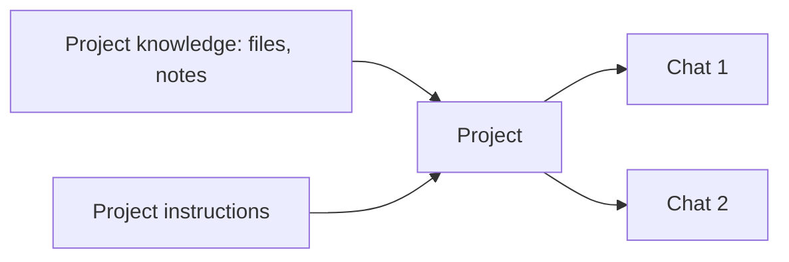

<LevelBadge level="beginner" />

<VerifyNote lastVerified="2026-06-20" source="https://www.anthropic.com">
Le funzionalità e i limiti dei Progetti variano per piano e cambiano — verifica il comportamento attuale nell'app/centro assistenza.
</VerifyNote>

Un **Progetto** è uno spazio di lavoro dedicato in Claude.ai che raccoglie **file, conoscenza e istruzioni propri**. Invece di ricaricare gli stessi documenti e rispiegare il contesto a ogni chat, lo configuri una volta sola — e ogni conversazione nel Progetto parte già informata.

## Perché usare un Progetto

- **Risposte fondate.** Aggiungi i tuoi documenti (un manuale, specifiche, appunti) e Claude risponde *a partire da essi* — una versione integrata e no-code di [RAG](/docs/foundations/rag).
- **Contesto persistente.** Le istruzioni del Progetto agiscono come un [system prompt](/docs/foundations/roles) circoscritto per tutto ciò che vi è contenuto.
- **Organizzato.** Tutte le chat su un argomento/cliente/iniziativa stanno insieme.

## Configurane uno

1. **Crea un Progetto** e dagli uno scopo chiaro.
2. **Aggiungi conoscenza** — i file/testi che dovrebbe sempre conoscere.
3. **Scrivi le istruzioni del Progetto** — ruolo, convenzioni, cosa fare/evitare.
4. **Inizia a chattare** — ogni conversazione eredita la conoscenza + le istruzioni.

## Ottimi casi d'uso

- Uno spazio di lavoro **cliente/account** (i loro documenti + i tuoi appunti).
- Una knowledge base su un **codebase o prodotto** per Q&A.
- Un **progetto di scrittura** con la tua guida di stile e i lavori precedenti (così le bozze rispecchiano la tua voce).
- **Studio** per un corso, con il programma e i materiali caricati.

## Suggerimenti

- **Cura la conoscenza** — file pertinenti e aggiornati battono lo scaricare tutto (il rumore danneggia il recupero).
- **Mantieni le istruzioni concise e veritiere** (stessa regola delle [istruzioni personalizzate](/docs/claude-app/custom-instructions)).
- **Non aggiungere dati sensibili** che non ti senti a tuo agio ad archiviare — vedi [Privacy](/docs/foundations/privacy).

## Avanti

- [Istruzioni personalizzate e stili](/docs/claude-app/custom-instructions)
- [Memoria tra le chat](/docs/claude-app/memory)
- [Retrieval-Augmented Generation (RAG)](/docs/foundations/rag)
