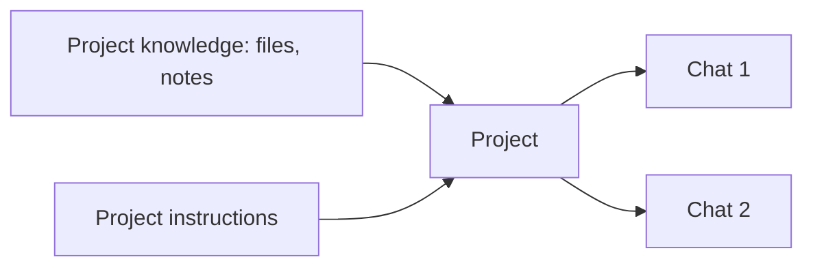

<LevelBadge level="beginner" />

<VerifyNote lastVerified="2026-09-23" source="https://claude.com/blog/projects-redesigned">
Le funzionalità e i limiti dei Progetti variano per piano e cambiano — verifica il comportamento attuale nell'app o nel centro assistenza. Una versione **ridisegnata dei Progetti** (un coordinatore che delega a thread paralleli) è entrata in beta in Claude Code il 17 settembre 2026 ed è prevista in arrivo sul resto di Claude e sui piani Team/Enterprise più avanti. Questa pagina descrive il Progetto basato su knowledge base che la maggior parte degli account ha ancora.
</VerifyNote>

Un **Progetto** è uno spazio di lavoro dedicato in Claude.ai che raccoglie **file, conoscenza e istruzioni propri**. Invece di ricaricare gli stessi documenti e rispiegare il contesto a ogni chat, lo configuri una volta sola — e ogni conversazione nel Progetto parte già informata.

<Callout type="objectives" items={[
  "Cosa raccoglie un Progetto, e perché è meglio che riattaccare il contesto a ogni chat",
  "La configurazione in quattro passi, e l'unico passo che tutti saltano",
  "Come curare la conoscenza del Progetto perché il recupero resti preciso",
  "In cosa questo Progetto differisce dai Progetti coordinatore-e-thread di Claude Code"
]} />

## Perché usare un Progetto

- **Risposte fondate.** Aggiungi i tuoi documenti (un manuale, specifiche, appunti) e Claude risponde *a partire da essi* — una versione integrata e no-code di [RAG](/docs/foundations/rag).
- **Contesto persistente.** Le istruzioni del Progetto agiscono come un [system prompt](/docs/foundations/roles) circoscritto per tutto ciò che vi è contenuto.
- **Organizzato.** Tutte le chat su un argomento/cliente/iniziativa stanno insieme.

## Configurane uno

<Steps items={[
  {title: "Crea un Progetto con uno scopo chiaro", body: "Un Progetto per ogni argomento, cliente o iniziativa. Un Progetto che copre tre cose scollegate recupera male su tutte e tre."},
  {title: "Aggiungi conoscenza", body: "I file e i testi che dovrebbe sempre conoscere — il manuale, le specifiche, la guida di stile. È da qui che Claude risponde."},
  {title: "Scrivi le istruzioni del Progetto", body: "Il passo che tutti saltano. Ruolo, convenzioni, cosa fare e cosa evitare. Senza, hai un indice di ricerca invece di un collega."},
  {title: "Inizia a chattare", body: "Ogni conversazione dentro il Progetto eredita automaticamente la conoscenza e le istruzioni."}
]} />

```mermaid
flowchart LR
  K[Project knowledge: files, notes] --> P[Project]
  I[Project instructions] --> P
  P --> C1[Chat 1]
  P --> C2[Chat 2]
```

## Ottimi casi d'uso

- Uno spazio di lavoro **cliente/account** (i loro documenti + i tuoi appunti).
- Una knowledge base su un **codebase o prodotto** per Q&A.
- Un **progetto di scrittura** con la tua guida di stile e i lavori precedenti (così le bozze rispecchiano la tua voce).
- **Studio** per un corso, con il programma e i materiali caricati.

## Un punto di partenza per le istruzioni del Progetto

<PromptCard title="Scheletro di istruzioni del Progetto">{`You are helping with [project/client name].

Context: [what this project is, who it serves, current stage]

Always:
- Answer from the project knowledge first; say so when you are going beyond it.
- Use [our terminology: list the 3-5 terms that matter].
- Match the tone in [named file in the knowledge base].

Never:
- Invent figures, dates, or quotes. If it is not in the knowledge, say it is not in the knowledge.
- [Project-specific constraint: e.g. reference the deprecated v1 API.]`}</PromptCard>

## Suggerimenti

- **Cura la conoscenza** — file pertinenti e aggiornati battono lo scaricare tutto (il rumore danneggia il recupero).
- **Mantieni le istruzioni concise e veritiere** (stessa regola delle [istruzioni personalizzate](/docs/claude-app/custom-instructions)).
- **Fai pulizia quando le cose cambiano.** Una specifica superata lasciata nella knowledge base è peggio di nessuna specifica, perché Claude non ha modo di sapere che ha perso il confronto con quella nuova.
- **Non aggiungere dati sensibili** che non ti senti a tuo agio ad archiviare — vedi [Privacy](/docs/foundations/privacy).

## Due cose che si chiamano "Progetti"

Sono prodotti davvero diversi, e i nomi si sovrappongono durante il rilascio:

| | Questo Progetto (Claude.ai) | [Progetti di Claude Code](/docs/claude-code/projects-coordinator-threads) |
|---|---|---|
| Cos'è | Uno spazio di lavoro con conoscenza + istruzioni | Un coordinatore che delega a thread paralleli |
| Cosa fa | Fonda le *tue* chat sui *tuoi* file | Delimita, suddivide ed esegue il lavoro al posto tuo |
| Esegue codice? | No | Sì — ogni thread è una sessione cloud su un proprio branch |
| Chi ce l'ha | Ampiamente disponibile | Beta, utenti Claude Code Pro/Max selezionati al lancio |

Se stai leggendo di coordinatori, thread e pull request, si tratta di quello di Claude Code.

<Quiz questions={[
  {
    q: "A cosa assomigliano le istruzioni del Progetto?",
    options: [
      "A un messaggio una tantum nella prima chat",
      "A un system prompt circoscritto, applicato a ogni chat del Progetto",
      "A un filtro che nasconde i file a Claude",
      "A un riassunto che Claude scrive per sé stesso"
    ],
    answer: 1,
    explain: "Le istruzioni del Progetto si comportano come un system prompt circoscritto al Progetto, così ogni conversazione al suo interno eredita lo stesso ruolo e le stesse convenzioni senza che tu debba ripeterli."
  },
  {
    q: "Perché scaricare ogni file disponibile nella conoscenza del Progetto fa danni?",
    options: [
      "Claude fa pagare a file",
      "I file scadono dopo un certo numero di chat",
      "Materiale irrilevante e datato aggiunge rumore che degrada il recupero",
      "Viene letto solo il primo file"
    ],
    answer: 2,
    explain: "La conoscenza del Progetto è materiale da cui si recupera, quindi la pertinenza conta più del volume. I documenti superati sono il caso peggiore — Claude non può capire che un file più recente ne scavalca uno più vecchio, a meno che tu non lo rimuova o lo etichetti."
  }
]} />

<Callout type="takeaways" items={[
  "Un Progetto raccoglie conoscenza più istruzioni, così ogni chat al suo interno parte informata.",
  "Le istruzioni sono il passo che tutti saltano — senza di esse hai una ricerca, non un collega.",
  "Cura e fai pulizia: i file superati ingannano attivamente, non aggiungono solo rumore.",
  "I Progetti coordinatore-e-thread di Claude Code sono un prodotto diverso che condivide il nome."
]} />

## Avanti

- [Istruzioni personalizzate e stili](/docs/claude-app/custom-instructions)
- [Memoria tra le chat](/docs/claude-app/memory)
- [Retrieval-Augmented Generation (RAG)](/docs/foundations/rag)
