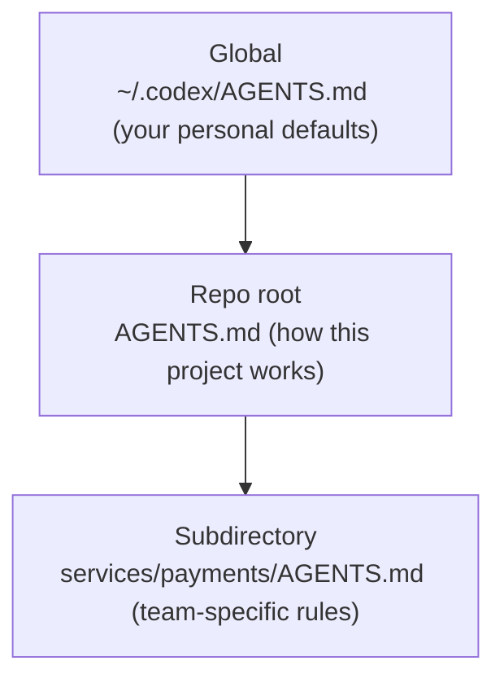

<LevelBadge level="intermediate" />

<VerifyNote lastVerified="2026-06-27" source="https://agents.md/">
La lista degli adopter di AGENTS.md e il comportamento di import/symlink di Claude Code evolvono rapidamente — verifica i dettagli sul sito ufficiale di AGENTS.md e nella documentazione sulla memoria di Claude Code.
</VerifyNote>

Conosci già [CLAUDE.md](/docs/claude-code/claude-md) — il briefing di progetto di Claude Code. Ma il tuo repo è probabilmente toccato da *più* di un agente: un collega usa Codex, la CI usa un coding bot, qualcuno apre il repo in Cursor. `AGENTS.md` è lo standard aperto che questi strumenti concordano di leggere, così scrivi le istruzioni del tuo progetto **una sola volta** invece di mantenere un file diverso per ogni strumento.

<Callout type="objectives" items={["Cos'è AGENTS.md e chi lo governa", "Perché Claude Code legge CLAUDE.md e non AGENTS.md", "Tre modi affidabili per mantenere un'unica fonte di verità tra gli strumenti", "Come si fondono i file AGENTS.md annidati e globali", "Cosa va nel file — e cosa tenere fuori"]} />

## Cos'è AGENTS.md

`AGENTS.md` è un semplice file Markdown nella root del tuo repo — pensalo come un **README scritto per gli agenti invece che per gli umani**. Spiega a un coding agent come compilare, testare e contribuire al progetto. Il formato non ha campi obbligatori: gli agenti semplicemente leggono la prosa.

È uno standard aperto governato dalla **Agentic AI Foundation (AAIF) sotto la Linux Foundation** e, a metà 2026, è usato da oltre 60.000 progetti open-source e letto da più di 30 strumenti — tra cui OpenAI Codex, Jules e Gemini CLI di Google, Cursor, Windsurf, Devin, Zed, Warp, Aider, goose, Amp e il coding agent di GitHub Copilot.

<Callout type="info" items={["AGENTS.md è una convenzione, non un runtime: ogni strumento decide come scoprire, fondere e iniettare il file.", "Nessuno schema è imposto — una prosa chiara batte una struttura rigida.", "Completa il tuo README; non lo sostituisce."]} />

## L'inghippo di Claude Code

Ecco il punto su cui le persone inciampano: **Claude Code legge `CLAUDE.md`, non `AGENTS.md`.** Se il tuo repo ha solo un `AGENTS.md`, Claude Code lo ignora di default. Non è un bug — precede lo standard — ma significa che un repo multi-strumento ha bisogno di una strategia di sincronizzazione deliberata, altrimenti le tue istruzioni divergono silenziosamente.

<Callout type="warning" items={["Non dare per scontato che Claude Code ricada su AGENTS.md — non lo legge automaticamente.", "Due file mantenuti a mano (CLAUDE.md e AGENTS.md) divergeranno. Scegli un'unica fonte di verità.", "Verifica il comportamento attuale nella documentazione ufficiale sulla memoria prima di affidarti a qualsiasi affermazione di fallback."]} />

## Mantieni un'unica fonte di verità

Tre pattern mantengono CLAUDE.md e AGENTS.md sincronizzati senza duplicare i contenuti. Scegli in base alla piattaforma del tuo team.

<Steps items={[{title: "Symlink (il più semplice)", body: "Rendi CLAUDE.md un symlink ad AGENTS.md. Claude Code segue i symlink e legge il target byte per byte — un solo file reale, zero logica di merge. Avvertenza: su Windows, creare un symlink richiede la Developer Mode o i diritti di amministratore, quindi i team cross-platform potrebbero preferire il metodo import."}, {title: "@import (cross-platform)", body: "Tieni un CLAUDE.md minimale il cui unico compito è richiamare il file standard con un import @AGENTS.md. Claude Code espande il file importato nel contesto all'avvio, così AGENTS.md resta l'unica fonte e non c'è alcun symlink da rompere su Windows."}, {title: "/init (migrazione)", body: "Stai inizializzando Claude Code in un repo che ha già un AGENTS.md (o .cursorrules / .windsurfrules)? Esegui /init — legge quei file e incorpora le parti rilevanti in un CLAUDE.md generato."}]} />

<PromptCard title="Crea un symlink da CLAUDE.md allo standard condiviso (macOS / Linux)">{`ln -s AGENTS.md CLAUDE.md`}</PromptCard>

<PromptCard title="Oppure tieni un CLAUDE.md di una riga che lo importa">{`@AGENTS.md`}</PromptCard>

<Callout type="tip" items={["Usa il symlink quando tutto il team è su macOS/Linux — è ciò che richiede meno manutenzione.", "Usa @import quando ci sono contributor su Windows.", "Committa quello che scegli, così tutto il team ottiene lo stesso comportamento."]} />

## Come si fondono i file annidati e globali

Gli agenti più sofisticati trattano AGENTS.md in modo gerarchico — lo stesso modello mentale della [gerarchia di memoria di CLAUDE.md](/docs/claude-code/claude-md). Codex, per esempio, parte da un file globale nella tua home directory e scende attraverso la root Git fino alla cartella corrente, concatenando man mano:

I file più vicini al lavoro vincono, perché vengono concatenati **per ultimi** e sovrascrivono le indicazioni precedenti. Così un `services/payments/AGENTS.md` eredita le istruzioni della root del repo e aggiunge regole valide solo all'interno di quel servizio — metti le indicazioni specializzate il più vicino possibile al codice specializzato.

<Flashcards title="L'interoperabilità a colpo d'occhio" cards={[{front: "Chi legge AGENTS.md?", back: "Oltre 30 strumenti — Codex, Cursor, Windsurf, Devin, Zed, Gemini CLI, il coding agent di Copilot e altri. Non Claude Code di default."}, {front: "Chi legge CLAUDE.md?", back: "Claude Code — e solo Claude Code. Non legge AGENTS.md automaticamente."}, {front: "La migliore sincronizzazione per un team Mac/Linux", back: "Symlink da CLAUDE.md → AGENTS.md. Un solo file reale, nessuna divergenza."}, {front: "La migliore sincronizzazione con contributor Windows", back: "Un CLAUDE.md di una riga contenente @AGENTS.md — nessun symlink necessario."}, {front: "Ordine di merge per i file annidati", back: "Globale → root del repo → sottocartella. I file più vicini al lavoro sovrascrivono, perché vengono concatenati per ultimi."}]} />

## Cosa metterci dentro

La stessa disciplina di un buon CLAUDE.md — lo standard suggerisce solo alcune sezioni comuni:

- **Panoramica del progetto** — cos'è, in due frasi.
- **Comandi di build e test** — come eseguire, testare e fare il lint.
- **Stile del codice** — convenzioni che un agente non può dedurre.
- **Istruzioni di test** — cosa significa "fatto".
- **Considerazioni di sicurezza** — cosa non toccare o committare mai.
- **Linee guida per commit / PR** — formato dei messaggi, regole sui branch.

<Callout type="warning" items={["Gli agenti seguono il file alla lettera — istruzioni obsolete o velleitarie fanno attivamente male, esattamente come CLAUDE.md.", "Tienilo breve e veritiero; descrivi come funziona il progetto oggi.", "Non committare mai segreti; rimanda ai documenti voluminosi invece di incollarli."]} />

## Mettiti alla prova

<Quiz title="Mettiti alla prova" questions={[{q: "Claude Code legge AGENTS.md automaticamente?", options: ["Sì, ricade su AGENTS.md", "No — legge solo CLAUDE.md", "Solo su Windows"], answer: 1, explain: "Claude Code legge CLAUDE.md e ignora di default un AGENTS.md autonomo, quindi i repo multi-strumento hanno bisogno di una strategia di sincronizzazione deliberata."}, {q: "Il tuo team è interamente su macOS e Linux. Qual è il modo con meno manutenzione per condividere un unico file di istruzioni tra Claude Code e Codex?", options: ["Mantenere CLAUDE.md e AGENTS.md a mano", "Creare un symlink da CLAUDE.md ad AGENTS.md", "Incollare AGENTS.md in un commento"], answer: 1, explain: "Il symlink da CLAUDE.md → AGENTS.md ti dà un solo file reale; Claude Code segue il symlink e legge il target byte per byte."}, {q: "Quando gli agenti fondono un AGENTS.md globale, uno nella root del repo e uno in una sottocartella, quale vince in caso di conflitto?", options: ["Il file globale", "Il file della root del repo", "Il file della sottocartella più vicino al lavoro"], answer: 2, explain: "I file vengono concatenati globale → root → sottocartella, quindi il file più vicino al lavoro compare per ultimo e sovrascrive le indicazioni precedenti."}]} />

<Callout type="takeaways" items={["AGENTS.md è lo standard aperto, governato dalla Linux Foundation, che oltre 30 coding agent leggono — un README per gli agenti.", "Claude Code legge CLAUDE.md, non AGENTS.md, quindi i repo multi-strumento devono mantenerli sincronizzati.", "Crea un symlink da CLAUDE.md → AGENTS.md su Mac/Linux, oppure usa un import @AGENTS.md di una riga per i team cross-platform.", "I file annidati si fondono globale → root → sottocartella, con il file più vicino che vince.", "Riempilo come un ottimo CLAUDE.md: panoramica, comandi di build/test, convenzioni, sicurezza e guardrail — breve e veritiero."]} />

## Prossimi passi

- [CLAUDE.md e file di memoria](/docs/claude-code/claude-md) — il lato Claude Code della stessa idea
- [Template CLAUDE.md](/docs/templates/claude-md) — starter pronti all'uso che puoi riutilizzare come AGENTS.md
- [Slash Command](/docs/claude-code/slash-commands) — incluso /init per migrare i file di istruzioni esistenti

## Fonti e approfondimenti

- [AGENTS.md — sito ufficiale e specifica](https://agents.md/)
- [OpenAI Codex — Istruzioni personalizzate con AGENTS.md](https://developers.openai.com/codex/guides/agents-md)
- [Documentazione sulla memoria di Claude Code](https://code.claude.com/docs/en/memory)
