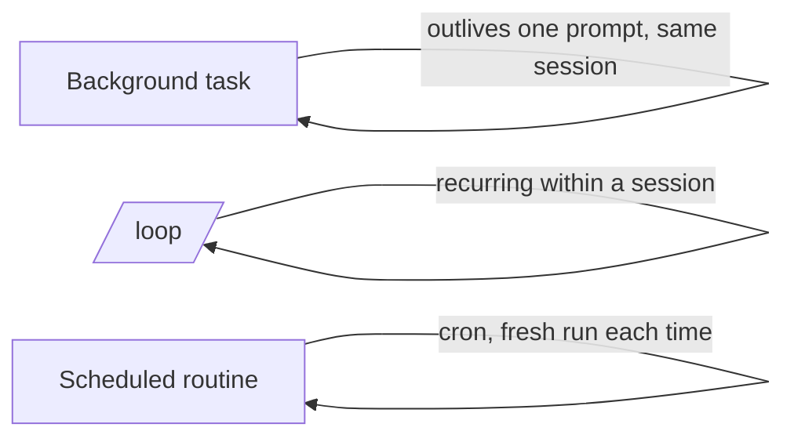

<LevelBadge level="advanced" />

<VerifyNote lastVerified="2026-06-20" source="https://docs.anthropic.com/en/docs/claude-code">
I comandi esatti e la disponibilità di attività in background, /loop e pianificazione cambiano tra le release — verifica nella documentazione ufficiale.
</VerifyNote>

Non tutto è una modifica rapida. Claude Code può eseguire lavoro che **sopravvive a un singolo prompt**: comandi lunghi in background, loop ricorrenti ed esecuzioni pianificate.

## Attività in background

Avvia un comando a lunga esecuzione (un server di sviluppo, un watcher dei test, una build) **senza bloccare** la sessione. Claude continua a lavorare e viene notificato quando l'attività produce output o termina. Usalo per qualsiasi cosa che normalmente metteresti in background con `&` — ma in modo gestito, così Claude può leggerne l'output in seguito.

:::tip Non fare busy-waiting
Avvia l'attività in background e prosegui; lascia che sia la notifica di completamento a riportarti indietro, anziché fare polling in un loop stretto.
:::

## Loop ricorrenti (`/loop`)

`/loop` esegue un prompt o un comando a **intervalli ricorrenti** all'interno di una sessione — ad esempio "ogni 5 minuti, controlla lo stato del deploy". Dagli un intervallo, oppure lascia che Claude regoli da sé il ritmo. Ottimo per sorvegliare un'esecuzione di CI o per fare polling di un job esterno di cui l'harness non potrebbe altrimenti notificarti.

## Agenti cloud pianificati

Per il lavoro che dovrebbe avvenire **a orario, in modo continuativo** — "ogni mattina riassumi le nuove issue", "ogni ora, controlla le novità e aggiorna la documentazione" — usa le **attività pianificate / routine** (in stile cron). Ogni esecuzione parte da zero, quindi le sue istruzioni devono essere **autoconsistenti**.

## Come scegliere tra di essi

| Esigenza | Usa |
|---|---|
| Eseguire un comando lungo, continuare a lavorare | Attività in background |
| Fare polling di qualcosa ogni N minuti in questa sessione | `/loop` |
| Fare qualcosa a un orario, indefinitamente | Routine pianificata |

:::warning L'autonomia ha bisogno di protezioni
Qualsiasi cosa che agisca senza supervisione a un orario dovrebbe avere un ambito ristretto ed essere reversibile. Abbinala a [permessi](/docs/claude-code/permissions) rigorosi e leggi [Rendere robuste le esecuzioni autonome](/docs/security/hardening-autonomous-runs).
:::

## Avanti

- [Modalità headless e l'Agent SDK](/docs/claude-code/headless-and-agent-sdk)
- [Permessi e modalità](/docs/claude-code/permissions)
- [Rendere robuste le esecuzioni autonome](/docs/security/hardening-autonomous-runs)
