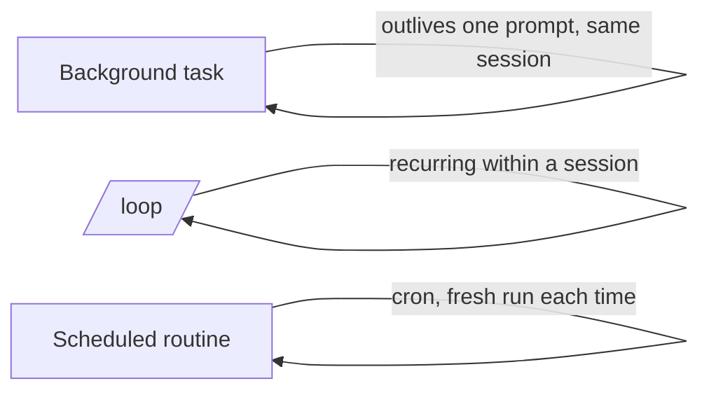

<LevelBadge level="advanced" />

<VerifyNote lastVerified="2026-07-15" source="https://code.claude.com/docs/en">
I comandi esatti e la disponibilità di task in background, /loop e pianificazione cambiano da una release all'altra: verifica nella documentazione ufficiale.
</VerifyNote>

Non tutto è una modifica rapida. Claude Code può eseguire lavoro che **sopravvive a un singolo prompt**: comandi lunghi in background, loop ricorrenti ed esecuzioni pianificate.

<Callout type="objectives" items={[
  "Distinguere i tre meccanismi: task in background, /loop e routine pianificate",
  "Avviare un comando lungo senza bloccare la sessione — e sapere perché controllarlo in un ciclo serrato è la mossa sbagliata",
  "Scegliere quello giusto con una sola domanda: il lavoro sopravvive al prompt, alla sessione o a nessuno dei due?",
  "Scrivere istruzioni per un'esecuzione pianificata che siano autosufficienti, perché ogni esecuzione parte da zero",
  "Mettere dei guardrail sotto tutto ciò che agisce senza supervisione"
]} />

## Task in background

Avvia un comando di lunga durata (un dev server, un test watcher, una build) **senza bloccare** la sessione. Claude continua a lavorare e viene avvisato quando il task produce output o termina. Usalo per tutto ciò che di solito metteresti in background con `&` — ma in forma gestita, così Claude può leggere l'output più tardi.

:::tip Niente attesa attiva
Avvia il task in background e prosegui; lascia che sia la notifica di completamento a riportarti indietro, invece di controllarlo in un ciclo serrato.
:::

## Loop ricorrenti (`/loop`)

`/loop` esegue un prompt o un comando a **intervalli ricorrenti** all'interno di una sessione — ad es. "ogni 5 minuti, controlla lo stato del deploy". Gli dai un intervallo, oppure lasci che Claude decida il ritmo da sé. Ottimo per tenere d'occhio una run di CI o interrogare un job esterno di cui l'harness non può altrimenti avvisarti.

<PromptCard title="Controlla un deploy ogni cinque minuti, nella sessione">
{`/loop 5m check the deploy status and tell me the moment it goes green or fails`}
</PromptCard>

Se ometti l'intervallo, Claude regola il ritmo da solo invece di seguire il tuo orologio.

## Agenti cloud pianificati

Per il lavoro che deve avvenire **a orari fissi, in modo continuativo** — "ogni mattina riassumi le nuove issue", "ogni ora cerca novità e aggiorna la documentazione" — usa **task / routine pianificati** (in stile cron). Ogni esecuzione parte da zero, quindi le sue istruzioni devono essere **autosufficienti**.

```mermaid
flowchart LR
  A[Background task] -->|outlives one prompt, same session| A
  B[/loop/] -->|recurring within a session| B
  C[Scheduled routine] -->|cron, fresh run each time| C
```

## Scegliere fra i tre

| Esigenza | Usa |
|---|---|
| Eseguire un comando lungo e continuare a lavorare | Task in background |
| Controllare qualcosa ogni N minuti in questa sessione | `/loop` |
| Fare qualcosa a orari fissi, a tempo indeterminato | Routine pianificata |

<Steps items={[
  {
    "title": "Chiediti a cosa deve sopravvivere il lavoro",
    "body": "Un prompt, ma non la sessione? Task in background. Il prompt, ripetuto, dentro questa sessione? /loop. La sessione stessa, a orari fissi, a tempo indeterminato? Routine pianificata."
  },
  {
    "title": "Avvialo senza bloccare",
    "body": "Avvia il comando lungo in background e continua a lavorare. Claude viene avvisato quando il task produce output o termina — non controllarlo in un ciclo serrato."
  },
  {
    "title": "Rendi autosufficiente l'esecuzione pianificata",
    "body": "Ogni esecuzione pianificata parte da zero, quindi le sue istruzioni portano con sé tutto il contesto di cui ha bisogno. Nulla della sessione in cui l'hai configurata viene trasferito."
  },
  {
    "title": "Delimita e limita tutto ciò che è senza supervisione",
    "body": "Solo lavoro ben circoscritto e reversibile, abbinato a permessi rigorosi. L'autonomia senza guardrail è la modalità di fallimento che questa funzione rende facile da raggiungere."
  }
]} />

:::warning L'autonomia richiede guardrail
Tutto ciò che agisce senza supervisione secondo una pianificazione dovrebbe essere ben circoscritto e reversibile. Abbinalo a [permessi](/docs/claude-code/permissions) rigorosi e leggi [Hardening Autonomous Runs](/docs/security/hardening-autonomous-runs).
:::

<Quiz questions={[
  {
    "q": "Vuoi un riepilogo delle nuove issue ogni mattina, in modo continuativo. Quale meccanismo è adatto?",
    "options": [
      "Un task in background",
      "/loop con intervallo di 24 ore",
      "Una routine pianificata",
      "Un comando lungo avviato con &"
    ],
    "answer": 2,
    "explain": "Il lavoro che deve avvenire a orari fissi, a tempo indeterminato, è ciò per cui esistono i task / le routine pianificati: girano in stile cron e sopravvivono a qualsiasi sessione. /loop si ripete solo dentro una sessione, quindi si ferma quando la sessione finisce."
  },
  {
    "q": "Perché le istruzioni di una routine pianificata devono essere autosufficienti?",
    "options": [
      "Perché le esecuzioni pianificate hanno una finestra di contesto più piccola",
      "Perché ogni esecuzione parte da zero, senza il contesto della sessione in cui è stata configurata",
      "Perché la sintassi cron non può esprimere prompt lunghi",
      "Perché i permessi vengono reimpostati in sola lettura a ogni esecuzione"
    ],
    "answer": 1,
    "explain": "Ogni esecuzione parte da zero, quindi tutto ciò che le serve deve stare nelle sue istruzioni. Il contesto della sessione in cui hai creato la routine non viene trasferito."
  },
  {
    "q": "Hai avviato in background un test watcher di lunga durata. Cosa NON devi fare adesso?",
    "options": [
      "Continuare con altro lavoro nella stessa sessione",
      "Aspettare che la notifica di completamento ti riporti indietro",
      "Controllare il task in un ciclo serrato finché non termina",
      "Leggere l'output del task più tardi, quando ne ha prodotto un po'"
    ],
    "answer": 2,
    "explain": "L'attesa attiva vanifica lo scopo. Il task è gestito, quindi Claude viene avvisato quando produce output o termina: avvialo, continua a lavorare e lascia che sia la notifica a riportarti indietro."
  }
]} />

<Callout type="takeaways" items={[
  "Tre meccanismi, una sola domanda: il lavoro sopravvive al prompt (task in background), si ripete dentro la sessione (/loop) o sopravvive del tutto alla sessione (routine pianificata)?",
  "I task in background sono gestiti, non semplicemente messi in background con & — Claude può leggerne l'output più tardi e viene avvisato quando terminano.",
  "Niente attesa attiva. Avvialo, prosegui, lascia che la notifica di completamento ti riporti da lui.",
  "/loop accetta un intervallo, oppure regola il ritmo da sé se lo ometti.",
  "Ogni esecuzione pianificata parte da zero, quindi le sue istruzioni devono reggersi da sole.",
  "L'autonomia senza supervisione richiede permessi rigorosi e un ambito reversibile: l'abbinamento non è facoltativo."
]} />

## Prossimi passi

- [Auto-Commit Background Agents: Draft-PR Handoff](/docs/claude-code/auto-commit-background-agents) — cosa succede quando una sessione in background termina
- [Headless Mode & the Agent SDK](/docs/claude-code/headless-and-agent-sdk)
- [Permissions & Modes](/docs/claude-code/permissions)
- [Hardening Autonomous Runs](/docs/security/hardening-autonomous-runs)
