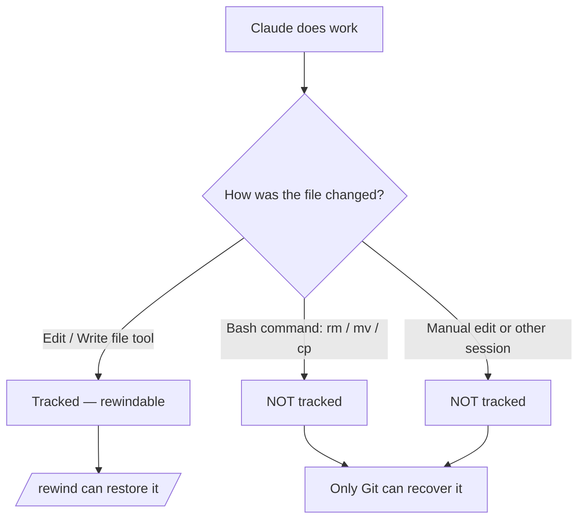

<LevelBadge level="intermediate" />

<Callout type="objectives" items={["Capire cosa cattura un checkpoint — e cosa silenziosamente non cattura", "Aprire il menu di rewind in due modi e scegliere ogni volta l'azione di ripristino giusta", "Distinguere 'restore' (annulla lo stato) da 'summarize' (comprimi il contesto)", "Sapere esattamente perché i checkpoint completano Git ma non lo sostituiscono mai"]} />

<VerifyNote lastVerified="2026-07-09" source="https://code.claude.com/docs/en/checkpointing">
Il comportamento dei checkpoint, le azioni del menu di rewind, la conservazione e i requisiti di versione (ad esempio, riprendere oltre un `/clear` richiede Claude Code v2.1.191+) cambiano tra una release e l'altra — verifica nella documentazione ufficiale.
</VerifyNote>

## L'idea di fondo

Quando lasci Claude libero di eseguire una modifica ambiziosa e su vasta scala, la domanda più spaventosa è "e se va storto dopo tre modifiche di profondità?" Il **checkpointing** è la risposta: Claude Code cattura automaticamente uno snapshot del tuo codice prima di ogni modifica, così puoi tornare indietro a qualsiasi stato precedente invece di districare a mano un refactoring lasciato a metà.

Consideralo un **annulla locale per l'intera sessione** — una rete di sicurezza che ti permette di dire "sì, prova l'approccio audace" senza paura.

## Come vengono creati i checkpoint

Non sei tu a creare i checkpoint — avvengono automaticamente.

<Steps items={[{title: "Ogni prompt = un checkpoint", body: "Ogni prompt dell'utente cattura lo stato del tuo codice prima dell'esecuzione degli strumenti di modifica dei file di Claude. Nessun comando, nessuna configurazione, nessuna cerimonia."}, {title: "Persistono tra le sessioni", body: "I checkpoint sopravvivono all'uscita e alla ripresa di una conversazione, così puoi tornare indietro in una sessione ripresa, non solo in quella attiva."}, {title: "Si ripuliscono da soli", body: "I checkpoint vengono rimossi insieme alla loro sessione dopo 30 giorni (configurabile). Sono un ripristino a livello di sessione, non un archivio."}]} />

## Aprire il menu di rewind

Ci sono due modi per accedervi:

<Steps items={[{title: "Esegui /rewind", body: "Digita lo slash command dal prompt. Funziona sempre."}, {title: "Premi Esc due volte — ma solo con l'input vuoto", body: "Il doppio Esc apre il menu di rewind quando la casella del prompt è vuota. Se contiene del testo, il doppio Esc cancella quel testo invece (il testo cancellato viene salvato nella cronologia dell'input, quindi premi Su per recuperarlo dopo)."}]} />

<PromptCard title="Apri il menu di rewind">{`/rewind`}</PromptCard>

Il menu elenca **ogni prompt che hai inviato in questa sessione**. Scegli il punto su cui vuoi agire, poi scegli un'azione.

## Restore vs. summarize: la distinzione chiave

È qui che le persone si confondono. Il menu offre due *tipi* di azione:

- Le azioni **restore** cambiano lo stato sul disco e/o nella conversazione — annullano.
- Le azioni **summarize** non toccano mai i tuoi file — comprimono la conversazione per liberare spazio nella finestra di contesto.

<Callout type="warning" items={["Restore = annulla (ripristina codice, conversazione o entrambi). Summarize = comprimi il contesto (i file sul disco restano intatti).", "Ricorri a restore quando una modifica ha rotto qualcosa. Ricorri a summarize quando la sessione è gonfia ma il codice va bene."]} />

### Le azioni di restore

<Steps items={[{title: "Restore code and conversation", body: "Ripristina sia i tuoi file sia la cronologia della chat al punto selezionato — un 'riavvolgi il tempo' pulito fino a quel momento."}, {title: "Restore conversation", body: "Riavvolge la chat fino a quel messaggio ma mantiene il tuo codice attuale. Utile per riporre una domanda senza perdere le modifiche che vuoi conservare."}, {title: "Restore code", body: "Ripristina le modifiche ai file ma mantiene la conversazione. Annulla le modifiche, conserva la discussione su di esse."}]} />

Dopo aver ripristinato la conversazione (o dopo aver scelto "Summarize from here"), il prompt originale del messaggio selezionato viene reinserito nel campo di input, così puoi rinviarlo o modificarlo.

### Le azioni di summarize

Entrambe comprimono parte della conversazione in un riepilogo generato dall'AI — come un **`/compact` mirato** in cui scegli quale lato del messaggio selezionato spremere.

<Steps items={[{title: "Summarize from here", body: "I messaggi PRIMA del messaggio selezionato restano intatti. Il messaggio selezionato e tutto ciò che segue diventano un riepilogo. Usalo per scartare una discussione secondaria mantenendo il contesto iniziale in dettaglio completo."}, {title: "Summarize up to here", body: "I messaggi PRIMA del messaggio selezionato diventano un riepilogo; il messaggio selezionato e tutto ciò che segue restano intatti. Rimani alla fine della conversazione. Usalo per comprimere le chiacchiere di configurazione iniziale mantenendo il lavoro recente alla lettera."}]} />

In entrambi i casi i messaggi originali rimangono nel transcript della sessione, quindi Claude può ancora fare riferimento ai dettagli. Puoi digitare istruzioni facoltative per orientare ciò su cui il riepilogo si concentra.

Per l'intero flusso, vedi [Gestione del contesto](/docs/claude-code/context-management) — le azioni di summarize di `/rewind` sono un bisturi laddove `/compact` è un pennello a tratto largo.

## Tornare indietro oltre un `/clear`

Se hai eseguito `/clear` in precedenza nello stesso processo di Claude Code, il menu di rewind mostra una voce aggiuntiva in cima: `/resume <session-id> (previous session)`. Selezionala per saltare indietro alla conversazione che era attiva prima di `/clear`.

<VerifyNote lastVerified="2026-07-09" source="https://code.claude.com/docs/en/checkpointing">
Riprendere oltre un `/clear` dal menu di rewind richiede Claude Code v2.1.191 o versione successiva. Sulle versioni precedenti, esegui invece `/resume` e scegli la sessione precedente dall'elenco.
</VerifyNote>

## Dove i checkpoint si fermano — i limiti che mordono

I checkpoint sembrano magici finché non lo sono più. Contano tre lacune:

<Steps items={[{title: "Le modifiche via bash sono invisibili", body: "I file toccati dai comandi shell che Claude esegue — rm, mv, cp, generatori di codice, formatter — NON vengono tracciati. Solo le modifiche dirette tramite gli strumenti di modifica dei file di Claude vengono registrate in un checkpoint. Un file eliminato da rm è perso per quanto riguarda il rewind."}, {title: "Le modifiche esterne e concorrenti sono invisibili", body: "Le modifiche manuali che fai al di fuori di Claude Code, e le modifiche da altre sessioni concorrenti, normalmente non vengono catturate — a meno che non tocchino per caso gli stessi file modificati dalla sessione corrente."}, {title: "È a livello di sessione, non di cronologia", body: "I checkpoint sono un ripristino rapido e locale. Non sono commit, non sono branch e non sono condivisibili con il tuo team."}]} />

## Checkpoint vs. Git: usali entrambi

Risolvono problemi diversi, quindi abbinali.

| | Checkpoint (`/rewind`) | Git |
|---|---|---|
| Ambito | Una sessione | Intera cronologia del progetto |
| Granularità | Per prompt, automatico | Per commit, deliberato |
| Traccia le modifiche fatte via bash? | No | Sì (una volta in stage/committate) |
| Durata | ~30 giorni, poi sparisce | Permanente |
| Condivisibile / collaborativo | No | Sì |
| Modello mentale | "Annulla locale" | "Cronologia permanente" |

<Callout type="tip" items={["Committa gli stati funzionanti con Git prima di un'esecuzione rischiosa e su vasta scala — è la tua base solida e duratura.", "Usa /rewind per un ripristino rapido all'interno della sessione tra un commit e l'altro senza inquinare la tua cronologia Git.", "Se Claude eseguirà bash distruttivo (rm/mv) o generatori, affidati a Git — il rewind non salverà quei file."]} />

## Quando ricorrervi

<Steps items={[{title: "Esplorare alternative", body: "Prova un'implementazione audace e, se non ti piace, ripristina codice e conversazione al punto di biforcazione e provane un'altra."}, {title: "Recuperare da una modifica sbagliata", body: "Una modifica ha introdotto un bug tre prompt fa? Ripristina il codice a subito prima invece di eseguire il debug delle macerie."}, {title: "Iterare su una feature", body: "Sperimenta con delle varianti, sapendo sempre che uno stato notoriamente buono è a un /rewind di distanza."}, {title: "Liberare spazio di contesto", body: "Una prolissa deviazione di debug si è mangiata la tua finestra di contesto? Fai summarize dal punto intermedio in avanti e mantieni le tue istruzioni originali in dettaglio completo."}]} />

<Quiz title="Mettiti alla prova" questions={[{q: "Claude ha eseguito `rm config.old.json` tramite un comando bash e lo vuoi indietro. Può `/rewind` ripristinarlo?", options: ["Sì — ogni modifica che Claude fa viene registrata in un checkpoint", "No — le modifiche fatte via bash non vengono tracciate; solo le modifiche dirette con gli strumenti sui file lo sono", "Solo se esegui /rewind entro 30 secondi"], answer: 1, explain: "Il checkpointing cattura solo le modifiche fatte tramite gli strumenti di modifica dei file di Claude. I file cambiati dai comandi bash (rm, mv, cp) non vengono tracciati — ed è esattamente a questo che serve Git."}, {q: "Il tuo codice va bene, ma una lunga digressione di debug ha riempito la finestra di contesto. Quale azione è adatta?", options: ["Restore code and conversation a prima della digressione", "Restore code", "Summarize from here all'inizio della digressione"], answer: 2, explain: "Le azioni di summarize comprimono la conversazione senza toccare i file. 'Summarize from here' trasforma la digressione in un riepilogo mantenendo intatto il tuo contesto precedente — liberando spazio di contesto senza alcuna modifica al codice."}, {q: "Come viene creato un checkpoint?", options: ["Esegui /checkpoint manualmente", "Automaticamente, prima di ogni modifica — ogni prompt ne crea uno", "Solo quando fai un commit in Git"], answer: 1, explain: "Il checkpointing è automatico: ogni prompt dell'utente cattura lo stato pre-modifica del tuo codice. Non c'è alcun passaggio manuale."}]} />

<Flashcards title="Vocabolario di checkpoint e rewind" cards={[{front: "Checkpoint", back: "Uno snapshot automatico del tuo codice preso prima di ogni modifica, uno per prompt. Legato alla sessione, conservato ~30 giorni."}, {front: "/rewind", back: "Apre il menu di rewind che elenca ogni prompt di questa sessione, così puoi fare restore o summarize da qualsiasi punto. Raggiungibile anche tramite doppio Esc con l'input vuoto."}, {front: "Azione di restore", back: "Ripristina lo stato — codice, conversazione o entrambi — al punto selezionato. Questo è l''annulla'."}, {front: "Azione di summarize", back: "Comprime parte della conversazione in un riepilogo AI per liberare contesto. I file sul disco non vengono mai toccati."}, {front: "Punto cieco di bash", back: "I file cambiati dai comandi shell (rm/mv/cp) NON vengono registrati in un checkpoint — solo le modifiche dirette con gli strumenti sui file lo sono. Per quelli usa Git."}]} />

<Callout type="takeaways" items={["I checkpoint sono snapshot automatici del tuo codice, uno per prompt — un annulla locale per l'intera sessione, conservato circa 30 giorni.", "Apri il menu di rewind con /rewind o con doppio Esc a input vuoto; elenca ogni prompt che hai inviato.", "Le azioni di restore annullano lo stato (codice, conversazione o entrambi); le azioni di summarize comprimono il contesto e non toccano mai i file.", "Le modifiche fatte via bash, esterne e concorrenti NON vengono tracciate — solo le modifiche dirette con gli strumenti sui file lo sono.", "I checkpoint completano Git, non lo sostituiscono: pensa 'annulla locale' vs. 'cronologia permanente e condivisibile'."]} />

## Prossimo

- [Gestione del contesto](/docs/claude-code/context-management) — `/compact`, `/clear` e come summarize si inserisce nel quadro più ampio
- [Plan Mode](/docs/claude-code/plan-mode) — indaga e approva un piano prima che le modifiche vengano eseguite, così torni indietro meno spesso
- [Permessi](/docs/claude-code/permissions) — l'altra metà per eseguire compiti ambiziosi in sicurezza
