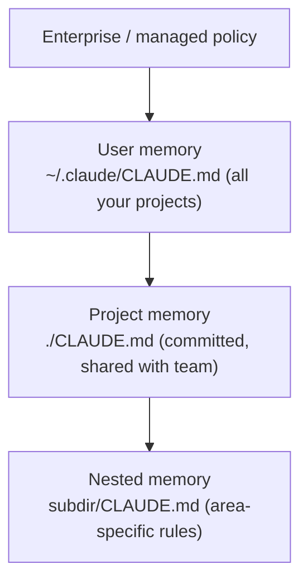

<LevelBadge level="beginner" />

<VerifyNote lastVerified="2026-06-20" source="https://docs.anthropic.com/en/docs/claude-code/memory">
Le posizioni dei file di memoria e la sintassi degli import possono cambiare — verifica i dettagli nella documentazione ufficiale di Claude Code sulla memoria.
</VerifyNote>

Se fai **una sola** cosa per migliorare [Claude Code](/docs/claude-code/what-is-claude-code), fai questa. `CLAUDE.md` è un file di testo semplice che Claude legge all'inizio di ogni sessione — il briefing permanente del tuo progetto.

## Perché è l'impostazione a più alta leva

Senza di esso, rispieghi il tuo progetto a ogni sessione ("usiamo pnpm, i test sono in `__tests__`, non toccare `/generated`…"). Con esso, Claude lo sa già. Buone istruzioni qui migliorano *ogni* interazione futura in un colpo solo.

## La gerarchia della memoria

Claude Code legge la memoria da diversi punti e li unisce, all'incirca dal più globale al più specifico:

- **Memoria utente** — le tue preferenze personali in tutti i progetti.
- **Memoria di progetto** (`./CLAUDE.md`, sotto controllo di versione) — come funziona *questo* repository. Condivisa con il tuo team.
- **Annidata** — inserisci un `CLAUDE.md` in una sottocartella per regole che si applicano solo lì.

## Genera un punto di partenza

Esegui `/init` in un progetto e Claude redige un `CLAUDE.md` ispezionando il codice. Poi **ridimensionalo** — la bozza è un punto di partenza, non il traguardo.

## Cosa metterci

- Cos'è il progetto, in due frasi.
- Lo stack tecnologico e come **eseguire / testare / fare il lint**.
- Convenzioni che Claude non può dedurre (nomenclatura, struttura, stile dei commit).
- **Protezioni**: "esegui i test prima di dichiararti completo", "non modificare mai `/vendor`", "non committare mai segreti".

Prendi uno starter già pronto da [Template CLAUDE.md](/docs/templates/claude-md).

## Cosa NON metterci

:::warning Breve e veritiero batte lungo e ambizioso
Claude segue `CLAUDE.md` *alla lettera*. Istruzioni obsolete, vaghe o velleitarie fanno attivamente danni. Descrivi come il progetto funziona **davvero** oggi, tienilo conciso e rivedilo periodicamente.
:::

Evita: documenti giganti incollati (usa gli `@imports` per fare riferimento ai file), segreti e regole che in realtà non segui.

## Import

Includi documenti esistenti invece di duplicarli — ad esempio fai riferimento alla tua guida di stile con un import `@path/to/file` così c'è un'unica fonte autorevole. Vedi la [documentazione ufficiale sulla memoria](https://docs.anthropic.com/en/docs/claude-code/memory) per la sintassi esatta.

## Avanti

- [Modalità Piano](/docs/claude-code/plan-mode) — prime modifiche sicure
- [Permessi e modalità](/docs/claude-code/permissions) — cosa Claude può fare senza supervisione
- [Tutorial: personalizza Claude Code per un repository reale](/docs/walkthroughs/customize-claude-code)
