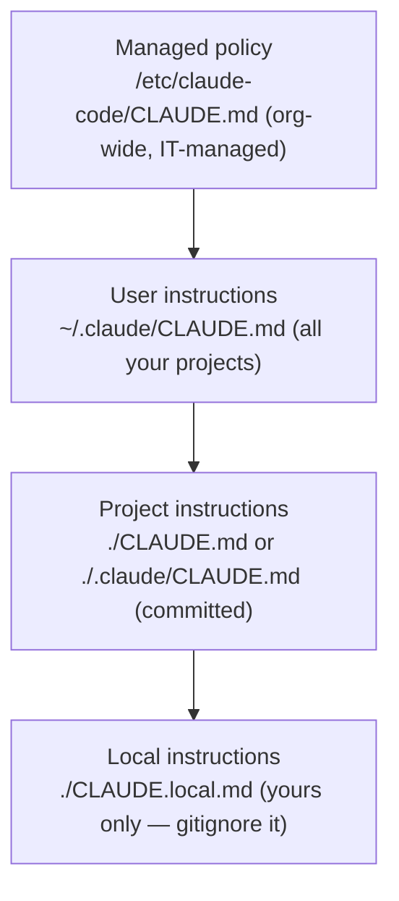

<LevelBadge level="beginner" />

<VerifyNote lastVerified="2026-10-06" source="https://code.claude.com/docs/en/memory">
Posizioni, ordine di caricamento e sintassi degli import vengono dalla documentazione ufficiale sulla memoria («How Claude remembers your project»), che ora descrive **due** meccanismi: i file CLAUDE.md che scrivi tu e l'**auto-memoria** che Claude scrive da sé. Gli import si risolvono fino a una profondità massima di quattro passaggi. Verifica lì i dettagli specifici: queste cose cambiano.
</VerifyNote>

Se fai **una** sola cosa per migliorare [Claude Code](/docs/claude-code/what-is-claude-code), fai questa. `CLAUDE.md` è un file di testo semplice che Claude legge all'inizio di ogni sessione: il briefing permanente del tuo progetto.

<Callout type="objectives" items={["Perché CLAUDE.md è l'impostazione di Claude Code con il maggior impatto", "Come si carica la gerarchia della memoria, dalla policy gestita fino a CLAUDE.local.md", "In cosa l'auto-memoria è diversa dal CLAUDE.md che scrivi tu", "Come generare un file di partenza con /init e snellirlo", "Cosa va in CLAUDE.md e cosa tenerne fuori", "Come gli @import ti permettono di riferire documenti senza duplicarli"]} />

## Perché è l'impostazione con il maggior impatto

Senza di esso, devi rispiegare il tuo progetto a ogni sessione ("usiamo pnpm, i test sono in `__tests__`, non toccare `/generated`…"). Con esso, Claude lo sa già. Buone istruzioni qui migliorano *ogni* interazione futura in un colpo solo.

## La gerarchia della memoria

Claude Code carica la memoria da diverse posizioni e le fonde nell'ordine di caricamento, partendo dall'ambito più ampio: così un'istruzione di progetto entra nel contesto *dopo* un'istruzione utente.

```mermaid
flowchart TD
  A["Managed policy<br/>/etc/claude-code/CLAUDE.md (org-wide, IT-managed)"] --> B["User instructions<br/>~/.claude/CLAUDE.md (all your projects)"]
  B --> C["Project instructions<br/>./CLAUDE.md or ./.claude/CLAUDE.md (committed)"]
  C --> D["Local instructions<br/>./CLAUDE.local.md (yours only — gitignore it)"]
```

- **Policy gestita** — istruzioni a livello di organizzazione che distribuisce il tuo team IT/DevOps. Il percorso dipende dal sistema operativo: `/Library/Application Support/ClaudeCode/CLAUDE.md` su macOS, `/etc/claude-code/CLAUDE.md` su Linux e WSL, `C:\Program Files\ClaudeCode\CLAUDE.md` su Windows.
- **Istruzioni utente** (`~/.claude/CLAUDE.md`) — le tue preferenze personali su ogni progetto.
- **Istruzioni di progetto** (`./CLAUDE.md` *oppure* `./.claude/CLAUDE.md`, sotto commit) — come funziona *questo* repo. Condivise con il tuo team. Se il tuo repo usa [`AGENTS.md`](/docs/claude-code/agents-md), quello può caricarsi al posto di questi file o insieme a essi.
- **Istruzioni locali** (`./CLAUDE.local.md`) — note specifiche del progetto solo per te, come l'URL di un ambiente sandbox. Aggiungilo a `.gitignore`.

I file nella gerarchia di cartelle *sopra* la tua directory di lavoro vengono caricati all'avvio; i file nelle **sottocartelle vengono caricati su richiesta**, quando Claude mette mano a qualcosa in quell'area.

<Callout type="tip" items={["Un solo file non ti basta più? Spezza le istruzioni in .claude/rules/*.md, un argomento per file, scoperti ricorsivamente. Le regole senza frontmatter paths si caricano all'avvio con la stessa priorità di .claude/CLAUDE.md; aggiungi il frontmatter paths per caricare una regola solo quando Claude lavora su file corrispondenti, e risparmi contesto."]} />

<Flashcards title="Conosci i tuoi livelli di memoria" cards={[{front: "Policy gestita", back: "CLAUDE.md a livello di organizzazione, gestito dall'IT: il livello più ampio, caricato prima delle istruzioni utente e di progetto."}, {front: "Istruzioni utente", back: "~/.claude/CLAUDE.md — le tue preferenze personali che valgono su ogni progetto."}, {front: "Istruzioni di progetto", back: "./CLAUDE.md oppure ./.claude/CLAUDE.md — sotto commit e condivise con il team; descrivono come funziona questo repo."}, {front: "Istruzioni locali", back: "./CLAUDE.local.md — preferenze personali specifiche del progetto. Mettilo in gitignore."}, {front: ".claude/rules/*.md", back: "Istruzioni con un argomento per file, per progetti più grandi. Con il frontmatter paths si caricano solo per i file corrispondenti."}, {front: "CLAUDE.md in sottocartella", back: "Si carica su richiesta, quando Claude lavora in quella parte dell'albero, non all'avvio."}]} />

## L'altra metà: l'auto-memoria

CLAUDE.md è la metà della memoria che scrivi *tu*. Claude Code tiene anche un'**auto-memoria**: note che Claude scrive da sé partendo dalle tue correzioni e preferenze, salvate per repository e caricate in ogni sessione insieme ai tuoi file CLAUDE.md.

| | File CLAUDE.md | Auto-memoria |
| --- | --- | --- |
| **Chi la scrive** | Tu | Claude |
| **Cosa contiene** | Istruzioni e regole | Apprendimenti e pattern |
| **Ambito** | Progetto, utente od organizzazione | Per repository, condivisa tra i worktree |

Entrambe sono *contesto*, non imposizione: Claude le tratta come indicazioni da soppesare, non come configurazione a cui deve obbedire. Per bloccare in modo assoluto un'azione, a prescindere da ciò che Claude decide, usa invece un [hook PreToolUse](/docs/claude-code/hooks).

<Callout type="warning" items={["L'auto-memoria carica solo le prime 200 righe o 25 KB: un MEMORY.md gonfio viene troncato silenziosamente. Vedi Audit del budget di contesto per il dettaglio completo dei costi di avvio."]} />

## Genera un punto di partenza

<Steps items={[{title: "Esegui /init nel progetto", body: "Claude ispeziona il codice e redige un CLAUDE.md per te in automatico."}, {title: "Snelliscilo", body: "La bozza è un punto di partenza, non il traguardo. Riducila a ciò che è vero e utile."}, {title: "Prendi spunto da un template", body: "Recupera uno starter già pronto dalla pagina Template CLAUDE.md e adattalo al tuo repo."}]} />

<PromptCard title="Genera una bozza di CLAUDE.md">{`/init`}</PromptCard>

Recupera uno starter già pronto da [Template CLAUDE.md](/docs/templates/claude-md).

## Cosa metterci dentro

- Cos'è il progetto, in due frasi.
- Lo stack tecnologico e come **eseguire / testare / fare il lint**.
- Convenzioni che Claude non può dedurre (nomenclatura, struttura, stile dei commit).
- **Protezioni**: "esegui i test prima di dichiarare concluso", "non modificare mai `/vendor`", "non committare mai segreti".

## Cosa NON metterci dentro

<Callout type="warning" items={["Claude segue CLAUDE.md alla lettera: istruzioni obsolete, vaghe o velleitarie fanno attivamente danni.", "Descrivi come il progetto funziona realmente oggi; breve e veritiero batte lungo e ambizioso.", "Evita documenti incollati giganteschi (usa invece gli @import), i segreti e le regole che in realtà non segui.", "Rivedilo periodicamente in modo che resti accurato man mano che il progetto evolve."]} />

## Import

Includi i documenti esistenti invece di duplicarli: ad esempio, riferisci la tua guida di stile con un import `@path/to/file` così da avere un'unica fonte autorevole. Funzionano sia i percorsi relativi sia quelli assoluti; i percorsi relativi si risolvono rispetto al file che contiene l'import, **non** rispetto alla tua directory di lavoro. I file importati possono importarne altri, fino a una profondità massima di **quattro passaggi**.

Due trappole di sintassi da conoscere prima che ti mordano:

- **Gli spazi vogliono il backslash.** `@Design\ Docs/api-conventions.md` funziona; senza il backslash il percorso si ferma al primo spazio. Racchiuderlo tra virgolette non importa il file per niente.
- **I backtick escludono l'import.** L'analisi degli import salta i code span e i blocchi di codice, quindi `` `@README` `` resta testo letterale mentre `@README` da solo importa il file. È così che *menzioni* un percorso senza caricarlo.

Vedi la [documentazione ufficiale sulla memoria](https://code.claude.com/docs/en/memory) per il riferimento completo.

<Callout type="tip" items={["Un'unica fonte autorevole: riferisci un file con gli @import invece di incollarne il contenuto in CLAUDE.md.", "Se un documento esiste già, collegalo: non copiarlo. Le copie si disallineano col tempo."]} />

## Mettiti alla prova

<Quiz title="Mettiti alla prova" questions={[{q: "Quale file legge Claude Code all'inizio di ogni sessione come briefing permanente del tuo progetto?", options: ["README.md", "CLAUDE.md", "package.json"], answer: 1, explain: "CLAUDE.md è il file di memoria in testo semplice che Claude legge all'inizio di ogni sessione."}, {q: "Cosa fa l'esecuzione di /init in un progetto?", options: ["Esegue il commit di CLAUDE.md nel repo del tuo team", "Redige un CLAUDE.md ispezionando il codice, che poi tu snellisci", "Elimina i file di memoria obsoleti"], answer: 1, explain: "/init redige un CLAUDE.md di partenza a partire dal codice: la bozza è un punto di partenza, quindi dopo la snellisci."}, {q: "Qual è il modo consigliato per includere un documento esistente di grandi dimensioni come una guida di stile?", options: ["Incollare l'intero documento in CLAUDE.md", "Riferirlo con un import @path/to/file", "Conservarlo come segreto"], answer: 1, explain: "Usa gli @import per puntare al file in modo da avere un'unica fonte autorevole anziché una copia duplicata che si disallinea."}, {q: "Dove vanno le note personali specifiche del progetto, quelle che non vuoi mettere sotto commit?", options: ["~/.claude/CLAUDE.md", "./CLAUDE.local.md", "./.claude/CLAUDE.md"], answer: 1, explain: "./CLAUDE.local.md è il livello locale: specifico del progetto ma solo tuo. Mettilo in gitignore. ~/.claude/CLAUDE.md vale per tutti i tuoi progetti, mentre ./.claude/CLAUDE.md sono istruzioni di team sotto commit."}, {q: "Chi scrive l'auto-memoria?", options: ["Tu, a mano", "Claude, partendo dalle tue correzioni e preferenze", "Il tuo amministratore IT"], answer: 1, explain: "L'auto-memoria è la metà che Claude scrive da sé: apprendimenti e pattern, salvati per repository. CLAUDE.md è la metà che scrivi tu."}, {q: "Un CLAUDE.md in una sottocartella si carica quando?", options: ["All'avvio, insieme a ogni altro file di memoria", "Su richiesta, quando Claude lavora in quella parte dell'albero", "Solo se lo importi con @"], answer: 1, explain: "I file sopra la tua directory di lavoro si caricano all'avvio; i file nelle sottocartelle si caricano su richiesta, quando Claude mette mano a qualcosa in quell'area."}]} />

<Callout type="takeaways" items={["CLAUDE.md è l'impostazione con il maggior impatto: migliora ogni sessione futura in un colpo solo.", "La memoria si carica dall'ambito più ampio al più stretto: policy gestita, poi utente (~/.claude/CLAUDE.md), progetto (./CLAUDE.md oppure ./.claude/CLAUDE.md), poi locale (./CLAUDE.local.md). I file nelle sottocartelle si caricano su richiesta.", "L'auto-memoria è l'altra metà: le note che Claude scrive da sé, per repository, caricate a ogni sessione. Entrambe sono contesto, non imposizione: per bloccare qualcosa in modo assoluto usa un hook.", "Un solo file non ti basta più? Spezzalo in .claude/rules/*.md e delimita le regole con il frontmatter paths.", "Inizia con /init, poi snellisci la bozza fino a ciò che è davvero vero.", "Tienilo breve e veritiero: usa gli @import (massimo quattro passaggi) per i documenti grandi e non committare mai segreti."]} />

## Avanti

- [AGENTS.md e interoperabilità tra strumenti](/docs/claude-code/agents-md) — condividi un unico file di istruzioni con ogni coding agent
- [Modalità Piano](/docs/claude-code/plan-mode) — prime modifiche sicure
- [Permessi e modalità](/docs/claude-code/permissions) — cosa Claude può fare senza supervisione
- [Tutorial: personalizza Claude Code per un repository reale](/docs/walkthroughs/customize-claude-code)
