<LevelBadge level="intermediate" />

Un progetto Claude Code accumula debito di contesto come un laptop accumula schede del browser. Ogni skill che installi aggiunge una riga a un elenco che Claude rilegge a ogni turno. Ogni subagente aggiunge una descrizione. Ogni paragrafo di `CLAUDE.md` che hai scritto a marzo viene caricato a settembre, che il task ne abbia bisogno o no. E ogni `npm test` scarica fino a 30.000 caratteri nella conversazione. Niente di tutto questo è visibile finché la sessione non inizia a dimenticare le istruzioni o la fattura smette di corrispondere al lavoro.

[Gestione del contesto](/docs/claude-code/context-management) copre i due comandi che usi sul momento, `/clear` e `/compact`. Questa pagina è l'audit che esegui una volta per progetto: sei punti in cui Claude Code spende contesto prima che tu scriva qualcosa o tra un turno e l'altro, l'impostazione che governa ciascuno e il valore predefinito. Tutto ciò che trovi qui è nella documentazione ufficiale di settembre 2026, e la maggior parte delle manopole è più recente del folklore che le circonda.

<Callout type="objectives" items={[
  "Misurare prima di tagliare: leggere /context, l'attribuzione di /usage e la stima dell'elenco di /doctor per sistemare prima la voce più pesante",
  "Sfoltire l'elenco delle skill con /skill-doctor (v2.1.252+) e i quattro stati di skillOverrides, conoscendo il budget dell'1% della finestra a cui l'elenco è limitato",
  "Limitare ciò che un comando di shell o un task in background restituisce inline (30.000 e 32.000 caratteri di default) con bashOutputMaxChars e taskOutputMaxChars",
  "Smettere di pagare CLAUDE.md in ogni subagente con omitClaudeMd (v2.1.271+) e tenere le descrizioni dei subagenti sotto la soglia di avviso dei 15.000 token",
  "Impostare di proposito la finestra di auto-compattazione (/autocompact, autoCompactWindow) e capire il budget di 25.000 token che decide quali skill invocate sopravvivono alla compattazione",
  "Limitare l'effort a livello di flotta con maxEffortLevel quando la vera fattura sono i token di thinking, non il contesto"
]} />

<VerifyNote lastVerified="2026-09-15" source="https://code.claude.com/docs/en/settings-reference">
Nomi delle impostazioni, default, intervalli e versioni minime dal riferimento delle impostazioni di Claude Code (`autoCompactWindow`, `bashOutputMaxChars`, `taskOutputMaxChars`, `maxEffortLevel`, `skillListingBudgetFraction`, `skillOverrides`, `disableBundledSkills`). Comportamento di `/skill-doctor`, budget dell'1% per l'elenco, limite di 1.536 caratteri per descrizione e budget di ri-attacco di 25.000 token dalla [documentazione delle skill](https://code.claude.com/docs/en/skills). Limiti inline di Bash dal [riferimento degli strumenti](https://code.claude.com/docs/en/tools-reference#output-limits). `omitClaudeMd`, l'avviso dei 15.000 token per le descrizioni e ciò che un subagente carica dalla [documentazione dei subagenti](https://code.claude.com/docs/en/sub-agents). Indicazioni su CLAUDE.md e costi da [Gestire i costi](https://code.claude.com/docs/en/costs). Le dimensioni del contesto dei modelli non sono ripetute qui; vedi [Modelli e prezzi](/docs/whats-new/models-and-pricing).
</VerifyNote>

## Cosa c'è nella finestra prima che tu scriva

```mermaid
flowchart LR
  subgraph startup["Loaded at session start (every turn thereafter)"]
    SP[System prompt]
    CM[CLAUDE.md hierarchy]
    AM["Auto memory (first 200 lines / 25 KB)"]
    SL["Skill listing (capped at 1% of window)"]
    AD["Subagent descriptions (warning at 15k tokens)"]
    MT["MCP tool names (schemas deferred)"]
  end
  subgraph turns["Added as you work"]
    TR["Tool results (Bash ≤30k chars inline)"]
    TO["Background task output (≤32k chars inline)"]
    SK["Invoked skill bodies"]
    FR[File reads]
  end
  startup --> turns --> C{Auto-compact window}
  C -->|summary| R["Re-attached skills: 5k each, 25k total"]
```

Due fatti rendono questo diagramma azionabile. Tutto ciò che sta nel riquadro di sinistra viene pagato **a ogni richiesta**, perché Claude Code invia l'intera conversazione a ogni turno e solo lo sconto per la lettura dalla cache lo attenua. E il riquadro di destra è dove un singolo comando verboso può aggiungere in un solo passaggio più di tutto il riquadro di sinistra. L'audit qui sotto procede da sinistra a destra.

## L'audit

<Steps items={[
  { title: "Misura: /context, /usage, /doctor", body: "Esegui /context per una ripartizione in tempo reale per categoria con suggerimenti di ottimizzazione, inclusi quali file CLAUDE.md e di auto-memoria sono stati caricati. Su un piano Pro, Max, Team o Enterprise, /usage attribuisce l'uso recente a skill, subagenti, plugin e singoli server MCP in percentuale, e segnala i comportamenti (contesto lungo, cache miss) che pesano per il 10% o più. /doctor stima il costo in contesto dell'elenco delle skill e i suoi maggiori contributori. Annota le tre voci più pesanti prima di cambiare qualsiasi cosa." },
  { title: "Sfoltisci l'elenco delle skill con /skill-doctor", body: "Ogni skill nell'elenco costa contesto a ogni turno, che Claude la usi o no. /skill-doctor (v2.1.252+) mostra il costo in contesto e la frequenza di invocazione di ogni skill, segnala le skill mai invocate e ti dice dove disattivarle; elenca anche i plugin che non hai usato di recente. Parti da quelle inutilizzate a costo più alto. Le sessioni interattive aprono il report nella scheda Stats del gestore /plugin; con -p viene stampato come testo. Non copre le skill bundled o enterprise, richiede il recupero dei feature flag e rifiuta di girare via Remote Control." },
  { title: "Comprimi, non cancellare, con skillOverrides", body: "Quattro stati per skill: on (nome e descrizione elencati), name-only (elencata senza descrizione, ancora invocabile), user-invocable-only (nascosta a Claude, ancora nel menu /), off. Il menu /skills lo scrive per te: evidenzia una skill, premi Spazio per ciclare, Esc per salvare in .claude/settings.local.json. Le skill dei plugin si gestiscono invece tramite /plugin. Impostare disableBundledSkills: true rimuove le skill e i workflow bundled di Claude Code in una riga." },
  { title: "Conosci il budget dell'elenco e il limite delle descrizioni", body: "L'elenco è limitato all'1% della finestra di contesto del modello (skillListingBudgetFraction, default 0.01). Quando trabocca, Claude Code mantiene ogni nome ma elimina le descrizioni a partire dalle skill meno usate, togliendo le parole chiave di cui Claude ha bisogno per selezionarle automaticamente. Anche la descrizione di ogni skill più when_to_use viene tagliata a 1.536 caratteri (skillListingMaxDescChars). Metti il caso d'uso chiave nella prima frase." },
  { title: "Riduci ciò che viene caricato all'avvio", body: "Tieni CLAUDE.md sotto le 200 righe e sposta le istruzioni specifiche di un workflow (revisione PR, migrazioni) nelle skill, che vengono caricate solo quando invocate. L'auto-memoria carica solo le prime 200 righe o 25 KB, quindi un MEMORY.md gonfio viene troncato silenziosamente. Le descrizioni dei subagenti vengono lette a ogni turno: quando le descrizioni combinate dei tuoi subagenti personalizzati superano i 15.000 token, Claude Code avvisa all'avvio. Sposta i dettagli nel system prompt di ogni subagente, che viene caricato solo quando gira." },
  { title: "Limita l'output degli strumenti inline", body: "Un comando Bash o PowerShell riuscito restituisce di default fino a circa 30.000 caratteri inline; oltre, Claude riceve una breve anteprima più un percorso file e legge il file su richiesta. Un comando fallito restituisce fino a 10.000 caratteri come estratto testa-e-coda. bashOutputMaxChars (v2.1.261+, vincolato a 4.000–128.000) imposta insieme il tetto inline e la finestra di rilettura e fa ignorare a Claude Code BASH_MAX_OUTPUT_LENGTH. taskOutputMaxChars fa lo stesso per i task in background letti con TaskOutput (default 32.000, stesso intervallo). Abbassali nei progetti con strumenti di build loquaci; alzali solo quando Claude continua comunque ad aprire il file salvato." },
  { title: "Smetti di pagare CLAUDE.md in ogni subagente", body: "Un subagente non-fork carica ogni livello della gerarchia CLAUDE.md più uno snapshot di git status, oltre al proprio prompt. Gli agenti integrati Explore e Plan saltano entrambi. Per i subagenti personalizzati che ricevono tutto dal prompt di delega, imposta omitClaudeMd: true nel frontmatter (v2.1.271+): i file CLAUDE.md utente, progetto e locali vengono saltati; i file di policy gestiti vengono comunque caricati. Ignorato quando l'agente gira come agente principale della sessione. Per istruzioni condivise voluminose nelle esecuzioni headless, passa --append-subagent-system-prompt-file (v2.1.261+) invece di infilarle in ogni descrizione." },
  { title: "Imposta di proposito la finestra di auto-compattazione", body: "autoCompactWindow è un conteggio di token da 100.000 a 1.000.000, limitato alla finestra del tuo modello; se non impostato, Claude Code sceglie una finestra tarata sul modello. /autocompact 500k lo scrive nelle impostazioni utente; --autocompact lo sovrascrive per una sessione; CLAUDE_CODE_AUTO_COMPACT_WINDOW sovrascrive entrambi. CLAUDE_AUTOCOMPACT_PCT_OVERRIDE (1–100) può solo abbassare il punto di attivazione. Dopo la compattazione, le skill invocate vengono ri-attaccate fino a 5.000 token ciascuna entro un totale di 25.000 token, dalla più recente, quindi le skill più vecchie possono essere eliminate del tutto. Se una skill deve sopravvivere, re-invocala dopo /compact." },
  { title: "Limita l'effort quando la fattura è il thinking, non il contesto", body: "I token di thinking sono fatturati come output. maxEffortLevel (v2.1.267+) limita l'effort che qualsiasi sessione può usare: uno tra low, medium, high, xhigh o max (max = nessun limite). Si applica prima di ogni richiesta su ogni provider, vince il limite più basso tra gli ambiti, e un limite sotto xhigh disabilita ultracode. I limiti per modello vanno in modelSettings. Distribuiscilo tramite impostazioni gestite per imporlo a un'organizzazione." }
]} />

## Un blocco di impostazioni da incollare

<PromptCard title="Limiti di contesto locali al progetto (.claude/settings.local.json)">
{`{
  "bashOutputMaxChars": 12000,
  "taskOutputMaxChars": 12000,
  "skillOverrides": {
    "legacy-migration-notes": "name-only",
    "deploy-prod": "user-invocable-only",
    "old-design-system": "off"
  },
  "autoCompactWindow": 500000,
  "maxEffortLevel": "high"
}`}
</PromptCard>

Leggilo dall'alto in basso come decisioni, non come default. I due limiti di output presuppongono un test runner loquace; riportali verso i default di 30.000 / 32.000 se Claude inizia ad aprire il file di output salvato a ogni esecuzione. I tre override mantengono le skill raggiungibili senza pagare le loro descrizioni. La finestra di compattazione è una scelta esplicita per un modello con contesto da 1M in cui preferisci compattare a metà piuttosto che al punto tarato sul modello. Il limite di effort è l'unica riga qui che cambia la qualità dell'output, quindi impostalo per ultimo e solo dopo che `/usage` mostra i token di thinking come voce dominante.

<PromptCard title="Subagente che non carica CLAUDE.md (.claude/agents/repo-auditor.md)">
{`---
name: repo-auditor
description: Audits a repository for dead code and unused exports. Use for read-only sweeps.
tools: Read, Grep, Glob, Bash
model: sonnet
omitClaudeMd: true
---
You are a read-only auditor. Everything you need is in the delegation prompt.
Report findings as a table of path, symbol, and evidence. Do not edit files.`}
</PromptCard>

<PromptCard title="Esegui il report delle skill in una sessione headless">
{`claude -p "/skill-doctor"`}
</PromptCard>

## Errori comuni

<Callout type="warning" items={[
  "Cancellare le skill invece di comprimerle. name-only mantiene una skill invocabile a costo di elenco quasi nullo; off la rimuove anche dal menu /. La maggior parte delle skill 'inutilizzate' dovrebbe diventare name-only, non sparire.",
  "Alzare bashOutputMaxChars al tetto di 128.000 perché un log di build ha traboccato. Questo rende ogni comando futuro fino a 4× più costoso inline. Filtra invece il log con un hook PreToolUse (grep per FAIL, head -100); la documentazione sui costi mostra l'hook esatto.",
  "Impostare autoCompactWindow sopra il contesto del modello. Claude Code lo limita silenziosamente alla finestra, quindi l'impostazione sembra applicata e non fa nulla.",
  "Presumere che un subagente sia economico perché il suo contesto è separato. Il suo avvio include comunque ogni livello di CLAUDE.md e uno snapshot di git, a meno che non sia Explore, Plan o imposti omitClaudeMd.",
  "Leggere /skill-doctor via Remote Control da un telefono. Restituisce 'Skill usage reports are not available on this connection.' Eseguilo nel terminale in cui vive la sessione.",
  "Aspettarsi che una skill invocata sopravviva a /compact. Solo le invocazioni più recenti rientrano nel budget di ri-attacco di 25.000 token, a 5.000 token ciascuna. Re-invoca quelle che ti servono ancora."
]} />

## Verifica rapida

<Quiz questions={[
  {
    q: "Cosa riporta /skill-doctor, e cosa lascia fuori di proposito?",
    options: [
      "Il corpo completo di ogni skill; nulla è escluso",
      "Costo in contesto e conteggio delle invocazioni di ogni skill della sessione, segnalando quelle mai invocate — le skill bundled ed enterprise sono escluse",
      "Solo le skill dei plugin",
      "Solo le skill che hanno dato errore"
    ],
    answer: 1,
    explain: "Il report copre le skill della tua sessione tranne quelle bundled ed enterprise, mostra costo e frequenza, segnala le skill mai invocate con l'indicazione di dove disattivarle, ed elenca i plugin non usati di recente. Richiede v2.1.252+ e il recupero dei feature flag."
  },
  {
    q: "L'elenco delle skill ha superato il suo budget. Cosa succede?",
    options: [
      "Claude Code rifiuta di avviarsi",
      "Le skill vengono rimosse a caso",
      "Ogni nome resta; le descrizioni vengono eliminate a partire dalle skill meno usate, quindi Claude ha meno probabilità di selezionarle automaticamente",
      "Il budget cresce automaticamente"
    ],
    answer: 2,
    explain: "L'elenco è limitato all'1% della finestra di contesto (skillListingBudgetFraction 0.01). In caso di overflow, i nomi vengono mantenuti e le descrizioni delle skill meno usate vengono eliminate per prime. Alza la frazione o imposta le skill a bassa priorità su name-only."
  },
  {
    q: "Un npm test riuscito stampa 80.000 caratteri. Con le impostazioni predefinite, cosa riceve Claude?",
    options: [
      "Tutti gli 80.000 caratteri inline",
      "Circa i primi 30.000 caratteri più un percorso a un file salvato con il resto, che Claude può leggere o cercare",
      "Nulla — il comando viene terminato",
      "Solo gli ultimi 10.000 caratteri"
    ],
    answer: 1,
    explain: "I risultati validi sono inline fino a circa 30.000 caratteri di default; oltre, Claude riceve una breve anteprima e il percorso del file salvato. I fallimenti ricevono un estratto testa-e-coda di 10.000 caratteri senza file. bashOutputMaxChars (4.000–128.000) cambia il tetto per i risultati validi."
  },
  {
    q: "Quali subagenti saltano i tuoi file CLAUDE.md senza alcuna configurazione?",
    options: [
      "Nessuno — ogni subagente li carica",
      "Gli agenti integrati Explore e Plan",
      "Tutti i subagenti personalizzati",
      "I subagenti fork"
    ],
    answer: 1,
    explain: "Explore e Plan saltano CLAUDE.md e lo snapshot di git status. Ogni altro subagente integrato o personalizzato carica entrambi, a meno che la sua definizione non imposti omitClaudeMd: true (v2.1.271+). Un fork eredita invece la conversazione del genitore."
  },
  {
    q: "Hai invocato sei skill in una sessione lunga e /compact è appena stato eseguito. Quali sopravvivono?",
    options: [
      "Tutte e sei, per intero",
      "Quelle invocate più di recente, fino a 5.000 token ciascuna entro un totale di 25.000 token; le più vecchie possono essere eliminate del tutto",
      "Nessuna — la compattazione cancella le skill",
      "Solo la prima invocata"
    ],
    answer: 1,
    explain: "Claude Code ri-attacca l'invocazione più recente di ogni skill dopo il riepilogo, mantenendo i primi 5.000 token di ciascuna, entro un budget combinato di 25.000 token riempito a partire dalla skill invocata più di recente. Re-invoca tutto ciò che ti serve ancora."
  },
  {
    q: "maxEffortLevel è impostato a 'medium' nelle impostazioni gestite e a 'high' nelle tue impostazioni utente. Cosa gira?",
    options: [
      "high — vincono le impostazioni utente",
      "medium — si applica il limite più basso tra gli ambiti",
      "max — i limiti in conflitto si annullano",
      "Qualunque cosa /effort abbia impostato per ultimo"
    ],
    answer: 1,
    explain: "Quando più ambiti impostano un limite, si applica il più basso, quindi un limite impostato in un ambito non può essere alzato da un altro. Sovrascrive anche /effort, --effort, CLAUDE_CODE_EFFORT_LEVEL e il frontmatter effort. Richiede v2.1.267+."
  }
]} />

<Flashcards cards={[
  { front: "/skill-doctor", back: "v2.1.252+. Costo in contesto + frequenza di invocazione per skill; segnala le skill mai invocate e dove disattivarle; elenca i plugin inutilizzati. Esclude skill bundled/enterprise. Non via Remote Control. Stampa come testo con -p." },
  { front: "Budget dell'elenco skill", back: "1% della finestra di contesto del modello (skillListingBudgetFraction 0.01). In overflow mantiene i nomi, elimina prima le descrizioni delle skill meno usate. Ogni descrizione + when_to_use limitata a 1.536 caratteri (skillListingMaxDescChars)." },
  { front: "Stati di skillOverrides", back: "on (nome + descrizione) · name-only (nome, ancora invocabile) · user-invocable-only (nascosta a Claude, nel menu /) · off (nascosta ovunque). Menu /skills: Spazio cicla, Esc salva in .claude/settings.local.json. Skill dei plugin: usa /plugin." },
  { front: "Limiti di output Bash", back: "Valido: ~30.000 caratteri inline, poi anteprima + percorso del file salvato. Fallimento: 10.000 caratteri testa-e-coda, nessun file. bashOutputMaxChars (v2.1.261+) vincola a 4.000–128.000 e sovrascrive BASH_MAX_OUTPUT_LENGTH." },
  { front: "taskOutputMaxChars", back: "Limite inline per l'output dei task in background letto con TaskOutput. Default 32.000 caratteri (vengono mantenuti i più recenti). Intervallo 4.000–128.000. Sovrascrive TASK_MAX_OUTPUT_LENGTH. v2.1.261+." },
  { front: "omitClaudeMd", back: "Frontmatter del subagente, v2.1.271+. Salta CLAUDE.md utente, progetto e locale; i file di policy gestiti vengono comunque caricati. Ignorato per l'agente principale della sessione. Explore e Plan saltano CLAUDE.md comunque." },
  { front: "autoCompactWindow", back: "Token, 100.000–1.000.000, limitato alla finestra del modello. Non impostato = default tarato sul modello. /autocompact 500k lo scrive; --autocompact sovrascrive per sessione; CLAUDE_CODE_AUTO_COMPACT_WINDOW sovrascrive entrambi. CLAUDE_AUTOCOMPACT_PCT_OVERRIDE può solo abbassare." },
  { front: "Skill dopo la compattazione", back: "L'invocazione più recente di ogni skill viene ri-attaccata, primi 5.000 token ciascuna, 25.000 token in totale, dalla più recente. Le skill più vecchie possono essere eliminate del tutto. L'elenco delle skill in sé non viene ricaricato." },
  { front: "Limite descrizioni subagenti", back: "Le descrizioni combinate dei subagenti personalizzati oltre i 15.000 token attivano un avviso all'avvio. Accorcia le descrizioni; sposta i dettagli nel system prompt, che viene caricato solo quando il subagente gira." },
  { front: "maxEffortLevel", back: "v2.1.267+. low / medium / high / xhigh / max (nessun limite). Applicato prima di ogni richiesta su ogni provider. Vince il limite più basso tra gli ambiti. Sotto xhigh disabilita ultracode. Limiti per modello in modelSettings." }
]} />

<Callout type="takeaways" items={[
  "Misura prima: /context per la ripartizione in tempo reale, /usage per l'attribuzione per skill, subagente, plugin e server MCP, /doctor per la stima dell'elenco.",
  "L'elenco delle skill è una tassa per turno limitata all'1% della finestra. /skill-doctor ti dice cosa comprimere; name-only mantiene una skill utilizzabile a costo quasi nullo.",
  "L'output degli strumenti è il modo più rapido per far saltare una finestra: ~30.000 caratteri inline per comando riuscito, 32.000 per task in background. Limita con bashOutputMaxChars / taskOutputMaxChars, o filtra con un hook.",
  "I subagenti non sono gratis all'avvio: ogni livello di CLAUDE.md più git status, a meno che non siano Explore, Plan o usino omitClaudeMd. Tieni le descrizioni personalizzate sotto i 15.000 token combinati.",
  "La compattazione mantiene solo le skill invocate più di recente (5.000 ciascuna, 25.000 in totale). Imposta autoCompactWindow deliberatamente e re-invoca ciò che deve sopravvivere.",
  "Quando i token di thinking dominano la fattura, maxEffortLevel limita l'effort a livello di flotta; vince l'ambito più basso e vale su ogni provider."
]} />

## Fonti e approfondimenti

- [Documentazione Claude Code — Riferimento impostazioni](https://code.claude.com/docs/en/settings-reference) — `autoCompactWindow`, `bashOutputMaxChars`, `taskOutputMaxChars`, `maxEffortLevel`, `skillListingBudgetFraction`, `skillOverrides`, `disableBundledSkills`
- [Documentazione Claude Code — Estendere Claude con le skill](https://code.claude.com/docs/en/skills) — `/skill-doctor`, il budget dell'elenco, il limite delle descrizioni, il budget di ri-attacco alla compattazione
- [Documentazione Claude Code — Riferimento strumenti: limiti di output](https://code.claude.com/docs/en/tools-reference#output-limits) — tetti inline per comandi validi e falliti
- [Documentazione Claude Code — Subagenti](https://code.claude.com/docs/en/sub-agents) — cosa viene caricato all'avvio, `omitClaudeMd`, l'avviso dei 15.000 token per le descrizioni
- [Documentazione Claude Code — Gestire i costi](https://code.claude.com/docs/en/costs) — attribuzione di `/usage`, la guida delle 200 righe per CLAUDE.md, l'hook di filtro dell'output dei test
- [Documentazione Claude Code — Esplora la finestra di contesto](https://code.claude.com/docs/en/context-window) — la simulazione interattiva che il diagramma di questa pagina riassume
- Correlato su AILmanac: [Costo in token di MCP](/docs/claude-code/mcp-token-cost) — la metà specifica di MCP dello stesso audit
- Correlato su AILmanac: [Limiti della flotta di subagenti](/docs/claude-code/subagent-fleet-limits) — il lato concorrenza e budget dei subagenti

## Prossimi passi

- [Gestione del contesto](/docs/claude-code/context-management) — `/clear` vs `/compact` sul momento, una volta finito l'audit
- [Skill](/docs/claude-code/skills) — scrivere skill che si meritano la loro riga nell'elenco
- [Subagenti](/docs/claude-code/subagents) — progettare il prompt di delega in modo che `omitClaudeMd` sia sicuro
