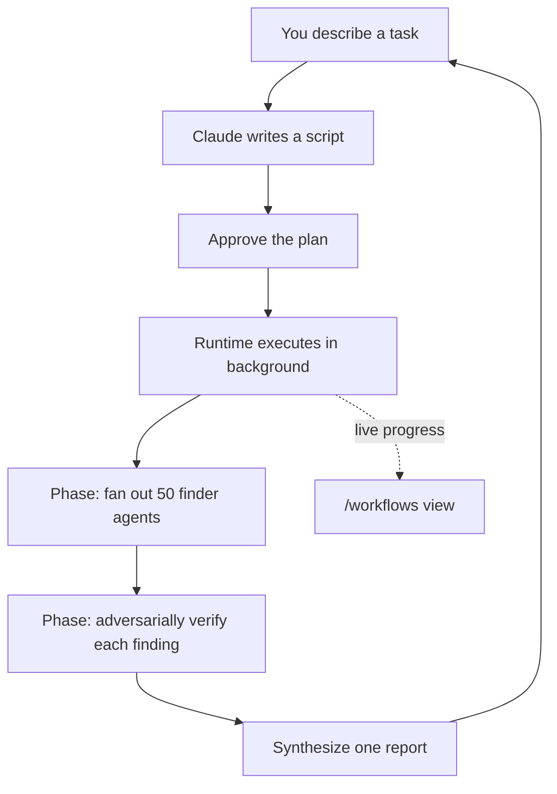

<LevelBadge level="advanced" />

<VerifyNote lastVerified="2026-06-28" source="https://code.claude.com/docs/en/workflows">
I workflow dinamici sono una funzionalità in rapida evoluzione: la parola chiave di attivazione, le opzioni di approvazione, i limiti sugli agent e la disponibilità cambiano tra le release di Claude Code — conferma i dettagli nella documentazione ufficiale. Richiedono Claude Code v2.1.154+ e un piano a pagamento.
</VerifyNote>

<Callout type="objectives" items={["Distinguere un workflow da subagent, skill e team di agent in base a chi detiene il piano", "Vederne uno in 30 secondi con il comando integrato /deep-research", "Avviare il tuo in tre modi: la parola chiave ultracode, /effort ultracode o un comando salvato", "Sapere da cosa ti protegge il prompt di approvazione prima di premere Sì", "Tenere sotto controllo costi ed esecuzioni non presidiate con lo slicing e l'allowlist"]} />

Un **workflow dinamico** è uno script JavaScript che orchestra i [subagent](/docs/claude-code/subagents) su larga scala. Descrivi un task; Claude *scrive lo script*; un runtime lo esegue in background mentre la tua sessione resta reattiva. Mentre un normale task multi-step vive turno per turno nella finestra di contesto di Claude, un workflow sposta il **piano nel codice** — il ciclo, le diramazioni e ogni risultato intermedio vivono in variabili dello script, così il tuo contesto conserva solo la risposta finale.

È proprio questo singolo cambiamento a permettere ai workflow di scalare fino a *decine o centinaia* di agent in una sola esecuzione, dove la delega ordinaria si ferma a una manciata.

## Quando ricorrere a un workflow

Claude Code ti offre quattro modi per eseguire lavori multi-step. La vera domanda è **chi detiene il piano**:

| | [Subagent](/docs/claude-code/subagents) | [Skill](/docs/claude-code/skills) | Team di agent | **Workflow** |
| :-- | :-- | :-- | :-- | :-- |
| Cos'è | Un worker che Claude genera | Istruzioni che Claude segue | Un lead che supervisiona sessioni pari | Uno script che il runtime esegue |
| Chi decide cosa eseguire dopo | Claude, turno per turno | Claude, secondo il prompt | Il lead, turno per turno | **Lo script** |
| Dove vivono i risultati | Finestra di contesto | Finestra di contesto | Una lista di task condivisa | **Variabili dello script** |
| Scala | Pochi per turno | Come i subagent | Una manciata di pari | **Da decine a centinaia** |
| All'interruzione | Riavvia il turno | Riavvia il turno | I teammate continuano a girare | **Riprendibile nella sessione** |

Usa un workflow quando un task richiede **più agent di quanti una sola conversazione possa coordinare**, o quando vuoi l'orchestrazione **codificata in uno script che puoi leggere e rieseguire**. Casi canonici:

- Una **caccia ai bug su tutta la codebase** — diffondi un finder su ogni modulo, poi fai sì che agent indipendenti verifichino in modo avversariale ogni risultato prima che venga segnalato.
- Una **migrazione di 500 file** — un agent per file, ognuno nel proprio worktree, con una fase di verifica.
- Una **domanda di ricerca** dove le fonti devono essere **verificate in modo incrociato l'una contro l'altra**, non solo riassunte.
- Un **piano difficile** che vale la pena redigere da diverse angolazioni indipendenti, poi soppesate l'una contro l'altra prima di impegnarti.

Quest'ultimo punto è quello sottovalutato: un workflow può applicare un *pattern di qualità ripetibile* (revisione avversariale, stesura multi-angolo, verifica a maggioranza), così ottieni un risultato più affidabile di un singolo passaggio — non solo più agent.



## Il modo più rapido per vederne uno: /deep-research

Claude Code include un workflow integrato così non devi scriverne uno per provare il modello. Eseguilo su qualsiasi domanda:

<PromptCard title="Prova un workflow con un solo comando">{`/deep-research What changed in the Node.js permission model between v20 and v22?`}</PromptCard>

Diffonde ricerche web su diverse angolazioni, recupera e **verifica in modo incrociato** le fonti, vota su ogni affermazione e restituisce un **report con citazioni in cui le affermazioni che non hanno superato la verifica incrociata vengono filtrate**. Approva quando richiesto, poi guardalo lavorare con `/workflows`. (Richiede che lo strumento WebSearch sia disponibile.)

## Tre modi per avviare il tuo

**1. Chiedilo in un solo prompt.** Includi la parola chiave `ultracode`, oppure chiedi semplicemente a parole ("usa un workflow", "esegui un workflow"). Claude scrive uno script per quel singolo task senza cambiare il livello di effort della tua sessione:

<PromptCard title="Esegui un task come workflow">{`ultracode: audit every API endpoint under src/routes/ for missing auth checks`}</PromptCard>

La parola chiave viene evidenziata nel tuo input. Non era ciò che intendevi? Premi `Option+W` (macOS) o `Alt+W` (Windows/Linux) per rimuovere l'evidenziazione per quel prompt.

:::note Cronologia della parola chiave
Prima della v2.1.160 la parola di attivazione letterale era `workflow`; è stata rinominata in `ultracode` così che la parola comune "workflow" non innescasse un'esecuzione. Le richieste in linguaggio naturale ("esegui un workflow") funzionano in **entrambe** le versioni.
:::

**2. Lascia decidere a Claude — effort ultracode.** Imposta la sessione su ultracode e Claude pianifica un workflow per *ogni* task sostanziale, decidendo da solo quando ne vale la pena:

<PromptCard title="Attiva l'orchestrazione automatica per la sessione">{`/effort ultracode`}</PromptCard>

Ultracode combina il [reasoning effort](/docs/api/thinking-and-effort) `xhigh` con l'orchestrazione automatica. Una singola richiesta può diventare diversi workflow in successione — uno per comprendere il codice, uno per fare la modifica, uno per verificarla. Ogni task usa quindi più token e impiega più tempo, quindi torna a `/effort high` per il lavoro di routine. Dura solo per la sessione corrente.

**3. Esegui un comando salvato o integrato.** `/deep-research`, o qualsiasi workflow che hai salvato (vedi sotto), appare nell'autocompletamento di `/` come qualsiasi slash command.

## Approva prima dell'esecuzione

I workflow possono generare molti agent, quindi la CLI ti mostra le fasi pianificate e chiede prima:

- **Sì, eseguilo** — avvia l'esecuzione
- **Sì, e non chiedere più per `[name]` in `[path]`** — avvia e salta il prompt per questo workflow in questo progetto
- **Visualizza lo script grezzo** (`Ctrl+G` lo apre nel tuo editor) — leggi prima di decidere
- **No** — annulla (`Tab` ti permette di modificare prima il prompt)

Se ti viene chiesto o meno dipende dalla tua [modalità di permessi](/docs/claude-code/permissions): **Default / accept-edits** chiede a ogni esecuzione (a meno che tu non abbia disattivato il prompt per quel workflow); **Auto** chiede solo al primo avvio; **bypass / `claude -p` / Agent SDK** non chiedono mai — l'esecuzione parte immediatamente.

:::warning I subagent non ereditano la modalità della tua sessione
Qualunque sia la modalità di permessi della tua sessione, gli agent generati da un workflow girano sempre in **`acceptEdits`** ed ereditano la tua [allowlist degli strumenti](/docs/claude-code/permissions) — le modifiche ai file sono approvate automaticamente. Comandi shell, fetch web e strumenti MCP *non* presenti nella tua allowlist possono comunque mettere in pausa l'esecuzione per chiederti conferma. In un'esecuzione lunga e non presidiata, **aggiungi alla tua allowlist i comandi di cui gli agent hanno bisogno prima di avviare** così da non bloccarsi in attesa di te. Vedi [Hardening delle esecuzioni autonome](/docs/security/hardening-autonomous-runs).
:::

## Come viene eseguita un'esecuzione

Il runtime esegue lo script in un **ambiente isolato**, separato dalla tua conversazione — i risultati intermedi restano in variabili dello script, senza mai toccare il contesto di Claude. Lo script stesso **non ha accesso diretto al filesystem o alla shell**: sono gli *agent* a leggere, scrivere ed eseguire comandi; lo script li coordina soltanto.

Ogni esecuzione scrive il proprio script in un file nella directory della tua sessione in `~/.claude/projects/`, e Claude ottiene il percorso. Quindi puoi chiedere a Claude lo script, leggere l'orchestrazione che ha scritto, confrontarlo con un'esecuzione precedente, oppure modificarlo e chiedere a Claude di rilanciare dalla tua versione modificata.

Il runtime applica alcuni limiti così che uno script difettoso non possa andare fuori controllo:

| Vincolo | Perché |
| :-- | :-- |
| Nessun input utente a metà esecuzione (solo i prompt di permesso degli agent la mettono in pausa) | Per l'approvazione tra le fasi, esegui ogni fase come un workflow a sé |
| Lo script non ha accesso diretto a filesystem/shell | Gli agent fanno il lavoro; lo script coordina |
| Fino a **16 agent concorrenti** (meno su macchine con pochi core) | Limita l'uso delle risorse locali |
| **1.000 agent totali** per esecuzione | Previene loop fuori controllo |

## Osserva e gestisci le esecuzioni

Esegui `/workflows` per elencare le esecuzioni in corso e completate, poi selezionane una per aprire la sua vista di avanzamento — ogni fase con il suo conteggio di agent, il totale di token e il tempo trascorso. Approfondisci una fase, poi un agent, per leggerne il prompt, le ultime chiamate agli strumenti e il risultato. Controlli chiave:

| Tasto | Azione |
| :-- | :-- |
| `↑` / `↓` | Seleziona una fase o un agent |
| `Enter` / `→` | Approfondisci; `Esc` torna indietro |
| `f` | Filtra gli agent per stato (v2.1.186+) |
| `p` | Metti in pausa o riprendi l'esecuzione |
| `x` | Ferma l'agent selezionato — o l'intera esecuzione quando il focus è su di essa |
| `r` | Riavvia l'agent in esecuzione selezionato |
| `s` | **Salva** lo script di questa esecuzione come comando |

Un riepilogo di avanzamento su una riga appare anche nel pannello dei task sotto la tua casella di input; premi la freccia giù per portarvi il focus, Enter per espanderlo.

**Riprendere:** ferma un'esecuzione e riprendila più tardi (`p`) — gli agent già terminati restituiscono risultati in cache, gli altri girano dal vivo. La ripresa funziona **all'interno della stessa sessione**; esci da Claude Code a metà esecuzione e la sessione successiva la avvia da capo.

## Salva un workflow per riutilizzarlo

Quando Claude scrive una buona orchestrazione per qualcosa che ripeterai — una revisione che esegui su ogni branch — premi `s` in `/workflows` per salvare lo script di quell'esecuzione. `Tab` alterna la destinazione:

- `.claude/workflows/` nel tuo progetto — condiviso con chiunque cloni il repo
- `~/.claude/workflows/` nella tua home — disponibile ovunque, lo vedi solo tu

Successivamente viene eseguito come `/[name]` nelle sessioni future. Un workflow salvato può ricevere input tramite un global `args`, così lo parametrizzi al momento della chiamata invece di modificare lo script:

```text
> Run /triage-issues on issues 1024, 1025, and 1030
```

Claude passa la lista come dati strutturati, così lo script chiama metodi di array/oggetto su `args` direttamente.

## Attenzione al costo

Un workflow genera molti agent, quindi una singola esecuzione può usare **sensibilmente più token** rispetto a svolgere lo stesso task in conversazione, e conta verso l'utilizzo e i rate limit del tuo piano. Due abitudini mantengono la cosa ragionevole:

- **Fai slicing prima.** Esegui su una sola directory (non l'intero repo) o su una domanda ristretta prima, per valutare la spesa; `/workflows` mostra dal vivo l'uso di token per agent, e puoi fermarti in qualsiasi momento senza perdere il lavoro completato.
- **Dimensiona il modello correttamente.** Ogni agent usa il modello della tua sessione a meno che lo script non instradi una fase altrove. Controlla `/model` prima di un'esecuzione grande, e quando descrivi il task, chiedi a Claude di usare un **modello più piccolo per le fasi che non richiedono il più potente**. Vedi [Costi e latenza](/docs/foundations/cost-and-latency) e [Scegliere un modello](/docs/api/choosing-a-model).

## Errori comuni

- **Aspettarsi un human-in-the-loop a metà esecuzione.** Non c'è input a metà esecuzione. Se un task richiede la tua approvazione tra le fasi, suddividilo in workflow separati.
- **Dimenticare l'allowlist nelle esecuzioni non presidiate.** Un workflow lungo si blocca nel momento in cui un agent incontra un comando shell non presente nell'allowlist. Pre-autorizza ciò di cui gli agent hanno bisogno.
- **Ricorrere a un workflow quando basterebbe un subagent.** Pochi task delegati per turno è ciò per cui esistono i [subagent](/docs/claude-code/subagents). I workflow giustificano il loro overhead su scala di *flotta* o quando vuoi l'orchestrazione salvata come script rieseguibile.
- **Eseguire l'effort ultracode per tutta la sessione per modifiche di routine.** Pianifica un workflow per tutto — ottimo per il lavoro difficile, dispendioso per una correzione di una riga. Torna a `/effort high`.

<Quiz title="Mettiti alla prova" questions={[{q: "Qual è la differenza distintiva tra un workflow e subagent, skill o team di agent?", options: ["Un workflow può generare agent; gli altri no", "Il piano vive in uno script che il runtime esegue, non turno per turno nel contesto di Claude", "I workflow sono gli unici a girare in background"], answer: 1, explain: "Tutti e quattro possono eseguire lavori multi-step. In un workflow il ciclo, le diramazioni e i risultati intermedi vivono in variabili dello script — il contesto di Claude conserva solo la risposta finale — ed è questo a permettergli di scalare fino a decine o centinaia di agent."}, {q: "Esegui un workflow lungo e non presidiato e gli agent hanno bisogno di un comando shell che non è nella tua allowlist. Cosa succede?", options: ["Gli agent lo approvano automaticamente perché girano in acceptEdits", "L'esecuzione si blocca in attesa della tua approvazione", "L'esecuzione salta quel comando e continua"], answer: 1, explain: "Gli agent del workflow girano in acceptEdits quindi le modifiche ai file sono approvate automaticamente, ma comandi shell, fetch web e strumenti MCP non presenti nella tua allowlist mettono comunque in pausa l'esecuzione per chiederti conferma. Pre-autorizza ciò di cui gli agent hanno bisogno prima di un'esecuzione non presidiata."}, {q: "Qual è il modo più economico per valutare quanto costerà un workflow grande prima di impegnarti?", options: ["Leggere prima lo script salvato", "Eseguirlo su una fetta ristretta — una directory o una domanda — e osservare i token per agent in /workflows", "Passare l'intera sessione a un modello più piccolo"], answer: 1, explain: "Fai slicing prima: esegui su una directory o una domanda ristretta, osserva dal vivo l'uso di token per agent in /workflows, e fermati in qualsiasi momento senza perdere il lavoro completato."}]} />

<Callout type="takeaways" items={["Un workflow sposta il piano nel codice — lo script contiene il ciclo e i risultati intermedi, così le esecuzioni scalano fino a decine o centinaia di agent.", "Provane uno all'istante con /deep-research; avvia il tuo con la parola chiave ultracode, /effort ultracode o un /command salvato.", "Il prompt di approvazione esiste perché un'esecuzione può generare molti agent — Default e accept-edits chiedono a ogni esecuzione; Auto chiede una volta; bypass e headless non chiedono mai.", "Gli agent generati girano in acceptEdits con la tua allowlist, quindi pre-autorizza i comandi di cui hanno bisogno prima di un'esecuzione non presidiata.", "I workflow costano sensibilmente più token — fai slicing prima, dimensiona il modello per fase e torna dall'effort ultracode a /effort high per le modifiche di routine."]} />

## Disattivare i workflow

Disattiva i **Workflow dinamici** in `/config`, imposta `"disableWorkflows": true` in `~/.claude/settings.json`, oppure imposta la variabile d'ambiente `CLAUDE_CODE_DISABLE_WORKFLOWS=1`. Le organizzazioni possono disabilitarli nelle [impostazioni gestite](/docs/claude-code/settings). Quando sono disattivati, i comandi di workflow integrati scompaiono e `ultracode` non innesca più un'esecuzione né appare nel menu `/effort`.

## Avanti

- [Subagent e agent paralleli](/docs/claude-code/subagents) — la primitiva worker che i workflow orchestrano
- [Progettare un workflow multi-subagent (walkthrough)](/docs/walkthroughs/multi-subagent-workflow)
- [Harness per agent a lunga esecuzione](/docs/frontiers/long-running-agent-harnesses) — i principi di progettazione dietro le esecuzioni multi-agent durature
- [Hardening delle esecuzioni autonome](/docs/security/hardening-autonomous-runs)
