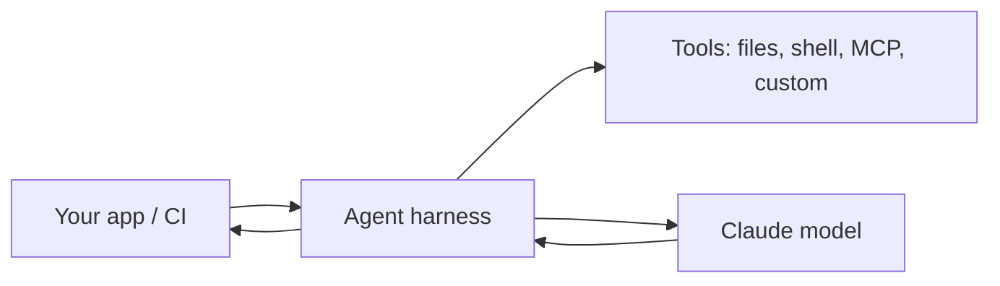

<LevelBadge level="advanced" />

<VerifyNote lastVerified="2026-06-20" source="https://docs.anthropic.com/en/docs/claude-code/sdk">
I nomi degli SDK, dei pacchetti e i flag headless evolvono — verifica nella documentazione ufficiale di Claude Agent SDK / Claude Code.
</VerifyNote>

Claude Code non è solo interattivo. Puoi eseguirlo in modalità **headless** (non interattiva, scriptabile) e puoi costruire i **tuoi agenti** sullo stesso harness sottostante con l'**Agent SDK**.

## Modalità headless

Esegui un singolo prompt in modo non interattivo e cattura l'output — perfetto per script, hook pre-commit e CI:

```bash
claude -p "Review the staged diff and list any bugs as a Markdown checklist"
```

Convoglia l'input in ingresso, ottieni un risultato in uscita. Combinalo con i [permessi](/docs/claude-code/permissions) impostati su una postura sicura e non interattiva, così non resta mai bloccato in attesa di approvazione — e **bloccalo a fondo** così un'esecuzione automatizzata non può toccare i segreti (vedi [Rendere robuste le esecuzioni autonome](/docs/security/hardening-autonomous-runs)).

Un uso classico: un job di CI che fa rivedere a Claude ogni pull request — vedi il [tutorial sulla revisione delle PR](/docs/walkthroughs/pr-review-action).

## L'Agent SDK

Il **Claude Agent SDK** (Python e TypeScript) ti permette di costruire agenti di produzione sullo stesso ciclo che alimenta Claude Code — uso degli strumenti, accesso a file/shell, permessi, gestione del contesto — ma integrato nella *tua* applicazione.



Ricorri a esso quando hai superato la singola chiamata API o un ciclo fatto a mano e vuoi un runtime per agenti completo di tutto. Per lo spettro delle opzioni — singola chiamata → workflow → agente personalizzato → gestito — vedi [Costruire agenti sull'API](/docs/api/building-agents).

## Headless/SDK contro interattivo

| Modalità | Per |
|---|---|
| Claude Code interattivo | Sviluppo quotidiano con un essere umano nel ciclo |
| Headless (`claude -p`) | Script, pre-commit, esecuzioni una tantum in CI |
| Agent SDK | Agenti di produzione integrati nel tuo software |

## Avanti

- [Una GitHub Action che rivede ogni PR (tutorial)](/docs/walkthroughs/pr-review-action)
- [Costruire agenti sull'API](/docs/api/building-agents)
- [Rendere robuste le esecuzioni autonome](/docs/security/hardening-autonomous-runs)
