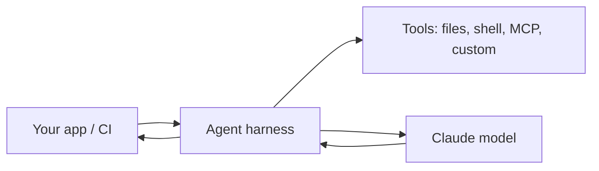

<LevelBadge level="advanced" />

<VerifyNote lastVerified="2026-07-17" source="https://code.claude.com/docs/en/agent-sdk/overview">
I nomi degli SDK, dei pacchetti e i flag headless evolvono — verifica nella documentazione ufficiale di Claude Agent SDK / Claude Code.
</VerifyNote>

Claude Code non è solo interattivo. Puoi eseguirlo in modalità **headless** (non interattiva, scriptabile) e puoi costruire i **tuoi agenti** sullo stesso harness sottostante con l'**Agent SDK**.

<Callout type="objectives" items={["Come eseguire un singolo prompt in modo non interattivo e catturarne l'output","Perché un'esecuzione non presidiata richiede una postura dei permessi deliberata, non quella interattiva predefinita","Quando hai superato la chiamata singola e dovresti passare all'Agent SDK","Le tre modalità a confronto, per scegliere in modo deliberato e non per abitudine"]} />

## Modalità headless

Esegui un singolo prompt in modo non interattivo e cattura l'output — perfetto per script, hook pre-commit e CI:

<PromptCard title="Rivedi il diff in staging da uno script">
{`claude -p "Review the staged diff and list any bugs as a Markdown checklist"`}
</PromptCard>

Convoglia l'input in ingresso, ottieni un risultato in uscita. Combinalo con i [permessi](/docs/claude-code/permissions) impostati su una postura sicura e non interattiva, così non resta mai bloccato in attesa di approvazione — e **bloccalo a fondo** così un'esecuzione automatizzata non può toccare i segreti (vedi [Rendere robuste le esecuzioni autonome](/docs/security/hardening-autonomous-runs)).

<Steps items={[
  {title: "Parti da -p e da un prompt ristretto", body: "Un prompt, una risposta, uscita. Tutto ciò che serve a un'esecuzione headless è un flag, perché non c'è un'interfaccia che ti chieda qualcosa."},
  {title: "Decidi subito la postura dei permessi", body: "Una sessione interattiva chiede a te; un job di CI non ha nessuno a cui chiedere. Imposta regole di autorizzazione esplicite per gli strumenti di cui il compito ha davvero bisogno, e fai in modo che un prompt senza risposta termini l'esecuzione invece di bloccarla."},
  {title: "Metti un limite all'esecuzione", body: "Limita i turni e la spesa, così un ciclo che va storto costa minuti e centesimi invece di ore e dollari."},
  {title: "Chiedi un output strutturato", body: "Uno script che analizza prosa è uno script che si rompe. Richiedi JSON — o uno schema — così il risultato è leggibile dalla macchina fin dall'origine."},
  {title: "Rendi robusto ciò che può raggiungere", body: "Segreti, rete e accesso in scrittura sono le tre cose di cui un'esecuzione non presidiata dovrebbe avere il minimo. Vedi Rendere robuste le esecuzioni autonome."}
]} />

I flag esatti per ogni passaggio — e le insidie che contengono — sono in [La CLI claude: i flag che cambiano i risultati](/docs/claude-code/cli-flags). Un uso classico di tutto questo insieme: un job di CI che fa rivedere a Claude ogni pull request — vedi il [tutorial sulla revisione delle PR](/docs/walkthroughs/pr-review-action).

## L'Agent SDK

Il **Claude Agent SDK** (Python e TypeScript) ti permette di costruire agenti di produzione sullo stesso ciclo che alimenta Claude Code — uso degli strumenti, accesso a file/shell, permessi, gestione del contesto — ma integrato nella *tua* applicazione.

```mermaid
flowchart LR
  A[Your app / CI] --> H[Agent harness]
  H --> T[Tools: files, shell, MCP, custom]
  H --> L[Claude model]
  L --> H --> A
```

Ricorri a esso quando hai superato la singola chiamata API o un ciclo fatto a mano e vuoi un runtime per agenti completo di tutto. Per lo spettro delle opzioni — singola chiamata → workflow → agente personalizzato → gestito — vedi [Costruire agenti sull'API](/docs/api/building-agents).

## Headless/SDK contro interattivo

| Modalità | Per |
|---|---|
| Claude Code interattivo | Sviluppo quotidiano con un essere umano nel ciclo |
| Headless (`claude -p`) | Script, pre-commit, esecuzioni una tantum in CI |
| Agent SDK | Agenti di produzione integrati nel tuo software |

## Verifica te stesso

<Quiz questions={[
  {
    q: "Qual è la differenza fondamentale tra un'esecuzione headless e una sessione interattiva?",
    options: [
      "Headless usa un modello più piccolo",
      "Headless non può usare strumenti",
      "Non c'è nessuno che risponda a un prompt, quindi la postura dei permessi va decisa in anticipo",
      "Le esecuzioni headless saltano CLAUDE.md"
    ],
    answer: 2,
    explain: "L'harness è lo stesso. Cambia che ogni decisione che una sessione interattiva affiderebbe a te va risolta tramite configurazione prima dell'avvio — ed è per questo che un'esecuzione non presidiata richiede impostazioni esplicite di permessi, turni e spesa."
  },
  {
    q: "Hai una chiamata `claude -p` una tantum in CI e ora vuoi la stessa logica integrata nel tuo prodotto, con strumenti personalizzati e una tua gestione dei permessi. Cosa scegli?",
    options: [
      "Un prompt -p più lungo",
      "L'Agent SDK, che espone lo stesso ciclo — uso degli strumenti, accesso a file e shell, permessi, gestione del contesto — dentro la tua applicazione",
      "Una seconda chiamata -p che convoglia l'output nella prima",
      "La Messages API senza ciclo di agente"
    ],
    answer: 1,
    explain: "È esattamente la linea di confine tra i due. Una chiamata -p una tantum è uno script che invoca una CLI; l'Agent SDK ti dà lo stesso harness come runtime da integrare e controllare. Costruire agenti sull'API illustra l'intero spettro."
  }
]} />

<Callout type="takeaways" items={["Headless è lo stesso harness senza l'essere umano — quindi tutto ciò che l'umano avrebbe deciso diventa configurazione.","Restringi i permessi, limita turni e spesa, e chiedi un output strutturato. Tutti e quattro sono flag, non convenzioni.","Passa all'Agent SDK quando vuoi il ciclo dentro la tua applicazione invece di una chiamata CLI da uno script.","Un'esecuzione non presidiata è una postura di sicurezza oltre che una funzionalità: rendi robusto ciò che può raggiungere prima di pianificarla."]} />

## Avanti

- [La CLI claude: i flag che cambiano i risultati](/docs/claude-code/cli-flags) — il contratto a cinque flag per un'esecuzione non presidiata
- [Una GitHub Action che rivede ogni PR (tutorial)](/docs/walkthroughs/pr-review-action)
- [Costruire agenti sull'API](/docs/api/building-agents)
- [Rendere robuste le esecuzioni autonome](/docs/security/hardening-autonomous-runs)
