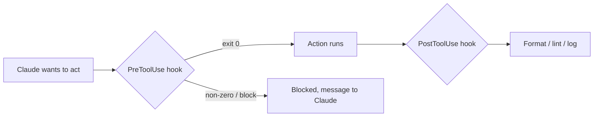

<LevelBadge level="advanced" />

<VerifyNote lastVerified="2026-06-20" source="https://docs.anthropic.com/en/docs/claude-code/hooks">
I nomi esatti degli eventi hook e lo schema di configurazione evolvono — verifica rispetto alla documentazione ufficiale sugli hook prima di affidarti a un evento specifico.
</VerifyNote>

Gli hook sono **comandi shell che Claude Code esegue automaticamente** in punti definiti del suo ciclo di vita. Mentre i [permessi](/docs/claude-code/permissions) decidono *se* un'azione è consentita, gli hook permettono a *te* di eseguire logica deterministica attorno a essa — formattazione, validazione, logging, gate. Sono il modo per rendere un comportamento garantito anziché un "ricordati di".

## Quando ricorrere a un hook

- **Auto-formattazione / lint** dopo ogni modifica di file (`PostToolUse`).
- **Bloccare** un'azione che viola una regola prima che venga eseguita (`PreToolUse`).
- **Notificare o registrare** quando una sessione termina o un'attività si conclude (`Stop`).
- **Iniettare contesto** all'avvio della sessione.

## Come funzionano

Registri gli hook in [`settings.json`](/docs/claude-code/settings), associandoli a un **evento** (e spesso a un matcher di strumento). Quando l'evento si verifica, Claude esegue il tuo comando e ne legge il risultato — un'uscita diversa da zero o un output specifico può **bloccare** l'azione e restituire un messaggio a Claude.

```json
{
  "hooks": {
    "PostToolUse": [
      {
        "matcher": "Edit|Write",
        "hooks": [
          { "type": "command", "command": "npx prettier --write \"$CLAUDE_FILE_PATH\"" }
        ]
      }
    ]
  }
}
```

L'hook riceve il contesto (ad esempio il percorso del file, il nome dello strumento) tramite ambiente/stdin — vedi la documentazione per il payload esatto, che varia in base all'evento.

## Il modello mentale



## Buone pratiche

- **Mantieni gli hook veloci e idempotenti** — vengono eseguiti molto spesso.
- **Segnala forte i problemi reali**, ma non bloccare per questioni estetiche.
- **Tratta l'output dell'hook come feedback per Claude** — un messaggio chiaro lo aiuta a correggersi da solo.
- Gli hook vengono eseguiti con i privilegi della tua shell — rivedi qualsiasi hook che non hai scritto tu ([Revisione del codice di terze parti](/docs/security/reviewing-third-party-code)).

Starter da copia-incolla si trovano in [Ricette per hook e settings.json](/docs/templates/hooks-settings).

## Avanti

- [settings.json](/docs/claude-code/settings) · [Permessi](/docs/claude-code/permissions)
- [Skill](/docs/claude-code/skills) — competenza contro automazione
- [Rendere robuste le esecuzioni autonome](/docs/security/hardening-autonomous-runs)
