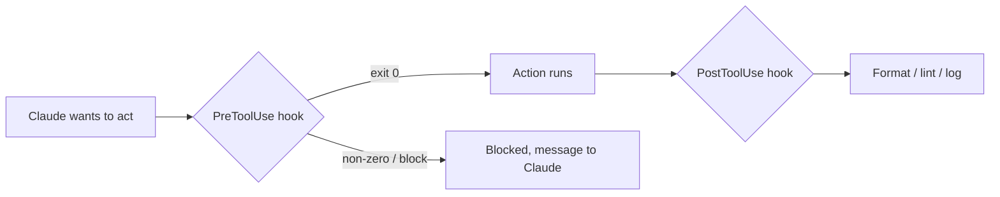

<LevelBadge level="advanced" />

<VerifyNote lastVerified="2026-08-22" source="https://code.claude.com/docs/en/hooks">
Claude Code documenta più di 30 eventi hook raggruppati per fase — l'elenco completo, la grammatica dei matcher per ciascun evento e i campi JSON di output universali sono nel riferimento ufficiale sugli hook. Nomi e forma dei payload evolvono; verifica alla fonte prima di vincolarti a un evento o a un campo specifico.
</VerifyNote>

Gli hook sono **comandi shell che Claude Code esegue automaticamente** in punti definiti del suo ciclo di vita. Mentre i [permessi](/docs/claude-code/permissions) decidono *se* un'azione è consentita, gli hook permettono a *te* di eseguire logica deterministica attorno a essa — formattazione, validazione, logging, gate, oscuramento. Sono il modo per rendere un comportamento garantito anziché un "ricordati di".

<Callout type="objectives" items={["Quando ricorrere a un hook invece che a un'istruzione, a un permesso o a una skill", "Il ciclo di vita completo: eventi di sessione, prompt, tool, subagent, task, compattazione e fine turno", "Come si configura un hook: evento, matcher e il payload JSON su stdin", "I due modi in cui un hook blocca un'azione — exit code 2 contro JSON su stdout", "I campi JSON di output universali condivisi tra gli eventi: continue, additionalContext, systemMessage, reloadSkills, sessionTitle, suppressOutput, updatedInput", "Le buone pratiche e gli errori comuni che distinguono gli hook veloci e sicuri da quelli lenti e silenziosi"]} />

## Quando ricorrere a un hook

Ricorri a un hook quando vuoi che un comportamento sia *garantito*, non semplicemente richiesto. Ogni compito comune si associa a un evento del ciclo di vita:

- **Auto-formattazione / lint** dopo ogni modifica di file (`PostToolUse` su `Edit|Write`).
- **Bloccare** un'azione che viola una regola prima che venga eseguita (`PreToolUse`).
- **Oscurare** il messaggio dell'assistente prima che arrivi al terminale (`MessageDisplay`).
- **Ricaricare le skill** o impostare un **titolo di sessione** dopo un `SessionStart`.
- **Notificare o registrare** quando una sessione termina, un task si conclude o un turno fallisce (`Stop`, `StopFailure`, `SessionEnd`).
- **Iniettare contesto** all'avvio della sessione o quando vengono caricate le istruzioni.

## Come funzionano

Registri gli hook in [`settings.json`](/docs/claude-code/settings), associandoli a un **evento** (e spesso a un matcher — di solito il nome di un tool, a volte un tipo di subagent, un trigger di compattazione o un tipo di notifica). Quando l'evento si verifica, Claude esegue il tuo comando, passando un **payload JSON su stdin** (il nome dell'evento, la sessione e campi specifici dell'evento come il nome del tool e i suoi input). L'exit code e lo stdout del tuo comando decidono cosa succede dopo.

<Steps items={[{title: "Associa un evento", body: "Registra l'hook in settings.json sotto l'evento del ciclo di vita che ti interessa — per esempio PostToolUse per l'automazione dopo un tool, o MessageDisplay per l'oscuramento."}, {title: "Restringi con un matcher", body: "Aggiungi un matcher perché l'hook scatti solo quando è rilevante, es. matcher \"Edit|Write\" per le modifiche ai file, o matcher \"startup|resume\" su SessionStart."}, {title: "Leggi il payload da stdin", body: "Quando l'evento si verifica, Claude esegue il tuo comando e gli invia un payload JSON su stdin — il nome dell'evento, la sessione e i campi specifici dell'evento (tool_name, tool_input, notification, ecc.)."}, {title: "Decidi cosa succede dopo", body: "L'exit code e l'output del tuo comando determinano l'esito: lasciar proseguire l'azione, eseguire la tua logica, bloccarla, oppure restituire JSON strutturato per cambiare ciò che Claude vede."}]} />

```json
{
  "hooks": {
    "PostToolUse": [
      {
        "matcher": "Edit|Write",
        "hooks": [
          { "type": "command", "command": "jq -r '.tool_input.file_path' | xargs npx prettier --write" }
        ]
      }
    ]
  }
}
```

L'hook qui sopra legge il percorso del file modificato dal JSON su stdin (`.tool_input.file_path`) e lo formatta. Non dare per scontato che una variabile d'ambiente contenga il percorso — **leggilo da stdin.** Segnaposto di percorso utili come `${CLAUDE_PROJECT_DIR}` *sono* invece disponibili per localizzare gli script.

## Il ciclo di vita a colpo d'occhio

Gli hook di Claude Code coprono l'intera sessione, non solo le chiamate ai tool. Raggruppali per fase così sai dove agganciare la tua logica.

| Fase | Eventi | Uso tipico |
| --- | --- | --- |
| **Sessione** | `SessionStart`, `SessionEnd`, `Setup`, `InstructionsLoaded`, `ConfigChange`, `CwdChanged`, `DirectoryAdded`, `FileChanged` | Iniettare contesto all'avvio, fare uno snapshot alla fine, reagire a un ricaricamento di `CLAUDE.md` o a una modifica di `.env` su disco |
| **Prompt** | `UserPromptSubmit`, `UserPromptExpansion` | Filtrare o riscrivere il prompt prima che Claude lo veda |
| **Tool** | `PreToolUse`, `PermissionRequest`, `PermissionDenied`, `PostToolUse`, `PostToolUseFailure`, `PostToolBatch` | Consentire/negare un'azione, escalare a una persona, formattare dopo le modifiche, riprovare dopo un rifiuto in modalità automatica |
| **Subagent** | `SubagentStart`, `SubagentStop` | Registrare avvio/arresto, impedire a un subagent di restituire un risultato |
| **Task** | `TaskCreated`, `TaskCompleted` | Annullare un task creato per sbaglio, mettere un gate sul completamento |
| **Compattazione** | `PreCompact`, `PostCompact` | Fare uno snapshot del transcript prima della compattazione, verificare dopo |
| **Turno** | `Stop`, `StopFailure`, `Notification`, `MessageDisplay` | Notificare al completamento, allertare su un errore dell'API, oscurare il testo mostrato |
| **Team + MCP** | `TeammateIdle`, `Elicitation`, `ElicitationResult`, `WorktreeCreate`, `WorktreeRemove` | Coordinamento tra sessioni, gate sulle elicitation MCP, wrapping delle operazioni sui worktree |

I campi esatti su stdin, la grammatica dei matcher e le regole di blocco di ogni evento sono nel [riferimento ufficiale sugli hook](https://code.claude.com/docs/en/hooks). Il catalogo qui sopra è la mappa; il riferimento è il territorio.

## Come blocca un hook

Due modi, a seconda dell'evento:

- **Exit code 2** — l'hook fa fallire l'azione e tutto ciò che ha scritto su **stderr** diventa il messaggio che Claude vede. Semplice, e funziona per gli hook di tipo command sugli eventi bloccanti (`PreToolUse`, `UserPromptSubmit`, `PreCompact`, `SubagentStop`, `Stop`, `TaskCreated`, `TaskCompleted`, `TeammateIdle`, `Elicitation`).
- **JSON su stdout (exit 0)** — restituisci una decisione strutturata. Per `PreToolUse` si tratta di un `permissionDecision` con valore `"allow"`, `"deny"` o `"escalate"` più un `permissionDecisionReason`. Gli eventi non bloccanti (`PostToolUse`, `Notification`, `MessageDisplay`, `StopFailure`, la maggior parte degli eventi di sessione) ignorano i tentativi di blocco — ma il loro output JSON può comunque orientare ciò che Claude vede dopo.

Lo script qui sotto è un hook `PreToolUse` sul tool Bash. Leggilo dall'alto verso il basso: estrae il comando da stdin e, se sembra distruttivo, scrive una motivazione su stderr ed esce con 2 per bloccare.

```bash
#!/usr/bin/env bash
# PreToolUse hook on the Bash tool: refuse to delete things.
command=$(jq -r '.tool_input.command' < /dev/stdin)
if [[ "$command" == rm\ * || "$command" == *"rm -rf"* ]]; then
  echo "Blocked: destructive 'rm' is not allowed by policy." >&2
  exit 2
fi
exit 0
```

## Campi JSON di output universali

La maggior parte degli eventi accetta su stdout un oggetto JSON strutturato che orienta ciò che succede dopo — distinto dai campi di decisione specifici dell'evento come `permissionDecision`. I più utili:

| Campo | Cosa fa | Dove funziona |
| --- | --- | --- |
| **`continue`** | Se `false`, Claude interrompe completamente l'elaborazione — ha la precedenza su qualsiasi decisione specifica dell'evento | Quasi tutti gli eventi |
| **`systemMessage`** | Aggiunge un messaggio al contesto / transcript di Claude, così vede perché sei intervenuto | Quasi tutti gli eventi bloccanti |
| **`additionalContext`** | Inietta contesto aggiuntivo che Claude può leggere e usare al turno successivo | `SessionStart`, `UserPromptSubmit`, altri |
| **`reloadSkills`** | Riscansiona le directory delle skill così una sessione recepisce una skill appena scritta | `SessionStart` (e altri eventi di sessione) |
| **`sessionTitle`** | Imposta il titolo della sessione nell'interfaccia — sotto `hookSpecificOutput` su `SessionStart` | `SessionStart` |
| **`suppressOutput`** | Nasconde a Claude l'output del tool (utile per comandi rumorosi) | Eventi dei tool |
| **`updatedInput`** | Riscrive l'input del tool prima che venga eseguito (es. aggiungere un flag `--dry-run`) | `PreToolUse` |
| **`terminalSequence`** | Emette sequenze di escape del terminale — bell, titolo della finestra, badge di notifica | `Notification`, `StopFailure`, altri |

I campi di decisione specifici dell'evento — `permissionDecision` (`"allow" \| "deny" \| "escalate"` + `permissionDecisionReason`) su `PreToolUse` e `PermissionRequest`, e `retry: true` su `PermissionDenied` per lasciare che Claude ritenti la chiamata negata — si sovrappongono a quelli universali.

## Il modello mentale

Un hook `PreToolUse` viene eseguito *prima* dell'azione e può bloccarla; un hook `PostToolUse` viene eseguito *dopo* che è riuscita e reagisce al risultato.


```mermaid
flowchart LR
  A[Claude wants to act] --> B{PreToolUse hook}
  B -->|exit 0| C[Action runs]
  B -->|non-zero / block| X[Blocked, message to Claude]
  C --> D{PostToolUse hook}
  D --> E[Format / lint / log]
```

<Flashcards title="Gli eventi hook a colpo d'occhio" cards={[{front: "PreToolUse", back: "Scatta prima che un'azione venga eseguita. Usalo per bloccare o filtrare — ad es. rifiutare un comando distruttivo prima che venga eseguito. Campo di decisione: permissionDecision."}, {front: "PostToolUse", back: "Scatta dopo un'azione corrispondente. Usalo per formattare, fare lint o registrare ciò che è appena cambiato. Non bloccante."}, {front: "MessageDisplay", back: "Scatta mentre il testo del messaggio dell'assistente viene mostrato. Usalo per oscurare segreti o dati personali nel terminale — agisce solo sulla visualizzazione, non può bloccare."}, {front: "SessionStart", back: "Scatta all'inizio (o alla ripresa) di una sessione. Usalo per iniettare contesto tramite additionalContext, per fare reloadSkills dopo l'arrivo di una nuova skill, o per impostare sessionTitle."}, {front: "Stop / StopFailure", back: "Stop scatta quando Claude conclude un turno senza errori; StopFailure scatta quando il turno è finito su un errore dell'API (rate_limit, overloaded, auth, ecc.). Notifica o riprova automaticamente sulla variante di fallimento."}, {front: "PreCompact / PostCompact", back: "Scattano attorno alla compattazione del contesto. PreCompact può bloccare (exit 2) o fare prima uno snapshot del transcript; PostCompact reagisce allo stato compattato."}]} />

## Buone pratiche

- **Mantieni gli hook veloci e idempotenti** — vengono eseguiti molto spesso. Gli hook `SessionEnd` condividono un unico budget di 1,5 secondi tra tutti, quindi tieni al minimo il lavoro di fine sessione.
- **Fai rumore sui problemi reali**, ma non bloccare per questioni cosmetiche.
- **Considera l'output dell'hook come feedback per Claude** — un messaggio chiaro su stderr (exit 2) o in `systemMessage` (JSON) lo aiuta a correggersi da solo.
- **Preferisci l'output JSON agli exit code** quando vuoi dire più di "bloccato" — `permissionDecision: "escalate"` su `PreToolUse` porta la decisione a una persona senza sbattere la porta, e `additionalContext` ti permette di *orientare* invece di limitarti a rifiutare.
- Gli hook vengono eseguiti con i privilegi della tua shell — rivedi qualsiasi hook che non hai scritto tu ([Revisione del codice di terze parti](/docs/security/reviewing-third-party-code)).

## Errori comuni

- **Leggere il percorso del file da una variabile d'ambiente.** Il percorso sta nel JSON su stdin (`.tool_input.file_path`), non in `$CLAUDE_FILE_PATH`. Passa stdin attraverso `jq`.
- **Blocchi silenziosi.** Se un hook `PreToolUse` esce con 2 senza scrivere nulla su stderr, Claude è bloccato ma non sa *perché* e non può adattarsi. Scrivi sempre una motivazione chiara (o usa `permissionDecisionReason`).
- **Provare a bloccare un evento non bloccante.** `PostToolUse` scatta *dopo* che il tool è stato eseguito — un exit 2 mette solo un messaggio all'orecchio di Claude, non può annullare l'azione. Se ti serve un gate, aggancia `PreToolUse`.
- **Hook lenti.** Un hook `PostToolUse` viene eseguito dopo *ogni* modifica corrispondente. Un linter da 3 secondi rende l'intera sessione lenta — tieni gli hook veloci e, idealmente, fa' agire solo su ciò che è cambiato.
- **Matcher troppo ampi.** `matcher: ".*"` scatta su ogni tool. Restringi con un nome esatto, con un elenco `Edit|Write`, oppure con il campo `if` per singolo handler (es. `"if": "Bash(git push *)"`).
- **Dimenticare che i matcher esistono anche per gli eventi non legati ai tool.** `SessionStart` corrisponde a `startup|resume|clear|compact|fork`; `Notification` corrisponde a tipi come `permission_prompt|idle_prompt|agent_completed`; `PreCompact` corrisponde a `manual|auto`. Un singolo hook agganciato al sottoinsieme sbagliato scatta troppo spesso o mai.
- **Fidarsi di hook che non hai scritto.** Un hook esegue shell arbitraria con i tuoi privilegi. Rivedi prima qualsiasi hook proveniente da un plugin o da un template — vedi [Revisione del codice di terze parti](/docs/security/reviewing-third-party-code).

<Callout type="warning" items={["Un hook esegue shell arbitraria con i tuoi privilegi — non configurare mai un hook preso da un plugin o da un template senza averlo prima letto."]} />

## Ricette da rubare

Gli starter da copiare e incollare sono in [Ricette per gli hook e settings.json](/docs/templates/hooks-settings). Qualche esempio di alto impatto per vedere la forma degli eventi più recenti:

<PromptCard title="Formattare automaticamente i file modificati (PostToolUse su Edit|Write)">{`{
  "hooks": {
    "PostToolUse": [
      {
        "matcher": "Edit|Write",
        "hooks": [
          { "type": "command", "command": "jq -r '.tool_input.file_path' | xargs npx prettier --write" }
        ]
      }
    ]
  }
}`}</PromptCard>

<PromptCard title="Impostare un titolo di sessione per progetto all'avvio (SessionStart)">{`{
  "hooks": {
    "SessionStart": [
      {
        "matcher": "startup|resume",
        "hooks": [
          {
            "type": "command",
            "command": "jq -nc --arg t \\"$(basename \\"$PWD\\") — $(git rev-parse --abbrev-ref HEAD 2>/dev/null || echo detached)\\" '{hookSpecificOutput:{sessionTitle:$t}}'"
          }
        ]
      }
    ]
  }
}`}</PromptCard>

<PromptCard title="Ricaricare le skill dopo un SessionStart (recepisce una skill appena scritta)">{`{
  "hooks": {
    "SessionStart": [
      {
        "matcher": "startup|resume",
        "hooks": [
          { "type": "command", "command": "printf '{\\"reloadSkills\\": true}\\n'" }
        ]
      }
    ]
  }
}`}</PromptCard>

<PromptCard title="Oscurare le API key dal testo dell'assistente mostrato (MessageDisplay)">{`{
  "hooks": {
    "MessageDisplay": [
      {
        "hooks": [
          {
            "type": "command",
            "command": "jq -r '.message.content' | sed -E 's/(sk-[A-Za-z0-9_-]{20,})/sk-***REDACTED***/g'"
          }
        ]
      }
    ]
  }
}`}</PromptCard>

<PromptCard title="Notificare al fallimento di un turno (StopFailure — rate limit, overload, auth)">{`{
  "hooks": {
    "StopFailure": [
      {
        "matcher": "rate_limit|overloaded|authentication_failed|billing_error",
        "hooks": [
          { "type": "command", "command": "osascript -e 'display notification \\"Claude Code turn failed — check the terminal\\" with title \\"Claude Code\\"'" }
        ]
      }
    ]
  }
}`}</PromptCard>

<Quiz title="Mettiti alla prova" questions={[{q: "Dove trova un hook il percorso del file appena modificato?", options: ["Nella variabile d'ambiente $CLAUDE_FILE_PATH", "Nel payload JSON su stdin, in .tool_input.file_path", "In un argomento a riga di comando passato da Claude"], answer: 1, explain: "Il percorso sta nel JSON su stdin (.tool_input.file_path), non in una variabile d'ambiente. Passa stdin attraverso jq per leggerlo."}, {q: "Un hook PreToolUse esce con codice 2. Cosa succede?", options: ["L'azione è consentita e stdout viene registrato", "L'azione viene bloccata e tutto ciò che l'hook ha scritto su stderr diventa il messaggio che Claude vede", "Claude ignora il risultato perché l'exit 2 è riservato"], answer: 1, explain: "L'exit code 2 fa fallire l'azione; stderr diventa il messaggio che Claude vede. Scrivi sempre una motivazione chiara così Claude può adattarsi."}, {q: "Vuoi che una sessione recepisca una skill che hai appena aggiunto a .claude/skills/ senza riavviare. Quale campo di output, su quale evento?", options: ["reloadSkills: true su SessionStart", "restart: true su Stop", "refresh: true su PostToolUse"], answer: 0, explain: "Emettere {\"reloadSkills\": true} da un hook SessionStart riscansiona le directory delle skill così la sessione corrente recepisce le skill nuove o modificate."}, {q: "Vuoi oscurare i segreti dal testo di Claude prima che appaia sullo schermo dell'utente. Quale evento?", options: ["PreToolUse", "PostToolUse", "MessageDisplay"], answer: 2, explain: "MessageDisplay scatta mentre il testo del messaggio dell'assistente viene mostrato — il punto giusto per trasformare o oscurare il testo lungo la strada verso il terminale. Non può bloccare."}]} />

<Callout type="takeaways" items={["Gli hook rendono un comportamento garantito, non richiesto — logica deterministica attorno ad azioni che i permessi possono solo consentire o negare.", "Il ciclo di vita copre più di 30 eventi tra le fasi di sessione, prompt, tool, subagent, task, compattazione e turno — scegli la fase giusta prima di scrivere lo script.", "Registrali in settings.json su un evento più un matcher; Claude invia un payload JSON su stdin e legge il tuo exit code e il tuo output.", "Leggi il percorso del file da stdin (.tool_input.file_path) — non da una variabile d'ambiente.", "Blocca con l'exit code 2 (stderr diventa il messaggio) oppure con JSON strutturato su stdout (permissionDecision sugli eventi dei tool, {continue: false} per fermare tutto).", "I campi di output universali — additionalContext, systemMessage, reloadSkills, sessionTitle, suppressOutput, updatedInput — ti permettono di orientare Claude invece di limitarti a consentire o rifiutare.", "Tieni gli hook veloci, idempotenti e con matcher stretti — e rivedi qualsiasi hook che non hai scritto tu, perché viene eseguito con i privilegi della tua shell."]} />

## Prossimi passi

- [settings.json](/docs/claude-code/settings) · [Permessi](/docs/claude-code/permissions)
- [Skill](/docs/claude-code/skills) — competenza contro automazione
- [Irrobustire le esecuzioni autonome](/docs/security/hardening-autonomous-runs)
