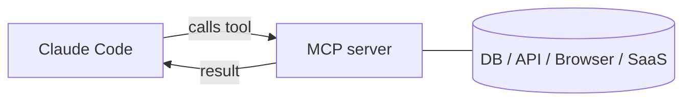

<LevelBadge level="advanced" />

<VerifyNote lastVerified="2026-06-23" source="https://code.claude.com/docs/en/mcp">
I comandi `claude mcp`, gli scope di configurazione e i trasporti evolvono nel tempo — verifica nella documentazione ufficiale di Claude Code MCP e su modelcontextprotocol.io.
</VerifyNote>

Il **Model Context Protocol (MCP)** è uno standard aperto per collegare l'AI a strumenti e dati esterni. Un **server MCP** espone funzionalità (interrogare un database, aprire una PR su GitHub, pilotare un browser); Claude Code si connette a esso e può **chiamare quegli strumenti** durante una sessione. È così che estendi Claude oltre il tuo filesystem e la tua shell.

## Come è strutturato



Dichiari i server che Claude può usare; ogni server pubblica un insieme di strumenti con i relativi schemi; Claude li sceglie e li chiama come qualsiasi altro strumento.

## Trasporti

- **stdio** — un processo locale che Claude avvia (ottimo per strumenti/CLI locali).
- **Remoto (HTTP/SSE)** — un server in hosting, spesso con OAuth.

## Configurare i server

Il percorso più veloce è il comando `claude mcp add` — scrive la configurazione al posto tuo:

```bash
# A local stdio server (everything after -- is the launch command)
claude mcp add github -- npx -y @modelcontextprotocol/server-github

# A remote HTTP server, shared with everyone on the project
claude mcp add --transport http --scope project linear https://mcp.linear.app/mcp
```

Sotto il cofano è solo JSON. Un server con scope **project** finisce in un `.mcp.json` nella radice del repo — committalo e tutto il tuo team ottiene gli stessi strumenti:

```json
{
  "mcpServers": {
    "github": { "command": "npx", "args": ["-y", "@modelcontextprotocol/server-github"] }
  }
}
```

**Lo scope decide chi vede il server:**

| Scope | Risiede in | Da usare per |
|---|---|---|
| `local` (predefinito) | le tue impostazioni utente, solo questo progetto | esperimenti personali, segreti |
| `project` | `.mcp.json` nel repo (committato) | strumenti che tutto il team dovrebbe condividere |
| `user` | le tue impostazioni utente, tutti i progetti | server che vuoi ovunque |

Esegui `claude mcp list` per vedere cosa è connesso e `/mcp` all'interno di una sessione per ispezionare gli strumenti e autenticarti ai server remoti. Vedi [Configurazione MCP e scaffold di server](/docs/templates/mcp-config) per dei punti di partenza copia-incolla.

## Esempio pratico: dai a Claude il tuo database

Supponi di voler far rispondere a Claude alle domande interrogando un Postgres locale invece di incollare tu i risultati delle query. Aggiungi il server (scope project, così i compagni di team lo ereditano):

```bash
claude mcp add --scope project db -- npx -y @modelcontextprotocol/server-postgres "postgresql://localhost/app"
```

Ora in una sessione puoi chiedere: *"How many users signed up last week? Check the DB."* Claude chiama lo strumento `query` del server, ottiene le righe e risponde — niente ciclo di copia-incolla. Poiché ha scope project, un compagno di team che fa il pull del repo ottiene la stessa capacità nel momento in cui apre Claude Code. Mantieni la stringa di connessione in sola lettura se vuoi solo letture.

## Fiducia e sicurezza

:::warning Tratta i server MCP come l'installazione di software
Un server MCP esegue codice e può leggere dati e compiere azioni. Connetti solo server di cui ti fidi, dai loro il **privilegio minimo** necessario, e ricorda che qualsiasi contenuto esterno che restituiscono può veicolare [prompt injection](/docs/security/prompt-injection). Esamina prima i server di terze parti — vedi [Esaminare il codice di terze parti](/docs/security/reviewing-third-party-code).
:::

## MCP anche nelle app

MCP alimenta anche i **Connettori** nelle app di Claude — stesso standard, superficie diversa. Vedi [Connettori (MCP) nelle app](/docs/claude-app/connectors) e, per l'API, [MCP e connessione agli strumenti](/docs/api/mcp).

## Errori comuni

- **Scope sbagliato.** Un server aggiunto con scope `local` non comparirà per i compagni di team; uno che volevi solo per te non dovrebbe essere committato con scope `project`. Scegli con cura.
- **Troppi server, troppi strumenti.** Ogni server connesso aggiunge i propri schemi di strumenti al contesto. Connetti ciò che serve al task, non l'intero catalogo.
- **Connessioni con privilegi eccessivi.** Dai a un server di database un ruolo in sola lettura a meno che Claude non abbia davvero bisogno di scrivere. MCP rende reali le capacità — riducile allo stretto necessario.
- **Dimenticare il rischio di injection.** Tutto ciò che un server restituisce (una pagina web, il corpo di una issue, una riga) è testo non attendibile che può veicolare [prompt injection](/docs/security/prompt-injection). Non collegare un potente server con capacità di scrittura accanto a uno non attendibile con capacità di lettura senza averci riflettuto bene.

## Prossimi passi

- [Costruisci e collega il tuo primo server MCP (guida passo passo)](/docs/walkthroughs/first-mcp-server)
- [Configurazione MCP e scaffold di server](/docs/templates/mcp-config)
- [Mettere in sicurezza agenti e strumenti](/docs/security/securing-agents)
