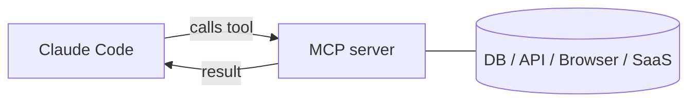

<LevelBadge level="advanced" />

<VerifyNote lastVerified="2026-06-20" source="https://code.claude.com/docs/en/mcp">
La sintassi di configurazione, gli scope e i transport MCP evolvono — verifica nella documentazione ufficiale MCP di Claude Code e su modelcontextprotocol.io.
</VerifyNote>

Il **Model Context Protocol (MCP)** è uno standard aperto per connettere l'AI a strumenti e dati esterni. Un **server MCP** espone capacità (interrogare un database, aprire una PR su GitHub, pilotare un browser); Claude Code si connette a esso e può **chiamare quegli strumenti** durante una sessione. È così che estendi Claude oltre il tuo filesystem e la tua shell.

## La sua forma



Dichiari i server che Claude può usare; ogni server pubblica un insieme di strumenti con i loro schema; Claude li sceglie e li chiama come qualsiasi altro strumento.

## Transport

- **stdio** — un processo locale che Claude avvia (ottimo per strumenti/CLI locali).
- **Remoto (HTTP/SSE)** — un server ospitato, spesso con OAuth.

## Configurazione dei server

I server vengono configurati (comunemente in un `.mcp.json` e/o tramite le impostazioni) con un comando/URL ed eventuale autenticazione. Gli scope controllano dove un server è disponibile (solo per te, oppure condiviso con il progetto). Vedi [Configurazione MCP e scaffold dei server](/docs/templates/mcp-config) per starter da copia-incolla.

```json
{
  "mcpServers": {
    "github": { "command": "npx", "args": ["-y", "@modelcontextprotocol/server-github"] }
  }
}
```

## Fiducia e sicurezza

:::warning Tratta i server MCP come installazione di software
Un server MCP esegue codice e può leggere dati e compiere azioni. Connetti solo server di cui ti fidi, concedi loro il **minimo privilegio** necessario e ricorda che qualsiasi contenuto esterno che restituiscono può veicolare [prompt injection](/docs/security/prompt-injection). Rivedi prima i server di terze parti — vedi [Revisione del codice di terze parti](/docs/security/reviewing-third-party-code).
:::

## MCP anche nelle app

MCP alimenta anche i **Connettori** nelle app di Claude — stesso standard, superficie diversa. Vedi [Connettori (MCP) nelle app](/docs/claude-app/connectors) e, per l'API, [MCP e connessione agli strumenti](/docs/api/mcp).

## Avanti

- [Costruisci e collega il tuo primo server MCP (tutorial)](/docs/walkthroughs/first-mcp-server)
- [Configurazione MCP e scaffold dei server](/docs/templates/mcp-config)
- [Mettere in sicurezza agenti e strumenti](/docs/security/securing-agents)
