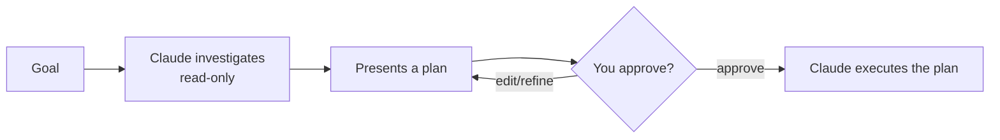

<LevelBadge level="beginner" />

<VerifyNote lastVerified="2026-06-20" source="https://docs.anthropic.com/en/docs/claude-code">
Il modo in cui entri in Modalità Piano (scorciatoia/flag) può cambiare tra le release — controlla la documentazione ufficiale di Claude Code.
</VerifyNote>

La **Modalità Piano** rende Claude Code **in sola lettura**: può esplorare il tuo codebase, eseguire ricerche e ragionare — ma **non modificherà i file né eseguirà comandi che alterano lo stato**. Produce invece un piano e attende la tua approvazione.

## Perché è il modo più sicuro per iniziare

Per qualsiasi cosa grande, rischiosa o sconosciuta, vuoi vedere *cosa* Claude intende fare prima che tocchi il tuo repository. La Modalità Piano separa il **pensare** dal **fare**:

Cogli le assunzioni sbagliate *prima* che diventino codice sbagliato.

## Quando usarla

- **Sempre** per cambiamenti grandi o su più file, migrazioni o refactoring.
- Quando lavori in un codebase che non conosci ancora del tutto.
- Quando vuoi un piano revisionabile da condividere con un collega.

Per modifiche minuscole e ovvie puoi saltarla — ma nel dubbio, pianifica prima.

## Come funziona in pratica

1. Entra in Modalità Piano e dichiara il tuo obiettivo.
2. Claude legge i file pertinenti e pone domande di chiarimento.
3. Restituisce un piano passo passo: i file da cambiare, l'approccio e come verificare.
4. Tu approvi (o affini). Solo allora passa a effettuare le modifiche.

:::tip Abbinala a CLAUDE.md
Un buon [CLAUDE.md](/docs/claude-code/claude-md) rende i piani più affilati — Claude pianifica avendo già a mente le tue convenzioni e protezioni.
:::

## Modalità Piano contro permessi

Risolvono problemi diversi e lavorano insieme:

- **Modalità Piano** = "investiga e proponi, non agire ancora". (Questa pagina.)
- **[Permessi](/docs/claude-code/permissions)** = una volta in azione, *quali* azioni sono consentite senza chiedere.

## Avanti

- [Permessi e modalità dei permessi](/docs/claude-code/permissions)
- [Gestione del contesto](/docs/claude-code/context-management) — mantieni efficaci le sessioni lunghe
- [Tutorial: personalizza Claude Code per un repository reale](/docs/walkthroughs/customize-claude-code)
