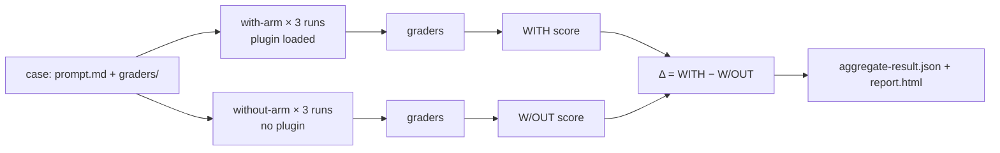

<LevelBadge level="advanced" />

<VerifyNote lastVerified="2026-09-14" source="https://code.claude.com/docs/en/plugin-evals">
`claude plugin eval` è arrivato in Claude Code **v2.1.269 (11 settembre 2026)** ed è documentato come funzionalità giovane: lo schema dei casi è `1.1`, il risultato JSON è `schemaVersion: 1`, e Anthropic può disattivare il comando lato server ("plugin eval is currently unavailable"). Default, flag e semantica dei grader riportati qui sotto vengono dalla pagina ufficiale alla data indicata; ricontrolla prima di collegare un gate CI rigido.
</VerifyNote>

<Callout type="objectives" items={[
  "Capire cosa misura un eval di plugin che `claude plugin validate` e un test manuale non possono misurare: la skill *si attiva*, e batte un modello senza plugin?",
  "Leggere i tre numeri di ogni risultato — WITH, W/OUT e Δ — e sapere perché alcuni grader sono deliberatamente esclusi dal punteggio",
  "Scegliere tra i sei tipi di grader (quattro gratuiti, due basati su un giudice) e scrivere rubriche che diano un segnale stabile",
  "Mockare i server MCP di un plugin perché una suite sia ripetibile e non tocchi mai il servizio reale",
  "Collegare un gate CI con modelli fissati, un tetto di costo e il contratto sugli exit code"
]} />

Finora l'autore di un plugin aveva due strumenti: `claude plugin validate`, che controlla che manifest e frontmatter vengano parsati, e i propri occhi. Nessuno dei due risponde alla domanda che decide se un plugin vale la pena di essere installato: **quando un utente scrive una richiesta naturale, Claude sceglie la skill, e il risultato è migliore di quello che Claude avrebbe prodotto comunque?** `claude plugin eval` risponde esattamente a questo. Esegue ogni caso in una sessione usa e getta con solo il tuo plugin caricato, lo esegue di nuovo senza alcun plugin, valuta entrambe le esecuzioni e riporta la differenza.

Questa pagina è per chi ha già un [plugin](/docs/claude-code/plugins-marketplaces) o una [skill](/docs/claude-code/skills) funzionante. Se ti serve solo il concetto, leggi le prime due sezioni e il quiz.

## Il modello mentale: due bracci e un delta

Ogni caso è un **prompt** più uno o più **grader**. Un grader è un controllo pass/fail su ciò che Claude ha prodotto. Per ogni caso Claude Code esegue:

- il **braccio with**: una sessione headless nuova con solo il tuo plugin caricato, il prompt inviato, Claude libero di lavorare finché non finisce o raggiunge il limite di turni/tempo, poi i grader applicati;
- il **braccio without**: lo stesso prompt, lo stesso numero di run, nessun plugin.

Ogni braccio esegue il caso **tre volte di default**, perché una singola esecuzione di un agente non deterministico dice quasi niente. Il punteggio di un run è la frazione di grader superati (pesata, se imposti dei pesi). Il punteggio del caso è la media tra i run. Ottieni:

| Colonna | Significato |
|---|---|
| `WITH` | Punteggio medio con il plugin caricato |
| `W/OUT` | Punteggio medio senza plugin |
| `Δ` | `WITH − W/OUT` — quello che il plugin ha contribuito davvero |

La parte non ovvia: **un punteggio `WITH` alto da solo non prova nulla.** Se un caso ottiene 1.0 in entrambi i bracci, Claude l'ha risolto senza di te, e il tuo plugin è peso morto per quel prompt. Il Δ è il numero che giustifica l'esistenza di un plugin. La documentazione di Anthropic nomina la scoperta iniziale più comune: un Δ vicino a zero *insieme* a un grader skill-fired che fallisce, il che significa che Claude non ha mai scelto la tua skill con una formulazione naturale. È un problema di `description` in `SKILL.md`, non un problema di codice, e nessuna quantità di test manuali in cui invochi la skill per nome l'avrebbe individuato.



### Perché alcuni grader sono esclusi dal punteggio

Un controllo come "il tool `Skill` è stato invocato" non può mai passare nel braccio without. Se contasse, trascinerebbe `W/OUT` verso zero e gonfierebbe il Δ gratis. Perciò in un run a due bracci Claude Code **esclude dal punteggio, in entrambi i bracci**, ogni grader `tool_used` il cui `tool` è `Skill`, più tutto ciò che marchi con `arm: with-only`. Compaiono comunque nel report come indicatori pass/fail (il report li etichetta come "plugin-fired indicator"), e il JSON li marca `scored: false`. Ne seguono due regole limite:

- Se *tutti* i grader di un caso verrebbero esclusi, vengono invece valutati normalmente, altrimenti non resterebbe nulla da valutare.
- `arm: both` forza un grader a contare in entrambi i bracci. È quello che vuoi per un controllo "**non** deve invocare la skill" su un prompt esca, scritto come `tool_used` con `min: 0` e `max: 0`.

Conseguenza da ricordare: la stessa suite può riportare un **punteggio assoluto diverso** con `--ablation none` (braccio singolo, niente escluso) rispetto alla modalità a due bracci di default. Confronta grandezze omogenee quando tracci i trend.

## Anatomia di un caso

Una suite vive in `evals/` dentro il plugin (o in un'altra directory che indichi tu). Ogni caso è una cartella che contiene un `prompt.md`, un `case.yaml`, o entrambi, più una cartella `graders/` con un file Markdown per grader.

```text
my-plugin/
├── .claude-plugin/plugin.json
├── skills/...
└── evals/
    ├── drafts-commit-message/
    │   ├── prompt.md            # frontmatter: run limits; body: the user's request
    │   └── graders/
    │       ├── criteria.md      # type: llm — rubric in the body
    │       └── skill-fired.md   # type: tool_used, tool: Skill
    ├── ignores-unrelated-request/
    │   └── ...
    ├── mocks/                   # optional suite-wide MCP mocks
    └── results/                 # written by each run — add to .gitignore
```

Il corpo del prompt viene inviato a Claude **esattamente com'è scritto**. Due cose colpiscono subito chi scrive casi per la prima volta:

- Ogni run parte in una **directory di lavoro vuota** con una home usa e getta, nessuna impostazione utente, nessun `CLAUDE.md`, nessun server MCP personale, nessun altro plugin e solo una allowlist di variabili d'ambiente (le basi come `PATH`, l'autenticazione del provider, la maggior parte di `ANTHROPIC_*`/`CLAUDE_CODE_*` e tutto ciò che si chiama `EVAL_*`). Se il task ha bisogno di file, mettili nel prompt, generali con uno scaffold o includili nel plugin.
- Le menzioni `@path` nel prompt **non** vengono espanse in allegati. Concedi `Read` in `allowed_tools` se Claude deve aprire un file.

I campi del frontmatter di `prompt.md` che contano di più:

| Campo | Default | Nota |
|---|---|---|
| `runs` | 3 | Da 1 a 50 per braccio; `--runs` lo sovrascrive |
| `max_turns` | 10 | Fino a 200. Raggiungerlo viene registrato come errore del run e di solito abbassa il punteggio, quindi sii generoso |
| `timeout_seconds` | 300 | Fino a 3600 per run |
| `allowed_tools` | `[]` | I tool in sola lettura vengono concessi semplicemente elencandoli; tutto il resto richiede una concessione da CLI |
| `model` | default della sessione | `--model` lo sovrascrive; fissalo in CI |
| `env` | `{}` | Le chiavi devono corrispondere a `EVAL_[A-Z0-9_]*` o il run fallisce |
| `plugins` | plugin più vicino che lo contiene | Imposta `["../.."]` se il rilevamento automatico non trova il tuo plugin |

`case.yaml` porta gli stessi campi (quelli di esecuzione sotto `execution:`) più i tre che fanno riferimento ad altri file: `context.scaffold_script` (uno script Bash che prepara il workspace, eseguito solo con `--scaffold`), `context.history_file` (una trascrizione `.jsonl` da riprendere, così il tuo prompt diventa il turno successivo) e `context.add_dirs` (directory di fixture che Claude può leggere).

## I sei tipi di grader

Quattro sono calcolati dalla trascrizione e dai file e non costano nulla. Due chiamano un modello giudice e si aggiungono al conto.

| Tipo | Gratuito? | Passa quando |
|---|---|---|
| `regex` | sì | Una regex JavaScript viene trovata nel target (`last_message` di default, oppure `trace`, `files`, un file specifico o `mock_calls`). `match: not_contains` per l'assenza, `match: "count:N"` per un conteggio esatto. L'insensibilità alle maiuscole va in `flags: i`; l'inline `(?i)` non è supportato |
| `tool_used` | sì | Le chiamate a `tool` il cui input codificato in JSON corrisponde a `input_match` sono in numero compreso tra `min` (default 1) e `max` (illimitato). `min: 0, max: 0` asserisce che un tool non è mai stato chiamato |
| `tool_order` | sì | Entrambi i tool sono stati chiamati e la prima corrispondenza `before` precede la prima corrispondenza `after` |
| `file_exists` | sì | Un file **creato da Claude** corrisponde al glob `path` (o nessuno corrisponde, con `exists: false`). I file creati da uno scaffold o soltanto modificati da Claude non contano |
| `llm` | no | Un modello giudice vota PASS sulla tua rubrica in almeno **due voti su tre** |
| `baseline` | no | Un giudice trova che il run soddisfa i criteri almeno quanto una trascrizione di riferimento che hai salvato come `baseline_file` |

**Non esistono grader a codice personalizzato**. Se devi verificare che una build o un test siano passati, fai dire al prompt a Claude di eseguirli e scrivere l'esito in un file, valuta quel file con `regex` e asserisci che il comando è stato eseguito con un grader `tool_used` il cui `input_match` lo nomina.

Il grader skill-fired che quasi ogni caso vuole ha questo aspetto (sostituisci il nome della skill; il pattern corrisponde anche alla forma con namespace `plugin:skill`):

<PromptCard title="graders/skill-fired.md — la mia skill è stata eseguita davvero?">{`---
type: tool_used
tool: Skill
input_match: '"skill"\\s*:\\s*"(?:[\\w-]+:)?your-skill-name"'
---`}</PromptCard>

E la rubrica del giudice accanto, scritta come condizioni PASS/FAIL concrete invece che come aggettivi:

<PromptCard title="graders/criteria.md — una rubrica che dà un verdetto stabile">{`---
type: llm
weight: 2
---

PASS if the reply is a single conventional-commit subject line under 72 characters,
starts with "refactor:", and mentions both the rename (getUser -> fetchUser) and the
number of call sites updated.
FAIL if the reply contains more than one candidate message, asks a clarifying
question, or omits the rename.`}</PromptCard>

### Abitudini che mantengono stabili i punteggi

Sono le pratiche raccomandate dalla documentazione ufficiale, e coincidono con ciò che chiunque abbia gestito pipeline LLM-as-judge impara a proprie spese:

- **Valuta l'output lungo con `regex` sul file, non con un giudice `llm`.** La varianza del giudice cresce con la lunghezza di ciò che legge. Riserva i grader `llm` ai messaggi finali brevi.
- **Un grader sul risultato, uno sul percorso.** Un grader `regex`/`llm`/`file_exists` ti dice che la risposta era giusta; un grader `tool_used`/`tool_order` ti dice che è stato *il tuo plugin* a produrla. Ti servono entrambi per interpretare il Δ.
- **Sospetta del giudice prima che del plugin quando il Δ è negativo ma la skill si è attivata.** Il giudice di default è un modello piccolo e veloce; può bocciare una risposta corretta perché formattata diversamente dalla rubrica. Rilancia con `--judge-model sonnet` e stringi la rubrica in modo che la formattazione non decida.
- **Itera su un caso con un braccio solo**, poi conferma con tre run: `--case <name> --runs 1 --ablation none`. Con un braccio solo la tabella mostra `SCORE` e `PASS%` al posto di `WITH`/`W/OUT`/`Δ`.

## Mocka i server MCP

Se le skill del tuo plugin chiamano tool MCP, un run **non avvia mai i server reali a meno che tu non lo chieda**. Al loro posto Claude Code registra un sostituto con il nome di ciascun server e risponde alle chiamate ai tool con file Markdown: `evals/mocks/<server>/<tool>.md` per l'intera suite, oppure la cartella `mocks/` del singolo caso per sovrascrivere caso per caso. Il corpo del file è il risultato del tool, con sostituzioni `{{input.<field>}}` e inserimenti `{{file:fixtures/...}}`. Un tool senza file di mock semplicemente non è disponibile per Claude.

<PromptCard title="evals/mocks/tracker/create_issue.md — un mock che asserisce anche l'input">{`---
expect:
  title: string
  priority: [low, medium, high]
---

Created issue #4821: {{input.title}}`}</PromptCard>

Il blocco `expect:` trasforma un mock in un'asserzione: una chiamata che lo viola **interrompe il run con punteggio 0** e registra server, tool e motivo. Punta un grader a `target: mock_calls` per valutare cosa il plugin ha chiesto al server di fare. Per i server le cui risposte dipendono dalla conversazione, `type: agent` fa interpretare il server a un modello piccolo; i run puliti salvano le sue risposte sotto `results/<timestamp>/mock-recordings/`, e una volta copiata una registrazione in `mocks/.replay/<server>/` i run successivi la riproducono senza chiamare alcun modello. Committa `.replay/` perché la CI sia deterministica. `_tools.json` (una risposta `tools/list` salvata) dà ai tool mockati le loro descrizioni e schemi reali invece di un segnaposto permissivo.

Per colpire invece i server reali: `--allow-real-servers` avvia quelli senza mock; `--mocks off` ignora del tutto i mock. In entrambi i casi quei processi girano **come te, fuori dalla sandbox**, e i loro tool hanno comunque bisogno di una concessione esplicita come `--allow-tools "mcp__plugin_my-plugin_github__*"`.

## Eseguirlo

<Steps items={[
  {title: "Genera la suite", body: "Dalla root del plugin lancia `claude plugin eval init`. Apre una sessione interattiva in cui Claude legge il plugin, chiede che aspetto ha un buon risultato, propone prompt che dovrebbero e non dovrebbero attivarlo, progetta i grader, li prova una volta e scrive una directory di caso per prompt. `claude plugin eval init --bare <name>` scrive invece un template vuoto (l'unica forma che funziona senza terminale, per esempio in CI)."},
  {title: "Esegui l'intera suite", body: "`claude plugin eval .` esegue ogni caso, entrambi i bracci, tre run ciascuno. La prima esecuzione chiede `Trust this plugin directory?`; dentro un repo git, rispondere sì rende fidato l'intero repository, anche per le sessioni interattive. Viene stampata una riga di avanzamento per run con il verdetto di ogni grader; seguono una tabella riassuntiva e un percorso `Report:`."},
  {title: "Concedi solo ciò che serve ai casi", body: "I run non si fermano mai a chiedere permessi. I tool integrati che richiedono una concessione che non hai dato (`Bash`, `Write`, `Edit`, `WebFetch`, `WebSearch`) vengono rimossi del tutto dalla sessione. Concedili per l'intera esecuzione: `--allow-tools Write Edit \"Bash(npm test *)\"`. Qualsiasi concessione Bash gira sotto la sandbox a livello di sistema operativo di Claude Code; su una macchina senza backend di sandbox (Windows nativo) il run viene rifiutato invece di girare senza confinamento."},
  {title: "Leggi il report", body: "`report.html` è un unico file autonomo senza richieste esterne. In alto: una riga di verdetto (effetto del plugin in punti rispetto alla baseline, casi migliorati/invariati/regrediti) e cinque riquadri (punteggio della suite, Δ di ablation, punteggio baseline, casi superati, run perfetti). Ogni scheda di caso mostra il Δ e una barra di punteggio con un segno alla soglia; un Δ negativo ha il bordo sinistro rosso. I grader falliti arrivano già espansi con i voti del giudice e l'estratto che ha visto."},
  {title: "Decidi dove va il report", body: "Se hai fatto login con un abbonamento claude.ai e gli artifact sono abilitati, il report viene pubblicato anche come artifact privato e viene stampato un URL `Published:`; `--no-publish` lo tiene in locale. L'autenticazione con API key non pubblica mai. Un run avviato dall'interno di una sessione Claude Code resta locale a meno che tu non aggiunga `--publish-report`."}
]} />

Il comando per l'intera suite con i flag che userai davvero:

<PromptCard title="Esegui la suite con un giudice più forte e un tetto di costo">{`claude plugin eval . \\
  --judge-model sonnet \\
  --max-cost-usd 10 \\
  --allow-tools Read Write "Bash(npm test *)" \\
  -j 4`}</PromptCard>

Note sui flag: `-j`/`--concurrency` va da 1 a 8 e accorcia solo il tempo reale, perché tutti i run condividono il rate limit del tuo account. `--max-cost-usd` è un tetto sulla **stima a prezzo di listino**, controllata prima dell'avvio di ogni run; i run già in corso finiscono, quindi la spesa può sforare di quei run, e tutto ciò che resta non avviato fa uscire il comando con codice 2 e `partial: true`. Metti il target (`.`) **prima** di `--tag`, `--allow-tools` e `--json`: ognuno di questi accetta una lista o un valore opzionale e inghiottirebbe un target che lo segue (l'errore "`--json` output path must end in `.json`" è proprio quello sbaglio).

## Quanto costa

Ogni run e ogni voto del giudice è una vera chiamata al modello sul tuo account, conteggiata nell'uso del piano o nella fattura API. L'aritmetica approssimativa: `cases × runs` run dell'agente per il braccio with, altrettanti per il braccio without, più **tre brevi chiamate al giudice per ogni grader `llm` o `baseline` per run**. Il caso singolo con due grader (uno `llm`, uno `tool_used`) della guida ufficiale ha eseguito sei run dell'agente in 74 secondi con una stima a prezzo di listino di circa 0,41 $. Tre leve mantengono una suite sostenibile:

- `--ablation none` dimezza i run dell'agente quando stai iterando sui grader e non ti serve il Δ.
- Solo grader gratuiti (`regex`, `tool_used`, `tool_order`, `file_exists`) per la suite a ogni commit; grader con giudice per quella notturna.
- Un errore di limite d'uso o di rate limit a metà suite fa sì che ogni run successivo **termini con quell'errore e di solito ottenga 0, e la suite non viene marcata `partial`**, quindi un run strozzato può sembrare identico a una regressione. Controlla la colonna `NOTES` o `cases[].arms.with[].error` prima di credere a un calo improvviso.

## Vincola la CI al punteggio

<PromptCard title="Job CI — modelli fissati, report locale, l'exit code guida la build">{`claude plugin eval . \\
  --trust-plugin \\
  --json results.json \\
  --threshold 0.8 \\
  --model claude-sonnet-5 \\
  --judge-model claude-haiku-4-5 \\
  --no-publish \\
  --max-cost-usd 20`}</PromptCard>

Perché c'è ogni flag:

- `--trust-plugin` asserisce la decisione di fiducia della prima esecuzione. Senza di esso un job non interattivo viene rifiutato con exit 1 (o resta bloccato al prompt se il runner alloca un TTY). Passalo solo per plugin di cui eseguiresti codice e suite sulla tua macchina.
- `--model` e `--judge-model` sono **fissati** in modo che un rollout di modello non venga mai scambiato per una regressione del plugin. Conta più di quanto sembri: l'agente sotto test usa di default `ANTHROPIC_MODEL` o il default corrente di Claude Code, che cambia con le release.
- `--threshold 0.8` perché il default è **1.0**, il che fa uscire il comando con codice 1 ogni volta che un caso è meno che perfetto. Un'asticella a 1.0 sulla media di tre run di un agente non deterministico è un gate instabile.
- `--json results.json` scrive il documento di risultato versionato (`schemaVersion: 1`, camelCase, nuovi campi aggiunti senza rinomine) e silenzia l'output di avanzamento.

Il contratto sugli exit code:

| Exit | Significato |
|---|---|
| 0 | Ogni caso alla soglia o sopra e ogni file di caso caricato |
| 1 | Un caso sotto soglia, un file di caso non caricato, nessun caso trovato, un run non avviabile, directory non fidata senza `--trust-plugin`, o un'opzione non valida |
| 2 | Run parziale: tetto di costo raggiunto, o credenziale rifiutata al primo run o prima. `results.json` viene comunque scritto con `partial: true` |
| 130 / 143 | Interrotto / terminato (per esempio timeout della CI). Risultati parziali scritti |

I problemi di scrittura o pubblicazione del report **non** cambiano mai l'exit code. Quando tracci i trend, scarta i documenti con `partial: true` e i run marcati `skippedPaidGraders`, perché i loro punteggi non sono confrontabili.

Campi che uno script di gating legge dal JSON: `aggregates.overallScore`, `aggregates.casesPassed` / `casesTotal`, `aggregates.meanDelta`, e per caso `cases[].aggregates.score` e `.delta` (omesso quando i bracci non sono confrontabili). Un run con `cases[].arms.with[].error` non nullo (per esempio `timed out after 300s`) viene comunque valutato su ciò che ha prodotto, quindi un errore non implica punteggio 0; un run `aborted` (l'`expect:` di un mock è scattato) ottiene 0 con `error` ancora `null`.

## Cosa può e non può raggiungere un run

Leggi questa sezione prima di valutare un plugin che non hai scritto tu. Puntare `claude plugin eval` a una directory è la stessa decisione di fiducia di `claude --plugin-dir`: le skill **e gli hook** del plugin si caricano e girano sulla tua macchina come te. L'isolamento limita ciò che può fare l'*agente sotto test*; non è una barriera contro il codice del plugin stesso, e una suite superata non dice nulla sulla sicurezza del plugin.

- **Agente isolato.** Ogni run riceve home, directory di lavoro e configurazione di Claude Code usa e getta, gira come processo figlio `claude -p`, non può leggere la directory degli eval (quindi non vede mai i prompt o i grader del caso né dei suoi fratelli), e ha il tool Artifact disattivato.
- **Le impostazioni gestite valgono ancora.** Le restrizioni distribuite da un amministratore sulla macchina si applicano dentro un run, quindi i risultati su un laptop gestito possono differire da quelli di un runner CI non gestito.
- **Vie di fuga opt-in.** Lo `scaffold_script` di un caso gira come te, fuori dalla sandbox, e solo con `--scaffold`. I server MCP reali solo con `--allow-real-servers` o `--mocks off`. L'`allowed_tools` di un caso o il frontmatter `allowed-tools` di una skill non possono mai allargare questi limiti.
- **Rete.** I comandi shell che concedi seguono le regole di rete della sandbox; una concessione `WebFetch(domain:…)` raggiunge direttamente quel dominio; gli hook del plugin e qualsiasi server MCP reale che avvii possono raggiungere qualunque host.

Per un plugin di terze parti che include hook o ha bisogno dei suoi server reali, tratta i punteggi come indicativi a meno che tu non abbia eseguito la suite in un container o su un runner CI. Vedi [Revisionare codice di terze parti](/docs/security/reviewing-third-party-code) per la checklist più ampia.

## Riferimento rapido: le trappole

- Il `target` di default per `regex` è `last_message`. Quando punti a `trace`, è JSON per riga, quindi le virgolette appaiono come `\"` e i newline sono escapati.
- `files` è una **lista di percorsi** creati da Claude, non il loro contenuto. Per valutare il contenuto, usa `{ source: file, path: <path> }` come `target`/`focus`. Un giudice `llm` vede PNG/JPEG/GIF/WebP come immagini e rifiuta gli altri binari (`.pptx`, PDF).
- Un giudice `llm` che legge `trace` vede solo i **primi 12 e gli ultimi 12 messaggi**.
- `file_exists` vede solo i file creati durante il run. Un file generato da scaffold o soltanto modificato gli è invisibile; valuta il suo contenuto o usa `tool_used` su `Edit`.
- Le chiavi sconosciute nel frontmatter di `prompt.md` sono un errore, e le chiavi `env` devono essere `EVAL_*`.
- Valutare un plugin installato per nome (`name@marketplace`) scrive i risultati sotto `./evals/results/` nella directory corrente e salta il prompt di fiducia.
- Il formato dei casi di plugin-eval è **separato** dal file `evals/evals.json` che il plugin skill-creator usa per gli eval delle skill.

<Flashcards cards={[
  {front: "braccio with / braccio without", back: "I due insiemi di run per un caso: con solo il tuo plugin caricato, e senza alcun plugin. Δ è il punteggio del braccio with meno quello del braccio without."},
  {front: "Perché `tool_used: Skill` non viene conteggiato?", back: "Non può mai passare senza il plugin, quindi conteggiarlo trascinerebbe W/OUT a zero e gonfierebbe il Δ. È escluso in entrambi i bracci e mostrato come indicatore plugin-fired."},
  {front: "Soglia di default", back: "1.0 — qualsiasi caso sotto il perfetto fa uscire il comando con codice 1. Imposta `--threshold` alla tua asticella reale in CI."},
  {front: "Regola dei voti del giudice", back: "Un grader `llm` passa quando il giudice vota PASS in almeno due voti su tre; un grader `baseline` confronta con una trascrizione di riferimento salvata."},
  {front: "Exit code 2", back: "Run parziale: il tetto --max-cost-usd è stato raggiunto o la credenziale è stata rifiutata. results.json viene comunque scritto con partial: true."},
  {front: "Blocco `expect:` di un mock", back: "Guardia sull'input di un tool MCP mockato. Una chiamata che lo viola interrompe il run con punteggio 0 e registra server, tool e motivo."},
  {front: "Variabili EVAL_*", back: "Le uniche variabili d'ambiente personalizzate che raggiungono un run. Tutto il resto della tua shell viene trattenuto, tranne una piccola allowlist."}
]} />

<Quiz title="Mettiti alla prova" questions={[
  {q: "Un caso ottiene 1.00 WITH e 1.00 W/OUT. Cosa ti dice?", options: ["Il plugin funziona perfettamente", "Claude risolve questo prompt senza il plugin, quindi il plugin qui non aggiunge nulla", "I grader sono rotti", "Il modello giudice è troppo debole"], answer: 1, explain: "Il Δ è zero. Un punteggio alto nel braccio with da solo non prova mai che il plugin abbia aiutato; lo prova solo la differenza tra i bracci."},
  {q: "Il tuo job CI esegue `claude plugin eval . --json results.json` senza altri flag ed esce con codice 1 anche se ogni caso ha ottenuto 0.9. Perché?", options: ["La modalità JSON esce sempre con 1", "Il --threshold di default è 1.0, quindi 0.9 è un fallimento", "La directory del plugin era fidata", "--json disabilita il punteggio"], answer: 1, explain: "La soglia di default è il perfetto (1.0). Passa --threshold 0.8 o qualunque sia la tua asticella. Passa anche --trust-plugin in CI, altrimenti anche il controllo sulla directory non fidata esce con 1."},
  {q: "Quali tipi di grader non costano nulla in più da eseguire?", options: ["llm e baseline", "regex, tool_used, tool_order, file_exists", "Solo regex", "Tutti e sei sono gratuiti"], answer: 1, explain: "Quattro grader sono calcolati dalla trascrizione e dai file. llm e baseline aggiungono ciascuno tre brevi chiamate al giudice per run."},
  {q: "Il Δ è negativo ma il grader skill-fired è passato in ogni run del braccio with. Cosa dice di controllare per primo la guida ufficiale?", options: ["Eliminare il plugin", "Alzare max_turns", "Il giudice: rilanciare con --judge-model sonnet e stringere la rubrica in modo che la formattazione non decida", "Aggiungere altri casi"], answer: 2, explain: "Un giudice piccolo può bocciare una risposta corretta perché formattata diversamente dalla rubrica. Sospetta del giudice prima che del plugin."},
  {q: "Il tool MCP mockato di un run riceve una chiamata il cui input viola il blocco `expect:` del mock. Cosa succede?", options: ["La chiamata restituisce una stringa di errore e il run continua", "Il run si interrompe con punteggio 0 e il motivo viene registrato", "Il grader viene saltato", "Il server reale viene avviato come fallback"], answer: 1, explain: "expect: è un'asserzione. Una chiamata che lo viola interrompe il run, ottiene 0 e compare come `aborted` con server, tool e motivo nel JSON."},
  {q: "A quale di questi ha accesso l'agente sotto test durante un run?", options: ["Le tue impostazioni in ~/.claude e CLAUDE.md", "I tuoi server MCP personali", "Il prompt e i grader del caso", "I tool in sola lettura elencati in allowed_tools del caso, più quello che hai concesso con --allow-tools"], answer: 3, explain: "I run sono isolati: home e configurazione usa e getta, nessuna impostazione personale, nessun altro plugin, e la directory degli eval è nascosta all'agente."}
]} />

## Fonti e approfondimenti

- [Test plugins with evals](https://code.claude.com/docs/en/plugin-evals) — il riferimento ufficiale su cui si basa questa pagina: formato dei casi, tabella dei grader, opzioni, exit code, isolamento
- [Plugins reference: `plugin eval` e `experimental.evals`](https://code.claude.com/docs/en/plugins-reference#plugin-eval)
- [Changelog di Claude Code, v2.1.269 (11 settembre 2026)](https://code.claude.com/docs/en/changelog) — la voce di rilascio
- [Skills: frontmatter e come la `description` decide l'attivazione](https://code.claude.com/docs/en/skills)
- [Sandboxing](https://code.claude.com/docs/en/sandboxing) — la sandbox a livello di sistema operativo applicata quando concedi Bash a un run
- [Modalità headless](https://code.claude.com/docs/en/headless) — il processo figlio `claude -p` su cui è costruito ogni run

## Prossimi passi

- [Plugin e Marketplace](/docs/claude-code/plugins-marketplaces) — impacchetta ciò che hai appena testato e pubblicalo quando la suite è verde
- [Skills](/docs/claude-code/skills) — il campo `description` è ciò che un grader skill-fired fallito ti sta dicendo di correggere
- [Revisionare codice di terze parti](/docs/security/reviewing-third-party-code) — prima di far passare il plugin di qualcun altro (e i suoi hook) attraverso un eval sulla tua macchina
