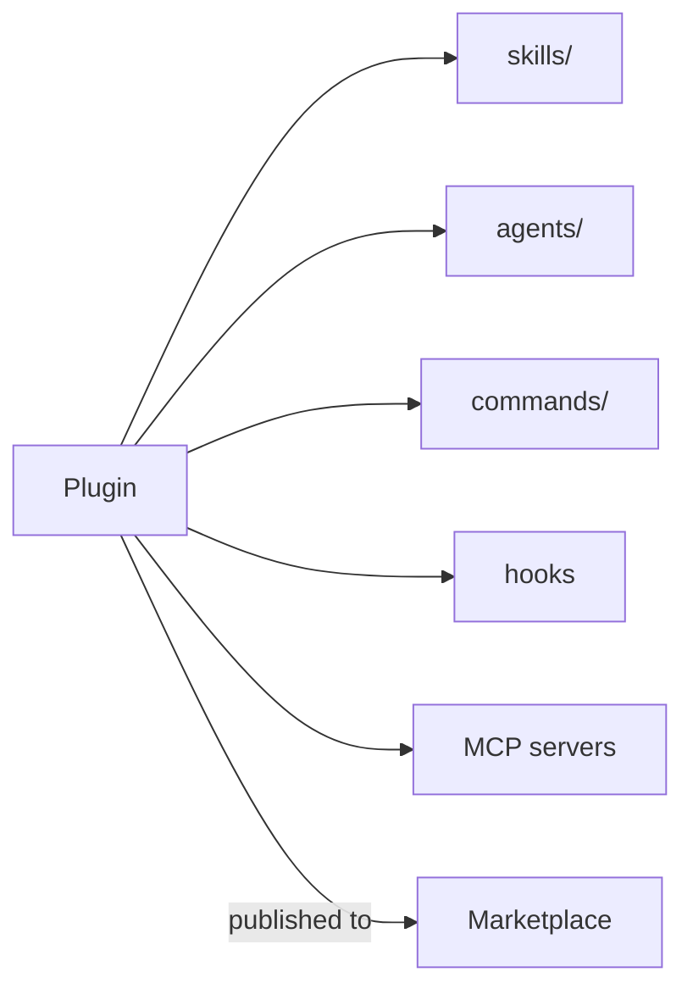

<LevelBadge level="advanced" />

<VerifyNote lastVerified="2026-06-20" source="https://code.claude.com/docs/en">
La struttura dei plugin e i meccanismi dei marketplace si stanno evolvendo rapidamente — verifica i dettagli nella documentazione ufficiale di Claude Code.
</VerifyNote>

Un **plugin** raggruppa diverse personalizzazioni — [skill](/docs/claude-code/skills), [subagent](/docs/claude-code/subagents), [comandi slash](/docs/claude-code/slash-commands), [hook](/docs/claude-code/hooks) e [server MCP](/docs/claude-code/mcp) — in un'unica unità installabile e versionata. Un **marketplace** è un catalogo di plugin che le persone possono scoprire e installare.

## Perché i plugin contano

- **Distribuisci un toolkit di team in un passaggio.** Invece di chiedere a tutti di copiare cinque file, pubblica un plugin; i colleghi lo installano e ottengono gli stessi comandi, hook, agenti e connessioni MCP.
- **Versioning.** Aggiorna il plugin e tutti scaricano la nuova versione.
- **Distribuzione.** Un marketplace rende il tuo toolkit (o quello altrui) facile da scoprire.

## Cosa c'è tipicamente dentro

Un plugin è una cartella strutturata (un manifest più i pezzi che distribuisce). Come minimo può contenere solo skill; al massimo, l'insieme completo qui sopra. Mantieni ogni plugin **coerente** — un plugin "convenzioni di team", un plugin "toolkit Python" — invece di un calderone di cose assortite.

## Fiducia prima di installare

:::warning I plugin possono distribuire codice eseguibile
Gli hook e i server MCP in un plugin vengono eseguiti con i tuoi privilegi. Installa da fonti di cui ti fidi e rivedi prima cosa fa un plugin — vedi [Revisione del codice di terze parti](/docs/security/reviewing-third-party-code).
:::

## Un percorso per scalare la tua configurazione

La progressione naturale: un `CLAUDE.md` → qualche [skill](/docs/claude-code/skills) e [comando](/docs/claude-code/slash-commands) → raggruppali in un plugin → pubblica su un marketplace per il tuo team o la community. Quest'ultimo passaggio fa parte di come AILmanac vuole aiutare l'ecosistema a crescere.

## Avanti

- [Skill](/docs/claude-code/skills) · [Subagent](/docs/claude-code/subagents) · [MCP](/docs/claude-code/mcp)
- [Revisione del codice di terze parti](/docs/security/reviewing-third-party-code)
- I [pacchetti di skill](/docs/templates/skills) di AILmanac
