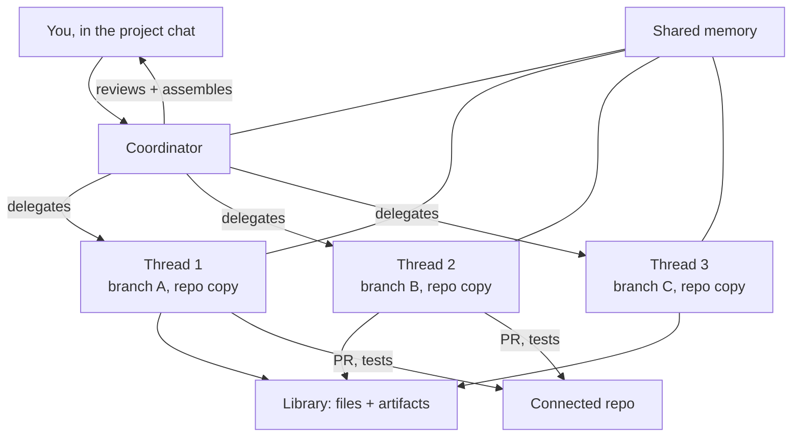

<LevelBadge level="advanced" />

<VerifyNote lastVerified="2026-09-23" source="https://claude.com/blog/projects-redesigned">
I Progetti ridisegnati sono in **beta** e vengono rilasciati a fasi. Idoneità, copertura dei piani e i controlli di coordinatore/thread sono ancora in movimento, e non esiste ancora una pagina di riferimento nella documentazione di Claude Code — il post di annuncio è la fonte autorevole. Verifica cosa ha davvero il tuo account prima di progettarci sopra.
</VerifyNote>

Il **17 settembre 2026** Anthropic ha ricostruito i Progetti. Il vecchio Progetto era una *cartella*: file, istruzioni e un mucchio di chat che li condividevano tutte. Il nuovo Progetto è un *organigramma* — "thread che fanno il lavoro e un coordinatore che li dirige".

È un cambiamento più grande di quanto sembri. Un Progetto non è più un posto dove metti il contesto; è una cosa che **esegue lavoro per conto tuo**. Descrivi un risultato nella chat principale del progetto, e Claude lo delimita, lo suddivide, lo delega a thread paralleli, rivede quello che torna indietro e assembla il risultato.

<Callout type="objectives" items={[
  "Cos'è davvero un thread — e perché 'una sessione cloud di Claude Code su un proprio branch' è la frase chiave",
  "In cosa il coordinatore differisce da un orchestratore di subagent, e quando ciascuno dei due è lo strumento giusto",
  "I quattro modi di eseguire lavoro in parallelo in Claude Code oggi, e come scegliere tra loro",
  "Perché i Progetti bruciano più in fretta i limiti d'uso, e le due manopole di modello/effort che lo controllano",
  "La regola di idoneità che spiega perché il tuo account forse non vede ancora il redesign"
]} />

## L'architettura in un diagramma

Contano tre pezzi, ed è facile confonderli:

- **Il coordinatore** è la chat principale del progetto. L'immagine usata da Anthropic è quella di dare un briefing a un capo di gabinetto: dici cosa ti serve, e lui instrada il lavoro verso thread nuovi o già esistenti.
- **Un thread** non è un lavoratore leggero. "Sotto il cofano, ogni thread è una sessione cloud di Claude Code che lavora su un proprio branch e una propria copia del repo." È una sessione completa, con una propria finestra di contesto, i propri strumenti e la propria capacità di generare **subagent, loop e workflow** quando un incarico è abbastanza grande da giustificarlo.
- **La memoria condivisa e la libreria** sono ciò che impedisce al fan-out di frammentarsi. Ogni thread attinge allo stesso bacino di memoria, e la libreria "raccoglie i file che aggiungi e gli artefatti prodotti da Claude", così gli output restano trovabili invece di morire dentro una sessione chiusa.

Con un repository collegato, i thread aprono pull request ed eseguono i test da soli. Puoi osservare e indirizzare da qualunque posto, telefono compreso.

## La frase che determina tutto il resto

> Ogni thread è una sessione cloud di Claude Code che lavora su un proprio branch e una propria copia del repo.

Leggila come tre impegni separati:

1. **Sessione propria** → finestra di contesto propria. I thread non condividono un budget di contesto come fanno i subagent dentro un'unica sessione. Il fan-out non si mangia più la finestra del genitore.
2. **Branch proprio** → i thread non possono sovrascriversi i file a vicenda. L'isolamento è imposto da git, non dalla disciplina di prompt. Il prezzo è che l'integrazione si sposta al momento del merge.
3. **Copia propria del repo** → un thread può eseguire test, installare dipendenze e rompere cose senza toccare la tua macchina né gli altri thread.

Quel terzo punto è anche il tetto attuale: i thread girano solo nel cloud. Anthropic dice che l'esecuzione "sulla tua macchina, insieme ai tuoi strumenti e al tuo codice locali e dietro la tua rete, sta arrivando molto presto" — finché non arriva, tutto ciò che richiede un servizio locale, un host raggiungibile solo in VPN o una dipendenza non pubblicata resta fuori dai Progetti.

## Scegliere tra quattro tipi di parallelismo

Claude Code offre ora quattro modi per fare più di una cosa alla volta. Non sono intercambiabili, e sceglierne uno sbagliato è l'errore più comune qui.

| Meccanismo | Chi orchestra | Isolamento | Contesto | Ideale per |
|---|---|---|---|---|
| [Subagent](/docs/claude-code/subagents) | Il tuo agente principale, dentro una sessione | Stesso working tree | Condividono i limiti della sessione; [massimo 20 in parallelo, profondità 3](/docs/claude-code/subagent-fleet-limits) | Fan-out di letture e ricerca dentro un singolo task |
| [Worktree](/docs/claude-code/worktrees) | Tu, a mano | Branch + directory separati, in locale | Sessioni separate che avvii tu | Lavoro parallelo locale che vuoi osservare e controllare |
| [Messaggistica tra sessioni](/docs/claude-code/inter-session-messaging) | Tu, indirizzando le sessioni per nome | Quello che ogni sessione ha già | Indipendente | Coordinare sessioni già in esecuzione |
| **Thread di progetto** | **Claude, dal coordinatore** | **Branch + copia del repo separati, nel cloud** | **Indipendente per ogni thread** | **Incarichi lunghi che vuoi delimitati, suddivisi e assemblati al posto tuo** |

L'euristica onesta:

- Se il lavoro sta in una sessione ed è per lo più lettura, usa i **subagent** — non richiedono configurazione e sono i più economici.
- Se vuoi supervisionare ogni passo sulla tua macchina, usa i **worktree**.
- Se la suddivisione è ovvia per te e preferisci deciderla tu, usa worktree o messaggistica. I Progetti aggiungono valore proprio quando **la decomposizione è la parte difficile**.
- Se l'incarico è grande, la suddivisione non è ovvia e vuoi controllare dal telefono invece di fare da balia a un terminale, usa i **Progetti**.

## Configurarne uno

<Steps items={[
  {title: "Scegli un obiettivo e un repo", body: "Sei tu a scegliere il risultato e il repository o il contesto rilevante in partenza. Il coordinatore usa entrambi per proporre la prima fetta di lavoro, quindi un obiettivo vago produce una delega vaga."},
  {title: "Configura l'ambiente", body: "Imposta ambiente cloud, connettori, plugin e istruzioni. Vengono ereditati da ogni thread che il coordinatore genera — è l'unico punto in cui un errore si moltiplica su tutto il fan-out."},
  {title: "Scegli modelli ed effort — due volte", body: "La chat del coordinatore e i thread di lavoro hanno impostazioni di modello ed effort separate. È la leva di costo principale; vedi sotto."},
  {title: "Descrivi il risultato, non i passi", body: "Dai al coordinatore un briefing da capo di gabinetto. Nominare il deliverable e i vincoli gli permette di delimitare e suddividere; nominare i passi lo trasforma in un modo costoso di eseguire una checklist che hai già scritto tu."},
  {title: "Regola la frequenza dei check-in", body: "Puoi regolare quanto spesso Claude si fa vivo con te e quanto facilmente avvia nuovi thread. Alza i check-in finché stai ancora calibrando il modo in cui decompone il tuo lavoro."},
  {title: "Rivedi al merge, non alla singola battuta", body: "I thread aprono pull request ed eseguono i test. La tua superficie di revisione è l'insieme di PR che il coordinatore assembla, ed è lì che branch isolati diventano un'unica modifica."}
]} />

## Il modello di costo, detto chiaramente

Anthropic è diretta su questo: "I Progetti possono raggiungere i limiti d'uso più in fretta." La ragione discende dall'architettura — ogni thread è una sessione cloud completa di Claude Code, quindi cinque thread sono all'incirca cinque sessioni di consumo in esecuzione simultanea, non una sessione divisa in cinque.

Esistono due manopole, e sono tutta la storia del costo:

<Callout type="tip" items={[
  "Modello/effort del coordinatore — delimita, rivede e assembla. Legge molto e scrive poco, quindi beneficia di un ragionamento capace.",
  "Modello/effort dei thread — questo viene moltiplicato per il numero di thread. Abbassarlo di un gradino è la singola modifica di costo con più leva che puoi fare.",
  "L'uso per progetto è visibile separatamente, così puoi vedere quanto costa un progetto senza tirare a indovinare dal tuo limite globale."
]} />

Lo schema che ne deriva: **tieni affilato il coordinatore, rendi proporzionati i lavoratori.** Delegare il lavoro meccanico — scrittura di test, migrazioni, passate sulla documentazione — a thread con un livello di effort più basso mentre il coordinatore rivede a un livello più alto ti dà quasi tutta la qualità a una frazione della spesa moltiplicata. È la stessa economia dell'[instradare i subagent su modelli più economici](/docs/claude-code/subagent-fleet-limits), applicata un livello più in alto.

## Perché forse non ce l'hai

Il cancello della beta è insolitamente specifico, e inganna chi presume che sia un semplice rilascio a percentuale. Al lancio, l'accesso è andato a:

> abbonati Claude Pro e Max selezionati che usano le sessioni cloud in Claude Code e non hanno progetti già esistenti sul web o sul desktop

Tre condizioni, tutte necessarie:

| Condizione | Perché punge |
|---|---|
| Piano Pro o Max | Team ed Enterprise arrivano dopo, a valle del rilascio consumer |
| Usa già le sessioni cloud in Claude Code | Gli utenti solo-locale non sono nella prima ondata, per quanto intenso sia il loro uso |
| **Nessun progetto già esistente su web o desktop** | La condizione sorprendente — essere un utente *storico e intenso* dei vecchi Progetti ti squalificava attivamente al lancio |

Quella terza regola è la trappola. Chi usa i Progetti da tempo è il meno probabile ad aver visto il redesign, perché il percorso di migrazione per i progetti esistenti non era ancora arrivato. I progetti esistenti continuano a funzionare durante il rilascio. Gli utenti Pro e Max senza accesso possono iscriversi a una lista d'attesa; Anthropic ha detto che l'accesso si sarebbe allargato "nel corso della settimana successiva" ad altri utenti di Claude Code su quei piani, poi al resto di Claude e a Team ed Enterprise.

## Errori comuni

- **Trattare il coordinatore come una casella di prompt.** È un delegatore. Dagli un risultato e dei vincoli; se gli passi una lista ordinata di passi, paghi l'overhead di orchestrazione per qualcosa che una singola sessione fa meglio.
- **Presumere che i thread condividano il tuo stato locale.** Hanno una copia cloud del repo. Modifiche locali non committate, file env locali e servizi su `localhost` lì non ci sono.
- **Dimenticare che l'isolamento rinvia i conflitti invece di rimuoverli.** Un branch per thread garantisce che i thread non si sovrascrivano a vicenda *mentre girano*. Non garantisce che tre PR che toccano lo stesso modulo si uniscano senza attriti. Dove puoi, delimita i thread lungo i confini dei moduli.
- **Lasciare l'effort dei thread allo stesso livello del coordinatore.** Quell'impostazione viene moltiplicata per il numero di thread. È il modo più rapido per sbattere contro un limite a metà incarico.
- **Usarlo per lavoro che richiede la tua macchina.** Le dipendenze da rete locale o strumenti locali appartengono ai [worktree](/docs/claude-code/worktrees) finché non arrivano i thread locali.

## Cosa segnala tutto questo

I Progetti sono il primo punto in cui Anthropic ha reso prodotto *la decomposizione stessa*. I subagent permettono a un modello di aprirsi a ventaglio dentro un task che hai definito tu. Un Progetto chiede al modello di definire i task. I controlli che Anthropic ha scelto di esporre — frequenza dei check-in, quanto prontamente apre nuovi thread, effort separato per coordinatore e lavoratori — sono tutte manopole su **quanta autonomia stai delegando**, il che è un segnale utile su dove stanno andando i prodotti agentici in generale. Vedi [il collo di bottiglia della verifica](/docs/frontiers/the-verification-bottleneck) per capire perché è la revisione, non la generazione, il vincolo contro cui va a sbattere questo design.

<Quiz questions={[
  {
    q: "Cos'è, tecnicamente, un thread di progetto?",
    options: [
      "Un subagent che gira dentro la sessione del coordinatore",
      "Una sessione cloud completa di Claude Code su un proprio branch e una propria copia del repo",
      "Un task in background che condivide la finestra di contesto del coordinatore",
      "Una richiesta accodata di Message Batches"
    ],
    answer: 1,
    explain: "La formulazione di Anthropic è precisa: ogni thread è una sessione cloud di Claude Code che lavora su un proprio branch e una propria copia del repo. È per questo che i thread hanno contesto indipendente e possono aprire le proprie pull request — ed è per questo che consumano come sessioni separate."
  },
  {
    q: "Perché i Progetti raggiungono i limiti d'uso più in fretta di una singola sessione?",
    options: [
      "Il coordinatore gira sempre al massimo effort",
      "Le sessioni cloud sono fatturate a una tariffa maggiorata",
      "Ogni thread è una sessione completa, quindi ne girano diverse in parallelo invece di condividere un unico budget",
      "La memoria condivisa viene rinviata a ogni richiesta"
    ],
    answer: 2,
    explain: "I thread sono sessioni complete che girano in parallelo, quindi il consumo si moltiplica per il numero di thread. La leva è modello/effort dei thread, che viene moltiplicato — abbassarlo tenendo capace il coordinatore è la modifica di costo con più leva."
  },
  {
    q: "Al lancio, quale condizione SQUALIFICAVA un account dalla beta?",
    options: [
      "Essere sul piano Max invece che Pro",
      "Avere progetti già esistenti su web o desktop",
      "Non aver mai usato i subagent",
      "Usare Claude Code solo tramite l'estensione IDE"
    ],
    answer: 1,
    explain: "La beta è andata ad abbonati Pro e Max selezionati che usano le sessioni cloud in Claude Code e non hanno progetti già esistenti su web o desktop. Gli utenti intensi dei vecchi Progetti erano quindi i meno probabili a vedere per primi il redesign, perché il percorso di migrazione non era ancora arrivato."
  }
]} />

<Callout type="takeaways" items={[
  "Un Progetto è ora un livello di orchestrazione, non una cartella: un coordinatore delimita e delega, i thread eseguono.",
  "Un thread è una sessione cloud completa su un proprio branch e una propria copia del repo — contesto indipendente, PR proprie, consumo proprio.",
  "Ricorri ai Progetti quando la decomposizione è la parte difficile; ricorri a subagent o worktree quando la suddivisione la conosci già.",
  "L'effort dei thread viene moltiplicato per il numero di thread; quello del coordinatore no. Regolali separatamente.",
  "Oggi i thread sono solo cloud, quindi tutto ciò che richiede strumenti locali o una rete privata resta per ora nei worktree."
]} />

## Avanti

- [Subagent](/docs/claude-code/subagents) — la primitiva di fan-out dentro la sessione, sopra cui stanno i thread
- [Limiti della flotta di subagent](/docs/claude-code/subagent-fleet-limits) — i tetti di concorrenza e l'instradamento di costo che valgono dentro ogni thread
- [Worktree](/docs/claude-code/worktrees) — l'alternativa locale, orchestrata da te, finché il solo-cloud è un vincolo

## Fonti e approfondimenti

- [Projects redesigned: from folder to conversation — Anthropic](https://claude.com/blog/projects-redesigned) — l'annuncio, e attualmente la descrizione autorevole di coordinatore, thread, memoria condivisa, libreria, idoneità alla beta e limitazione al solo cloud
- [Documentazione di Claude Code](https://code.claude.com/docs/en/overview) — la documentazione di riferimento delle funzionalità di Claude Code circostanti; al momento della scrittura non era ancora arrivata una pagina di riferimento sui Progetti
