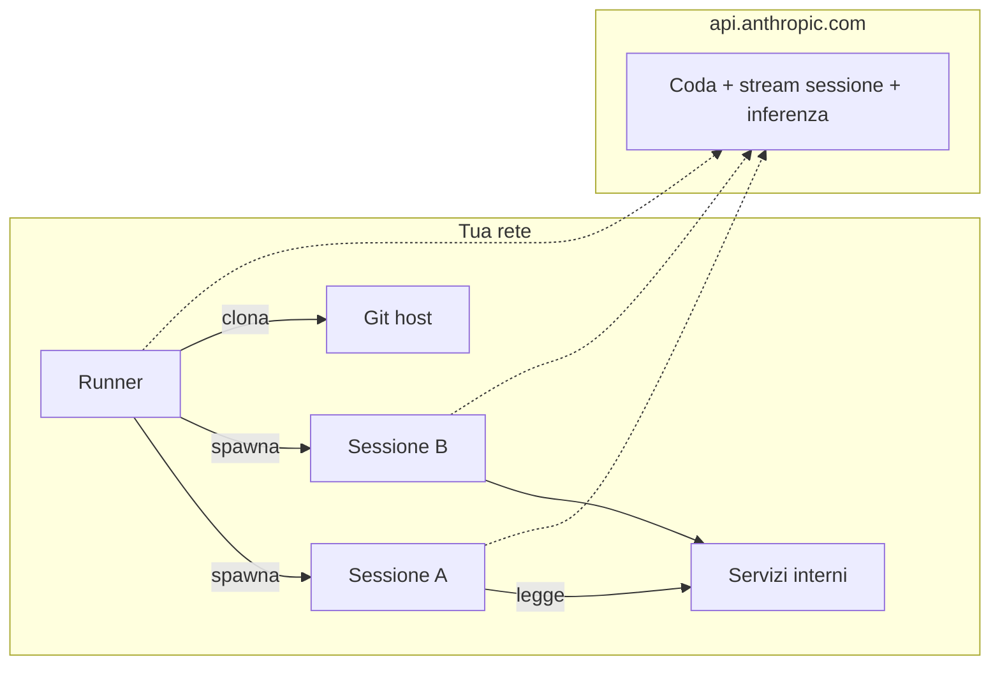

<LevelBadge level="advanced" />

<Callout type="objectives" items={[
  "Capire cos'è davvero un ambiente self-hosted — tre componenti (environment, runner, session) quasi identici a un runner CI self-hosted",
  "Vedere la forma di rete: 100% HTTPS in uscita, zero traffico in ingresso da Anthropic, il control plane resta hosted, l'esecuzione si sposta sui tuoi server",
  "Sapere quando usarli (accesso a rete interna, tooling custom, compliance) e le due risposte più semplici che la maggior parte dei team dovrebbe provare prima",
  "Avviare il primo runner con claude self-hosted-runner in quattro comandi, senza far finire il secret dell'ambiente nella shell history",
  "Capire il lock un-utente-alla-volta del runner — perché esiste, cosa fanno --drain-grace-sec e --retire-at, e come determina la dimensione minima della flotta",
  "Portare a casa le sei insidie che colpiscono ogni prima flotta di produzione (rotazione del secret, blocco ZDR, blocco del routing del modello, default di --base-dir, sfasamento dell'orologio, sfratto delle spot instance)",
]} />

<VerifyNote lastVerified="2026-08-07" source="https://code.claude.com/docs/en/self-hosted-environments">
La beta pubblica è stata rilasciata il **7 agosto 2026** in [Claude Code v2.1.224](https://code.claude.com/docs/en/changelog) sui piani Team ed Enterprise. Il sottocomando `claude self-hosted-runner` non esiste nelle versioni precedenti — avvia silenziosamente una normale sessione Claude usando le parole come prompt. Nomi, flag e percorso di abilitazione possono cambiare prima della GA; verifica sulla [pagina ufficiale degli ambienti self-hosted](https://code.claude.com/docs/en/self-hosted-environments) e sul suo [quickstart](https://code.claude.com/docs/en/self-hosted-environments-quickstart) prima di costruirci sopra.
</VerifyNote>

Il 7 agosto 2026 Anthropic ha rilasciato una feature che chiude l'ultimo vero gap tra Claude Code e il modo in cui le organizzazioni regolamentate gestiscono davvero l'infrastruttura: gli **ambienti self-hosted**. Ogni sessione cloud — quelle avviate da claude.ai, dalle app mobile e desktop, dalle [routine schedulate di Cowork](/docs/claude-app/cowork-scheduled-tasks) o da `claude --cloud` — può ora essere eseguita all'interno della tua rete, su macchine che provisioni e mantieni tu, sui piani Team ed Enterprise. Orchestrazione e chiamata al modello restano dalla parte di Anthropic; il checkout del codice, l'esecuzione dei tool e l'accesso alla rete interna vivono interamente sui tuoi server.

Se hai già gestito una flotta di runner self-hosted per GitHub Actions, la forma ti sarà familiare. Sarai produttivo più in fretta se porti dentro quel modello mentale.

## La versione in un paragrafo

Definisci un **environment** nelle impostazioni admin di claude.ai — una destinazione con nome. Copi il suo **environment secret** una volta (vita di 365 giorni; la UI lo chiama "environment key"). Installi Claude Code v2.1.224+ su un host Linux o macOS, metti il secret in un file, e lanci `claude self-hosted-runner --environment-secret-file /etc/claude/environment-secret --base-dir /workspace`. Quel processo fa polling in uscita su `api.anthropic.com`, rivendica le sessioni dalla coda del tuo ambiente, clona il repo scelto dallo sviluppatore e spawna un processo `claude` figlio per eseguire ogni sessione. Lo stato di sessione, i checkout git e tutto ciò che i tool toccano restano sul tuo host; solo il transcript per l'inferenza esce, su HTTPS in uscita. Nessun traffico in ingresso da Anthropic. Modello mentale semplice, una sorpresa operativa: un runner si blocca sul primo utente che vi capita e serve solo lui finché non drena.

## Dove si colloca rispetto alle due risposte più semplici

Prima di costruire una flotta, sii onesto sul fatto se ti serva davvero. Due prodotti adiacenti coprono la maggior parte dei casi "voglio Claude da qualche parte che non sia il mio laptop" senza infrastruttura da gestire.

| Opzione | Dove avviene l'esecuzione | Setup che gestisci tu | Sceglila quando |
| :--- | :--- | :--- | :--- |
| Cloud hosted da Anthropic (default) | Infra Anthropic | Nessuno | Non hai motivi di compliance o di rete per spostare l'esecuzione. È la risposta giusta per la maggior parte dei team. |
| [Remote Control](https://code.claude.com/docs/en/remote-control) | La tua macchina sempre accesa | Quella singola macchina | Vuoi pilotare una workstation dal telefono o da un altro laptop. Disponibile su Pro, Max, Team ed Enterprise. |
| **Ambienti self-hosted** | La tua flotta di runner | Immagine del runner, orchestrazione, egress, credenziali git | Ti serve l'esecuzione della sessione dentro la tua rete — registri interni, endpoint privati, codice air-gapped, o compliance che dice "i checkout restano sulla nostra infra". Solo Team ed Enterprise. |

Se una sessione avviata da terminale o IDE non lascia mai il laptop dello sviluppatore, niente di tutto questo si applica a quella sessione — il selettore di ambiente compare solo per le sessioni cloud.

## Architettura: environment, runner, session

Tre nomi; si mappano puliti sugli equivalenti GitHub Actions.

<Steps items={[
  {title: "Environment (~ runner group)", body: "Un gruppo con nome dei tuoi runner, creato nella pagina admin Cloud environments su claude.ai. Le sessioni sono instradate a un environment, non a un runner specifico. Nei campi API e nelle metriche appare come pool, e l'ID è una stringa tipo ccpool_..."},
  {title: "Runner (~ self-hosted runner)", body: "Un processo long-lived sul tuo host avviato con claude self-hosted-runner. Si registra all'environment usando l'environment secret, riceve un runner token e fa polling della coda per lavoro. Un binario, nessun servizio daemon da installare — il runner È la CLI standard claude in una modalità diversa."},
  {title: "Session (~ workflow run)", body: "Un task Claude Code avviato da uno sviluppatore, da claude.ai, dall'app mobile/desktop, da una routine schedulata di Cowork o da claude --cloud. Ogni sessione gira come processo claude figlio che il runner spawna, con il proprio event stream verso Anthropic."},
]} />

Ogni connessione è in uscita dalla tua rete. Anthropic non si connette mai in ingresso. Il runner e ogni sessione aprono ciascuno il proprio HTTPS in uscita verso `api.anthropic.com` per polling della coda, streaming di sessione e inferenza del modello; il runner o la sessione aprono connessioni git verso il tuo git host (pubblico su HTTPS/SSH, o interno direttamente visto che sei su quella rete).

## Disponibilità e i blocchi che incontrano la maggior parte delle org

Sei righe da leggere prima di pianificare un rollout. Ogni riga è un "no" duro, non un workaround.

- **Piani**: Team ed Enterprise, beta pubblica. **Allow self-hosted environments** deve essere attivato da un Owner o admin nella [pagina admin Cloud environments](https://claude.ai/admin-settings/cloud-environments); il pulsante **New** è nascosto finché non lo attivi. Richiede che [Claude Code sul web](https://code.claude.com/docs/en/claude-code-on-the-web) sia abilitato per l'organizzazione.
- **Zero Data Retention**: non disponibile per organizzazioni con ZDR attivo. Se la tua org ha bisogno di ZDR, gli ambienti self-hosted non fanno per te.
- **Routing del modello**: l'inferenza va all'API Anthropic su `api.anthropic.com`. **Non puoi** instradarla attraverso Amazon Bedrock, Google Cloud, Microsoft Foundry o un [LLM gateway](https://code.claude.com/docs/en/llm-gateway) dentro un ambiente self-hosted — la sessione si autentica con un token OAuth session-scoped emesso da Anthropic. Sposti l'esecuzione, mantieni l'inferenza.
- **Repository**: i checkout di sessione sono GitHub per ora. Se la tua source of truth è GitLab, Bitbucket o qualsiasi cosa self-hosted senza auth federata GitHub, aspetta.
- **Superfici non ancora instradabili**: le sessioni [Claude Tag](https://claude.com/docs/claude-tag/overview), Claude Security e Code Review non instradano ancora agli ambienti self-hosted. Chat regolare, Claude Code sul web, app mobile/desktop, routine schedulate e `claude --cloud` sì.
- **OS del runner**: host o container Linux o macOS. Windows non è supportato come host del runner — eseguilo dentro un container Linux invece. Le workstation degli sviluppatori non sono toccate (non ospitano mai il runner).

## Quickstart: il tuo primo runner in quattro comandi

Il setup guidato (`claude self-hosted-runner setup`) accompagna una macchina in cui hai fatto `claude auth login` con un account Owner/admin attraverso l'intero flusso in modo interattivo, e lascia un `./runner-setup/CHEAT-SHEET.md` alla fine. Su un host headless dove un setup interattivo non è possibile, fallo manualmente con questi quattro comandi.

<Steps items={[
  {title: "Crea l'environment in claude.ai e copia il secret", body: "Pagina admin Cloud environments → New sotto Self-hosted environments → dagli un nome → Copy environment key. Il secret è mostrato UNA SOLA VOLTA. Scade 365 giorni dopo la creazione. L'ID ccpool_... è recuperabile in seguito; il secret no."},
  {title: "Metti il secret in un file, fuori dalla shell history", body: "Il trucco subshell + umask legge da stdin, così il secret non finisce mai in ~/.bash_history o ~/.zsh_history. Ctrl-D dopo il paste + Enter."},
  {title: "Crea una base directory scrivibile dall'utente del runner", body: "Il runner ha --base-dir a /workspace di default. Se quella directory non esiste (o il runner non è root), incapperai in un errore al primo claim. Prendine possesso esplicitamente."},
  {title: "Avvia il runner e guardalo registrarsi", body: "Il processo fa polling della coda in foreground. Il restart on exit è affar tuo — vedi le ricette per la flotta più sotto."},
]} />

<PromptCard title="1. Verifica che Claude Code sia abbastanza nuovo">{`claude self-hosted-runner --help`}</PromptCard>

Stampa il testo d'uso del runner con flag come `--environment-secret-file` su v2.1.224+. Su versioni precedenti stampa il generale `claude --help` — aggiorna prima con `claude update` o reinstalla dal [canale `latest`](https://code.claude.com/docs/en/setup).

<PromptCard title="2. Metti in staging l'environment secret senza farlo trapelare">{`sudo mkdir -p /etc/claude
sudo bash -c '(umask 077 && cat > /etc/claude/environment-secret)'
# incolla il secret, premi Enter, poi Ctrl-D`}</PromptCard>

<PromptCard title="3. Crea una base directory scrivibile">{`sudo mkdir -p /workspace && sudo chown $USER /workspace`}</PromptCard>

<PromptCard title="4. Avvia il runner">{`claude self-hosted-runner \\
  --environment-secret-file /etc/claude/environment-secret \\
  --base-dir /workspace`}</PromptCard>

Entro pochi secondi lo stato dell'environment nella pagina admin passa da **No runners deployed** a **Healthy**. Avvia una sessione da `claude.ai/code`, scegli il tuo environment dal picker, e guarda il runner loggare `Picked up session <session-id>` con un contatore active/capacity.

Inviare un follow-up da qualsiasi altra macchina in cui hai fatto login:

<PromptCard title="Invia un follow-up a una sessione cloud in esecuzione">{`claude -p "add a test for the empty-list case" --cloud <session-id>`}</PromptCard>

Il `<session-id>` è l'ID nudo `session_...` o `cse_...` o l'URL `claude.ai/code` della sessione. Conferma con `Sent to cloud session.` più un link di visualizzazione.

## Il ciclo di vita del runner: il lock un-utente

Questa è la sorpresa che colpisce per prima la maggior parte degli operatori. È una scelta deliberata di isolamento e determina tutto sul dimensionamento della flotta.

- La prima sessione che un runner prende **blocca il runner all'account di quell'utente**. Da quel momento il runner rivendica solo il lavoro in coda di quell'utente, fino a `--capacity` sessioni concorrenti.
- Cosa succede dopo che quelle sessioni finiscono dipende da `--drain-grace-sec`:
  - **Default `0`**: il runner esce non appena le sessioni attive finiscono; il tuo orchestratore (Kubernetes, Compose, systemd + `Restart=always`) ne avvia uno nuovo su un disco pulito che può servire *qualsiasi* utente.
  - **Valore positivo**: il runner continua a fare polling della coda dell'account bloccato per quel numero di secondi prima di uscire. Usalo solo se le sessioni back-to-back di un singolo power user dominano.
- La **dimensione minima della flotta** è quindi il numero di utenti che ti aspetti stiano lavorando attivamente contemporaneamente — una sessione long-running su un runner blocca ogni altro utente da quel runner finché non drena.
- Il lease della sessione viene sondato circa a ogni ciclo; **60 secondi** senza un poll e il control plane rimette la sessione in coda su un altro runner. Heartbeat del runner e refresh del lease sono la stessa chiamata.
- Per host distrutti a un wall clock time senza signal (spot instance, cap sulla lifetime del sandbox), passa `--retire-at <epoch-seconds>` qualche minuto prima del kill. Il runner smette di prendere nuovo lavoro, rilascia ogni sessione attiva (così il prossimo messaggio dell'utente riprende su un runner fresco) ed esce con 0. Senza `--retire-at`, un kill senza signal appare come un crash e la sessione va in requeue da uno stato di lost-worker.
- SIGTERM triggera un drain graceful out of the box (nessun flag). Un turn che sopravvive al kill grace è comunque perso; dimensiona per quello.

<Flashcards title="Vocabolario del ciclo di vita del runner" cards={[
  {front: "Lock un-utente", back: "La prima sessione che un runner rivendica blocca il runner all'account di quell'utente finché non drena. Dimensione minima flotta = numero di utenti attivi concorrenti."},
  {front: "--drain-grace-sec", back: "Secondi per cui un runner continua a fare polling della coda dell'utente bloccato dopo che le sessioni attive finiscono. Default 0 (esce subito)."},
  {front: "--capacity", back: "Sessioni concorrenti per runner, tutte servite per l'utente bloccato."},
  {front: "--retire-at <epoch>", back: "Chiedi al runner di smettere di prendere lavoro e rilasciare le sessioni attive prima di un kill senza signal (spot instance, timeout sandbox). Previene lo stato di lost-worker."},
  {front: "--base-dir", back: "Dove il runner fa checkout dei repository. Default /workspace; deve esistere ed essere scrivibile, oppure esegui il runner come root."},
  {front: "--environment-secret-file", back: "Path al file che contiene il ccpool secret. L'env secret scade 365 giorni dalla creazione; ruotalo prima di allora."},
  {front: "ID ccpool_", back: "Identificatore pubblico dell'environment (a.k.a. pool_id nelle API e nelle metriche). Non è un secret; usalo nel check aud quando verifichi i token di sessione."},
]} />

## Rete e cosa attraversa davvero il perimetro

Il punto del self-hosting è il controllo su cosa esce. Vale quindi la pena essere precisi su cosa lo fa.

**Resta sulla tua infra** — checkout dei repository, artifact di build, secret che il tuo tooling legge, e qualsiasi file che le sessioni creano o modificano. Le chiamate sessione-a-servizio-interno (database, registri, endpoint HTTP privati) non lasciano mai la tua rete.

**Lascia la tua infra** — la conversazione stessa (prompt, risposte del modello, risultati dei tool) va a `api.anthropic.com` per l'inferenza, e Anthropic memorizza il transcript della sessione così che una sessione possa essere ripresa da un'altra superficie. Heartbeat del runner e polling della coda sono HTTPS in uscita verso lo stesso host. Opzionale: i clone git possono essere tunnelati attraverso il [git proxy](https://code.claude.com/docs/en/self-hosted-environments-deploy#use-the-anthropic-git-proxy) di Anthropic se il tuo git host interno è irraggiungibile dal runner direttamente.

**Non succede mai** — Anthropic non apre connessioni in ingresso verso la tua rete. Non c'è porta da esporre, ingress da firewallare.

Supporto proxy: il runner e l'orchestratore di autoscaling opzionale onorano `HTTPS_PROXY` / `NO_PROXY` e le variabili mTLS da [Network configuration](https://code.claude.com/docs/en/network-config). Le sessioni le ereditano. Il proxy sul percorso **non deve bufferizzare** le risposte server-sent-event — lo streaming di sessione si rompe se lo fa.

## Checklist di produzione: cosa cuocere nell'immagine del runner

Il runner è un binario solo. Tutto il resto che rende produttive le sessioni vive nell'immagine o in uno script wrapper.

- **Pinna la versione di Claude Code.** Il canale `latest` prende le release il giorno che escono; il canale `stable`, la Homebrew cask e i repo apt/dnf/apk stable seguono ~una settimana dopo. Segui [Install a specific version](https://code.claude.com/docs/en/setup#install-a-specific-version) e pinna.
- **Git ≥ 2.24** su PATH. Git più nuovo è richiesto per alcune opzioni di [Configure git](https://code.claude.com/docs/en/self-hosted-environments-deploy#configure-git); ogni floor dichiarato è su quella pagina.
- **Preinstalla i tuoi build tool** — compilatori, runtime dei linguaggi, package manager, CLI interne. Questo è l'80% del valore del "perché self-hostiamo": ogni sessione parte pronta a buildare, niente `apt install` a metà turn.
- **Provisiona le credenziali git** nell'immagine del runner o via wrapper. Le opzioni includono credenziali coniate per-sessione — vedi [Configure git](https://code.claude.com/docs/en/self-hosted-environments-deploy#configure-git).
- **Orchestrazione restart-on-exit** (Kubernetes Deployment, `systemd` con `Restart=always`, Compose con `restart: always`). Il runner esce di proposito quando le sessioni attive finiscono; senza un restarter, il tuo environment va freddo.
- **Sincronizzazione dell'orologio (NTP o equivalente).** L'autenticazione fallisce quando l'orologio è più di 5 minuti fuori — una causa silenziosa dei loop `poll auth failed`.
- **Autoscaling**: per domanda burst, deploya l'[orchestratore di autoscaling](https://code.claude.com/docs/en/self-hosted-environments-configuration#on-demand-runners), un secondo processo che ospiti tu e che avvia runner on-demand mentre le sessioni si accodano.

## Testing e identità

Due superfici adiacenti che vale la pena conoscere il giorno in cui vai oltre uno smoke test su singolo host:

- **Smoke test CI** — [Test end to end](https://code.claude.com/docs/en/self-hosted-environments-testing) dispatcha una sessione al tuo environment dalla CI (`--environment ccpool_...`) e legge le risposte di Claude, dandoti un gate di promozione dell'immagine.
- **Verifica l'identità della sessione** — [Session identity verification](https://code.claude.com/docs/en/self-hosted-environments-identity) permette ai tuoi servizi interni di validare il token di sessione prima di concedere l'accesso, usando l'ID `ccpool_...` come check `aud`. Questo è il pezzo che fa sapere alle API interne "questa richiesta viene da una sessione nel nostro environment, non dal laptop di un dipendente qualunque".

## Le sei insidie che colpiscono ogni prima flotta

Non inventate — ognuna è o nel fine print della doc o una conseguenza naturale del design. Risparmiati una settimana.

1. **Trappola versione del setup guidato.** Su Claude Code &lt; v2.1.224, `claude self-hosted-runner setup` non dà errore — avvia una normale sessione Claude con le parole letterali come prompt. Fai prima il check `--help`; se vedi il generale `claude --help`, aggiorna.
2. **L'environment secret si mostra una sola volta.** Il valore che copi alla creazione è irrecuperabile. Salvalo nel tuo secrets manager nello stesso momento in cui lo copi, prima di chiudere il wizard. Se lo perdi, crea un nuovo secret dalla tab **Configuration** dell'environment, propagalo ai tuoi runner, poi revoca il vecchio — i vecchi runner che colpiscono secret revocati falliscono il prossimo poll con `poll auth failed`.
3. **Trappola del default di `--base-dir`.** Se non passi `--base-dir` e non esegui il runner come root, `/workspace` non esisterà e non sarà scrivibile — il runner si registra bene, poi va in errore al primo claim. Passa sempre un `--base-dir` esplicito nelle esecuzioni non-root, e fa' `chown`.
4. **Il lock un-utente, di nuovo.** Un team di 20 ingegneri attivi ha bisogno di minimo 20 runner, non 20 × session-capacity. Sotto-provisiona qui e ogni altro utente aspetta dietro chi ha colpito il runner per primo. Dimensiona le flotte per *utenti attivi concorrenti*, non per sessioni concorrenti.
5. **Lo sfasamento dell'orologio fa fallire l'auth.** I runner su host oltre 5 minuti fuori dal wall-clock time loopano silenziosamente su `poll auth failed`. NTP non è opzionale.
6. **I kill senza signal perdono il turn corrente.** Spot instance, deadline del container runtime e alcune eviction di Kubernetes uccidono l'host senza SIGTERM. Setta `--retire-at` qualche minuto prima del known kill time così il runner drena pulito; altrimenti un turn in volo è perso e la sessione va in requeue da uno stato di lost-worker.

<Quiz title="Verifica la tua comprensione" questions={[
  {q: "La tua org Enterprise con ZDR attivo vuole spostare l'esecuzione di Claude Code on-prem. Può usare gli ambienti self-hosted?", options: ["Sì, ZDR è ortogonale alla location di esecuzione", "No — gli ambienti self-hosted non sono disponibili per organizzazioni con Zero Data Retention attivo", "Sì, ma solo per routine schedulate"], answer: 1, explain: "Gli ambienti self-hosted non sono disponibili per org con ZDR. Il transcript di sessione va comunque a api.anthropic.com per l'inferenza ed è memorizzato così che una sessione possa muoversi tra superfici — quello storage è incompatibile con ZDR."},
  {q: "Hai 20 ingegneri che potrebbero avere una sessione cloud Claude Code aperta in qualsiasi momento. Qual è il numero minimo di runner?", options: ["1, visto che --capacity gestisce le sessioni concorrenti", "20, perché ogni runner si blocca su un utente finché non drena", "Puoi calcolarlo come ceil(20 / --capacity)"], answer: 1, explain: "Un runner si blocca sull'account del primo utente per la sua lifetime. La dimensione minima della flotta è uguale agli utenti attivi concorrenti. --capacity bumpa solo la concorrenza per quel SINGOLO utente bloccato."},
  {q: "I tuoi runner sono su spot instance che ricevono 2 minuti di preavviso prima della terminazione — senza SIGTERM. Cosa setti per evitare di perdere sessioni a metà turn?", options: ["--drain-grace-sec 120", "--retire-at settato a qualche minuto prima del known termination time", "--capacity 1"], answer: 1, explain: "--retire-at gestisce i kill senza signal: il runner smette di accettare nuovo lavoro e rilascia le sessioni attive così che il prossimo messaggio dell'utente riprenda su un runner fresco. --drain-grace-sec influenza solo il polling post-drain."},
  {q: "Vuoi instradare le sessioni cloud di Claude Code alla tua inferenza Bedrock. Gli ambienti self-hosted lo abilitano?", options: ["Sì — è un use case comune", "No — le sessioni negli ambienti self-hosted si autenticano con un token OAuth session-scoped emesso da Anthropic e l'inferenza va solo su api.anthropic.com", "Sì, se usi un LLM gateway"], answer: 1, explain: "Il self-hosting sposta l'esecuzione, non l'inferenza. L'inferenza in un ambiente self-hosted non può essere instradata attraverso Bedrock, Google Cloud, Foundry o un LLM gateway."},
  {q: "Tiri su un runner su una macchina il cui orologio è 12 minuti avanti rispetto all'ora reale. Cosa vedi?", options: ["Funziona bene — Anthropic tollera lo sfasamento dell'orologio", "Si registra ma non prende mai sessioni", "Fallisce con poll auth failed e non si registra mai come Healthy — l'auth fallisce oltre uno sfasamento di 5 minuti"], answer: 2, explain: "I token di autenticazione sono time-bound. Oltre 5 minuti fuori dal wall-clock time e i poll del runner falliscono l'auth. NTP o una sincronizzazione dell'orologio simile è un requisito duro."},
]} />

<Callout type="takeaways" items={[
  "Gli ambienti self-hosted spostano l'ESECUZIONE delle sessioni cloud di Claude Code dentro la tua rete. Orchestrazione e inferenza restano su api.anthropic.com. Non c'è traffico in ingresso da Anthropic.",
  "Tre pezzi: environment (una destinazione di routing con nome), runner (un processo claude self-hosted-runner), session (un task Claude Code figlio). Stessa forma dei runner self-hosted di GitHub Actions.",
  "Disponibilità oggi: Team ed Enterprise, beta pubblica, off di default. Bloccato da ZDR. L'inferenza non può essere instradata fuori da Anthropic. Checkout solo GitHub. Host del runner Linux/macOS.",
  "Un runner si blocca sull'account del primo utente per la sua lifetime. Dimensione minima flotta = numero di utenti attivi concorrenti. --capacity scala solo la concorrenza per quell'utente bloccato.",
  "I quattro comandi sono tutto il quickstart: verifica la versione, staga il secret in un file protetto con umask, mkdir una --base-dir scrivibile, esegui il runner in foreground. Il restart-on-exit è job del tuo orchestratore.",
  "Per qualsiasi cosa meno di una flotta, il cloud hosted da Anthropic è la risposta giusta. Per pilotare una singola macchina sempre accesa da remoto, usa Remote Control invece.",
]} />

## Successivo

- Sessioni cloud che instraderai → [Claude Code sul web](https://code.claude.com/docs/en/claude-code-on-the-web)
- Sessioni schedulate che girano senza un device acceso → [Cowork Scheduled Tasks](/docs/claude-app/cowork-scheduled-tasks)
- Le ricette di hardening e flotta per deployment reali → [Deploy to production (doc ufficiale)](https://code.claude.com/docs/en/self-hosted-environments-deploy)
- L'altra primitiva per "eseguire Claude Code da qualche parte che non sia il mio laptop" → [Remote Control (doc ufficiale)](https://code.claude.com/docs/en/remote-control)
