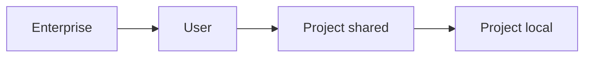

<LevelBadge level="intermediate" />

<VerifyNote lastVerified="2026-06-20" source="https://code.claude.com/docs/en/settings">
È meglio confermare le chiavi esatte e le posizioni dei file nella documentazione ufficiale di Claude Code sulle impostazioni.
</VerifyNote>

`settings.json` è dove risiede la configurazione di Claude Code — [permessi](/docs/claude-code/permissions), [hook](/docs/claude-code/hooks), variabili d'ambiente, valori predefiniti del modello e altro. Capire i **livelli** è la chiave.

## I livelli (dal più globale → al più specifico)

I livelli successivi (più specifici) hanno la precedenza sui precedenti:

1. **Enterprise / gestito** — policy impostata da un amministratore dell'organizzazione. Prevale su tutto.
2. **Utente** — `~/.claude/settings.json`. I tuoi valori predefiniti in tutti i progetti.
3. **Progetto (condiviso)** — `.claude/settings.json`, sotto controllo di versione nel repository. Valido per tutto il team.
4. **Progetto (personale)** — `.claude/settings.local.json`, escluso da git. I tuoi override per questo repository.

:::tip Committa il file condiviso, ignora quello locale
Metti le convenzioni di team in `.claude/settings.json` (sotto controllo di versione). Metti gli aggiustamenti personali e i percorsi specifici della macchina in `.claude/settings.local.json` (escluso da git). Questo mantiene il team coerente senza imporre le tue preferenze agli altri.
:::

## Cosa imposterai comunemente

- **`permissions`** — regole allow/ask/deny. Vedi [Permessi](/docs/claude-code/permissions).
- **`hooks`** — comandi che vengono eseguiti in corrispondenza di eventi del ciclo di vita. Vedi [Hook](/docs/claude-code/hooks).
- **`env`** — variabili d'ambiente per la sessione.
- **Valori predefiniti di modello / comportamento** — ad esempio il modello preferito.

## Modificare in sicurezza

- Mantieni un JSON valido (una virgola finale lo rompe).
- Preferisci regole di permesso **ristrette** a quelle ampie.
- Non mettere mai segreti in un file sotto controllo di versione — usa riferimenti `env` o un gestore di segreti.

File di partenza pronti da copiare si trovano in [Ricette per hook e settings.json](/docs/templates/hooks-settings).

## Avanti

- [Permessi e modalità dei permessi](/docs/claude-code/permissions)
- [Hook: automazione deterministica](/docs/claude-code/hooks)
- [Comandi slash personalizzati](/docs/claude-code/slash-commands)
