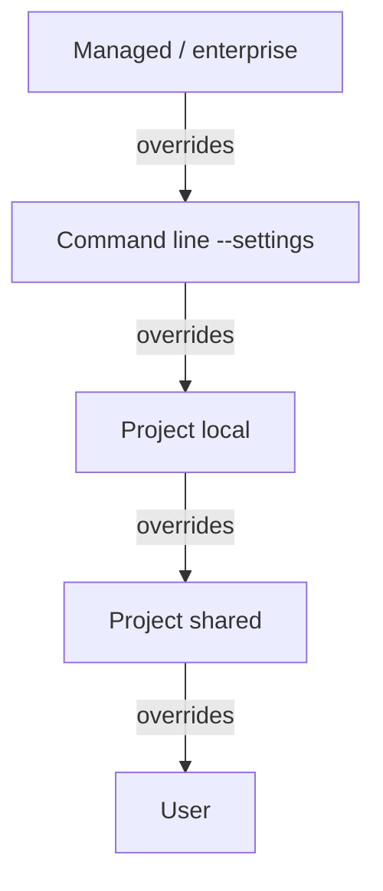

<LevelBadge level="intermediate" />

<VerifyNote lastVerified="2026-09-23" source="https://code.claude.com/docs/en/settings">
Stack di precedenza a cinque livelli (gestito → riga di comando → progetto locale → progetto condiviso → utente) e la regola "le variabili d'ambiente non sono un livello" dalla pagina ufficiale [Settings files and precedence](https://code.claude.com/docs/en/settings). Gli override per singola chiave sono elencati nel [riferimento delle impostazioni](https://code.claude.com/docs/en/settings-reference).
</VerifyNote>

`settings.json` è dove risiede la configurazione di Claude Code — [permessi](/docs/claude-code/permissions), [hook](/docs/claude-code/hooks), variabili d'ambiente, valori predefiniti del modello e altro. Capire i **livelli** è la chiave.

## I livelli (dal più alto per precedenza)

Quando la stessa chiave è impostata in più punti, Claude Code usa il valore del livello più alto che la imposta:

1. **Gestito / enterprise** — `managed-settings.json`, una policy MDM o le impostazioni gestite dal server dalla console claude.ai. Nulla di ciò che imposti le sovrascrive (salvo alcune eccezioni sensibili per la sicurezza).
2. **Riga di comando** — `claude --settings '<json-or-path>'`, solo per una sessione. Sta sopra ogni file tranne quello gestito e non scrive su alcun file.
3. **Progetto (personale)** — `.claude/settings.local.json`, escluso da git. I tuoi override per questo repository.
4. **Progetto (condiviso)** — `.claude/settings.json`, sotto controllo di versione nel repository. Valido per tutto il team.
5. **Utente** — `~/.claude/settings.json`. I tuoi valori predefiniti in tutti i progetti.

```mermaid
flowchart TB
  M[Managed / enterprise] -->|overrides| C[Command line --settings]
  C -->|overrides| L[Project local]
  L -->|overrides| P[Project shared]
  P -->|overrides| U[User]
```

:::note Le variabili d'ambiente non sono un livello
Stanno fuori da questo stack e si risolvono chiave per chiave. Ad esempio `ANTHROPIC_MODEL` prevale sulla chiave `model` di qualsiasi file, mentre `ANTHROPIC_DEFAULT_MODEL` si applica solo quando nessun file imposta `model`.
:::

:::tip Committa il file condiviso, ignora quello locale
Metti le convenzioni di team in `.claude/settings.json` (sotto controllo di versione). Metti gli aggiustamenti personali e i percorsi specifici della macchina in `.claude/settings.local.json` (escluso da git). Questo mantiene il team coerente senza imporre le tue preferenze agli altri.
:::

## Cosa imposterai comunemente

- **`permissions`** — regole allow/ask/deny. Vedi [Permessi](/docs/claude-code/permissions).
- **`hooks`** — comandi che vengono eseguiti in corrispondenza di eventi del ciclo di vita. Vedi [Hook](/docs/claude-code/hooks).
- **`env`** — variabili d'ambiente per la sessione.
- **Valori predefiniti di modello / comportamento** — ad esempio il modello preferito.

## Modificare in sicurezza

- Mantieni un JSON valido (una virgola finale lo rompe).
- Preferisci regole di permesso **ristrette** a quelle ampie.
- Non mettere mai segreti in un file sotto controllo di versione — usa riferimenti `env` o un gestore di segreti.

File di partenza pronti da copiare si trovano in [Ricette per hook e settings.json](/docs/templates/hooks-settings).

## Avanti

- [Permessi e modalità dei permessi](/docs/claude-code/permissions)
- [Hook: automazione deterministica](/docs/claude-code/hooks)
- [Comandi slash personalizzati](/docs/claude-code/slash-commands)
