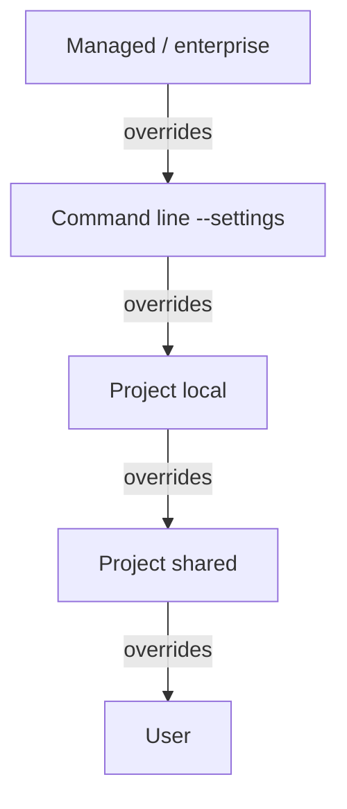

<LevelBadge level="intermediate" />

<VerifyNote lastVerified="2026-09-23" source="https://code.claude.com/docs/en/settings">
Stack di precedenza a cinque livelli (gestito → riga di comando → progetto locale → progetto condiviso → utente) e la regola "le variabili d'ambiente non sono un livello" dalla pagina ufficiale [Settings files and precedence](https://code.claude.com/docs/en/settings). Gli override per singola chiave sono elencati nel [riferimento delle impostazioni](https://code.claude.com/docs/en/settings-reference).
</VerifyNote>

`settings.json` è dove risiede la configurazione di Claude Code — [permessi](/docs/claude-code/permissions), [hook](/docs/claude-code/hooks), variabili d'ambiente, valori predefiniti del modello e altro. Capire i **livelli** è la chiave.

<Callout type="objectives" items={["Lo stack di precedenza a cinque livelli, e quale file vince quando due di essi impostano la stessa chiave","Perché le variabili d'ambiente non sono un livello, e cosa significa per ANTHROPIC_MODEL","In quale file mettere un'impostazione: convenzione di team versionata, override personale o esperimento di una sola sessione","Le quattro sezioni che modificherai davvero, e dove ciascuna è documentata in profondità","Come modificare senza rompere il file, e cosa non deve mai finire in un file di impostazioni versionato"]} />

## I livelli (dal più alto per precedenza)

Quando la stessa chiave è impostata in più punti, Claude Code usa il valore del livello più alto che la imposta:

<Steps items={[
  {title: "Gestito / enterprise", body: "managed-settings.json, una policy MDM o le impostazioni gestite dal server dalla console claude.ai. Nulla di ciò che imposti le sovrascrive (salvo alcune eccezioni sensibili per la sicurezza)."},
  {title: "Riga di comando", body: "claude --settings '<json-or-path>', solo per una sessione. Sta sopra ogni file tranne quello gestito e non scrive su alcun file — quindi è lo strumento giusto per un esperimento che non vuoi ricordare."},
  {title: "Progetto (personale)", body: ".claude/settings.local.json, escluso da git. I tuoi override per questo repository: percorsi specifici della macchina, un modello che preferisci qui, un hook che vuoi solo tu."},
  {title: "Progetto (condiviso)", body: ".claude/settings.json, sotto controllo di versione nel repository. Convenzioni valide per tutto il team — il file che un nuovo collega eredita clonando."},
  {title: "Utente", body: "~/.claude/settings.json. I tuoi valori predefiniti in tutti i progetti. Precedenza più bassa, quindi un repository può sempre sovrascriverti."}
]} />

```mermaid
flowchart TB
  M[Managed / enterprise] -->|overrides| C[Command line --settings]
  C -->|overrides| L[Project local]
  L -->|overrides| P[Project shared]
  P -->|overrides| U[User]
```

:::note Le variabili d'ambiente non sono un livello
Stanno fuori da questo stack e si risolvono chiave per chiave. Ad esempio `ANTHROPIC_MODEL` prevale sulla chiave `model` di qualsiasi file, mentre `ANTHROPIC_DEFAULT_MODEL` si applica solo quando nessun file imposta `model`.
:::

:::tip Committa il file condiviso, ignora quello locale
Metti le convenzioni di team in `.claude/settings.json` (sotto controllo di versione). Metti gli aggiustamenti personali e i percorsi specifici della macchina in `.claude/settings.local.json` (escluso da git). Questo mantiene il team coerente senza imporre le tue preferenze agli altri.
:::

## Cosa imposterai comunemente

- **`permissions`** — regole allow/ask/deny. Vedi [Permessi](/docs/claude-code/permissions).
- **`hooks`** — comandi che vengono eseguiti in corrispondenza di eventi del ciclo di vita. Vedi [Hook](/docs/claude-code/hooks).
- **`env`** — variabili d'ambiente per la sessione.
- **Valori predefiniti di modello / comportamento** — ad esempio il modello preferito.

## Modificare in sicurezza

- Mantieni un JSON valido (una virgola finale lo rompe).
- Preferisci regole di permesso **ristrette** a quelle ampie.
- Non mettere mai segreti in un file sotto controllo di versione — usa riferimenti `env` o un gestore di segreti.

<PromptCard title="Prova un'impostazione per una sola sessione senza scriverla in nessun file">
{`claude --settings '{"permissions":{"allow":["Bash(git log *)"]}}'`}
</PromptCard>

File di partenza pronti da copiare si trovano in [Ricette per hook e settings.json](/docs/templates/hooks-settings). Quando un file è malformato o una chiave non fa ciò che ti aspetti, `claude doctor` stampa gli errori di validazione dei file di impostazioni senza avviare una sessione — vedi [la pagina sulla CLI](/docs/claude-code/cli-flags) per questo e per `--safe-mode`.

## Verifica te stesso

<Quiz questions={[
  {
    q: "Il file .claude/settings.json versionato nel tuo repository imposta un modello, e il tuo ~/.claude/settings.json ne imposta uno diverso. Quale si applica?",
    options: [
      "Il tuo file utente — le impostazioni personali vincono sempre",
      "Il file versionato del repository — il progetto condiviso sta sopra l'utente",
      "Nessuno dei due; il conflitto è un errore",
      "Il file modificato più di recente"
    ],
    answer: 1,
    explain: "Le impostazioni utente sono il livello più basso, quindi un repository può sempre sovrascrivere i tuoi valori predefiniti personali. L'ordine è gestito → riga di comando → progetto locale → progetto condiviso → utente."
  },
  {
    q: "Dove va messo un percorso assoluto specifico della macchina?",
    options: [
      ".claude/settings.json, così ce l'ha tutto il team",
      ".claude/settings.local.json, che è escluso da git",
      "~/.claude/settings.json, così vale per ogni progetto",
      "managed-settings.json"
    ],
    answer: 1,
    explain: "settings.local.json è il livello a scopo di progetto escluso da git: adatto a percorsi e preferenze che hanno senso solo sulla tua macchina, senza imporli ai colleghi."
  },
  {
    q: "Quale affermazione sulle variabili d'ambiente è corretta?",
    options: [
      "Formano un sesto livello, subito sotto le impostazioni gestite",
      "Si risolvono chiave per chiave e stanno fuori dallo stack — ANTHROPIC_MODEL sovrascrive la chiave model di qualsiasi file, mentre ANTHROPIC_DEFAULT_MODEL si applica solo quando nessun file la imposta",
      "Vengono ignorate non appena esiste un qualsiasi file di impostazioni",
      "Funzionano solo se impostate nella sezione env di settings.json"
    ],
    answer: 1,
    explain: "La documentazione è esplicita: le variabili d'ambiente non sono un livello di precedenza. Ognuna ha la propria regola, ed è per questo che due variabili per lo stesso concetto possono comportarsi in modo diverso."
  }
]} />

<Callout type="takeaways" items={["Cinque livelli, una regola: vince il livello più alto che imposta una chiave. Il gestito è assoluto; le impostazioni utente sono le più deboli.","File versionato per le convenzioni di team, file locale per i valori personali e specifici della macchina, --settings per un esperimento usa e getta.","Le variabili d'ambiente non sono un livello. Controlla la regola di ciascuna variabile invece di presumere una posizione nello stack.","I segreti non vanno mai in un file di impostazioni versionato.","Quando un'impostazione sembra ignorata, esegui claude doctor per gli errori di validazione prima di cambiare altro."]} />

## Avanti

- [La CLI claude: i flag che cambiano i risultati](/docs/claude-code/cli-flags) — la controparte per sessione di ogni chiave qui sopra
- [Permessi e modalità dei permessi](/docs/claude-code/permissions)
- [Hook: automazione deterministica](/docs/claude-code/hooks)
- [Comandi slash personalizzati](/docs/claude-code/slash-commands)
