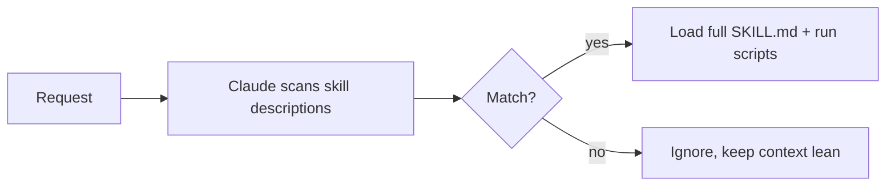

<LevelBadge level="advanced" />

<VerifyNote lastVerified="2026-06-20" source="https://code.claude.com/docs/en/skills">
La struttura dei file di skill e dove le skill vengono eseguite (Claude Code, Claude.ai, Cowork) si stanno evolvendo — verifica nella documentazione ufficiale sulle Skill.
</VerifyNote>

Una **Skill** impacchetta competenza — istruzioni più script e risorse facoltativi — che Claude carica **solo quando è pertinente**. Invece di stipare tutto in [CLAUDE.md](/docs/claude-code/claude-md), dai a Claude una libreria di capacità che richiama su richiesta.

## Anatomia

Una skill è una cartella con un `SKILL.md`: frontmatter YAML + istruzioni.

```markdown
---
name: pdf-forms
description: Use when the user needs to fill, read, or generate PDF forms.
---

# PDF Forms
Steps and rules for working with PDF forms…
(optionally reference scripts/ or resources/ in this folder)
```

La **`description` è il trigger** — Claude la legge per decidere *quando* attivare la skill. Scrivila come "Use when…", abbastanza specifica da farla caricare al momento giusto e non altrimenti.

## Divulgazione progressiva (perché le skill scalano)

Claude non carica in anticipo il corpo completo di ogni skill — vede il leggero `name` + `description`, e richiama le istruzioni complete (ed esegue gli script) solo quando una richiesta corrisponde. Questo mantiene snello il contesto anche con molte skill installate.



## Dove risiedono

- Personali: `~/.claude/skills/<name>/SKILL.md`
- Progetto (condivisibili): `.claude/skills/<name>/SKILL.md`
- Raggruppate in un [plugin](/docs/claude-code/plugins-marketplaces) per la distribuzione al team.

AILmanac fornisce [7 pacchetti di skill pronti all'uso](/docs/templates/skills) — copiane uno per provarlo.

## Skill contro comando contro subagent contro MCP

| Strumento | Cos'è | Lo attiva tu o Claude |
|---|---|---|
| [Comando slash](/docs/claude-code/slash-commands) | Un prompt salvato | Lo invochi **tu** |
| **Skill** | Competenza su richiesta + script | Lo carica **Claude** quando è pertinente |
| [Subagent](/docs/claude-code/subagents) | Un agente delegato con il proprio contesto | Claude delega |
| [MCP](/docs/claude-code/mcp) | Una connessione a strumenti/dati esterni | Fornisce strumenti da chiamare |

## Avanti

- [Scrivi la tua prima skill (tutorial)](/docs/walkthroughs/first-skill)
- [Template SKILL.md](/docs/templates/skills)
- [Plugin e marketplace](/docs/claude-code/plugins-marketplaces)
