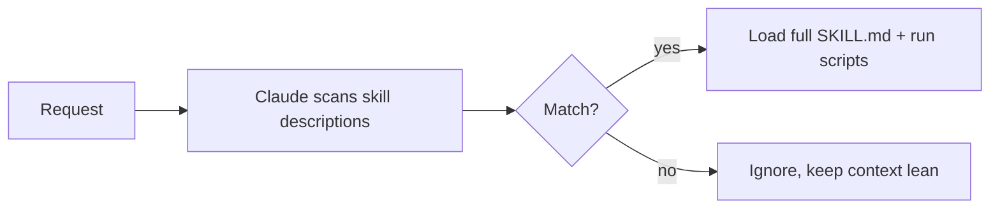

<LevelBadge level="advanced" />

<VerifyNote lastVerified="2026-06-23" source="https://code.claude.com/docs/en/skills">
La struttura dei file di skill, la divulgazione progressiva e dove le skill vengono eseguite (Claude Code, Claude.ai, Cowork) si stanno evolvendo — verifica nella documentazione ufficiale sulle Skill.
</VerifyNote>

Una **Skill** impacchetta competenza — istruzioni più script e risorse facoltativi — che Claude carica **solo quando è pertinente**. Invece di stipare tutto in [CLAUDE.md](/docs/claude-code/claude-md), dai a Claude una libreria di capacità che richiama su richiesta.

## Anatomia

Una skill è una cartella con un `SKILL.md`: frontmatter YAML + istruzioni.

```markdown
---
name: pdf-forms
description: Use when the user needs to fill, read, or generate PDF forms.
---

# PDF Forms
Steps and rules for working with PDF forms…
(optionally reference scripts/ or resources/ in this folder)
```

La **`description` è il trigger** — Claude la legge per decidere *quando* attivare la skill. Scrivila come "Use when…", abbastanza specifica da farla caricare al momento giusto e non altrimenti.

## Divulgazione progressiva (perché le skill scalano)

Claude non carica in anticipo il corpo completo di ogni skill — vede il leggero `name` + `description`, e richiama le istruzioni complete (ed esegue gli script) solo quando una richiesta corrisponde. Questo mantiene snello il contesto anche con molte skill installate.



## Dove risiedono

- Personali: `~/.claude/skills/<name>/SKILL.md`
- Progetto (condivisibili): `.claude/skills/<name>/SKILL.md`
- Raggruppate in un [plugin](/docs/claude-code/plugins-marketplaces) per la distribuzione al team.

AILmanac fornisce [7 pacchetti di skill pronti all'uso](/docs/templates/skills) — copiane uno per provarlo.

## Esempio pratico: una skill che si attiva da sola

Crea `~/.claude/skills/release-notes/SKILL.md`:

```markdown
---
name: release-notes
description: Use when the user asks to write release notes or a changelog from git history.
---

# Release Notes
1. Run `git log <last-tag>..HEAD --oneline` to get the commits.
2. Group them into Features / Fixes / Breaking changes.
3. Write user-facing notes — what changed for *users*, not commit messages.
4. Output Markdown ready to paste into a GitHub release.
```

Più tardi digiti: *"Draft release notes since v1.4."* Claude non aveva mai avuto questi passaggi nel contesto — ma la richiesta corrisponde alla `description`, quindi richiama il `SKILL.md` completo, esegue il `git log` e produce note raggruppate. Non hai invocato nulla per nome; è stata la **description a fare il routing**. Aggiungi un file `scripts/` nella stessa cartella e la skill potrà eseguirlo come parte del passaggio 1.

## Skill contro comando contro subagent contro MCP

| Strumento | Cos'è | Lo attiva tu o Claude |
|---|---|---|
| [Comando slash](/docs/claude-code/slash-commands) | Un prompt salvato | Lo invochi **tu** |
| **Skill** | Competenza su richiesta + script | Lo carica **Claude** quando è pertinente |
| [Subagent](/docs/claude-code/subagents) | Un agente delegato con il proprio contesto | Claude delega |
| [MCP](/docs/claude-code/mcp) | Una connessione a strumenti/dati esterni | Fornisce strumenti da chiamare |

Regola pratica: **tu** vuoi attivarlo su richiesta → comando slash. **Claude** deve conoscere la procedura e applicarla quando è pertinente → skill. Il lavoro deve avvenire in un contesto separato → subagent. Devi raggiungere un sistema esterno → MCP.

## Errori comuni

- **Una description che non si attiva.** "Helps with PDFs" è troppo vaga; "Use when the user needs to fill, read, or generate PDF forms" dice a Claude esattamente quando caricarla. La description è l'intero meccanismo di attivazione — scrivila per il matching, non per gli esseri umani.
- **Mettere invece tutto in CLAUDE.md.** [CLAUDE.md](/docs/claude-code/claude-md) si carica a *ogni* sessione e costa sempre contesto; una skill si carica *solo quando è pertinente*. Sposta le procedure situazionali nelle skill e tieni CLAUDE.md per le regole di progetto sempre valide.
- **Una skill gigante e unica.** Molte skill piccole e descritte con precisione fanno un routing migliore di una sola tuttofare — la divulgazione progressiva aiuta solo se ogni description è specifica.
- **Dimenticare che è condivisibile.** Una skill di progetto in `.claude/skills/` committata su git dà la capacità a tutto il team; una personale in `~/.claude/skills/` resta tua.

## Prossimi passi

- [Scrivi la tua prima skill (guida pratica)](/docs/walkthroughs/first-skill)
- [Template SKILL.md](/docs/templates/skills)
- [Plugin e marketplace](/docs/claude-code/plugins-marketplaces)
