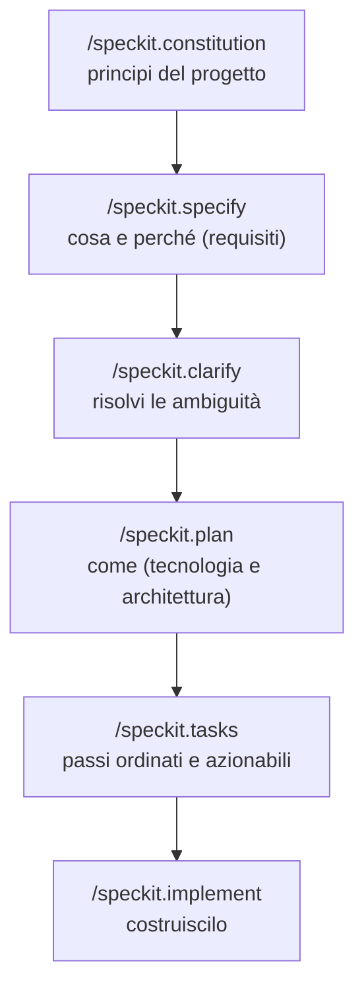

<LevelBadge level="intermediate" />

# Sviluppo guidato dalle specifiche con Spec Kit

Il vibe coding — "costruiscimi una dashboard", accetta qualunque cosa torni indietro — funziona benissimo finché la funzionalità non diventa grande. Poi l'agente va alla deriva: dimentica una decisione presa prima, re-inventa una funzione, oppure consegna qualcosa che tecnicamente gira ma non è ciò che intendevi. Lo **Sviluppo guidato dalle specifiche (Spec-Driven Development, SDD)** è la soluzione che ha preso piede in tutta la comunità dell'agentic coding nel 2026: invece di trattare il prompt come usa e getta, rendi una **specifica scritta e revisionabile la fonte di verità** e fai generare il codice all'agente *a partire da* essa.

L'open-source **[Spec Kit](https://github.com/github/spec-kit)** di GitHub trasforma quell'idea in un flusso di lavoro concreto che puoi eseguire dentro Claude Code già oggi.

<Callout type="objectives" items={["Capire cos'è lo sviluppo guidato dalle specifiche e quale problema risolve", "Percorrere le fasi di Spec Kit: constitution → specify → plan → tasks → implement", "Installare la CLI Specify e integrarla in Claude Code", "Conoscere i controlli di qualità opzionali (clarify, analyze, checklist)", "Decidere quando lo SDD vale l'overhead e quando saltarlo"]} />

<VerifyNote lastVerified="2026-06-28" source="https://github.com/github/spec-kit">
Spec Kit si muove velocemente (~116k★, con licenza MIT). I nomi dei comandi, il flag di selezione dell'agente di `specify init` e gli strumenti supportati cambiano tra una release e l'altra — verifica la quickstart attuale nel README del repo prima di affidarti alla sintassi esatta. I nomi degli slash command qui sotto usano il namespace `/speckit.*` introdotto nelle release recenti.
</VerifyNote>

## Perché le specifiche, non solo i prompt

Un prompt sparisce nel momento in cui il turno finisce. Una **specifica è un artefatto**: può essere letta, revisionata in una PR, corretta e ri-eseguita. Quel singolo cambiamento risolve i tre modi in cui le grandi build agentiche vanno male:

- **Deriva (Drift)** — l'agente contraddice una decisione precedente perché nessuno l'ha messa per iscritto. La specifica è la memoria.
- **Ambiguità** — "fallo bello" significa dieci cose diverse. Costringere i requisiti nella prosa fa emergere le lacune *prima* che il codice esista, dove sono economiche da correggere.
- **Diff non revisionabili** — una PR generata da 2.000 righe è difficile da giudicare. Una specifica + un piano revisionati rendono il diff *atteso* invece che sorprendente.

Il modello mentale: **l'intento è la cosa di valore e durevole; il codice è un artefatto a valle, rigenerabile.** Lo SDD è il cugino disciplinato della stessa [Plan Mode](/docs/claude-code/plan-mode) di Claude Code — prima pianifica, poi costruisci — scalato a un'intera funzionalità e persistito in file nel tuo repo.

## Il flusso di lavoro di Spec Kit

Spec Kit struttura una funzionalità come una breve pipeline di slash command. Ognuno scrive artefatti Markdown nel tuo repo (sotto `.specify/`), così ogni fase è ispezionabile e sotto controllo di versione.

<Steps items={[{title: "Constitution", body: "Esegui /speckit.constitution una volta per progetto. Scrive i principi di governo — stile del codice, soglia di testing, scelte architetturali non negoziabili — in .specify/memory/constitution.md. Ogni fase successiva viene verificata rispetto a essa, quindi questo è il tuo guardrail durevole (pensalo come un CLAUDE.md focalizzato sui principi)."}, {title: "Specify", body: "Esegui /speckit.specify e descrivi COSA stai costruendo e PERCHÉ — user story, requisiti, criteri di successo. Deliberatamente NON lo stack tecnologico. L'agente produce una specifica strutturata che leggi e correggi prima di andare avanti."}, {title: "Plan", body: "Esegui /speckit.plan con le tue scelte tecniche — framework, archivio dati, vincoli. Ora viene scritto il COME: architettura, componenti e come soddisfano la specifica. Le decisioni tecnologiche vivono qui, non nella specifica, così la specifica resta agnostica rispetto all'implementazione."}, {title: "Tasks", body: "Esegui /speckit.tasks per scomporre il piano in un elenco numerato e ordinato di passi piccoli e revisionabili singolarmente. È questo che rende la build verificabile — puoi vedere la sequenza prima che venga scritto qualunque codice."}, {title: "Implement", body: "Esegui /speckit.implement e l'agente esegue l'elenco dei task, costruendo la funzionalità rispetto al piano e alla constitution. Poiché ogni fase precedente è stata revisionata, il diff risultante è atteso, non una sorpresa."}]} />

### Controlli di qualità opzionali

Altri tre comandi stringono il ciclo quando una funzionalità è ad alto rischio:

- **`/speckit.clarify`** — interroga la specifica per le aree sotto-specificate e ti pone domande mirate *prima* della pianificazione. È meglio eseguirlo subito dopo `specify`.
- **`/speckit.analyze`** — verifica in modo incrociato specifica, piano e task per coerenza e lacune di copertura.
- **`/speckit.checklist`** — genera una checklist di validazione così che "fatto" sia definito e testabile.

<Callout type="tip" items={["Esegui /speckit.clarify prima di /speckit.plan — correggere l'ambiguità è più economico prima che l'architettura sia decisa.", "Tratta ogni artefatto generato come una PR: leggilo, correggilo e solo allora avanza alla fase successiva.", "Committa gli artefatti .specify/ — sono il registro revisionabile dell'intento dietro al codice."]} />

## Mettilo in funzione con Claude Code

Spec Kit include una CLI, **Specify**, che genera gli slash command nel tuo progetto. Supporta oltre 30 agenti di coding, tra cui Claude Code.

<Steps items={[{title: "Installa la CLI Specify", body: "Usa uv per installarla dal repo. (Richiede Python + uv.)"}, {title: "Inizializza un progetto", body: "Genera la struttura .specify/ e i comandi dell'agente. Esegui init in un repo nuovo o esistente; quando richiesto, scegli Claude Code come agente (oppure passa il flag di integrazione attuale dal README)."}, {title: "Apri Claude Code e controlla i comandi", body: "Avvia claude nella cartella del progetto. Saprai che è tutto collegato quando /speckit.constitution, /speckit.specify, /speckit.plan, /speckit.tasks e /speckit.implement compaiono come slash command."}]} />

<PromptCard title="Install the Specify CLI (uv)">{`uv tool install specify-cli --from git+https://github.com/github/spec-kit.git`}</PromptCard>

<PromptCard title="Scaffold spec-driven workflow into a project">{`# new project
specify init my-feature

# or in the current repo
specify init --here`}</PromptCard>

<PromptCard title="Then, inside Claude Code, run the pipeline">{`/speckit.constitution Establish principles: TypeScript strict, tests for every public function, no secrets in code.
/speckit.specify Build a CSV export for the reports page: users pick a date range and download a CSV of matching rows.
/speckit.clarify
/speckit.plan Next.js App Router, server action for the query, stream the CSV; no new dependencies.
/speckit.tasks
/speckit.implement`}</PromptCard>

<Callout type="warning" items={["Il flag esatto di selezione dell'agente per specify init cambia tra una release e l'altra — controlla la quickstart nel README invece di copiare un flag alla cieca.", "Lo SDD non elimina la necessità di verificare: leggi il codice generato ed eseguilo. La specifica rende il diff revisionabile, non automaticamente corretto.", "Non mettere mai segreti o credenziali nella specifica, nel piano o nella constitution — vengono committati come qualunque altro file."]} />

## Quando usarlo (e quando no)

Lo SDD scambia un po' di cerimonia iniziale per ottenere controllo. Quello scambio vale la pena quando il lavoro è grande, ambiguo o deve essere revisionato da altri — ed è puro overhead quando non lo è.

<Callout type="info" items={["Usa lo SDD: funzionalità greenfield, build su più file, qualunque cosa un collega debba revisionare, oppure lavoro che affiderai a una flotta di subagent.", "Salta lo SDD: script una tantum, fix minuscoli, codice esplorativo usa e getta — un semplice prompt o la Plan Mode è più veloce.", "Funziona anche su brownfield: punta /speckit.specify a un miglioramento di un codebase esistente, non solo a progetti nuovi."]} />

<Flashcards title="SDD at a glance" cards={[{front: "Qual è la fonte di verità nello SDD?", back: "La specifica scritta. Il codice è un artefatto rigenerabile a valle di essa."}, {front: "Cosa fa /speckit.constitution?", back: "Scrive i principi durevoli del progetto (stile, soglia di testing, regole architetturali) rispetto ai quali ogni fase successiva viene verificata."}, {front: "Dove vanno le decisioni sullo stack tecnologico?", back: "In /speckit.plan — non nella specifica. La specifica resta agnostica rispetto all'implementazione (cosa e perché); il piano è il come."}, {front: "Cosa rende verificabile una build di Spec Kit?", back: "/speckit.tasks produce un elenco di task ordinato e revisionabile prima che venga scritto qualunque codice, e ogni fase scrive artefatti Markdown ispezionabili."}, {front: "Quando NON dovresti usare lo SDD?", back: "Script una tantum, fix minuscoli o esplorazione usa e getta — la cerimonia costa più di quanto faccia risparmiare."}]} />

## Mettiti alla prova

<Quiz title="Check yourself" questions={[{q: "Qual è l'idea centrale dello sviluppo guidato dalle specifiche?", options: ["Scrivere prompt una tantum più dettagliati", "Rendere una specifica revisionabile la fonte di verità e generare il codice a partire da essa", "Saltare la pianificazione e lasciare improvvisare l'agente"], answer: 1, explain: "Lo SDD tratta l'intento come l'artefatto durevole e di valore e il codice come un output a valle, rigenerabile — l'opposto del vibe coding con prompt usa e getta."}, {q: "Quale fase di Spec Kit dovrebbe catturare lo stack tecnologico e l'architettura?", options: ["/speckit.specify", "/speckit.plan", "/speckit.constitution"], answer: 1, explain: "specify descrive il COSA e il PERCHÉ (agnostico rispetto all'implementazione); plan è dove si decide il COME — framework, archivio dati, architettura."}, {q: "Quando lo sviluppo guidato dalle specifiche NON vale l'overhead?", options: ["Una funzionalità greenfield su più file che un collega deve revisionare", "Uno script usa e getta di una riga o un fix minuscolo", "Qualunque lavoro che affiderai ai subagent"], answer: 1, explain: "La cerimonia iniziale dello SDD ripaga su lavori grandi, ambigui o revisionati. Per un fix banale, un semplice prompt o la Plan Mode è più veloce."}]} />

<Callout type="takeaways" items={["Lo sviluppo guidato dalle specifiche rende una specifica revisionabile — non il prompt — la fonte di verità, eliminando deriva, ambiguità e diff non revisionabili.", "Spec Kit di GitHub (la CLI Specify) porta lo SDD in Claude Code come slash command /speckit.*.", "La pipeline è constitution → specify → (clarify) → plan → (analyze) → tasks → (checklist) → implement, e ogni fase scrive artefatti ispezionabili.", "Tieni il COSA/PERCHÉ nella specifica e il COME nel piano; revisiona ogni artefatto come una PR prima di avanzare.", "Usalo per funzionalità grandi, ambigue o revisionate; saltalo per lavoro usa e getta — e verifica sempre comunque il codice generato."]} />

## Avanti

- [Plan Mode](/docs/claude-code/plan-mode) — il ciclo integrato e più leggero "pianifica prima di costruire"
- [Slash Commands](/docs/claude-code/slash-commands) — come i comandi /speckit.* si inseriscono nel sistema di comandi di Claude Code
- [CLAUDE.md & Memory Files](/docs/claude-code/claude-md) — l'idea dei principi-come-memoria dietro la constitution
- [Subagents](/docs/claude-code/subagents) — affida un elenco di task revisionato a una flotta di agenti
- [Coding & Software Development](/docs/playbooks/coding) — la mentalità del verifica-tutto da cui dipende lo SDD

## Fonti e approfondimenti

- [github/spec-kit — Toolkit for Spec-Driven Development](https://github.com/github/spec-kit) (MIT)
- [Spec Kit README & quickstart](https://github.com/github/spec-kit/blob/main/README.md)
- [Anthropic — Plan Mode in Claude Code](https://code.claude.com/docs/en/interactive-mode)
