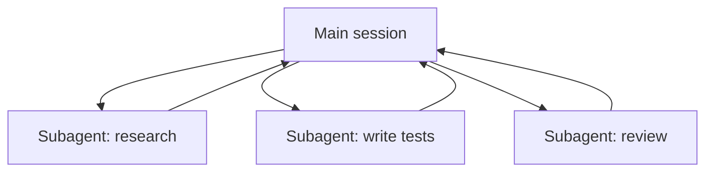

<LevelBadge level="advanced" />

<VerifyNote lastVerified="2026-06-20" source="https://code.claude.com/docs/en/sub-agents">
La configurazione dei subagent e l'interfaccia `/agents` cambiano nel tempo — verifica nella documentazione ufficiale.
</VerifyNote>

Un **subagent** è un'istanza separata di Claude con la **propria finestra di contesto** e un **insieme circoscritto di strumenti**, a cui la tua sessione principale delega una porzione di lavoro. Riporta indietro un risultato, non l'intera trascrizione — così la sessione principale resta focalizzata e senza ingombri.

## Perché delegare

- **Proteggere il contesto principale.** Un'immersione di ricerca o una grande scansione di file può bruciare migliaia di token; falla in un subagent e torna solo la conclusione.
- **Specializzare.** Dai a un subagent un system prompt su misura e solo gli strumenti di cui ha bisogno (ad esempio un revisore in sola lettura).
- **Parallelizzare.** Esegui sottoattività indipendenti contemporaneamente — ad esempio esplora tre moduli simultaneamente.

## Come definirli

I subagent sono configurati come file Markdown con frontmatter (nome, descrizione, strumenti consentiti, talvolta un modello), gestiti tramite l'interfaccia `/agents`. La `description` dice all'agente principale *quando* delegare a esso. Circoscrivi gli strumenti in modo stretto — un revisore raramente ha bisogno di accesso in scrittura.

## Quando NON parallelizzare

:::warning Il parallelo non è gratis
- **I passaggi dipendenti** devono essere sequenziali — non distribuire il lavoro dove il passaggio B ha bisogno dell'output del passaggio A.
- **Le scritture su file condivisi** possono entrare in conflitto; isolale (vedi [Git worktree](/docs/claude-code/worktrees)) o serializzale.
- **L'overhead di coordinamento** può superare il beneficio per le attività piccole. Delega quando la sottoattività è consistente e indipendente.
:::

## Subagent contro gli "agenti" di API/SDK

Questa pagina riguarda la delega integrata di Claude Code. Costruire i *tuoi* agenti in modo programmatico è trattato in [Costruire agenti sull'API](/docs/api/building-agents). Il modello mentale — un obiettivo, un ciclo di strumenti, un contesto isolato — è lo stesso.

## Avanti

- [Progetta un workflow multi-subagent (tutorial)](/docs/walkthroughs/multi-subagent-workflow)
- [Gestione del contesto](/docs/claude-code/context-management)
- [Git worktree](/docs/claude-code/worktrees)
