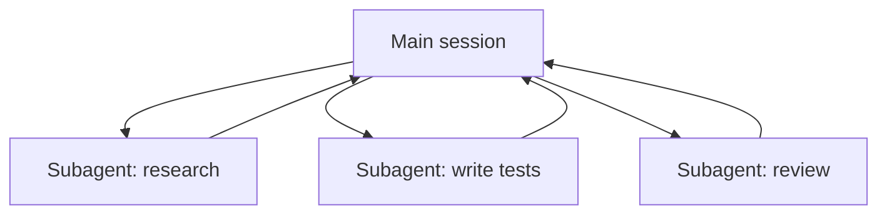

<LevelBadge level="advanced" />

<VerifyNote lastVerified="2026-06-23" source="https://code.claude.com/docs/en/sub-agents">
I campi del frontmatter dei subagent, l'elenco degli agenti integrati e l'interfaccia `/agents` cambiano nel tempo: verifica nella documentazione ufficiale.
</VerifyNote>

Un **subagent** è un'istanza separata di Claude con una **propria finestra di contesto** e un **insieme circoscritto di strumenti**, a cui la tua sessione principale delega una porzione di lavoro. Riporta indietro un risultato, non l'intera trascrizione, così la sessione principale resta concentrata e ordinata.

## Perché delegare

- **Proteggere il contesto principale.** Un'indagine di ricerca o una scansione di file di grandi dimensioni possono bruciare migliaia di token; falla in un subagent e tornerà solo la conclusione.
- **Specializzare.** Dai a un subagent un system prompt su misura e solo gli strumenti di cui ha bisogno (ad es. un revisore in sola lettura).
- **Parallelizzare.** Esegui contemporaneamente sottoattività indipendenti, ad es. esplora tre moduli simultaneamente.



## Quelli integrati che hai già

Prima di definirne di tuoi, sappi che Claude Code include subagent a cui delega automaticamente:

- **Explore** — un agente veloce e in sola lettura (gira su un modello più economico) per cercare e comprendere una codebase senza modificarla.
- **Plan** — raccoglie contesto durante la modalità di pianificazione, così la ricerca resta fuori dalla conversazione principale in sola lettura.
- **General-purpose** — un agente con strumenti completi per lavori complessi e multi-step che combinano esplorazione e modifiche.

Raramente li invochi per nome; Claude vi ricorre quando un'attività è adatta. I subagent personalizzati servono per i lavoratori che *tu* continui a ricreare con le stesse istruzioni.

## Definire i tuoi

Un subagent è un file Markdown con frontmatter YAML (il corpo diventa il suo system prompt). Solo `name` e `description` sono obbligatori; tutto il resto è opzionale. Conservalo per progetto in `.claude/agents/` (mettilo sotto git così il team lo condivide) o per utente in `~/.claude/agents/`. Creane uno con il comando `/agents` o a mano:

```markdown
---
name: code-reviewer
description: Expert code reviewer. Use proactively after code changes.
tools: Read, Glob, Grep
model: sonnet
---

You are a senior reviewer. Read the changed files, then report only
high-confidence issues: correctness bugs, security risks, and missing
tests. For each, show the file:line, the problem, and a concrete fix.
Do not restate what the code does. Never edit files.
```

Due cose rendono buono un subagent:

- **La `description` è il segnale di routing.** Claude la legge per decidere *quando* delegare, quindi scrivila come un trigger: "Use proactively after code changes" lo richiama automaticamente; un vago "helps with code" no. Questa è la singola riga del file con la maggiore leva.
- **Circoscrivi gli strumenti in modo stretto.** Il campo `tools` è una allowlist (oppure usa `disallowedTools` come denylist). Un revisore che può solo `Read, Glob, Grep` *non può* modificare accidentalmente il tuo codice: la restrizione è una garanzia, non un suggerimento. Ometti `tools` e il subagent eredita tutto ciò che ha la sessione principale.

## Esempio pratico: un fan-out di revisione parallela

Hai terminato una funzionalità che tocca tre moduli e vuoi un controllo rapido e indipendente di ciascuno. Nella tua sessione principale:

> "Rivedi le modifiche in `auth/`, `billing/` e `api/` — usa il subagent code-reviewer su ciascuno, in parallelo."

Claude genera tre istanze di `code-reviewer` contemporaneamente. Ognuna legge solo il proprio modulo, consuma il proprio contesto sul contenuto dei file e restituisce un breve elenco di rilievi. La tua sessione principale non vede mai i diff grezzi, ma solo tre report ordinati, e l'intera operazione termina all'incirca nel tempo della singola istanza di revisione più lenta anziché nella somma di tutte e tre. Poiché il revisore è in sola lettura, tre agenti che lavorano contemporaneamente non possono entrare in conflitto su una scrittura.

## Quando NON parallelizzare

:::warning Il parallelismo non è gratis
- **I passaggi dipendenti** devono essere sequenziali: non distribuire lavoro in cui il passaggio B ha bisogno dell'output del passaggio A.
- **Le scritture su file condivisi** possono entrare in conflitto; isolale (vedi [Git Worktree](/docs/claude-code/worktrees)) o serializzale.
- **Il sovraccarico di coordinamento** può superare il beneficio per attività piccole. Delega quando la sottoattività è consistente e indipendente.
:::

## Subagent vs gli "agent" dell'API/SDK

Questa pagina riguarda la delega integrata di Claude Code. Costruire i *tuoi* agenti in modo programmatico è descritto in [Costruire agenti sull'API](/docs/api/building-agents). Il modello mentale — un obiettivo, un loop di strumenti, contesto isolato — è lo stesso.

## Errori comuni

- **Una `description` vaga.** Se non dice *quando* usare il subagent, Claude non delegherà al momento giusto (o non delegherà affatto). Inizia con "Use when…" / "Use proactively after…".
- **Lasciare gli strumenti completamente aperti.** Un subagent pensato per revisionare non dovrebbe poter scrivere. Una allowlist trasforma l'intento in una garanzia.
- **Aspettarsi memoria condivisa.** Un subagent riceve la sua `description`, il suo system prompt e l'attività che gli affidi, non la tua conversazione principale. Passa nella delega il contesto di cui ha bisogno.
- **Distribuire lavoro dipendente.** Il parallelismo aiuta solo per sottoattività *indipendenti*; se B ha bisogno dell'output di A, eseguili in sequenza.

## Prossimi passi

- [Progettare un workflow multi-subagent (guida pratica)](/docs/walkthroughs/multi-subagent-workflow)
- [Gestione del contesto](/docs/claude-code/context-management)
- [Git Worktree](/docs/claude-code/worktrees)
