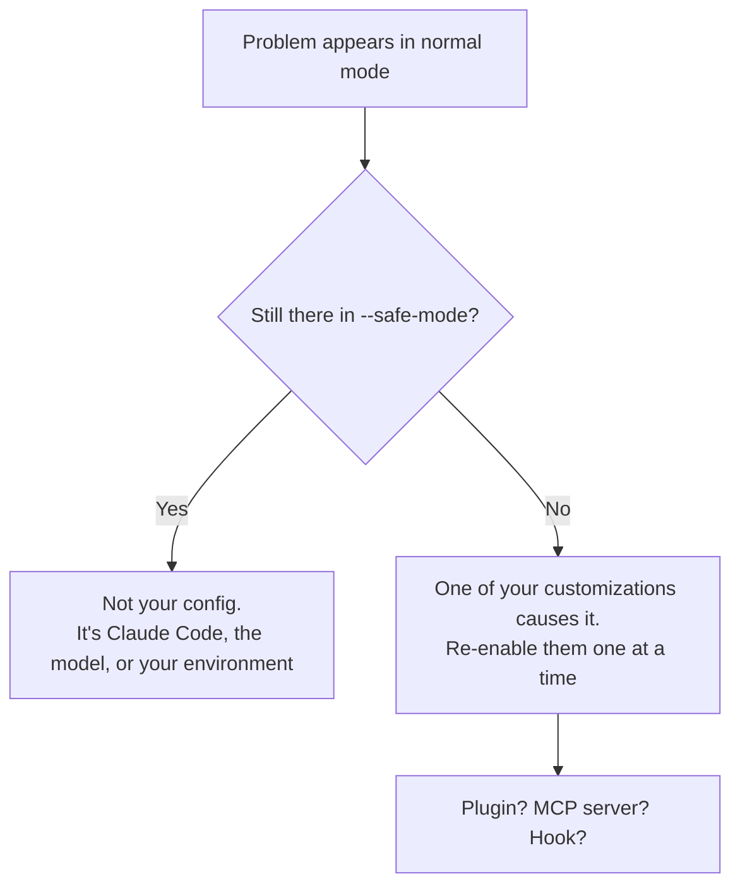

<LevelBadge level="intermediate" />

<Callout type="objectives" items={["Indirizzare qualsiasi problema di Claude Code alla sua soluzione in un solo passaggio, usando una tabella dei sintomi", "Eseguire i due comandi diagnostici che risolvono la maggior parte dei problemi di configurazione, prima di mettersi a debuggare a mano", "Isolare se la causa reale è un plugin, un server MCP o un hook", "Risolvere i quattro classici guasti a runtime: memoria elevata, blocchi, thrashing della compattazione e ricerca che non trova nulla", "Raccogliere le prove giuste prima di aprire una segnalazione di bug"]} />

<VerifyNote lastVerified="2026-07-17" source="https://code.claude.com/docs/en/troubleshooting">
I comandi, i flag e le variabili d'ambiente di questa pagina sono verificati sulla documentazione ufficiale di troubleshooting di Claude Code. Le diagnostiche cambiano tra una release e l'altra — verifica lì prima di affidarti a un flag esatto.
</VerifyNote>

## L'idea di fondo

Quasi ogni problema di Claude Code è di uno di due tipi, e hanno soluzioni completamente diverse:

- **La tua configurazione è sbagliata** — un plugin, un server MCP, un hook, un file di impostazioni, un binario mancante. La soluzione è *configurazione*.
- **La sessione è sotto sforzo** — la finestra di contesto è piena, un file enorme ha fatto esplodere la memoria, il terminale non riesce a renderizzare. La soluzione è *igiene*.

È tirando a indovinare su quale dei due sia che si perde un pomeriggio. La tabella qui sotto elimina il tirare a indovinare.

:::tip Un tipo di "stranezza" diverso?
Questa pagina riguarda lo **strumento** che si comporta male — non parte, si blocca, la ricerca non trova nulla. Se è il **modello** a comportarsi male — si è inventato un fatto, ha dimenticato un'istruzione, ha rifiutato qualcosa di ragionevole — quella è un'altra pagina: [Perché Claude ha fatto così?](/docs/contribute/troubleshooting)
:::

## Parti da qui: sintomo → dove andare

Trova il tuo sintomo. Non leggere il resto della pagina.

| Sintomo | Vai a |
|---|---|
| `command not found`, installazione fallita, `EACCES`, errori di PATH o TLS | [Ufficiale: installazione e login](https://code.claude.com/docs/en/troubleshoot-install) |
| Login in loop, errori OAuth, `403 Forbidden`, "organization disabled" | [Ufficiale: login e autenticazione](https://code.claude.com/docs/en/troubleshoot-install#login-and-authentication) |
| Impostazioni che non vengono applicate, hook che non scattano, server MCP che non si caricano | [Isola la tua configurazione](#isola-la-tua-configurazione) qui sotto |
| `API Error: 5xx`, `529 Overloaded`, `429`, errori di validazione | [Errori e limiti di frequenza](/docs/api/errors-and-rate-limits) |
| `model not found` / "you may not have access to it" | [Modelli e prezzi attuali](/docs/whats-new/models-and-pricing) |
| VS Code o JetBrains non rilevano Claude | [Integrazioni IDE](/docs/claude-code/ide-integrations) |
| CPU o memoria elevate | [Memoria e CPU](#memoria-e-cpu) qui sotto |
| Blocchi, freeze, mancate risposte | [Blocchi e freeze](#blocchi-e-freeze) qui sotto |
| `Autocompact is thrashing` | [Thrashing della compattazione](#thrashing-della-compattazione) qui sotto |
| La ricerca, `@file`, gli agent o le skill non trovano i file | [La ricerca non trova nulla](#la-ricerca-non-trova-nulla) qui sotto |
| Riquadri, sbavature o glifi sbagliati nel terminale dell'IDE | [Testo illeggibile nel terminale](#testo-illeggibile-nel-terminale) qui sotto |

## I due comandi da eseguire per primi

Prima di metterti a debuggare a mano, esegui il checkup integrato. Diagnostica installazione, impostazioni, estensioni e uso del contesto — e propone correzioni che può applicare dopo la tua conferma.

<Steps items={[{title: "Esegui il checkup dall'interno di una sessione", body: "/doctor (il suo alias è /checkup) ispeziona installazione, impostazioni, estensioni e uso del contesto, poi si offre di applicare le correzioni che può. Solo questo risolve la maggior parte delle lamentele sulla configurazione."}, {title: "Se Claude Code non parte nemmeno, eseguilo dalla shell", body: "claude doctor fa lo stesso checkup dall'esterno di una sessione, così una configurazione rotta non può bloccare lo strumento che dovrebbe diagnosticarla."}, {title: "Se il problema sa di tool o connettore, controlla MCP a parte", body: "/mcp stampa lo stato live di ogni server MCP configurato — il modo più rapido per capire se un server non si è caricato invece di comportarsi male."}]} />

<PromptCard title="Diagnosticare una configurazione rotta">{`# inside a session
/doctor

# if the session won't start at all
claude doctor

# check MCP server status
/mcp`}</PromptCard>

## Isola la tua configurazione

Se le impostazioni non vengono applicate, gli hook non scattano o c'è semplicemente qualcosa *che non va*, la domanda non è mai "cosa è rotto" — è **quale delle tue personalizzazioni è rotta**. Rispondi rimuovendole tutte in una volta.

`--safe-mode` avvia Claude Code con ogni personalizzazione disabilitata: niente plugin, niente server MCP, niente hook.

<PromptCard title="Testare con una configurazione pulita">{`claude --safe-mode`}</PromptCard>

Questo ti dà un risultato binario e netto:



Una volta che sai che è una personalizzazione, fai bisezione: riabilitale a gruppi finché il problema non ritorna. I sospetti, in ordine approssimativo di quanto spesso sono i colpevoli, sono i [server MCP](/docs/claude-code/mcp), gli [hook](/docs/claude-code/hooks), i [plugin](/docs/claude-code/plugins-marketplaces) e le [impostazioni](/docs/claude-code/settings).

<Callout type="tip" items={["--safe-mode è la prima mossa giusta anche per lentezze misteriose, non solo per i guasti conclamati. Un server MCP troppo chiacchierone è una causa molto comune di entrambi."]} />

## Memoria e CPU

Claude Code funziona con la maggior parte degli ambienti, ma su codebase grandi può consumare risorse reali. Affronta questi punti in ordine — sono ordinati dal più economico.

<Steps items={[{title: "Compatta regolarmente", body: "Esegui /compact per ridurre il contesto. Una finestra di contesto gonfia è di gran lunga la causa più comune di una sessione pesante. Vedi /docs/claude-code/context-management."}, {title: "Riavvia tra un task importante e l'altro", body: "Chiudi e riavvia Claude Code quando passi a un lavoro scorrelato, invece di lasciare che un solo processo accumuli un pomeriggio di stato."}, {title: "Nascondi le directory di build grandi", body: "Aggiungi output di build, cache e dipendenze vendorizzate a .gitignore, così non entrano mai in una ricerca o in una lettura."}, {title: "Escludi le tue personalizzazioni", body: "Riavvia con claude --safe-mode. Se il consumo cala, la causa è un plugin, un server MCP o un hook — da lì fai bisezione."}, {title: "Se la memoria resta alta, raccogli prove", body: "Esegui /heapdump per scrivere uno snapshot dell'heap JavaScript più un riepilogo della memoria su ~/Desktop (o nella home directory su Linux senza una cartella Desktop)."}]} />

Il riepilogo di `/heapdump` riporta resident set size, heap JS, array buffer e memoria nativa non attribuita. Quella suddivisione è la parte utile: ti dice se la crescita è negli oggetti JavaScript o giù nel codice nativo. Per ispezionare cosa tiene viva la memoria, apri il file `.heapsnapshot` in Chrome DevTools sotto **Memory → Load**.

<VerifyNote lastVerified="2026-07-17" source="https://code.claude.com/docs/en/troubleshooting">
`/heapdump` scrive su `~/Desktop`, con fallback sulla home directory nei sistemi Linux senza una cartella Desktop. Allega entrambi i file quando segnali un problema di memoria.
</VerifyNote>

## Blocchi e freeze

Se Claude Code smette di rispondere:

<Steps items={[{title: "Annulla l'operazione in corso", body: "Premi Ctrl+C. Questo interrompe qualunque cosa sia in esecuzione senza uccidere la sessione."}, {title: "Se continua a non rispondere, chiudi il terminale", body: "Chiudi il terminale e riavvia. Sembra distruttivo, ma non lo è."}, {title: "Riprendi da dove eri rimasto", body: "Esegui claude --resume nella STESSA directory. Riavviare non fa perdere la conversazione — il transcript sopravvive al processo."}]} />

<Callout type="tip" items={["La paura di perdere una conversazione lunga è il motivo per cui si aspetta la fine di un blocco invece di ucciderlo. Non farlo — claude --resume nella stessa directory riporta indietro la sessione."]} />

## Thrashing della compattazione

Questo errore sembra allarmante ed è in realtà una *protezione*:

```
Autocompact is thrashing: the context refilled to the limit...
```

Significa che la compattazione automatica è **riuscita** — e poi un file o l'output di un tool ha immediatamente riempito di nuovo l'intera finestra di contesto, diverse volte di fila. Claude Code smette di riprovare invece di bruciare chiamate API su un loop che non sta facendo progressi.

La causa è quasi sempre una singola cosa sovradimensionata letta per intero. Scegli la soluzione adatta alla tua situazione:

| Situazione | Soluzione |
|---|---|
| Il problema è un singolo file enorme | Chiedi a Claude di leggere un intervallo di righe o una singola funzione invece dell'intero file |
| Il contesto contiene un output grande che non ti serve più | `/compact` con un focus che lo scarta |
| La lettura grande è davvero necessaria | Spostala su un [subagent](/docs/claude-code/subagents), così brucia una finestra di contesto separata |
| La conversazione precedente non conta più | `/clear` |

<PromptCard title="Compattare con un focus che scarta il superfluo">{`/compact keep only the plan and the diff`}</PromptCard>

L'opzione subagent è quella che si dimentica, ed è spesso la migliore: un subagent legge il file gigante nel *suo* contesto e restituisce al tuo solo la conclusione. Vedi [Gestione del contesto](/docs/claude-code/context-management) e [Subagent](/docs/claude-code/subagents).

## La ricerca non trova nulla

Se il tool Search, le menzioni `@file`, gli agent personalizzati o le skill personalizzate non trovano file che sai esistere, probabilmente il binario `ripgrep` incluso non riesce a girare sul tuo sistema. La soluzione è installare il `ripgrep` della tua piattaforma e dire a Claude Code di usare quello.

<Steps items={[{title: "Installa ripgrep per la tua piattaforma", body: "macOS: brew install ripgrep — Ubuntu/Debian: sudo apt install ripgrep — Alpine: apk add ripgrep — Arch: pacman -S ripgrep — Windows: winget install BurntSushi.ripgrep.MSVC"}, {title: "Di' a Claude Code di smettere di usare il binario incluso", body: "Imposta USE_BUILTIN_RIPGREP=0 nel tuo ambiente. Senza questo passaggio, installare ripgrep non cambia nulla."}, {title: "Verifica", body: "Riesegui la ricerca o la menzione @file che falliva. Esegui /doctor se continua a non restituire nulla."}]} />

<PromptCard title="Sistemare la ricerca su macOS">{`brew install ripgrep
export USE_BUILTIN_RIPGREP=0`}</PromptCard>

### L'eccezione WSL

Su WSL, i risultati di ricerca incompleti in genere **non** sono un binario rotto. Leggere attraverso il confine tra filesystem Windows e Linux comporta una penalità di prestazioni sul disco, quindi la ricerca restituisce meno corrispondenze del previsto. La ricerca funziona comunque — semplicemente rende meno del dovuto.

<Callout type="warning" items={["Su WSL, claude doctor riporta Search come OK anche mentre i risultati sono incompleti. Un checkup verde non esclude questo caso — ed è esattamente ciò che lo rende difficile da diagnosticare."]} />

Tre vie d'uscita, dalla migliore: sposta il progetto sul filesystem Linux (`/home/`) invece che su `/mnt/c/`; esegui Claude Code nativamente su Windows invece che tramite WSL; oppure restringi le ricerche così da scandire meno file — "Search for JWT validation logic in the auth-service package" batte "find the auth code".

## Testo illeggibile nel terminale

Caratteri che vengono renderizzati come riquadri, sbavature o glifi sbagliati dentro il terminale integrato di VS Code, Cursor o Devin Desktop sono un problema del **renderer GPU**, non un problema di font o di codifica.

<PromptCard title="Sistemare i glifi illeggibili in un terminale IDE">{`/terminal-setup`}</PromptCard>

Questo imposta `terminal.integrated.gpuAcceleration` su `"off"`. In alternativa puoi impostarlo a mano nelle impostazioni dell'editor e ricaricare la finestra — stesso risultato.

## Le tabelle grandi vengono troncate

Una tabella Markdown oltre le 200 righe renderizza le prime 200 seguite da una riga `… N more rows not shown`. Questo è **solo un limite di visualizzazione** — la tabella completa è ancora nella conversazione, e `/copy` copia ogni riga. Per una tabella troppo grande da leggere in un terminale, chiedi a Claude di scriverla su un file.

<VerifyNote lastVerified="2026-07-17" source="https://code.claude.com/docs/en/troubleshooting">
Il limite di visualizzazione a 200 righe è arrivato in Claude Code v2.1.208. Prima venivano renderizzate tutte le righe, quindi riprendere una sessione contenente una tabella molto grande poteva impantanarsi mentre la ri-renderizzava.
</VerifyNote>

## Scrivere una buona segnalazione di bug

Se qui non c'è nulla che ti calzi, segnalalo — ma porta prove. Una segnalazione che dice "è lento" non porta da nessuna parte; una con uno snapshot dell'heap e un risultato in `--safe-mode` viene risolta.

<Steps items={[{title: "Esegui /doctor e /mcp", body: "Cattura cosa dice il checkup e quali server MCP sono effettivamente caricati. Metà dei bug segnalati trova risposta qui."}, {title: "Annota se --safe-mode cambia qualcosa", body: "Questo singolo dato dice a chi mantiene il progetto se guardare a Claude Code o alle tue personalizzazioni. È la riga più preziosa della tua segnalazione."}, {title: "Allega artefatti per i problemi di risorse", body: "Per i problemi di memoria, allega entrambi i file scritti da /heapdump — lo snapshot e il riepilogo."}, {title: "Invia", body: "Usa /feedback dentro Claude Code per segnalare direttamente ad Anthropic, oppure controlla prima github.com/anthropics/claude-code per un problema già noto."}]} />

<Callout type="takeaways" items={["Esegui prima /doctor (alias /checkup) — dalla shell come claude doctor se la sessione non parte. Diagnostica installazione, impostazioni, estensioni e uso del contesto, e può applicare correzioni.", "claude --safe-mode disabilita tutte le personalizzazioni in una volta. Che il problema sopravviva o no è il dato più informativo che tu possa raccogliere.", "Memoria elevata: /compact, riavvia tra un task e l'altro, metti le directory di build in .gitignore, poi --safe-mode, poi /heapdump per le prove.", "Un blocco non è una conversazione persa — Ctrl+C, poi riavvia il terminale, poi claude --resume nella stessa directory.", "Il thrashing dell'autocompact significa che una lettura sovradimensionata riempie di nuovo la finestra. Leggi a pezzi, /compact con un focus, o delega la lettura a un subagent.", "La ricerca che non trova nulla di solito significa che il ripgrep incluso non riesce a girare: installa il ripgrep della tua piattaforma E imposta USE_BUILTIN_RIPGREP=0. Su WSL è invece una penalità del confine tra filesystem — e claude doctor riporta comunque Search come OK."]} />

<Quiz title="Verifica le tue conoscenze" questions={[{q: "Gli hook non scattano e le impostazioni sembrano ignorate. Qual è la singola cosa più informativa da provare?", options: ["Reinstallare Claude Code", "Eseguire claude --safe-mode e vedere se il problema sopravvive", "Cancellare il tuo CLAUDE.md"], answer: 1, explain: "--safe-mode disabilita tutte le personalizzazioni in una volta. Se il problema sparisce, la causa è uno dei tuoi plugin, server MCP o hook e puoi fare bisezione. Se sopravvive, la tua configurazione non è la causa — il che è ugualmente utile da sapere."}, {q: "Claude Code si blocca a metà task e Ctrl+C non aiuta. Chiudi il terminale. Che ne è della tua conversazione?", options: ["È persa — ecco perché conviene aspettare la fine dei blocchi", "Sopravvive — esegui claude --resume nella stessa directory", "È salvata solo se hai eseguito /compact prima"], answer: 1, explain: "Riavviare non fa perdere la conversazione. Esegui claude --resume nella STESSA directory per riprendere la sessione. La paura di perdere il transcript è esattamente il motivo per cui si aspetta inutilmente la fine dei blocchi."}, {q: "Vedi 'Autocompact is thrashing: the context refilled to the limit...'. Cosa è successo davvero?", options: ["La compattazione è fallita e il contesto è corrotto", "La compattazione è riuscita, ma un file o l'output di un tool ha subito riempito di nuovo la finestra diverse volte di fila", "Il tuo piano ha esaurito i token"], answer: 1, explain: "La compattazione è riuscita — poi qualcosa di sovradimensionato ha riempito di nuovo il contesto ripetutamente. Claude Code smette di riprovare per non bruciare chiamate API su un loop che non progredisce. Risolvi la lettura sovradimensionata: spezzala, /compact con un focus, o spostala su un subagent."}, {q: "Hai installato ripgrep con brew perché le menzioni @file non trovavano nulla, ma la ricerca è ancora rotta. Cosa ti sei perso?", options: ["Devi riavviare la macchina", "Devi anche impostare USE_BUILTIN_RIPGREP=0 così Claude Code usa il tuo binario invece di quello incluso", "brew installa la versione sbagliata — usa apt"], answer: 1, explain: "Installare ripgrep da solo non cambia nulla. Devi impostare USE_BUILTIN_RIPGREP=0 nel tuo ambiente per dire a Claude Code di usare il binario della tua piattaforma invece di quello incluso che non riusciva a girare."}, {q: "Su WSL la ricerca restituisce meno corrispondenze del previsto ma claude doctor riporta Search come OK. Cosa sta succedendo?", options: ["doctor sta mentendo — il binario ripgrep è rotto", "Leggere attraverso il confine tra filesystem Windows e Linux comporta una penalità sul disco, quindi la ricerca rende meno pur continuando a funzionare", "Il tuo progetto è troppo grande da indicizzare"], answer: 1, explain: "Su WSL, le penalità di lettura cross-filesystem fanno sì che la ricerca restituisca meno risultati che su un filesystem nativo. Continua a funzionare, quindi doctor riporta Search come OK — ed è questo che la rende difficile da individuare. Sposta il progetto su /home/, esegui nativamente su Windows, o invia ricerche più mirate."}]} />

## Prossimi passi

- [Perché Claude ha fatto così?](/docs/contribute/troubleshooting) — risolvere i problemi di comportamento del *modello* invece che dello strumento
- [Gestione del contesto](/docs/claude-code/context-management) — `/compact` vs `/clear`, e come mantenere le sessioni leggere
- [Errori e limiti di frequenza](/docs/api/errors-and-rate-limits) — `429`, `529` e strategie di retry sull'API
- [Costo in token di MCP](/docs/claude-code/mcp-token-cost) — quando un server connesso è silenziosamente il problema
