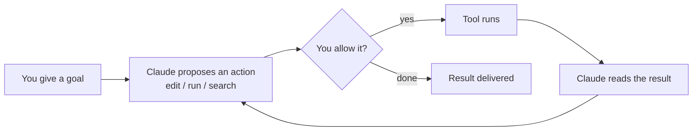

<LevelBadge level="beginner" />

<VerifyNote lastVerified="2026-06-20" source="https://docs.anthropic.com/en/docs/claude-code/overview">
I comandi di installazione e l'esatto insieme di funzionalità cambiano spesso. Considera la documentazione ufficiale di Claude Code come la fonte autorevole per la configurazione.
</VerifyNote>

**Claude Code** è lo strumento di coding *agentico* di Anthropic. A differenza di una finestra di chat, può davvero **fare cose nel tuo progetto**: leggere e modificare file, eseguire comandi shell, cercare nel codebase e richiamare strumenti esterni — tutto con il tuo permesso.

## Il modello mentale: un ciclo agentico

Questa è l'unica idea che fa quadrare tutto il resto:

Dai un obiettivo in linguaggio naturale ("aggiungi i test per il modulo di autenticazione e correggi ciò che fallisce"). Claude **pianifica, agisce, osserva il risultato e ripete** finché l'obiettivo non è raggiunto. Tu mantieni il controllo tramite i [permessi](/docs/claude-code) e la [Modalità Piano](/docs/claude-code).

## Dove puoi eseguirlo

- **Terminale (CLI)** — la superficie originale; funziona in qualsiasi shell.
- **Estensioni IDE** — VS Code e JetBrains, con diff inline.
- **Desktop e web** — e condivide le tue impostazioni, hook e permessi tra le varie superfici.

## Cosa configurerai (più o meno in ordine di leva)

1. **[CLAUDE.md](/docs/claude-code)** — istruzioni di progetto persistenti. Impatto massimo, sforzo minimo.
2. **[Modalità Piano](/docs/claude-code)** — investiga e proponi *prima* che venga eseguita qualsiasi modifica.
3. **[Permessi](/docs/claude-code)** — cosa Claude può fare senza chiedere.
4. **[settings.json](/docs/claude-code)** — il sistema di configurazione completo.
5. **[Comandi slash](/docs/claude-code)**, **[hook](/docs/claude-code)**, **[skill](/docs/claude-code)**, **[subagent](/docs/claude-code)**, **[server MCP](/docs/claude-code)** — funzionalità avanzate, da aggiungere man mano che ne hai bisogno.

## La tua prima sessione (la sua forma)

1. Installa e autenticati (vedi la [documentazione ufficiale](https://docs.anthropic.com/en/docs/claude-code/overview) per i comandi attuali).
2. Esegui `cd` in un progetto e avvia Claude Code.
3. Esegui `/init` per generare un **CLAUDE.md** iniziale.
4. Chiedi qualcosa di piccolo e concreto: *"Spiega come funziona il routing in questa app."*
5. Poi prova prima una modifica in **Modalità Piano**, rivedi il piano e lascialo eseguire.

:::tip Inizia in sola lettura
Per la tua prima attività reale, usa la [Modalità Piano](/docs/claude-code) — Claude investiga e ti mostra un piano senza toccare i file. È il modo più sicuro per costruire fiducia.
:::

## Avanti

- La configurazione a più alta leva → [CLAUDE.md e file di memoria](/docs/claude-code)
- Fallo dall'inizio alla fine → [Tutorial: personalizza Claude Code per un repository reale](/docs/walkthroughs)
- Costruisci le tue automazioni → [Template e ricette](/docs/templates)
