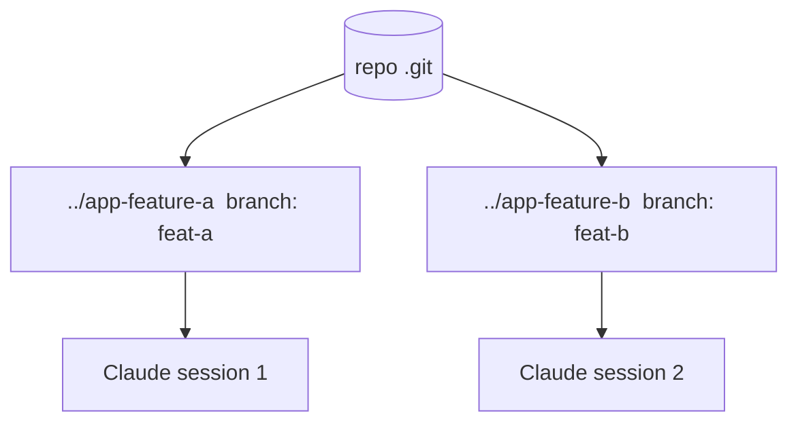

<LevelBadge level="advanced" />

Un **git worktree** permette a un singolo repository di avere **più directory di lavoro**, ciascuna con checkout su un branch diverso. Abbinalo a Claude Code e potrai eseguire **diverse sessioni in parallelo** sullo stesso progetto — ciascuna che modifica i propri file, senza collisioni.

## Il problema che risolve

Se due sessioni Claude modificano la stessa directory di lavoro contemporaneamente, si pestano i piedi a vicenda con le rispettive modifiche. I worktree danno a ogni sessione la **propria directory e il proprio branch**, così il lavoro parallelo resta isolato finché non fai il merge.



## Le basi

```bash
# from your repo
git worktree add ../app-feature-a -b feat-a   # new dir + new branch
git worktree add ../app-fix-123 -b fix-123
git worktree list
# when done with one:
git worktree remove ../app-feature-a
```

Apri una sessione di Claude Code in ogni directory di worktree e lasciale lavorare in modo indipendente.

## Quando ne vale la pena

- **Feature/fix paralleli** che vuoi far avanzare contemporaneamente.
- **Un'attività lunga in esecuzione** in un worktree mentre continui a lavorare in un altro.
- **Esperimenti rischiosi** isolati dal tuo checkout principale.

## Insidie

:::warning Attenzione al merge-back
- I branch alla fine verranno **uniti** — i conflitti emergono allora, non durante. Mantieni i worktree focalizzati e di breve durata.
- Non eseguire **risorse condivise con stato** (un solo DB di sviluppo, una sola porta) da due worktree senza separarle.
- Fai pulizia con `git worktree remove` così le directory obsolete non si accumulano.
:::

## Worktree contro subagent

- **[Subagent](/docs/claude-code/subagents)** = parallelismo *all'interno* di una sessione (delega, contesto isolato).
- **Worktree** = parallelismo *tra* sessioni su disco (branch/file isolati). Si compongono bene: una sessione in un worktree può a sua volta generare subagent.

## Avanti

- [Subagent e agenti paralleli](/docs/claude-code/subagents)
- [Modalità headless e l'Agent SDK](/docs/claude-code/headless-and-agent-sdk)
- [Gestione del contesto](/docs/claude-code/context-management)
