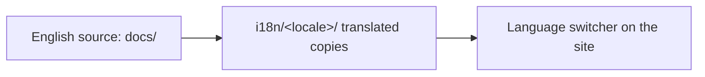

<LevelBadge level="intermediate" />

AILmanac nasce in inglese ma è **costruito per essere tradotto** — è così che raggiunge "tutti nel mondo". Se vuoi portarlo nella tua lingua, ecco il percorso.

## Come funziona l'i18n qui

Il sito usa l'internazionalizzazione integrata di Docusaurus. **L'inglese è la fonte canonica.** Una lingua è un insieme parallelo di file tradotti; Docusaurus mostra un selettore di lingua una volta che la lingua è abilitata.

## La regola d'oro: prenditene carico prima che lo pubblichiamo

:::warning Niente traduzioni a metà in produzione
Una lingua viene **abilitata in produzione solo quando qualcuno si impegna a mantenerla.** Una lingua tradotta al 30% e ferma da mesi danneggia la credibilità più dell'assenza di traduzione. Meglio tradurre bene una *sezione completa* che disseminare pagine parziali.
:::

## Come contribuire una traduzione

1. **Apri un issue** (usa il template *translation*) indicando quale lingua e quale sezione prenderai in carico.
2. **Traduci prima un blocco coerente** — ad esempio tutta *Start Here* — non pagine a caso.
3. **Lascia invariati codice, comandi e le fonti di `VerifyNote`**; traduci prosa, intestazioni e testo delle admonition.
4. **Non tradurre gli ID dei modelli né i link**; lascia i percorsi `/docs/...` così come sono.
5. **Apri una PR.** Un manutentore la esamina e, una volta che una lingua ha un responsabile + una prima sezione completa, la abilitiamo.

## Suggerimenti

- **Usa Claude per stendere una bozza**, poi un umano fluente la rivede — la traduzione con l'IA è un'ottima prima passata, non l'autorità finale (le [allucinazioni](/docs/foundations/hallucinations) valgono anche per la traduzione).
- **Adatta il livello/tono** della pagina inglese.
- **Segnala i termini intraducibili** (mantieni "prompt", "token" ecc. dove è la norma nella comunità tech della tua lingua).

## Avanti

- [Contribuisci in 10 minuti](/docs/contribute/contribute-in-10-minutes)
- [Guida di stile dei contenuti](/docs/contribute/style-guide)
- [Codice di condotta e governance](/docs/contribute/governance)
