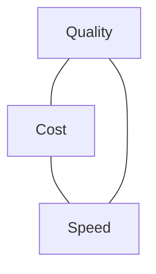

<LevelBadge level="intermediate" />

Qualità, costo e velocità sono in tensione tra loro. Non puoi massimizzarli tutti e tre contemporaneamente — ma *puoi* spendere ciascuno dove conta e risparmiare ovunque altro.

## Il triangolo

Un modello più grande è più intelligente ma più lento e costoso; uno più piccolo è veloce ed economico ma meno capace. La buona ingegneria consiste nel **indirizzare ogni task al punto giusto** di questo triangolo.

## Le leve più importanti (più o meno in ordine)

1. **Dimensiona correttamente il modello.** Non usare Opus per la classificazione. Parti da Sonnet, scendi a Haiku per i passaggi semplici/ad alto volume, riserva Opus per le parti difficili — [Scegliere un modello](/docs/api/choosing-a-model).
2. **Stratificazione dei modelli / cascate.** Usa prima un modello economico; passa a uno più potente solo quando serve (es. casi a bassa confidenza).
3. **[Prompt caching](/docs/api/prompt-caching).** Riutilizza un prefisso di prompt stabile tra le chiamate — grossi risparmi per system prompt ripetuti, contesto RAG o cataloghi di strumenti degli agenti.
4. **Riduci i token di input.** Invia solo ciò che conta; [RAG](/docs/foundations/rag) batte l'inserimento dell'intera base di conoscenza. Input più brevi = più economici *e* spesso migliori.
5. **Limita l'output** con `max_tokens` sensati e istruzioni di formato rigorose.
6. **Esegui in batch** il lavoro offline dove la latenza non conta.

## Vantaggi specifici per la latenza

- **Usa lo streaming** per le risposte così che gli utenti vedano subito l'output — enorme per la velocità *percepita* anche quando il tempo totale è invariato ([Streaming](/docs/api/streaming)).
- **Parallelizza** le sotto-chiamate indipendenti.
- **Usa la cache** per il lavoro ripetuto; pre-calcola dove puoi.
- Scegli un **modello più piccolo** per il percorso interattivo; svolgi il lavoro pesante in modo asincrono.

## Non ottimizzare alla cieca

Misura prima: dove vanno davvero i token e i secondi? Poi ottimizza la voce di spesa più grande. E ricontrolla la qualità con gli [evals](/docs/foundations/evals) dopo ogni taglio di costo — una configurazione più economica ma sbagliata non è più economica.

## Prossimi passi

- [Scegliere un modello Claude](/docs/api/choosing-a-model)
- [Prompt caching e ottimizzazione dei costi](/docs/api/prompt-caching)
- [Token, contesto e prezzi](/docs/api/tokens-and-pricing)
