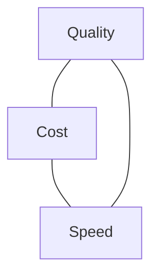
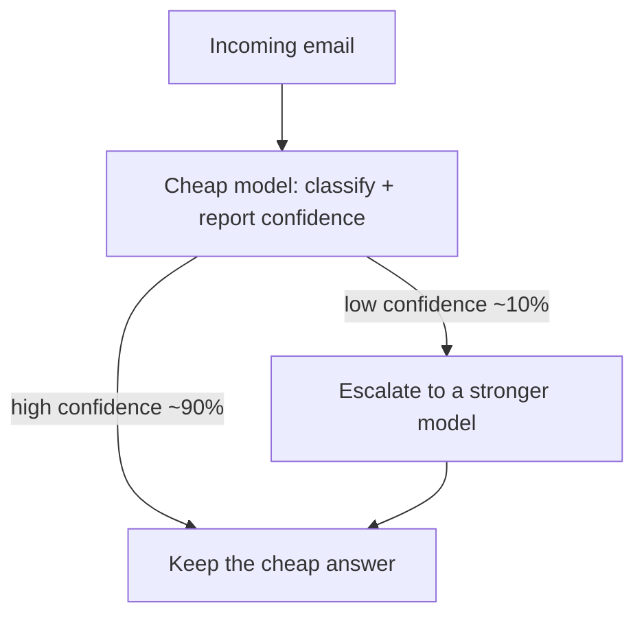

<LevelBadge level="intermediate" />

<Callout type="objectives" items={["Il triangolo costo/qualità/velocità — perché non puoi massimizzare tutti e tre contemporaneamente","Le sei leve più grandi per spendere dove conta e risparmiare ovunque altro","Come una cascata cheap-first indirizza il 90% del volume a un modello piccolo e taglia i costi del ~70% senza sacrificare la qualità sui casi difficili","I vantaggi specifici per la latenza (streaming, parallelismo, caching, async) che ridisegnano la velocità percepita","Perché 'ottimizzare alla cieca' brucia qualità — misura prima, difendi con gli evals dopo"]} />

Qualità, costo e velocità sono in tensione tra loro. Non puoi massimizzarli tutti e tre contemporaneamente — ma *puoi* spendere ciascuno dove conta e risparmiare ovunque altro.

## Il triangolo

```mermaid
flowchart TD
  Q[Quality] --- C[Cost]
  C --- S[Speed]
  S --- Q
```

Un modello più grande è più intelligente ma più lento e costoso; uno più piccolo è veloce ed economico ma meno capace. La buona ingegneria consiste nel **indirizzare ogni task al punto giusto** di questo triangolo.

## Le leve più importanti (più o meno in ordine)

<Steps items={[{title: "Dimensiona correttamente il modello", body: "Non usare Opus per la classificazione. Parti da Sonnet, scendi a Haiku per i passaggi semplici/ad alto volume, riserva Opus per le parti difficili. La leva singola più grande — vedi /docs/api/choosing-a-model."}, {title: "Stratificazione dei modelli / cascate", body: "Usa prima un modello economico; passa a uno più potente solo quando serve (es. casi a bassa confidenza). Vedi l'esempio pratico sotto."}, {title: "Prompt caching", body: "Riutilizza un prefisso di prompt stabile tra le chiamate — grossi risparmi per system prompt ripetuti, contesto RAG o cataloghi di strumenti degli agenti. Vedi /docs/api/prompt-caching."}, {title: "Riduci i token di input", body: "Invia solo ciò che conta. RAG batte l'inserimento dell'intera base di conoscenza. Input più brevi = più economici E spesso migliori."}, {title: "Limita i token di output", body: "Imposta un max_tokens sensato e istruzioni di formato rigorose. I token di output sono fatturati alla tariffa più alta — limitarli taglia la coda."}, {title: "Esegui in batch il lavoro offline", body: "Per tutto ciò che non deve essere interattivo, usa la Message Batches API. Scambia latenza per un grosso sconto per token."}]} />

## Esempio pratico: una cascata cheap-first

La cascata è la leva che le persone saltano perché suona vaga. Rendiamola concreta. Diciamo che devi triage-are 100.000 email di supporto. L'approccio ingenuo passa ogni email attraverso il tuo modello più forte. Una cascata indirizza la maggior parte del volume a un modello economico ed escala solo i casi difficili:

```mermaid
flowchart TD
  In[Incoming email] --> Cheap[Cheap model: classify + report confidence]
  Cheap -->|high confidence ~90%| Done[Keep the cheap answer]
  Cheap -->|low confidence ~10%| Strong[Escalate to a stronger model]
  Strong --> Done
```

Supponiamo che il modello economico risolva il 90% dei casi da solo e che un modello più potente costi circa 5× di più per token. Contando in *unità di costo* relative (1 = una passata cheap su una email):

- **Tutto-forte:** `100k × 5 = 500k` unità di costo.
- **Cascata:** `100k × 1` (ogni email riceve la passata cheap) `+ 10k × 5` (il 10% che escala) `= 150k` unità di costo.

Questo è circa un **taglio del 70%**, e i casi genuinamente difficili ricevono ancora il tuo modello migliore. I moltiplicatori e la ripartizione sono illustrativi — inserisci i tuoi [conteggi di token e tariffe](/docs/api/tokens-and-pricing) e misura il tasso di escalation *reale* con gli [evals](/docs/foundations/evals). La lezione vale comunque: i risparmi vengono da quanto raramente paghi la tariffa costosa, non dalla tariffa in sé.

## Vantaggi specifici per la latenza

<Callout type="tip" items={["Usa lo streaming per le risposte — gli utenti vedono i primi token istantaneamente, quindi la velocità percepita balza anche quando il tempo totale è invariato (/docs/api/streaming).","Parallelizza le sotto-chiamate indipendenti — una richiesta che si dirama su tre tool finisce in max(latency), non sum(latency).","Usa la cache per il lavoro ripetuto e pre-calcola dove puoi — i token più veloci sono quelli che non devi generare.","Scegli un modello più piccolo per il percorso interattivo; sposta il lavoro pesante in modo asincrono così l'utente non aspetta.","Riduci max_tokens di output per gli endpoint interattivi — le generazioni lunghe sono la fonte dominante di tail-latency."]} />

## Non ottimizzare alla cieca

Misura prima: dove vanno davvero i token e i secondi? Poi ottimizza la voce di spesa più grande. E ricontrolla la qualità con gli [evals](/docs/foundations/evals) dopo ogni taglio di costo — una configurazione più economica ma sbagliata non è più economica.

<Quiz title="Verifica" questions={[{q: "Qual è DI SOLITO la leva di costo singola più grande?", options: ["Abilitare il prompt caching", "Dimensionare correttamente il modello al task (non usare il flagship per lavori che un modello piccolo gestisce bene)", "Impostare un max_tokens più piccolo", "Usare il batch mode"], answer: 1, explain: "La scelta del modello è di gran lunga il moltiplicatore più grande — spesso 5–10× tra i tier. Caching, capping e batching sono significativi, ma nessuno batte 'smetti di pagare tariffe flagship per un lavoro che un modello classe Haiku finisce correttamente'."}, {q: "In una cascata cheap-first, da dove vengono realmente i risparmi?", options: ["Dal modello economico che è intrinsecamente più economico per token", "Da quanto RARAMENTE finisci per pagare la tariffa costosa — la maggior parte dei casi si risolve al tier economico", "Dal prompt caching nascosto dietro la cascata", "Dallo streaming delle risposte"], answer: 1, explain: "La matematica (100k × 1 + 10k × 5 vs 100k × 5) mostra che i risparmi sono dominati dal tasso di escalation. Se indirizzi il 90% al cheap e il 10% al forte, stai pagando la tariffa costosa su un decimo del volume."}, {q: "Vuoi che l'utente senta una risposta come più veloce. Quale leva aiuta DI PIÙ senza cambiare la scelta del modello?", options: ["Imposta max_tokens a 5 così la risposta è corta", "Fai streaming dei token man mano che vengono generati così il time-to-first-token crolla nettamente", "Ritenta la richiesta due volte in parallelo e tieni la più veloce", "Aggiungi uno spinner di caricamento"], answer: 1, explain: "Lo streaming ridisegna la latenza PERCEPITA senza cambiare il tempo totale di generazione — gli utenti vedono l'output man mano che viene prodotto, quindi una risposta di 4 secondi sembra istantanea. Troncare con un max_tokens minuscolo danneggia la qualità; i retry paralleli bruciano costo."}, {q: "Hai tagliato i costi passando da Sonnet a Haiku su un workflow. Qual è il prossimo passo richiesto?", options: ["Rilascialo — il costo è sceso, quella è tutta la vittoria", "Ri-esegui gli evals per confermare che la qualità non è crollata — una configurazione più economica ma sbagliata non è più economica", "Metti in cache il prompt così costa ancora meno", "Aggiungi un fallback a Opus per ogni richiesta"], answer: 1, explain: "Ogni taglio di costo va difeso dagli evals. Una risposta economica sbagliata di solito costa di più di una costosa giusta — tramite retry, escalation o pulizia a valle. Misura la qualità dopo ogni cambiamento."}]} />

<Callout type="takeaways" items={["Il triangolo è reale: qualità, costo e velocità sono in tensione tra loro — ingegnerizzare significa indirizzare ogni task al punto giusto, non massimizzare tutti e tre.","Dimensionare correttamente il modello è la leva singola più grande; le cascate la moltiplicano pagando le tariffe flagship solo sulla minoranza difficile.","Prompt caching, max_tokens stretti e trimming degli input guidato da RAG si compongono con la scelta del modello.","La percezione della latenza è un asse separato — streaming, sotto-chiamate parallele e lavoro pesante async ridisegnano la UX senza cambiare il costo grezzo.","Ogni taglio di costo deve essere difeso dagli evals — una configurazione più economica ma sbagliata non è più economica."]} />

## Prossimi passi

- [Scegliere un modello Claude](/docs/api/choosing-a-model)
- [Prompt caching e ottimizzazione dei costi](/docs/api/prompt-caching)
- [Token, contesto e prezzi](/docs/api/tokens-and-pricing)
